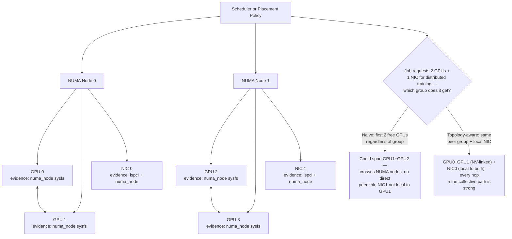

# Lab 04 — Build a Topology-Aware GPU Placement Plan

## Lab Metadata

| Field | Value |
|---|---|
| Volume | 02 — GPU Architecture |
| Difficulty | Intermediate |
| Estimated time | 90–120 minutes |
| Lab level | L3 — Configuration and design |
| Target platform | Linux host with one or more NVIDIA GPUs |
| Primary tools | `nvidia-smi`, `lspci`, `numactl`, `/sys`, optional `hwloc` |

## 1. Objective

Inspect the physical relationships among GPUs, CPU NUMA nodes, PCIe paths, and network adapters, then produce a placement policy for single-GPU, multi-GPU, and distributed workloads.

The lab does not change firmware or move hardware. It turns existing topology evidence into an operational design that a scheduler or platform team can implement.

## 2. Background

A resource request such as “two GPUs” describes capacity but not locality. On a multi-socket host, the selected GPUs may be close to each other, attached to different CPU sockets, or far from the network adapter used for distributed communication.

Topology-aware placement improves predictability by aligning:

- communicating GPUs
- CPU workers
- host memory
- network adapters
- workload type

The objective is not to force every job onto the fastest path. It is to reserve strong paths for workloads that benefit from them and preserve scheduling flexibility for workloads that do not.

## 3. Learning Outcomes

After completing this lab, you will be able to:

- create a stable GPU inventory using UUIDs and PCI addresses
- map each GPU and NIC to a NUMA node
- interpret the GPU topology matrix
- classify strong and weak GPU pairs
- identify GPU-to-NIC affinity
- define placement rules for different workload profiles
- recognize topology drift after hardware or firmware changes

## 4. Architecture



**Figure 2.L4.1 — Placement policy over physical topology.** The scheduler should select GPU, CPU, memory, and NIC resources as one locality-aware group. The branch names the exact failure this lab's placement policy (Step 8) exists to prevent: a resource-count-only scheduler can satisfy "2 GPUs + 1 NIC" with a combination that crosses every locality boundary on the host, and nothing in a naive request would reveal that until the job's collective performance was already poor.

## 5. Prerequisites

### Hardware

- One or more NVIDIA GPUs
- Multi-GPU or multi-NUMA host preferred
- A high-speed NIC is helpful but not mandatory

### Software

```bash
nvidia-smi
lspci
numactl
```

Optional tools:

```bash
lstopo
hwloc-ls
```

### Permissions

Read access to `/sys` is normally sufficient. Detailed PCI information may require `sudo`.

## 6. Environment

Record the host before analysis.

```bash
hostname
cat /etc/os-release
uname -r
nvidia-smi --query-gpu=driver_version --format=csv,noheader | sort -u
```

Record the date, server model, firmware baseline, and driver version in your lab notes.

## 7. Components

| Component | Role in placement |
|---|---|
| GPU UUID | Stable workload and inventory identity |
| PCI bus address | Connects GPU identity to Linux topology |
| NUMA node | Identifies nearby CPU and host memory |
| PCIe root and switch | Defines host and peer communication path |
| Direct GPU link | Provides an accelerator-specific peer path where present |
| NIC | Carries distributed workload traffic |
| CPU affinity | Controls where host threads execute |
| Memory policy | Controls where host buffers are allocated |

## 8. Deployment Steps

This is a design lab. “Deployment” means collecting evidence and producing a policy artifact.

### Step 1 — Build the Stable GPU Inventory

#### Purpose

Map logical indices to stable UUIDs and PCI addresses.

#### Command

```bash
nvidia-smi --query-gpu=index,name,uuid,pci.bus_id,memory.total --format=csv
```

#### Expected Output

```text
index, name, uuid, pci.bus_id, memory.total [MiB]
0, NVIDIA H100 80GB HBM3, GPU-3a1f9e02-4c11-4b8a-9e2d-7f6b1c0a55e1, 00000000:1B:00.0, 81559 MiB
1, NVIDIA H100 80GB HBM3, GPU-7b2e0c14-8a33-4f9c-a1de-2c9d5e7f0b3a, 00000000:3D:00.0, 81559 MiB
2, NVIDIA H100 80GB HBM3, GPU-91c4d5a8-2f77-4e0b-8c1a-9d3e6f4b2a90, 00000000:9A:00.0, 81559 MiB
3, NVIDIA H100 80GB HBM3, GPU-c85f3d21-6e94-4a1c-b7d0-1a8e2f5c9b4d, 00000000:C3:00.0, 81559 MiB
```

#### Explanation

Use UUIDs for durable identity. Use the PCI bus address to join NVIDIA data with Linux topology data. This illustrative four-GPU inventory is what Step 2's topology matrix and Step 3's NUMA mapping will be cross-referenced against — record the exact UUID-to-bus-ID mapping before proceeding, since every later step's conclusions depend on knowing which stable identifier corresponds to which physical device.

### Step 2 — Record the GPU Topology Matrix

#### Purpose

Identify GPU-to-GPU path classes and CPU affinity.

#### Command

```bash
nvidia-smi topo -m
```

#### Expected Output

```text
        GPU0    GPU1    GPU2    GPU3    NIC0    NIC1    CPU Affinity    NUMA Affinity
GPU0     X      NV4     SYS     SYS     PIX     SYS     0-31            0
GPU1    NV4      X      SYS     SYS     SYS     SYS     0-31            0
GPU2    SYS     SYS      X      NV4     SYS     PIX     32-63           1
GPU3    SYS     SYS     NV4      X      SYS     SYS     32-63           1
NIC0    PIX     SYS     SYS     SYS      X      SYS
NIC1    SYS     SYS     PIX     SYS     SYS      X

Legend:
  X    = self
  NV4  = 4 NVLink connections between GPUs
  PIX  = connection traversing at most a single PCIe bridge
  SYS  = connection traversing PCIe as well as a NUMA/socket-level link
```

A matrix of GPU and NIC relationships, plus CPU and NUMA affinity where supported.

#### Interpretation

Read the legend printed by your installed version. Do not copy path meanings from another system without checking the local output.

Create a table like this, populated from the matrix above:

| Pair | Path label | Same NUMA node? | Direct peer path? | Placement class |
|---|---|---:|---:|---|
| GPU 0 ↔ GPU 1 | NV4 | Yes (node 0) | Yes | Preferred |
| GPU 2 ↔ GPU 3 | NV4 | Yes (node 1) | Yes | Preferred |
| GPU 0 ↔ GPU 2 | SYS | No | No | Avoid for communication-heavy jobs |
| GPU 1 ↔ GPU 3 | SYS | No | No | Avoid for communication-heavy jobs |

This example host has two clean topology groups — `{GPU0, GPU1, NIC0}` on NUMA node 0, and `{GPU2, GPU3, NIC1}` on NUMA node 1 — with no direct interconnect crossing the two groups at all. Any job needing more than 2 GPUs with strong peer communication on this host has to accept a `SYS`-class hop somewhere; the placement policy in Step 8 should make that trade-off explicit rather than silent.

### Step 3 — Map Every GPU to a NUMA Node

#### Purpose

Verify Linux's device locality.

#### Command

```bash
for bdf in $(nvidia-smi --query-gpu=pci.bus_id --format=csv,noheader | sed 's/^00000000:/0000:/'); do
  printf "%s NUMA=" "$bdf"
  cat "/sys/bus/pci/devices/$bdf/numa_node"
done
```

#### Expected Output

```text
0000:1b:00.0 NUMA=0
0000:3d:00.0 NUMA=0
0000:9a:00.0 NUMA=1
0000:c3:00.0 NUMA=1
```

One NUMA value per GPU. A value of `-1` means Linux does not expose a specific association. This output should agree exactly with the `NUMA Affinity` column from Step 2's topology matrix — `GPU0`/`GPU1` at NUMA 0 and `GPU2`/`GPU3` at NUMA 1 here matches that matrix precisely, which is the cross-check this step exists to perform. A mismatch between the two sources would itself be worth escalating before trusting either one.

#### Common Errors

If the sysfs path is missing, compare domain formatting between `nvidia-smi` and `lspci -D`.

### Step 4 — Map Network Adapters to NUMA Nodes

#### Purpose

Identify which NIC should serve each GPU group.

#### Commands

```bash
lspci -Dnn | grep -iE 'ethernet|infiniband|network'
```

For each NIC PCI address:

```bash
NIC_BDF="0000:41:00.0"
cat "/sys/bus/pci/devices/$NIC_BDF/numa_node"
```

#### Expected Output

```text
$ lspci -Dnn | grep -iE 'ethernet|infiniband|network'
0000:18:00.0 Ethernet controller [0200]: Mellanox Technologies MT2892 Family [ConnectX-6 Dx] [15b3:101d]
0000:9d:00.0 Ethernet controller [0200]: Mellanox Technologies MT2892 Family [ConnectX-6 Dx] [15b3:101d]

$ cat /sys/bus/pci/devices/0000:18:00.0/numa_node
0
$ cat /sys/bus/pci/devices/0000:9d:00.0/numa_node
1
```

A NUMA node for each adapter, or `-1` when locality is not exposed. `NIC0` at `0000:18:00.0` reporting NUMA node `0` matches `GPU0`/`GPU1`'s node from Step 3, and `NIC1` at `0000:9d:00.0` reporting node `1` matches `GPU2`/`GPU3` — confirming the same two topology groups identified from the `nvidia-smi topo -m` matrix in Step 2, now independently verified through Linux's own sysfs data rather than NVIDIA tooling alone.

### Step 5 — Inspect CPU and Memory Layout

#### Purpose

Identify CPUs and memory local to each device group.

#### Command

```bash
numactl --hardware
```

#### Expected Output

```text
available: 2 nodes (0-1)
node 0 cpus: 0 1 2 3 4 5 6 7 8 9 10 11 12 13 14 15
node 0 size: 257698 MB
node 1 cpus: 16 17 18 19 20 21 22 23 24 25 26 27 28 29 30 31
node 1 size: 258043 MB
node distances:
node   0   1
  0:  10  21
  1:  21  10
```

NUMA nodes, CPU lists, memory capacity, and distance values.

Create a placement record:

| NUMA node | CPUs | GPUs | NICs | Preferred workload |
|---|---|---|---|---|
| 0 | 0-15 | GPU 0, GPU 1 | NIC 0 | distributed rank group A |
| 1 | 16-31 | GPU 2, GPU 3 | NIC 1 | distributed rank group B |

Every row here is now backed by three independent, cross-checked sources: `nvidia-smi topo -m` (Step 2), GPU sysfs `numa_node` (Step 3), and NIC sysfs `numa_node` (Step 4) — all agreeing on the same two-group split, which is exactly the kind of multi-source confirmation Section 9's validation checklist requires before trusting a placement policy built on it.

### Step 6 — Inspect PCIe Link State

#### Purpose

Confirm that devices negotiate expected link width and speed.

#### Command

```bash
GPU_BDF="0000:31:00.0"
sudo lspci -s "$GPU_BDF" -vv | grep -E 'LnkCap:|LnkSta:'
```

#### Interpretation

Compare capability and negotiated state with the approved server design. A lower negotiated state requires context: power management, idle state, platform wiring, firmware, or a fault may explain it.

### Step 7 — Classify Workload Profiles

Create at least three profiles.

#### Profile A — Single-GPU inference

Priorities:

- sufficient GPU memory
- CPU locality
- request-path latency
- optional NIC locality

Strict GPU-to-GPU locality is not required.

#### Profile B — Multi-GPU training inside one node

Priorities:

- strongest GPU peer group
- balanced topology
- sufficient CPU and memory locality
- avoidance of fragmented allocation

#### Profile C — Distributed multi-node training

Priorities:

- strong local GPU group
- nearby high-speed NIC
- rank-to-device consistency
- collective communication path

### Step 8 — Write the Placement Policy

Use this structure:

```yaml
placement_profiles:
  single_gpu_inference:
    require_same_numa_cpu: true
    require_peer_group: false
    prefer_local_nic: true

  multi_gpu_training:
    require_same_peer_group: true
    require_balanced_gpu_count: true
    require_local_cpu_memory: true

  distributed_training:
    require_same_peer_group: true
    require_local_high_speed_nic: true
    require_rank_device_mapping: true
```

This is a conceptual policy, not a vendor-specific scheduler schema. Adapt it to Kubernetes, Slurm, or another platform later.

## 9. Validation

Validate that every rule is supported by evidence.

- Each GPU must map to a UUID and PCI address.
- Each device should have a recorded NUMA relationship or an explicit unknown state.
- Preferred GPU groups must come from the topology matrix.
- NIC affinity must be based on PCI and NUMA evidence.
- The policy must distinguish workload profiles.

## 10. Verification

Use CPU binding to verify that a test process can be placed near a selected GPU.

```bash
numactl --cpunodebind=0 --membind=0 bash -c 'taskset -pc $$; numactl --show'
```

Expected output should show CPU and memory policy aligned with the selected NUMA node.

Do not run production workloads under a new binding policy until it has been tested in a maintenance or staging environment.

## 11. Observability

Topology itself changes rarely, but the effective path can degrade.

Monitor or periodically verify:

- GPU inventory and UUIDs
- PCIe negotiated state
- topology matrix
- peer-link health
- NUMA mappings
- NIC inventory
- XID and PCIe errors
- workload placement decisions
- collective or peer bandwidth baselines

Useful commands:

```bash
nvidia-smi topo -m
nvidia-smi -q
journalctl -k | grep -iE 'nvrm|xid|pcie|aer'
```

## 12. Performance Measurements

This lab focuses on placement design, but collect a baseline where safe.

Possible measurements include:

- host-to-device copy bandwidth for local and remote NUMA binding
- peer copy bandwidth between selected GPU pairs
- collective performance for preferred and non-preferred groups
- GPU-to-NIC throughput for local and remote combinations

Do not invent expected numbers. Compare paths on the same host and retain the exact test configuration.

## 13. Failure Injection

### Failure Scenario — Deliberately Poor Placement Plan

Create a paper design that assigns:

- a GPU on NUMA node 0
- CPU workers on NUMA node 1
- a NIC on NUMA node 1
- a peer GPU across the weakest available path

Predict:

1. which data crosses socket boundaries
2. where contention may appear
3. which metrics would change
4. which workload types would be most affected
5. how the scheduler should prevent the placement

This is a non-disruptive failure exercise.

## 14. Troubleshooting

### Problem — Topology matrix changes after maintenance

**Symptoms**

- GPU indices changed
- path labels differ
- CPU affinity changed

**Diagnosis**

Compare UUID-to-PCI mappings, firmware settings, BIOS configuration, slot population, and device replacement records.

**Root cause**

Enumeration changed, hardware moved, or firmware altered the exposed topology.

**Resolution**

Rebuild the inventory using stable identifiers and update the placement policy only after validating the physical design.

### Problem — Preferred GPU group performs poorly

Check:

- negotiated PCIe state
- peer-link health
- CPU and memory binding
- NIC selection
- concurrent traffic
- application communication pattern

**Turning this into evidence.** A "preferred" `NV4` pair that still performs poorly is worth re-verifying rather than assumed still healthy — links can degrade after the initial topology capture:

```text
$ nvidia-smi nvlink --status
GPU 0: NVIDIA H100 80GB HBM3
	 Link 0: 26.562 GB/s
	 Link 1: 26.562 GB/s
	 Link 2: 0.000 GB/s
	 Link 3: 26.562 GB/s
```

Three of four expected NVLink connections reporting healthy throughput and one reporting `0.000 GB/s` is a degraded link, not a fully failed one — the pair is still classified `NV4` in a topology matrix captured before this degradation, and would still show as "preferred" in a placement policy that only checked the matrix once at commissioning time rather than periodically. This is the concrete argument for the Observability section's advice to re-verify peer-link health on a schedule, not just once during initial setup — a pair validated as strong months ago is not guaranteed to still be strong today.

### Problem — Scheduler cannot satisfy strict placement

The policy may be too restrictive for the available free resources. Decide whether to queue the job, relax locality for that workload, or reserve topology groups through capacity planning.

## 15. Cleanup

Unset temporary variables:

```bash
unset GPU_BDF NIC_BDF
```

Remove temporary inventory files only after saving the final topology report and placement policy in the appropriate repository or configuration-management system.

## 16. Summary

You converted hardware topology into an operational placement policy. The lab demonstrated that GPU allocation should consider CPU, memory, peer, and network locality rather than device count alone.

The resulting policy becomes an input to future Kubernetes, Slurm, and distributed-training chapters.

## 17. Challenge Exercises

1. Generate the GPU and NIC NUMA inventory automatically as JSON.
2. Compare local and remote NUMA host-to-device transfer performance.
3. Create Kubernetes node labels representing approved GPU peer groups.
4. Design a Slurm topology or generic-resource policy for the same host.
5. Detect topology drift automatically during node commissioning.
6. Add a policy for latency-sensitive inference and explain why it differs from training.

## 18. Further Reading

- [GPU Topology, Peer Access, and Data Paths](../chapter-10-gpu-topology-peer-access-and-data-paths)
- [Building a GPU Performance Model](../chapter-11-building-a-gpu-performance-model)
- [Volume 02 Architecture Summary](../chapter-12-volume-02-architecture-summary)
- [Lab 01 — Inspect GPU Architecture and Topology](./lab-01-inspect-gpu-architecture-and-topology)
