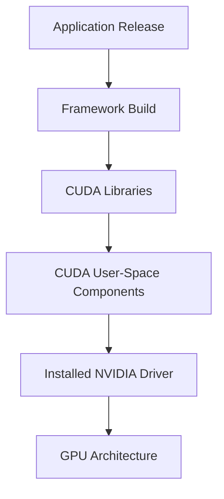

# Masterclass 01: CUDA Execution Model & Software Stack

## 1. Introduction: Why CUDA Exists & The Heterogeneous Model
Programmable GPUs required a new software contract designed for computation rather than rendering. CUDA abstracts away graphics primitives in favor of a compute-oriented paradigm. The system divides into a **host** (CPU and its memory) and a **device** (NVIDIA GPU and its memory resources). The host controls the orchestration; the device executes parallel work.

## 2. The CUDA Software Stack
The CUDA software stack is deeply layered, connecting applications to silicon.

### 2.1 The Components
- **Application Code:** User-written Python, C++, or Go.
- **Frameworks & Libraries:** PyTorch, TensorFlow, cuBLAS, cuDNN.
- **CUDA Runtime API (`cudart`):** High-level abstraction for memory and launches.
- **CUDA Driver API (`cuda`):** Low-level interface for contexts and modules.
- **NVIDIA Kernel Driver:** `nvidia.ko` in Linux, responsible for physical access.
- **GPU Hardware:** The physical Streaming Multiprocessors (SMs) executing the code.

### 2.2 Compilation, PTX, and SASS
A CUDA application ships with a combination of intermediate and physical binaries.
- **PTX (Parallel Thread Execution):** A stable, forward-compatible ISA. The JIT compiler in the driver compiles PTX into SASS.
- **SASS (Shader Assembly):** The actual microcode executed by a specific SM architecture (e.g., `sm_80` for A100, `sm_90` for H100).
- **Fatbins:** Containers that package both PTX and multiple SASS binaries to guarantee forward compatibility and peak performance across generations.

## 3. Programming and Execution Model
CUDA uses the SIMT (Single Instruction, Multiple Thread) execution model.

### 3.1 Grids, Blocks, and Threads
A kernel launch creates a **Grid**, which is partitioned into **Blocks**, which contain **Threads**.
- Threads execute the same program with different data indices.
- Threads in a block can cooperate via Shared Memory and block synchronization barriers.
- Blocks execute independently, meaning a small GPU handles them in waves, while a large GPU handles many concurrently.

### 3.2 Thread Warps
Hardware executes threads in groups of 32, known as **Warps**.
- **Warp Divergence:** If threads in a warp follow different control flow paths (e.g., `if-else`), the execution serializes.
- Exact NVIDIA specifications for modern hardware (like Hopper H100) often deal with Thread Block Clusters and Tensor Cores, but the core 32-thread warp remains the base scheduling unit.

## 4. Production Bottlenecks
- **Context Creation Delays:** The first CUDA call initializes a context. If not anticipated, this causes a latency spike.
- **Launch Overhead:** The host API has overhead. Small kernels launched sequentially will CPU-bind the process.
- **Binary Incompatibility:** Deploying a container compiled only for `sm_80` onto an `sm_89` (Ada) GPU without included PTX will fail or incur massive JIT compilation latency.

## 5. Senior Interview Scenarios

**Scenario 1: You observe 0% GPU utilization but the CPU is at 100%. What is happening?**
*Answer:* The workload is host-bound. Either the CPU is stuck in data preparation, or kernel launches are too small and the CPU is saturating on the CUDA Runtime API overhead. The GPU finishes the microscopic kernel before the CPU can submit the next one.

**Scenario 2: Explain the difference between `sm_90` and `compute_90` during compilation.**
*Answer:* `sm_90` generates SASS (physical assembly) specifically for Hopper GPUs. It cannot run on future architectures. `compute_90` dictates the PTX (virtual assembly) generated. PTX can be JIT-compiled at runtime by the NVIDIA driver for newer architectures, providing forward compatibility at the cost of JIT latency on the first run.
