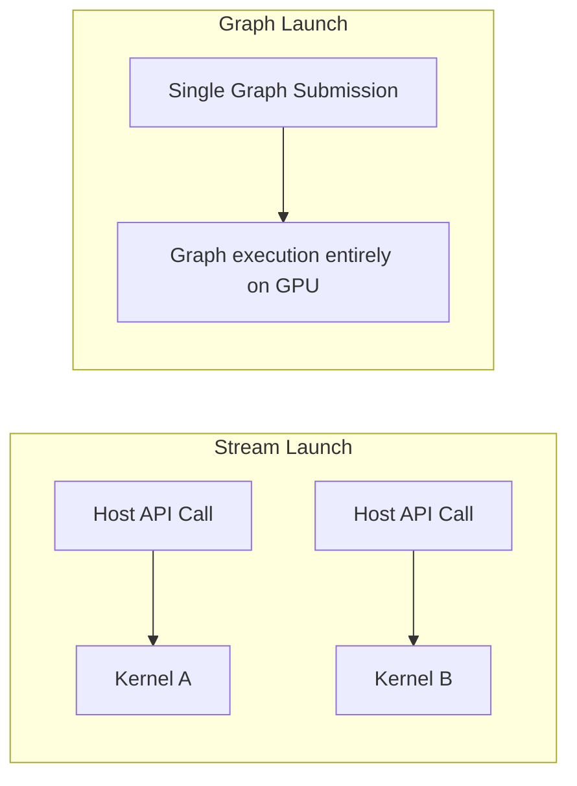

# Masterclass 03: Concurrency, Synchronization, & Profiling

## 1. Streams, Events, and Asynchrony
CUDA operations (launches, async memory copies) are placed into **Streams**, which act as in-order queues of work.
- **The Default Stream (Stream 0):** Historically a synchronizing stream that blocks operations in other streams. In modern programming, passing the `--default-stream per-thread` compiler flag prevents this implicit synchronization bottleneck.
- **Custom Streams:** Work in different non-blocking streams can execute concurrently on the GPU hardware, overlapping memory transfers and kernel execution.
- **Events (`cudaEvent_t`):** Lightweight markers placed into streams to measure time or synchronize dependencies without stalling the host CPU.

## 2. Synchronization Mechanisms & Errors
Hardware does not automatically enforce order across streams or across blocks.
- **Host-Device Sync (`cudaDeviceSynchronize`):** The CPU halts until all GPU work across all streams completes. Often overused, leading to CPU starvation.
- **Stream Sync (`cudaStreamSynchronize`):** The CPU halts only for a specific stream.
- **Cross-Stream Sync (`cudaStreamWaitEvent`):** The GPU handles dependency resolution directly in hardware, completely freeing the CPU from coordination latency.

### 2.1 Common Correctness Errors
- **Race Conditions:** Two blocks writing to the same global memory address without atomics.
- **Implicit Synchronization:** Issuing a synchronous `cudaMemcpy` or allocating pageable memory can force the driver to drain the pipeline, destroying intended concurrency.

## 3. CUDA Graphs
Kernel launch overhead (in the tens of microseconds) becomes the primary bottleneck for workloads that issue hundreds of small, fast kernels sequentially.
**CUDA Graphs** resolve this by allowing an application to record the entire dependency topology of kernels and memory operations into a single execution graph. The driver submits this graph to the GPU as one atomic operation, bypassing the CPU launch overhead entirely.
- Exact NVIDIA specifications state that CUDA Graphs can reduce CPU submission time from micro-seconds per kernel to a single micro-second for the entire graph.

## 4. Profiling and Production Troubleshooting
Profiling is mandatory for production CUDA development.
- **Nsight Systems (nsys):** Provides system-wide tracing. Used to debug CPU-GPU interactions, PCIe bottlenecks, stream concurrency, and API latency.
- **Nsight Compute (ncu):** Provides deep kernel-level metrics. Used to debug warp divergence, register spilling, L2 cache hit rates, and tensor core utilization.

## 5. Senior Interview Scenarios

**Scenario 1: You have 4 independent kernels to run. You place them in 4 separate streams, but Nsight Systems shows them executing sequentially. Why?**
*Answer:* There are a few possible reasons. 
1) The GPU hardware queues are full, or the GPU is fully occupied by a single kernel (occupancy is 100%), leaving no SMs for the others. 
2) An implicit synchronization event occurred (e.g., a pageable `cudaMemcpy` on the default stream). 
3) The legacy default stream behavior is blocking concurrency because it wasn't disabled.

**Scenario 2: How do you identify if a workload would benefit from CUDA Graphs?**
*Answer:* I would profile with Nsight Systems. If the timeline shows significant "white space" between kernels on the GPU, and the CPU thread is packed tightly with `cudaLaunchKernel` API calls, the workload is bound by host launch overhead. If the kernels repeat identically, it is a perfect candidate for CUDA Graphs.
