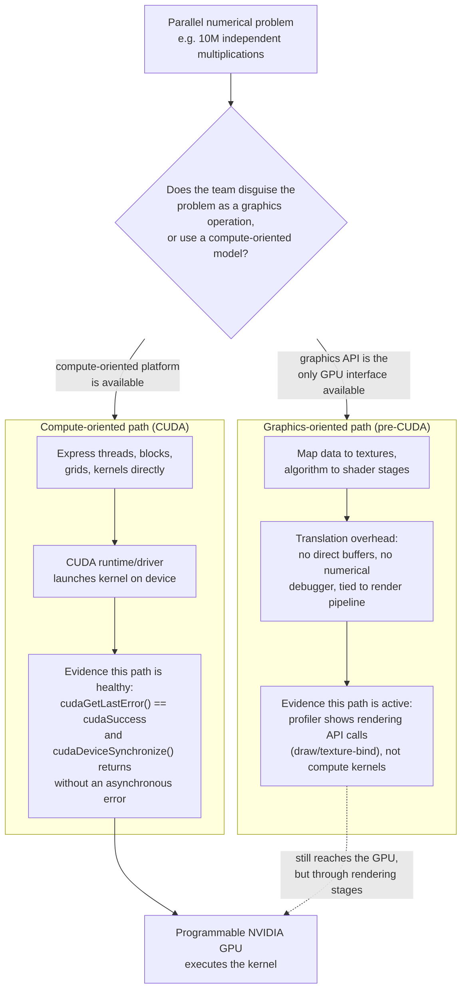
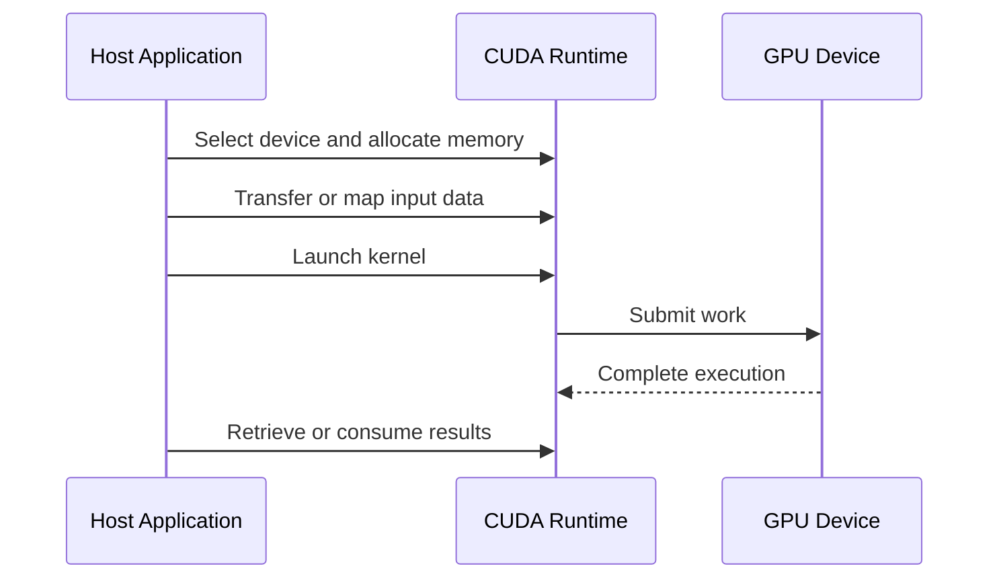
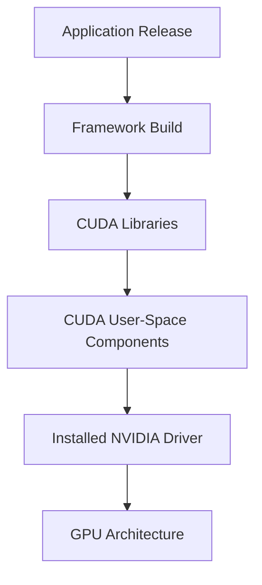

# Why CUDA Exists

## Introduction

A programmable GPU is not useful to general application developers unless software can express parallel work, move data, manage device resources, and launch computation without speaking directly to graphics-specific interfaces.

Before general-purpose GPU platforms matured, developers who wanted to use graphics processors for non-graphics work often had to disguise numerical problems as rendering operations. Data became textures. Computation became shader programs. Results were written through graphics pipelines. The hardware could perform the mathematics, but the programming model was built for images rather than scientific or enterprise applications.

CUDA exists because programmable GPU hardware needed a software contract designed for computation rather than rendering.

| Chapter field | Value |
|---|---|
| Volume | 03 — CUDA Fundamentals |
| Difficulty | Foundation |
| Estimated reading time | 40 minutes |
| Primary focus | Why a general-purpose GPU platform became necessary |
| Previous | Volume 02 Architecture Summary |
| Next | The CUDA Software Stack |

## Story

An engineering team has a simulation containing millions of independent calculations. They identify that each calculation could run in parallel, but the available GPU interface assumes vertices, textures, and rendering stages. The team spends more effort translating the problem into graphics abstractions than implementing the algorithm itself.

The result is difficult to maintain. Memory movement is obscure. Debugging tools are limited. The code is tied closely to graphics behavior. New engineers struggle to understand why a scientific calculation is expressed as a rendering pipeline.

The missing component is not arithmetic hardware. It is a compute-oriented abstraction that exposes the GPU directly enough to be useful while hiding enough hardware detail to remain programmable.

## Learning Objectives

After completing this chapter, you will be able to:

- Explain why programmable GPUs alone were insufficient for general-purpose computing.
- Describe the problems created by graphics-oriented compute techniques.
- Explain the role of a heterogeneous CPU–GPU programming model.
- Identify what CUDA standardizes between applications and NVIDIA GPUs.
- Explain when CUDA is relevant even when an engineer does not write kernels.

## Big Picture



**Figure 3.1.1 — The abstraction problem, as a fork with evidence.** Both paths eventually reach the same hardware. The graphics-oriented path is diagnosable only through rendering-pipeline instrumentation (draw calls, texture binds); the compute-oriented path is diagnosable through CUDA's own error and synchronization primitives. This is why "just use the GPU" was not a complete answer before CUDA: the *path* to the hardware determined what evidence was even observable when something went wrong.

## The Problem Before CUDA

The transition from fixed-function graphics hardware to programmable shaders created an opportunity. Developers could run small programs over large collections of data. However, the surrounding interface still assumed a graphics workload.

General-purpose use faced several difficulties:

- Problems had to be mapped into graphics primitives.
- Memory was described through graphics resources rather than ordinary compute buffers.
- Execution was controlled through rendering stages.
- Debugging and profiling were not designed for numerical kernels.
- Portability across hardware generations was difficult.
- Application code mixed algorithm logic with graphics-specific setup.

The approach proved that GPUs could accelerate general workloads, but it did not provide a sustainable platform for broad adoption.

## The Heterogeneous Model

CUDA assumes that a system contains at least two important execution domains:

- The **host**, usually the CPU and its memory.
- The **device**, the NVIDIA GPU and its memory resources.

The host controls the application, prepares work, allocates memory, moves or maps data, launches kernels, and coordinates completion. The device executes large amounts of parallel work.



**Figure 3.1.2 — Heterogeneous execution.** The CPU remains responsible for orchestration while the GPU executes parallel kernels.

This division is not a statement that the CPU is unimportant. A poorly designed host path can starve the GPU, serialize launches, or spend more time moving data than computing.

## What CUDA Provides

CUDA provides several related capabilities rather than one isolated feature.

| Capability | Engineering purpose |
|---|---|
| Programming model | Express threads, blocks, grids, and kernels |
| Runtime and driver APIs | Manage devices, contexts, memory, and execution |
| Compiler toolchain | Compile host code and GPU device code |
| Libraries | Provide optimized building blocks for common workloads |
| Debugging and profiling tools | Inspect correctness and performance |
| Compatibility model | Connect applications, drivers, toolkits, and GPU architectures |

The platform creates a stable way for software to target evolving NVIDIA hardware. Applications can express parallel intent without programming individual execution units directly.

## Why Threads and Kernels Matter

A kernel is a function executed on the GPU by many logical threads. Each thread receives coordinates that identify which portion of the problem it should process.

This model separates the algorithm from the exact number of physical Streaming Multiprocessors. The same grid can run on different GPUs. A larger GPU may execute more blocks concurrently; a smaller GPU may execute them in more waves.

The abstraction preserves scalability while still exposing concepts important for performance, including launch geometry, memory hierarchy, synchronization, and resource use.

## CUDA Is More Than Kernel Code

Infrastructure engineers often encounter CUDA without writing a single kernel.

Frameworks such as deep-learning systems use CUDA libraries and runtime services underneath high-level APIs. Container images package CUDA user-space components. Drivers expose the device. Kubernetes schedules GPU resources. Monitoring tools observe device health. Performance incidents may involve kernel behavior, context creation, memory allocation, or synchronization.

:::important
An application can be written entirely in Python and still depend deeply on CUDA. The language visible to the user does not reveal the execution stack underneath the framework.
:::

## What CUDA Does Not Solve Automatically

CUDA makes GPU computing accessible, but it does not guarantee efficient execution.

It does not automatically:

- Find parallelism in a sequential algorithm.
- Eliminate host-device transfer cost.
- Choose an optimal memory layout.
- Remove synchronization overhead.
- Prevent branch divergence.
- Guarantee compatibility between arbitrary binaries and devices.
- Make small workloads large enough to fill a GPU.

The platform provides mechanisms. Software architecture determines whether those mechanisms are used effectively.

## Alternatives and Boundaries

CUDA is specific to NVIDIA GPUs. Other accelerator ecosystems provide their own programming and runtime models. Some application frameworks hide these differences through higher-level abstractions, while portable programming systems attempt to target multiple backends.

The architecture decision depends on requirements:

| Requirement | Architectural consideration |
|---|---|
| Maximum access to NVIDIA features | Native CUDA ecosystem is often relevant |
| Multi-vendor portability | Higher-level or portable frameworks may be preferred |
| Minimal custom code | Use optimized libraries and frameworks |
| Custom high-performance kernels | Direct CUDA programming may be justified |
| Long-term maintainability | Minimize unnecessary device-specific code |

The correct question is not whether CUDA is universally best. It is whether the application requires the capabilities, maturity, libraries, and hardware integration the CUDA ecosystem provides.

## Production Perspective

In production, CUDA appears as a dependency graph.



**Figure 3.1.3 — Production dependency chain.** Compatibility must hold across the application, framework, libraries, driver, and target GPU.

A change at one layer can expose assumptions at another. A new container image may require driver capabilities unavailable on the host. A binary may omit code for an older GPU architecture. A framework upgrade may change memory behavior or kernel selection.

## Production Troubleshooting

### Problem: The GPU is visible, but the application cannot use it

| Evidence | Interpretation |
|---|---|
| `nvidia-smi` succeeds | Kernel driver can communicate with the device |
| Application sees zero devices | User-space exposure or application selection may be wrong |
| Library load error | Required CUDA user-space library may be missing |
| Failure on first tensor operation | Context creation or lazy initialization may be failing |

**Row 1 evidence — `nvidia-smi succeeds` only proves the kernel driver, not the application path:**

```text
$ nvidia-smi
+-----------------------------------------------------------------------------------------+
| NVIDIA-SMI 550.90.07              Driver Version: 550.90.07      CUDA Version: 12.4      |
|-----------------------------------------+------------------------+----------------------+
| GPU  Name                 Persistence-M | Bus-Id          Disp.A | Volatile Uncorr. ECC |
| Fan  Temp   Perf          Pwr:Usage/Cap |           Memory-Usage | GPU-Util  Compute M. |
|===========================================+========================+======================|
|   0  NVIDIA A100-SXM4-40GB          On  | 00000000:07:00.0 Off  |                    0 |
| N/A   34C    P0             52W / 400W |      4MiB / 40960MiB |      0%      Default |
+-----------------------------------------------------------------------------------------+
```

Read this alongside the application's own probe. `nvidia-smi` talking to the driver and a framework reporting zero devices are **not contradictory** — they are two different layers. Confirm the gap with a minimal device query run in the *same* process context (same container, same user, same `CUDA_VISIBLE_DEVICES`):

```text
$ python3 -c "import torch; print(torch.cuda.is_available(), torch.cuda.device_count())"
False 0
```

**Interpretation:** the host driver is healthy (`nvidia-smi` above proves that), but the process cannot construct a CUDA context — the failure is strictly between "device visible to the OS" and "device visible to this process." That narrows the search to device-node exposure, `CUDA_VISIBLE_DEVICES` filtering, or a missing/incompatible user-space library — not to a driver reinstall.

**Row 3 evidence — a library load error narrows the search further:**

```text
$ python3 -c "import torch; torch.zeros(1).cuda()"
Traceback (most recent call last):
  ...
OSError: libcudart.so.12: cannot open shared object file: No such file or directory
```

This specific error string is the difference between "CUDA is broken" (vague) and "the runtime library that this framework build links against is not on the loader path in this environment" (actionable) — check `ldconfig -p | grep libcudart` and the container's library mounts next, not the driver.

### Diagnosis Sequence

1. Confirm host-level GPU visibility.
2. Confirm the process or container can see the device files.
3. Confirm required user-space libraries are available.
4. Confirm the application build supports the target GPU and driver.
5. Capture the first CUDA error rather than only the final framework exception.

### Root Cause Pattern

A healthy GPU does not prove a healthy CUDA application path. Device management and application execution use overlapping but different components.

## Customer Scenario

A customer asks why their developers need CUDA when they use a high-level machine-learning framework. The architect explains that the framework provides the user-facing API, while CUDA supplies much of the execution substrate beneath it: device discovery, memory operations, optimized libraries, kernel launch, synchronization, and driver communication.

The customer does not need every developer to become a CUDA specialist. They do need platform engineers who understand the dependency chain well enough to manage compatibility, performance, and incidents.

## Interview Preparation

### Conceptual Questions

1. **Why were graphics APIs a poor long-term interface for general-purpose GPU computing?**
   "Because the interface assumed you were drawing something. If I had a scientific array to process, I had to encode it as a texture and encode my algorithm as a shader stage — the memory model, the debugging tools, and the execution stages were all built around vertices and pixels, not buffers and kernels. That's not a performance problem, it's a translation tax on every single project, and it means two engineers can't share numerical-computing intuition across a graphics API — CUDA's whole reason for existing is to remove that tax by giving compute its own first-class abstraction: threads, blocks, grids, and memory you allocate and copy explicitly."

2. **What is the difference between the host and device in the CUDA model?**
   "The host is the CPU and its memory — it's in charge, it allocates memory, prepares data, and launches work. The device is the GPU and its memory — it executes the parallel kernel once it's been handed the work. They're separate memory domains connected by an explicit transfer step, and the host doesn't block waiting for the device unless it asks to — that asynchrony is the whole reason CUDA programs can overlap computation with the next batch of data preparation."

3. **Why can a Python application still be a CUDA application?**
   "Because the language the developer types in tells you nothing about what's executing underneath. A PyTorch model call looks like ordinary Python, but it's dispatching into C++/CUDA library code — cuBLAS, cuDNN, the CUDA runtime — that allocates device memory, launches kernels, and manages streams. If that stack breaks, the visible symptom is a Python exception, but the actual fault could be a missing runtime library, a context-creation failure, or a kernel that doesn't support the installed GPU's compute capability. So when I'm debugging a 'Python error,' I have to be ready to go two or three layers below the language the user actually typed."

### Architecture Questions

1. **Draw the dependency path from a framework to GPU hardware.**
   "I'd draw it as six boxes left to right: Application code, then Framework or library — PyTorch, cuBLAS, whatever — then CUDA Runtime API, then CUDA Driver API, then the installed NVIDIA driver, then the GPU itself. Each arrow is a dependency, not just a call — the framework has to have been built against a compatible runtime, the runtime depends on driver capabilities, and the driver has to actually support the physical GPU's architecture. If I'm debugging a production incident I literally walk this chain left to right or right to left depending on which end I have evidence for."

2. **Explain which responsibilities remain on the CPU.**
   "Everything about orchestration stays on the host: process control, the operating system, business logic, file and network I/O, and specifically for CUDA — device selection, memory allocation calls, data preparation, and launching the kernel. The GPU never initiates work on its own; it only executes what the host queues up. So a 'GPU-accelerated' service can still be entirely CPU-bound if the host-side preparation — tokenization, batching, serialization — is the slow part. I've seen teams buy a bigger GPU to fix a problem that was actually in their Python preprocessing loop."

3. **Describe what CUDA standardizes and what remains application-specific.**
   "CUDA standardizes the contract: how you express parallel work as threads and kernels, how you manage device memory and contexts, how errors propagate, and how the compiler and driver agree on what a GPU can execute. What it does not standardize is whether your algorithm is actually parallel, what your memory access pattern looks like, or whether your launch configuration fills the GPU. Two teams can both write 'correct' CUDA and get wildly different performance because CUDA gives you the mechanism, not the architecture decision."

### Scenario Questions

1. **`nvidia-smi` works, but a framework reports no CUDA device. Where do you investigate?**
   "First I'd separate host-level visibility from process-level visibility — `nvidia-smi` proves the kernel driver can talk to the GPU, nothing more. Then I'd run the smallest possible device probe inside the exact same process context the framework runs in — same container, same user, same environment variables — because `CUDA_VISIBLE_DEVICES` being empty or a missing runtime library would produce exactly this symptom while `nvidia-smi` stays green. I would not touch the driver until I've proven the gap is below `nvidia-smi`'s layer."

2. **A workload spends more time copying data than executing kernels. Is CUDA failing?**
   "No — that's not a CUDA failure, that's a data-movement-dominated workload, and it's actually a very common architecture mistake, not a platform bug. CUDA did exactly what it was asked: allocate, copy, launch, copy back. The fix isn't in CUDA, it's in the application's design — reuse allocations instead of allocating per request, batch more work per transfer, pin the host buffers, or overlap the copy with compute using streams. I'd say this in an interview specifically because it's the kind of finding that separates someone who understands the platform from someone who just files a ticket saying 'CUDA is slow.'"

3. **A customer wants multi-vendor portability. What trade-offs should be discussed?**
   "I'd lay out that native CUDA gets you the deepest access to NVIDIA-specific features and the most mature tooling, but ties you to one vendor's hardware. Portable frameworks or higher-level abstractions trade some of that peak performance and feature access for the ability to target multiple backends. The real question I'd push the customer on isn't 'which is better' in the abstract — it's whether their actual workload needs CUDA-specific libraries and hardware features badly enough to justify the lock-in, or whether a portable layer's overhead is acceptable given their real portability requirement, which is often smaller than it sounds in the initial ask."

## Summary

CUDA exists because programmable GPU hardware needed a compute-oriented software platform. It replaced awkward graphics-based techniques with explicit concepts for devices, kernels, threads, memory, synchronization, compilation, and libraries.

The platform makes GPU computing practical, but it does not make every workload parallel or efficient automatically. Production success depends on understanding the complete dependency chain from application software to driver and hardware.

## Key Takeaways

- Programmable hardware required a compute-oriented abstraction.
- CUDA defines a heterogeneous host–device execution model.
- CUDA includes APIs, compilers, libraries, and tools—not only a language extension.
- High-level frameworks still depend on CUDA underneath.
- A visible GPU is only one part of a working CUDA path.

## Cross References

- Previous: [Volume 02 Architecture Summary](../volume-02/chapter-12-volume-02-architecture-summary)
- Next: [The CUDA Software Stack](./chapter-02-cuda-software-stack)
- Related lab: [Inspect and Validate a CUDA Environment](./labs/lab-01-inspect-and-validate-a-cuda-environment)
