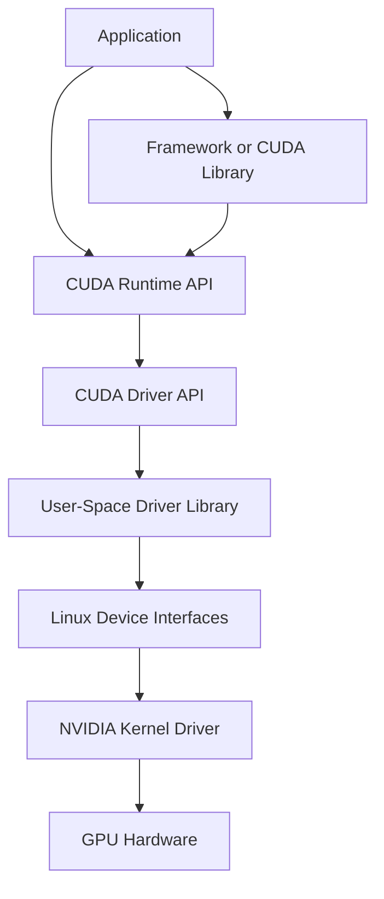
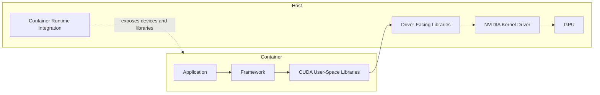

# The CUDA Software Stack

## Introduction

When a CUDA application fails, the visible error rarely identifies the failing layer by itself. A framework may report that no accelerator is available even though the host driver is healthy. A container may include a CUDA toolkit while depending on the host for the kernel driver. An application may import correctly and fail only when its first GPU operation triggers lazy initialization.

The CUDA stack must therefore be understood as a sequence of contracts rather than one installation.

| Chapter field | Value |
|---|---|
| Volume | 03 — CUDA Fundamentals |
| Difficulty | Foundation |
| Estimated reading time | 45 minutes |
| Primary focus | Responsibilities and boundaries across the CUDA stack |
| Previous | Why CUDA Exists |
| Next | CUDA Programming and Execution Model |

## Story

A team deploys the same container image to two GPU nodes. It works on one and fails on the other with a runtime initialization error. Both nodes expose the same GPU model. The image contains the same framework and CUDA libraries.

The difference is below the container boundary. One host runs a driver branch compatible with the user-space stack; the other does not. The container is identical, but the execution contract between user space and the host driver is not.

This is why “the container includes CUDA” is not a complete compatibility statement.

## Learning Objectives

After completing this chapter, you will be able to:

- Identify the major layers of the CUDA software stack.
- Distinguish the CUDA Runtime API from the CUDA Driver API.
- Explain the separation between user-space components and the kernel driver.
- Describe how containers depend on the host GPU stack.
- Build a layered diagnosis sequence for CUDA initialization failures.

## Big Picture

**Figure 3.2.1 — CUDA software layers.** High-level software eventually crosses from user space into the kernel driver before work can reach the device.

## Application and Framework Layer

Applications may call CUDA directly, but many production workloads use frameworks and optimized libraries. These layers choose kernels, allocate buffers, manage streams, and translate high-level operations into CUDA work.

A framework can hide CUDA details while still creating strong dependencies on:

- Specific runtime behavior
- Particular library versions
- Supported GPU architectures
- Driver capabilities
- Memory allocation strategies
- Kernel implementations selected at runtime

Operational teams should record the full software bill of materials rather than only the framework version.

## CUDA Libraries

CUDA libraries provide optimized implementations of common operations. They reduce the need for every application team to write and tune custom kernels.

Examples of library responsibilities include:

- Dense and sparse linear algebra
- Deep-learning primitives
- Fast Fourier transforms
- Random number generation
- Collective communication

Libraries sit above the runtime and driver layers but may perform their own device discovery, workspace allocation, algorithm selection, and compatibility checks.

## CUDA Runtime API

The Runtime API provides a convenient application-facing model for common operations such as:

- Device discovery and selection
- Memory allocation and transfer
- Kernel launch
- Stream and event management
- Error retrieval
- Synchronization

Runtime initialization is often lazy. A process may load successfully without creating a device context. The first operation that requires the GPU may trigger driver loading, context creation, library initialization, and memory allocation.

:::important
A successful application import is not proof that the CUDA execution path works. Validate an operation that actually touches the device.
:::

## CUDA Driver API

The Driver API is a lower-level interface for explicit control over devices, contexts, modules, and kernel launches. The Runtime API is implemented using driver capabilities beneath it.

| Runtime API | Driver API |
|---|---|
| Higher-level convenience | Lower-level explicit control |
| Common in ordinary CUDA applications | Common in runtimes, frameworks, and advanced tooling |
| Manages context behavior more implicitly | Exposes context and module management directly |
| Uses runtime-style functions | Uses driver-style functions and handles |

Both ultimately depend on the installed NVIDIA driver stack.

## User-Space Driver Components

User-space driver libraries translate application requests into operations understood by the kernel driver. They participate in context management, module loading, memory operations, and command submission.

These libraries are part of the compatibility boundary. A container may carry some user-space CUDA components while relying on host integration to expose driver-facing libraries and devices correctly.

## Kernel Driver

The kernel driver manages privileged interaction with the GPU. Its responsibilities include device initialization, memory management support, command submission, interrupt handling, and recovery coordination.

On Linux, device nodes and kernel modules form part of this boundary. A process without access to the required devices cannot use the GPU even if all user-space libraries are present.

## Containers and the Host Boundary

A GPU container is not a virtual GPU by itself. It packages application and user-space dependencies while the host provides the physical device and kernel driver.

**Figure 3.2.2 — Container boundary.** The image packages user space, while runtime integration connects the container to host driver resources.

This model explains several common failures:

- Device files not exposed
- Driver-facing libraries missing or shadowed
- Runtime hooks not configured
- Host driver too old for the application stack
- Container device selection excluding the expected GPU

## Compatibility as a Chain

Compatibility must hold across several dimensions.

| Layer | Question |
|---|---|
| Application | Was it built for the required runtime and libraries? |
| Framework | Does this build support the target CUDA stack? |
| Device code | Does the binary contain code usable by the target GPU? |
| User space | Are required libraries present and loadable? |
| Driver | Does it provide the capabilities expected by user space? |
| Hardware | Is the GPU architecture supported by the software build? |

Avoid reducing compatibility to a single “CUDA version” string. Different tools may report the version they were built against, the highest capability exposed by a driver, or the toolkit installed on disk.

## Context Creation

A CUDA context represents process state associated with a device. It contains resources needed to execute work, including virtual address state, loaded modules, allocations, and scheduling metadata.

Context creation has operational consequences:

- It consumes memory.
- It may be delayed until first use.
- Multiple processes may create separate contexts.
- Initialization time may affect cold-start latency.
- Failures may appear only when a device operation begins.

## Production Troubleshooting

### Problem: `nvidia-smi` works, but CUDA initialization fails

**Diagnosis order**

1. Confirm the process can access expected device nodes.
2. Confirm user-space libraries resolve from the intended location.
3. Confirm container runtime integration is active.
4. Confirm framework and driver compatibility.
5. Run a minimal device-query program outside and inside the container.

### Problem: Works on host, fails in container

| Check | Purpose |
|---|---|
| Device visibility | Confirm expected GPU is exposed |
| Library resolution | Detect shadowed or missing driver libraries |
| Environment variables | Confirm device filtering and library paths |
| Runtime configuration | Confirm GPU runtime hooks are enabled |
| Minimal CUDA test | Separate framework failure from platform failure |

### Problem: Import succeeds, first GPU operation fails

The application likely performs lazy initialization. Capture the first failing operation and inspect context creation, memory allocation, and library initialization rather than treating import success as validation.

## Customer Scenario

A customer maintains one golden container image and expects it to run on every GPU node. The architect explains that image standardization controls only part of the system. The host driver, runtime integration, GPU architecture, firmware, and device exposure remain external dependencies.

A production design therefore requires both image governance and node conformance testing.

## Interview Preparation

### Conceptual Questions

1. Why can a container include CUDA libraries but still require a host driver?
2. What is the difference between the Runtime API and Driver API?
3. Why might CUDA initialization be lazy?

### Architecture Questions

1. Draw the path from a framework call to the GPU.
2. Explain the user-space and kernel-space boundary.
3. Describe what must be validated for container compatibility.

### Scenario Questions

1. The same image works on one node and fails on another. What do you compare?
2. `nvidia-smi` works inside a container, but a framework reports no devices. What remains unproven?
3. Cold-start latency increases after a software upgrade. Which CUDA-layer events might contribute?

## Summary

The CUDA stack connects applications to GPU hardware through multiple layers: frameworks and libraries, the Runtime API, the Driver API, user-space driver components, kernel interfaces, and the GPU itself.

Containers package much of user space but do not replace the host driver. Reliable operations require validating the entire chain rather than relying on one command or one version label.

## Key Takeaways

- CUDA is a layered stack, not one package.
- Runtime initialization may occur only on first device use.
- The Driver API provides lower-level control beneath runtime abstractions.
- GPU containers depend on host device and driver integration.
- Compatibility must be evaluated across application, libraries, driver, and hardware.

## Cross References

- Previous: [Why CUDA Exists](./chapter-01-why-cuda-exists)
- Next: [CUDA Programming and Execution Model](./chapter-03-cuda-programming-and-execution-model)
- Related lab: [Inspect and Validate a CUDA Environment](./labs/lab-01-inspect-and-validate-a-cuda-environment)
