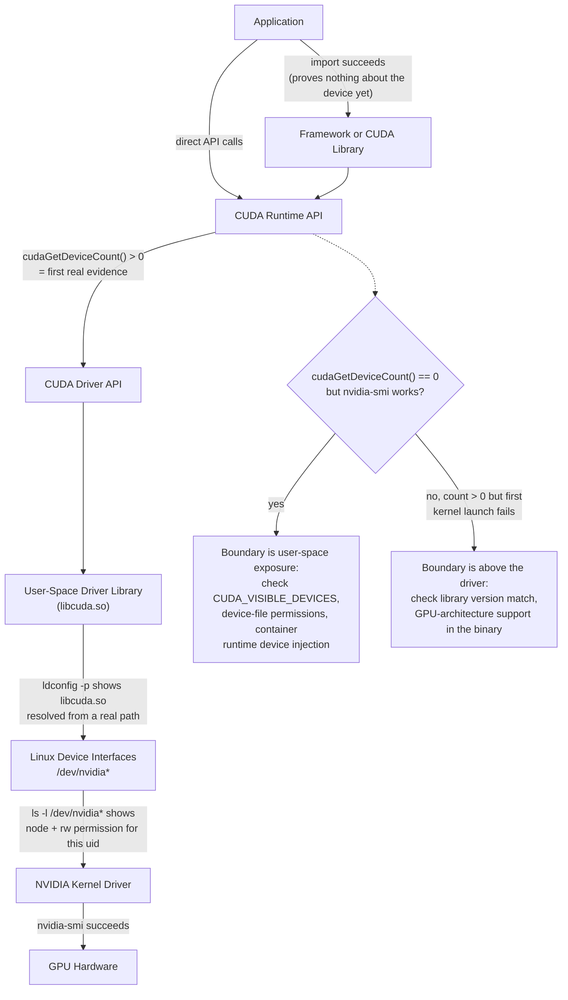
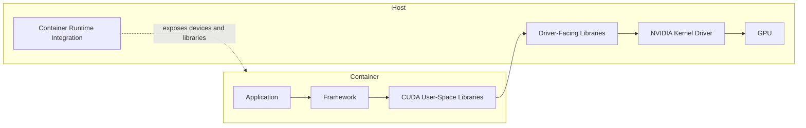

# The CUDA Software Stack

## Introduction

When a CUDA application fails, the visible error rarely identifies the failing layer by itself. A framework may report that no accelerator is available even though the host driver is healthy. A container may include a CUDA toolkit while depending on the host for the kernel driver. An application may import correctly and fail only when its first GPU operation triggers lazy initialization.

The CUDA stack must therefore be understood as a sequence of contracts rather than one installation.

| Chapter field | Value |
|---|---|
| Volume | 03 — CUDA Fundamentals |
| Difficulty | Foundation |
| Estimated reading time | 45 minutes |
| Primary focus | Responsibilities and boundaries across the CUDA stack |
| Previous | Why CUDA Exists |
| Next | CUDA Programming and Execution Model |

## Story

A team deploys the same container image to two GPU nodes. It works on one and fails on the other with a runtime initialization error. Both nodes expose the same GPU model. The image contains the same framework and CUDA libraries.

The difference is below the container boundary. One host runs a driver branch compatible with the user-space stack; the other does not. The container is identical, but the execution contract between user space and the host driver is not.

This is why “the container includes CUDA” is not a complete compatibility statement.

## Learning Objectives

After completing this chapter, you will be able to:

- Identify the major layers of the CUDA software stack.
- Distinguish the CUDA Runtime API from the CUDA Driver API.
- Explain the separation between user-space components and the kernel driver.
- Describe how containers depend on the host GPU stack.
- Build a layered diagnosis sequence for CUDA initialization failures.

## Big Picture



**Figure 3.2.1 — CUDA software layers as a fault-isolation ladder.** Each arrow names the specific evidence that proves that hop is healthy — a successful Python `import` proves almost nothing, while `cudaGetDeviceCount() > 0` is the first real signal a device is reachable from this process. The decision diamond captures the single most common triage split: device count zero with a healthy `nvidia-smi` points at the user-space/exposure boundary, not the driver.

## Application and Framework Layer

Applications may call CUDA directly, but many production workloads use frameworks and optimized libraries. These layers choose kernels, allocate buffers, manage streams, and translate high-level operations into CUDA work.

A framework can hide CUDA details while still creating strong dependencies on:

- Specific runtime behavior
- Particular library versions
- Supported GPU architectures
- Driver capabilities
- Memory allocation strategies
- Kernel implementations selected at runtime

Operational teams should record the full software bill of materials rather than only the framework version.

## CUDA Libraries

CUDA libraries provide optimized implementations of common operations. They reduce the need for every application team to write and tune custom kernels.

Examples of library responsibilities include:

- Dense and sparse linear algebra
- Deep-learning primitives
- Fast Fourier transforms
- Random number generation
- Collective communication

Libraries sit above the runtime and driver layers but may perform their own device discovery, workspace allocation, algorithm selection, and compatibility checks.

## CUDA Runtime API

The Runtime API provides a convenient application-facing model for common operations such as:

- Device discovery and selection
- Memory allocation and transfer
- Kernel launch
- Stream and event management
- Error retrieval
- Synchronization

Runtime initialization is often lazy. A process may load successfully without creating a device context. The first operation that requires the GPU may trigger driver loading, context creation, library initialization, and memory allocation.

:::important
A successful application import is not proof that the CUDA execution path works. Validate an operation that actually touches the device.
:::

## CUDA Driver API

The Driver API is a lower-level interface for explicit control over devices, contexts, modules, and kernel launches. The Runtime API is implemented using driver capabilities beneath it.

| Runtime API | Driver API |
|---|---|
| Higher-level convenience | Lower-level explicit control |
| Common in ordinary CUDA applications | Common in runtimes, frameworks, and advanced tooling |
| Manages context behavior more implicitly | Exposes context and module management directly |
| Uses runtime-style functions | Uses driver-style functions and handles |

Both ultimately depend on the installed NVIDIA driver stack.

## User-Space Driver Components

User-space driver libraries translate application requests into operations understood by the kernel driver. They participate in context management, module loading, memory operations, and command submission.

These libraries are part of the compatibility boundary. A container may carry some user-space CUDA components while relying on host integration to expose driver-facing libraries and devices correctly.

## Kernel Driver

The kernel driver manages privileged interaction with the GPU. Its responsibilities include device initialization, memory management support, command submission, interrupt handling, and recovery coordination.

On Linux, device nodes and kernel modules form part of this boundary. A process without access to the required devices cannot use the GPU even if all user-space libraries are present.

## Containers and the Host Boundary

A GPU container is not a virtual GPU by itself. It packages application and user-space dependencies while the host provides the physical device and kernel driver.



**Figure 3.2.2 — Container boundary.** The image packages user space, while runtime integration connects the container to host driver resources.

This model explains several common failures:

- Device files not exposed
- Driver-facing libraries missing or shadowed
- Runtime hooks not configured
- Host driver too old for the application stack
- Container device selection excluding the expected GPU

## Compatibility as a Chain

Compatibility must hold across several dimensions.

| Layer | Question |
|---|---|
| Application | Was it built for the required runtime and libraries? |
| Framework | Does this build support the target CUDA stack? |
| Device code | Does the binary contain code usable by the target GPU? |
| User space | Are required libraries present and loadable? |
| Driver | Does it provide the capabilities expected by user space? |
| Hardware | Is the GPU architecture supported by the software build? |

Avoid reducing compatibility to a single “CUDA version” string. Different tools may report the version they were built against, the highest capability exposed by a driver, or the toolkit installed on disk.

## Context Creation

A CUDA context represents process state associated with a device. It contains resources needed to execute work, including virtual address state, loaded modules, allocations, and scheduling metadata.

Context creation has operational consequences:

- It consumes memory.
- It may be delayed until first use.
- Multiple processes may create separate contexts.
- Initialization time may affect cold-start latency.
- Failures may appear only when a device operation begins.

## Production Troubleshooting

### Problem: `nvidia-smi` works, but CUDA initialization fails

**Diagnosis order**

1. Confirm the process can access expected device nodes.
2. Confirm user-space libraries resolve from the intended location.
3. Confirm container runtime integration is active.
4. Confirm framework and driver compatibility.
5. Run a minimal device-query program outside and inside the container.

**Evidence for step 1 — device node access is a permissions problem, not a driver problem:**

```text
$ ls -l /dev/nvidia*
crw-rw-rw- 1 root root 195,   0 Mar  3 09:12 /dev/nvidia0
crw-rw-rw- 1 root root 195, 255 Mar  3 09:12 /dev/nvidiactl
crw-rw-rw- 1 root root 195, 254 Mar  3 09:12 /dev/nvidia-modeset
crw-rw-rw- 1 root root 234,   0 Mar  3 09:12 /dev/nvidia-uvm
```

If this instead returns `No such file or directory` inside a container while the host shows the nodes above, the container runtime never injected the devices — that is a Container Toolkit / CDI configuration gap, not something a driver reinstall touches.

**Evidence for step 2 — confirm `libcuda.so` actually resolves, don't assume it:**

```text
$ ldconfig -p | grep libcuda
	libcuda.so.1 (libc6,x86-64) => /usr/lib/x86_64-linux-gnu/libcuda.so.1
	libcuda.so (libc6,x86-64) => /usr/lib/x86_64-linux-gnu/libcuda.so
```

An empty result here — inside the container — while the host shows these two lines is the signature of "container has application libraries but not the driver-facing library the host was supposed to mount in."

### Problem: Works on host, fails in container

| Check | Purpose |
|---|---|
| Device visibility | Confirm expected GPU is exposed |
| Library resolution | Detect shadowed or missing driver libraries |
| Environment variables | Confirm device filtering and library paths |
| Runtime configuration | Confirm GPU runtime hooks are enabled |
| Minimal CUDA test | Separate framework failure from platform failure |

**Row 3 evidence — environment variables that silently filter devices:**

```text
$ env | grep -E 'CUDA_VISIBLE_DEVICES|NVIDIA_VISIBLE_DEVICES'
NVIDIA_VISIBLE_DEVICES=none
```

`NVIDIA_VISIBLE_DEVICES=none` is a common accidental leftover from a base image or CI template — it silently produces zero visible GPUs with no error message at all, and it is indistinguishable from a real driver failure unless you check the environment first. This single line explains more "works on host, fails in container" tickets than actual driver incompatibility does.

**Row 5 evidence — the minimal test that separates framework bugs from platform bugs:**

```text
$ python3 -c "import torch; print(torch.cuda.is_available())"
```
Run this once on host, once inside the container, same GPU. If host prints `True` and container prints `False`, the fault is strictly inside the container boundary (rows 1-4 above) — the framework itself is not the suspect.

### Problem: Import succeeds, first GPU operation fails

The application likely performs lazy initialization. Capture the first failing operation and inspect context creation, memory allocation, and library initialization rather than treating import success as validation.

```text
>>> import torch          # succeeds — no device touched yet
>>> torch.cuda.is_available()
True
>>> x = torch.zeros(4, device="cuda")   # first real device operation
RuntimeError: CUDA error: no kernel image is available for execution on the device
```

This exact sequence is the chapter's core lesson made concrete: `import torch` and even `torch.cuda.is_available()` can both succeed while the first operation that actually needs to *execute code on the device* fails — here because the installed binary's device code doesn't cover this GPU's compute capability (see Chapter 11). Treat only the last line as validation.

## Customer Scenario

A customer maintains one golden container image and expects it to run on every GPU node. The architect explains that image standardization controls only part of the system. The host driver, runtime integration, GPU architecture, firmware, and device exposure remain external dependencies.

A production design therefore requires both image governance and node conformance testing.

## Interview Preparation

### Conceptual Questions

1. **Why can a container include CUDA libraries but still require a host driver?**
   "Because the kernel driver is privileged code that has to run in the host's kernel — a container shares the host's kernel by design, it doesn't bring its own. So the container can package the user-space CUDA libraries, the runtime, even the compiler, but the actual device control, interrupt handling, and command submission to the physical GPU has to go through whatever kernel driver is loaded on the host. 'The container has CUDA' is really only ever a claim about the user-space half of the stack."

2. **What is the difference between the Runtime API and Driver API?**
   "The Runtime API is the higher-level, more convenient interface most CUDA applications actually use — it manages context creation implicitly. The Driver API sits underneath it and gives you explicit control over devices, contexts, and modules — it's what frameworks and advanced tooling reach for when they need that control. Every Runtime API call eventually goes through Driver API capabilities, so if I see a driver-level error surface through a runtime-level call, that's expected, not a sign something is broken."

3. **Why might CUDA initialization be lazy?**
   "Because creating a context and initializing the device costs time and memory, and a process that imports a CUDA library doesn't necessarily know yet whether it will use the GPU. So the runtime defers actual device work — context creation, driver loading — until the first operation that truly needs the device. The operational consequence is the one I keep coming back to: a clean process start and successful import tell you nothing about whether the GPU path actually works, because that work hasn't happened yet."

### Architecture Questions

1. **Draw the path from a framework call to the GPU.**
   "Framework call, into the CUDA Runtime API, down into the Driver API, into the user-space driver library — `libcuda.so` — which talks across the device-file boundary to the NVIDIA kernel driver, which finally controls the GPU. I'd draw that as a straight vertical chain and then annotate each arrow with what proves it's working: library resolution for the user-space hop, device-node permissions for the kernel-driver hop, `nvidia-smi` for the final hop to hardware."

2. **Explain the user-space and kernel-space boundary.**
   "User space is everything the application, framework, and CUDA runtime/driver-API libraries do — it's flexible, replaceable per-container. Kernel space is the actual NVIDIA kernel module, which is privileged, shared across every process and container on that host, and controlled entirely by the host admin. The practical consequence is that you can update, swap, or version-pin everything in user space per-container, but the kernel driver is a single shared fact about the node — which is exactly why fleet-wide driver policy matters so much operationally."

3. **Describe what must be validated for container compatibility.**
   "Four things, and I check them in this order: device files are actually exposed to the container, the driver-facing user-space libraries resolve inside the container's namespace, the container runtime's GPU hooks or CDI integration are active, and the host driver version is new enough to support whatever the packaged CUDA user-space expects. I don't accept 'nvidia-smi works on the host' as proof of any of these — it only proves the host driver is healthy."

### Scenario Questions

1. **The same image works on one node and fails on another. What do you compare?**
   "First the host driver versions on both nodes — that's the most common single cause of exactly this symptom, because the image is identical by construction. Then I'd compare `nvidia-smi`'s reported CUDA capability on each node, the exposed device files, and whether the container runtime's GPU integration is configured identically. I would not touch the image at all until I've ruled out the host-side difference, because the story explicitly states the image is the same."

2. **`nvidia-smi` works inside a container, but a framework reports no devices. What remains unproven?**
   "`nvidia-smi` working inside the container proves the device is exposed and the driver-facing tooling can reach it — but it doesn't prove the framework's own CUDA runtime library resolves correctly, that `CUDA_VISIBLE_DEVICES` isn't filtering the framework's view specifically, or that the framework's build is compatible with the installed driver. Those are three separate things `nvidia-smi` cannot see, because it doesn't go through the framework's code path at all."

3. **Cold-start latency increases after a software upgrade. Which CUDA-layer events might contribute?**
   "I'd list context creation time, any change in lazy module loading behavior, JIT compilation if the new build shipped PTX instead of native code for this GPU, and library initialization order if a new dependency got pulled in. The way I'd actually find out, rather than guess, is compare a timeline of the first request before and after the upgrade and look for where the extra time actually landed instead of assuming which layer changed."

## Summary

The CUDA stack connects applications to GPU hardware through multiple layers: frameworks and libraries, the Runtime API, the Driver API, user-space driver components, kernel interfaces, and the GPU itself.

Containers package much of user space but do not replace the host driver. Reliable operations require validating the entire chain rather than relying on one command or one version label.

## Key Takeaways

- CUDA is a layered stack, not one package.
- Runtime initialization may occur only on first device use.
- The Driver API provides lower-level control beneath runtime abstractions.
- GPU containers depend on host device and driver integration.
- Compatibility must be evaluated across application, libraries, driver, and hardware.

## Cross References

- Previous: [Why CUDA Exists](./chapter-01-why-cuda-exists)
- Next: [CUDA Programming and Execution Model](./chapter-03-cuda-programming-and-execution-model)
- Related lab: [Inspect and Validate a CUDA Environment](./labs/lab-01-inspect-and-validate-a-cuda-environment)
