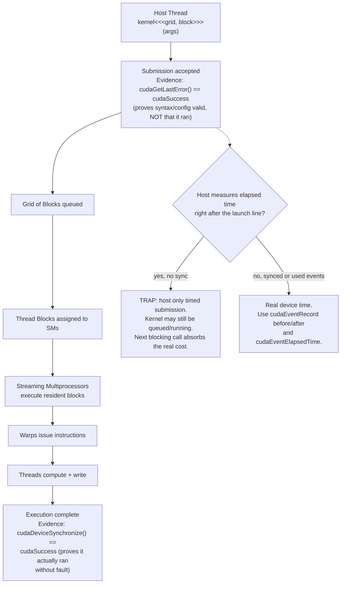
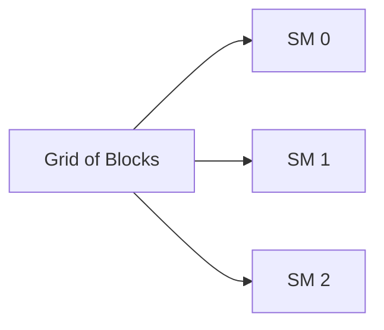
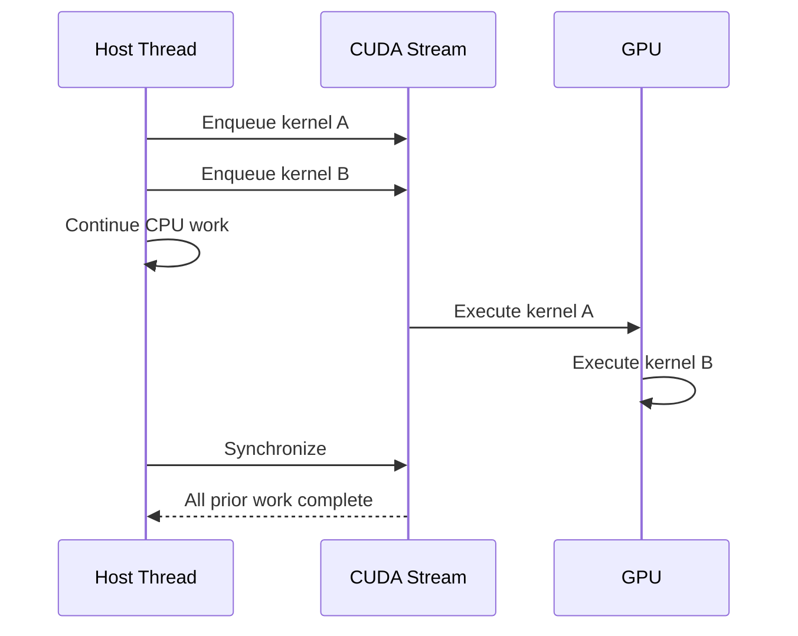

# CUDA Programming and Execution Model

## Introduction

CUDA software describes work in logical terms while the GPU schedules that work onto physical hardware. Applications launch kernels. Kernels create grids. Grids contain thread blocks. Blocks contain threads. Hardware groups threads into warps and assigns blocks to Streaming Multiprocessors.

The model looks simple on a diagram, but production behavior depends on several details: launch geometry, context state, asynchronous submission, resource limits, synchronization, and error propagation.

| Chapter field | Value |
|---|---|
| Volume | 03 — CUDA Fundamentals |
| Difficulty | Foundation |
| Estimated reading time | 50 minutes |
| Primary focus | Kernel launch and execution semantics |
| Previous | The CUDA Software Stack |
| Next | Host and Device Memory |

## Story

An application launches a kernel and immediately records the elapsed time with a host timer. The measured duration appears almost zero, yet the next operation blocks for much longer than expected.

The kernel launch was asynchronous. The host measured submission time, not execution time. The later operation forced synchronization and absorbed the outstanding work.

The application was functioning correctly. The engineer's mental model of completion was wrong.

## Learning Objectives

After completing this chapter, you will be able to:

- Explain kernels, grids, blocks, threads, and warps.
- Describe how logical CUDA work maps to GPU hardware.
- Explain asynchronous kernel launch behavior.
- Distinguish submission, execution, and completion.
- Identify common launch and synchronization mistakes.

## Big Picture



**Figure 3.3.1 — CUDA execution hierarchy with the submission-vs-completion trap made explicit.** A kernel launch returning is evidence of *acceptance*, not *completion* — the diagram's decision point is the single most common source of "impossible" timing numbers described in this chapter's Story, and the fix (device events) is called out directly on the healthy branch.

## Kernels

A kernel is a function executed on the GPU. One launch creates many logical thread instances of the same kernel code. Each thread derives its work from built-in coordinates such as block and thread indices.

A kernel launch specifies two important dimensions:

- Grid dimensions: how many blocks are created.
- Block dimensions: how many threads exist in each block.

The launch may also specify dynamic shared memory and a stream.

## Grids, Blocks, and Threads

Threads are the smallest logical execution instances visible to the programming model. Threads within a block can cooperate through shared memory and block-level synchronization. Blocks are intended to be independent so the scheduler can execute them in any order.

This independence provides scalability. The same grid can execute on GPUs with different numbers of SMs. A larger GPU may run more blocks concurrently; a smaller GPU executes more waves.

| Level | Responsibility |
|---|---|
| Thread | Process one logical element or coordinate |
| Block | Group cooperating threads |
| Grid | Represent all blocks in one kernel launch |
| Warp | Hardware instruction-issue group |
| SM | Execute resident blocks and warps |

## Mapping Indices to Data

A common one-dimensional mapping is conceptually:

```text
global_index = block_index × threads_per_block + thread_index
```

The kernel checks whether the calculated index falls inside the data range, then processes the corresponding element.

Two- and three-dimensional grids allow software to map threads naturally to images, matrices, volumes, and tiled tensor regions.

The mapping determines more than correctness. It influences memory coalescing, branch behavior, load balance, and how much parallel work is exposed.

## Block Placement

The GPU scheduler assigns a block to one SM, where it remains for its lifetime. Multiple blocks may reside on one SM if registers, shared memory, thread slots, warp slots, and architectural limits permit.

Blocks are not normally migrated between SMs during execution. This stable placement enables shared-memory cooperation and block-level synchronization.



**Figure 3.3.2 — Block scheduling.** Blocks are dispatched as SM resources become available; completion order is not guaranteed.

## Warps and Instruction Issue

Hardware groups threads from a block into warps. Threads in a warp execute a common instruction stream, with per-lane predicates controlling participation.

When threads take different branches, execution may serialize the paths. When a warp waits for memory, the scheduler can issue another ready warp. This latency-hiding model requires enough resident, runnable work.

## Contexts

A CUDA context holds process state associated with a device. It includes address-space state, allocations, loaded modules, and execution resources.

Context behavior matters operationally because:

- Creation may occur lazily.
- Contexts consume device memory.
- Different processes usually maintain distinct state.
- The selected device determines where subsequent operations execute.
- Context failure can surface during the first real GPU operation.

## Asynchronous Launch

Kernel launches are commonly asynchronous with respect to the host. The host submits work and continues without waiting for completion.



**Figure 3.3.3 — Asynchronous submission.** Host progress and GPU execution overlap until an operation requires completion.

This behavior improves overlap but complicates measurement and error handling.

## Submission Is Not Completion

A successful launch call may mean only that the request was accepted for submission. Errors caused during execution can appear later at a synchronization point or another API call.

This creates a common diagnostic trap: the API call reporting the error may not be the operation that caused it.

Useful debugging techniques include:

- Checking launch errors immediately.
- Synchronizing at controlled points during diagnosis.
- Preserving the first error rather than continuing through many failing calls.
- Using profilers and sanitizers to locate the original operation.

## Synchronization

Synchronization establishes a completion boundary. Common boundaries include:

- Device-wide synchronization
- Stream synchronization
- Event synchronization
- Blocking memory transfers
- Operations with implicit ordering requirements

Synchronization is necessary for correctness when the host or another operation consumes results. Excess synchronization reduces overlap and can serialize the pipeline.

## Launch Geometry

A launch must expose enough work to use the GPU while respecting per-block resource limits.

| Launch problem | Typical effect |
|---|---|
| Too few blocks | Some SMs remain idle |
| Very small blocks | Weak resource utilization |
| Excessive block resources | Fewer resident blocks |
| Poor index mapping | Uncoalesced memory or imbalance |
| Frequent tiny kernels | Launch overhead and gaps dominate |

No universal block size is optimal. The correct configuration depends on architecture, resource usage, and workload shape.

## Production Perspective

High-level frameworks generate kernel launches dynamically. Infrastructure teams may not control launch geometry directly, but they must interpret the resulting behavior.

Examples:

- Low utilization with many tiny kernels may indicate fragmented work.
- Long gaps between kernels may indicate CPU preprocessing or synchronization.
- Strong utilization with low throughput may indicate memory or instruction bottlenecks.
- Errors appearing at synchronization may originate from earlier asynchronous work.

## Production Troubleshooting

### Problem: Timing reports impossible kernel durations

**Root cause:** the host measured launch submission rather than GPU completion.

**Resolution:** use CUDA events or synchronize around the measured region when appropriate.

**Evidence — the wrong way versus the right way, side by side:**

```cpp
// WRONG: host wall-clock around an async launch
auto t0 = std::chrono::steady_clock::now();
myKernel<<<grid, block>>>(data);
auto t1 = std::chrono::steady_clock::now();
// prints "kernel: 0.014 ms" — this is submission time, not execution time
```

```cpp
// RIGHT: device events bracket the actual execution interval
cudaEvent_t start, stop;
cudaEventCreate(&start);
cudaEventCreate(&stop);
cudaEventRecord(start);
myKernel<<<grid, block>>>(data);
cudaEventRecord(stop);
cudaEventSynchronize(stop);       // wait only for this interval, not the whole device
float ms = 0.0f;
cudaEventElapsedTime(&ms, start, stop);
// prints "kernel: 4.812 ms" — the real number
```

The 340x gap between `0.014 ms` and `4.812 ms` in this example is not a measurement bug — it is exactly the story at the top of this chapter: the host thread returned from the launch statement almost immediately, and the "next operation" (here, the second timestamp) had nothing to synchronize on, so it measured nothing. `cudaEventSynchronize(stop)` is what forces the host to actually wait for the device-side `stop` marker.

### Problem: Error appears on an unrelated API call

**Root cause:** an earlier asynchronous operation failed and the error surfaced later.

**Resolution:** check errors close to launches and add temporary synchronization to isolate the failing operation.

**Evidence — a deferred error surfacing three calls later:**

```text
kernel_a<<<...>>>(buf);      // launches fine, cudaGetLastError() == cudaSuccess
kernel_b<<<...>>>(buf);      // launches fine, cudaGetLastError() == cudaSuccess
cudaMemcpy(host, buf, n, cudaMemcpyDeviceToHost);
// terminate called after throwing an instance of ...
// CUDA error: an illegal memory access was encountered
```

The error text is attached to the `cudaMemcpy` call, but `cudaMemcpy` is very likely innocent — it is simply the first call that forces synchronization after `kernel_a` or `kernel_b` actually faulted. Bisect by temporarily inserting `cudaDeviceSynchronize()` (plus a `cudaGetLastError()` check) directly after each kernel launch until the synchronize call that first reports the error identifies the true origin.

### Problem: Larger GPU gives little speedup

Check grid size, block count, per-block resource use, CPU launch gaps, memory bandwidth, and synchronization frequency.

**Evidence — a grid too small to use a bigger GPU:** an A10 (72 SMs) and an H100 (132 SMs) both run a kernel launched with `<<<64, 256>>>` — only 64 blocks. On the A10, most of the 72 SMs get at least one block; on the H100, at most 64 of 132 SMs ever receive work, and the other ~68 sit idle for the entire kernel. `nvidia-smi dmon` on the H100 run would show `sm%` capped well below 100 even though the kernel is compute-bound — the ceiling isn't the workload, it's that the grid never exposed enough blocks to fill the larger device. This is a launch-geometry bug, not a memory-bandwidth or driver issue, and it is diagnosed by comparing block count to SM count, not by re-profiling the kernel's instructions.

## Customer Scenario

A customer reports that GPU utilization oscillates between zero and high values. The application launches many short kernels separated by CPU preprocessing and synchronization. The GPU is healthy, but the execution pipeline does not provide continuous work.

The architect recommends profiling the full host–device timeline before purchasing additional GPUs.

## Interview Preparation

### Conceptual Questions

1. **What is the difference between a block and a warp?**
   "A block is the programmer's unit — I decide how many threads go in a block, and CUDA guarantees those threads can cooperate through shared memory and `__syncthreads()`, and that the whole block lands on one SM for its lifetime. A warp is the hardware's unit — the SM actually groups threads from a block into fixed groups of 32 and issues one instruction stream per warp. I don't choose the warp size or warp boundaries; the hardware does. The practical consequence is that a block size that isn't a multiple of 32 leaves lanes idle in the last warp — that's wasted hardware, not a correctness bug."

2. **Why are kernel launches often asynchronous?**
   "Because forcing the host to block on every single launch would throw away one of the biggest advantages of the architecture — the CPU could be preparing the next batch of data, or launching independent work, while the GPU chews through the current kernel. The launch call just enqueues the work into a stream and returns immediately; the actual execution happens on the GPU's own timeline. That's great for overlap, but it means 'the launch call returned' and 'the kernel finished' are two completely different events, and conflating them is the single most common CUDA measurement mistake I see."

3. **Why can an error surface after the operation that caused it?**
   "Because the operation that actually faults — say, an out-of-bounds write inside a kernel — executes asynchronously on the device, so the host has already moved on to enqueue more work by the time the fault happens. CUDA doesn't retroactively reach back into the host thread; it reports the error at the next point the host actually synchronizes or queries state, which could be several launches or an unrelated memcpy later. So when I see an error attached to some innocent-looking API call, my first assumption is that it's a messenger, not the culprit."

### Architecture Questions

1. **Draw the mapping from kernel launch to SM execution.**
   "Host thread launches with a grid and block configuration, that becomes a grid of blocks queued for the device, the scheduler assigns each block to one SM based on available resources — registers, shared memory, warp slots — and the SM breaks each resident block into warps of 32 threads that it actually issues instructions for. I'd draw the SM as a box that can hold multiple resident blocks simultaneously if resources allow, because that's what enables latency hiding — when one warp stalls on memory, the SM switches to another ready warp instead of idling."

2. **Explain which resources limit block residency.**
   "Four things cap how many blocks can be resident on one SM at once: registers per thread times threads per block against the SM's register file, shared memory requested per block against the SM's shared memory budget, the hardware's maximum resident blocks and warps per SM, and the maximum threads per block. Whichever of those four hits its ceiling first determines occupancy — and it's very common for a kernel that requests too many registers or too much shared memory to end up with only one or two resident blocks per SM even though the hardware could technically host many more purely on thread-count grounds."

3. **Describe the role of a CUDA context.**
   "A context is the container for everything the device needs to run a process's work — the address space, loaded modules, allocations, and scheduling state. It's usually created lazily on first device use, which is exactly why an application can import cleanly and even enumerate devices, and then fail only when the first real GPU operation forces context creation. Operationally I care about it because context creation itself consumes memory and time, so cold-start latency and per-process memory overhead both trace back to how many contexts get created and when."

### Scenario Questions

1. **A host timer shows a kernel took microseconds, but the next call blocks. Explain.**
   "The launch is asynchronous — the host timer only measured how long it took to enqueue the work, not how long the GPU took to run it. The 'next call' is very likely a synchronizing operation — a blocking memcpy, a `cudaDeviceSynchronize()`, or another call that has to wait for the queue to drain — and it's absorbing all the real execution time that the first timer missed entirely. I'd fix the measurement with `cudaEvent` timestamps around the kernel specifically, not blame the kernel for being 'slow somewhere else.'"

2. **A grid contains fewer blocks than the GPU has SMs. What happens?**
   "Some SMs simply never receive a block and sit idle for the kernel's entire duration — you can't split one block across multiple SMs, so no scheduling cleverness recovers that lost parallelism. If I saw this in `nvidia-smi dmon`, I'd expect `sm%` capped noticeably below 100 even on a compute-heavy kernel. The fix is architectural, not tunable: increase the grid size, often via a grid-stride loop, so there's enough independent work to cover every SM on the target hardware."

3. **An illegal access is reported during synchronization. Where do you investigate first?**
   "Synchronization is just where the error became visible, not where it happened — so I don't start by staring at the synchronize call. I look at what asynchronous device work was outstanding since the last confirmed-clean synchronization point: kernel launches, async copies, anything that touched device memory in that window. Then I narrow with temporary `cudaDeviceSynchronize()` calls inserted between suspects until I find the exact operation that first produces the error, and only then do I look at that operation's bounds checks and pointer lifetimes."

## Summary

CUDA expresses GPU work through kernels, grids, blocks, and threads. Hardware converts that logical work into warps and schedules blocks across SMs. Launches are commonly asynchronous, so submission, execution, and completion are distinct events.

Correct reasoning requires understanding launch geometry, contexts, resource limits, synchronization, and delayed error reporting.

## Key Takeaways

- Kernels create many logical thread instances.
- Blocks are the unit of placement and cooperation.
- Warps are the hardware instruction-issue groups.
- Kernel launch success does not always imply execution success.
- Synchronization is both a correctness tool and a performance cost.

## Cross References

- Previous: [The CUDA Software Stack](./chapter-02-cuda-software-stack)
- Volume introduction: [CUDA Fundamentals](./index)
- Related lab: [Inspect and Validate a CUDA Environment](./labs/lab-01-inspect-and-validate-a-cuda-environment)
