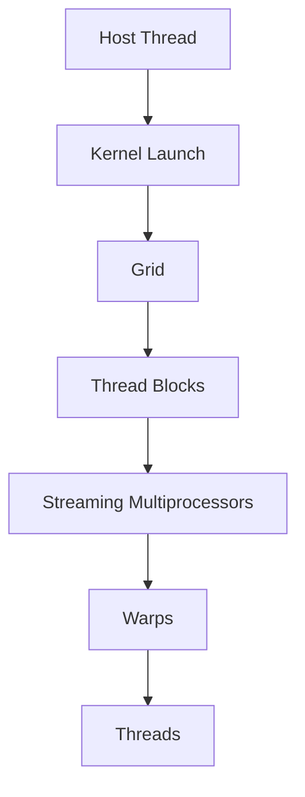
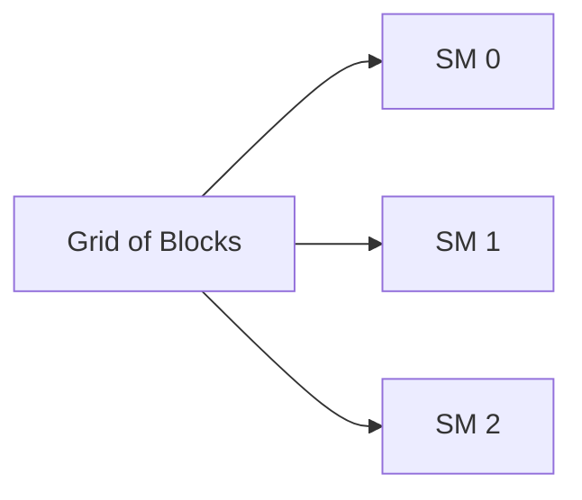
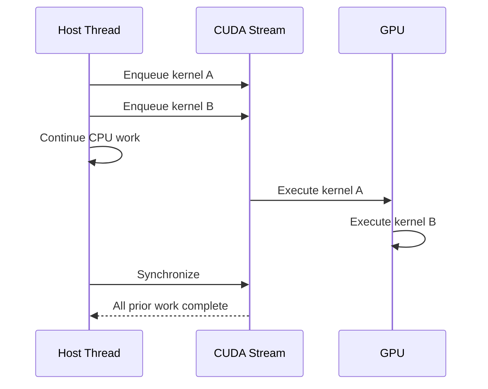

# CUDA Programming and Execution Model

## Introduction

CUDA software describes work in logical terms while the GPU schedules that work onto physical hardware. Applications launch kernels. Kernels create grids. Grids contain thread blocks. Blocks contain threads. Hardware groups threads into warps and assigns blocks to Streaming Multiprocessors.

The model looks simple on a diagram, but production behavior depends on several details: launch geometry, context state, asynchronous submission, resource limits, synchronization, and error propagation.

| Chapter field | Value |
|---|---|
| Volume | 03 — CUDA Fundamentals |
| Difficulty | Foundation |
| Estimated reading time | 50 minutes |
| Primary focus | Kernel launch and execution semantics |
| Previous | The CUDA Software Stack |
| Next | Host and Device Memory |

## Story

An application launches a kernel and immediately records the elapsed time with a host timer. The measured duration appears almost zero, yet the next operation blocks for much longer than expected.

The kernel launch was asynchronous. The host measured submission time, not execution time. The later operation forced synchronization and absorbed the outstanding work.

The application was functioning correctly. The engineer's mental model of completion was wrong.

## Learning Objectives

After completing this chapter, you will be able to:

- Explain kernels, grids, blocks, threads, and warps.
- Describe how logical CUDA work maps to GPU hardware.
- Explain asynchronous kernel launch behavior.
- Distinguish submission, execution, and completion.
- Identify common launch and synchronization mistakes.

## Big Picture



**Figure 3.3.1 — CUDA execution hierarchy.** The host launches logical work; the GPU schedules blocks and warps according to available resources.

## Kernels

A kernel is a function executed on the GPU. One launch creates many logical thread instances of the same kernel code. Each thread derives its work from built-in coordinates such as block and thread indices.

A kernel launch specifies two important dimensions:

- Grid dimensions: how many blocks are created.
- Block dimensions: how many threads exist in each block.

The launch may also specify dynamic shared memory and a stream.

## Grids, Blocks, and Threads

Threads are the smallest logical execution instances visible to the programming model. Threads within a block can cooperate through shared memory and block-level synchronization. Blocks are intended to be independent so the scheduler can execute them in any order.

This independence provides scalability. The same grid can execute on GPUs with different numbers of SMs. A larger GPU may run more blocks concurrently; a smaller GPU executes more waves.

| Level | Responsibility |
|---|---|
| Thread | Process one logical element or coordinate |
| Block | Group cooperating threads |
| Grid | Represent all blocks in one kernel launch |
| Warp | Hardware instruction-issue group |
| SM | Execute resident blocks and warps |

## Mapping Indices to Data

A common one-dimensional mapping is conceptually:

```text
global_index = block_index × threads_per_block + thread_index
```

The kernel checks whether the calculated index falls inside the data range, then processes the corresponding element.

Two- and three-dimensional grids allow software to map threads naturally to images, matrices, volumes, and tiled tensor regions.

The mapping determines more than correctness. It influences memory coalescing, branch behavior, load balance, and how much parallel work is exposed.

## Block Placement

The GPU scheduler assigns a block to one SM, where it remains for its lifetime. Multiple blocks may reside on one SM if registers, shared memory, thread slots, warp slots, and architectural limits permit.

Blocks are not normally migrated between SMs during execution. This stable placement enables shared-memory cooperation and block-level synchronization.



**Figure 3.3.2 — Block scheduling.** Blocks are dispatched as SM resources become available; completion order is not guaranteed.

## Warps and Instruction Issue

Hardware groups threads from a block into warps. Threads in a warp execute a common instruction stream, with per-lane predicates controlling participation.

When threads take different branches, execution may serialize the paths. When a warp waits for memory, the scheduler can issue another ready warp. This latency-hiding model requires enough resident, runnable work.

## Contexts

A CUDA context holds process state associated with a device. It includes address-space state, allocations, loaded modules, and execution resources.

Context behavior matters operationally because:

- Creation may occur lazily.
- Contexts consume device memory.
- Different processes usually maintain distinct state.
- The selected device determines where subsequent operations execute.
- Context failure can surface during the first real GPU operation.

## Asynchronous Launch

Kernel launches are commonly asynchronous with respect to the host. The host submits work and continues without waiting for completion.



**Figure 3.3.3 — Asynchronous submission.** Host progress and GPU execution overlap until an operation requires completion.

This behavior improves overlap but complicates measurement and error handling.

## Submission Is Not Completion

A successful launch call may mean only that the request was accepted for submission. Errors caused during execution can appear later at a synchronization point or another API call.

This creates a common diagnostic trap: the API call reporting the error may not be the operation that caused it.

Useful debugging techniques include:

- Checking launch errors immediately.
- Synchronizing at controlled points during diagnosis.
- Preserving the first error rather than continuing through many failing calls.
- Using profilers and sanitizers to locate the original operation.

## Synchronization

Synchronization establishes a completion boundary. Common boundaries include:

- Device-wide synchronization
- Stream synchronization
- Event synchronization
- Blocking memory transfers
- Operations with implicit ordering requirements

Synchronization is necessary for correctness when the host or another operation consumes results. Excess synchronization reduces overlap and can serialize the pipeline.

## Launch Geometry

A launch must expose enough work to use the GPU while respecting per-block resource limits.

| Launch problem | Typical effect |
|---|---|
| Too few blocks | Some SMs remain idle |
| Very small blocks | Weak resource utilization |
| Excessive block resources | Fewer resident blocks |
| Poor index mapping | Uncoalesced memory or imbalance |
| Frequent tiny kernels | Launch overhead and gaps dominate |

No universal block size is optimal. The correct configuration depends on architecture, resource usage, and workload shape.

## Production Perspective

High-level frameworks generate kernel launches dynamically. Infrastructure teams may not control launch geometry directly, but they must interpret the resulting behavior.

Examples:

- Low utilization with many tiny kernels may indicate fragmented work.
- Long gaps between kernels may indicate CPU preprocessing or synchronization.
- Strong utilization with low throughput may indicate memory or instruction bottlenecks.
- Errors appearing at synchronization may originate from earlier asynchronous work.

## Production Troubleshooting

### Problem: Timing reports impossible kernel durations

**Root cause:** the host measured launch submission rather than GPU completion.

**Resolution:** use CUDA events or synchronize around the measured region when appropriate.

### Problem: Error appears on an unrelated API call

**Root cause:** an earlier asynchronous operation failed and the error surfaced later.

**Resolution:** check errors close to launches and add temporary synchronization to isolate the failing operation.

### Problem: Larger GPU gives little speedup

Check grid size, block count, per-block resource use, CPU launch gaps, memory bandwidth, and synchronization frequency.

## Customer Scenario

A customer reports that GPU utilization oscillates between zero and high values. The application launches many short kernels separated by CPU preprocessing and synchronization. The GPU is healthy, but the execution pipeline does not provide continuous work.

The architect recommends profiling the full host–device timeline before purchasing additional GPUs.

## Interview Preparation

### Conceptual Questions

1. What is the difference between a block and a warp?
2. Why are kernel launches often asynchronous?
3. Why can an error surface after the operation that caused it?

### Architecture Questions

1. Draw the mapping from kernel launch to SM execution.
2. Explain which resources limit block residency.
3. Describe the role of a CUDA context.

### Scenario Questions

1. A host timer shows a kernel took microseconds, but the next call blocks. Explain.
2. A grid contains fewer blocks than the GPU has SMs. What happens?
3. An illegal access is reported during synchronization. Where do you investigate first?

## Summary

CUDA expresses GPU work through kernels, grids, blocks, and threads. Hardware converts that logical work into warps and schedules blocks across SMs. Launches are commonly asynchronous, so submission, execution, and completion are distinct events.

Correct reasoning requires understanding launch geometry, contexts, resource limits, synchronization, and delayed error reporting.

## Key Takeaways

- Kernels create many logical thread instances.
- Blocks are the unit of placement and cooperation.
- Warps are the hardware instruction-issue groups.
- Kernel launch success does not always imply execution success.
- Synchronization is both a correctness tool and a performance cost.

## Cross References

- Previous: [The CUDA Software Stack](./chapter-02-cuda-software-stack)
- Volume introduction: [CUDA Fundamentals](./index)
- Related lab: [Inspect and Validate a CUDA Environment](./labs/lab-01-inspect-and-validate-a-cuda-environment)
