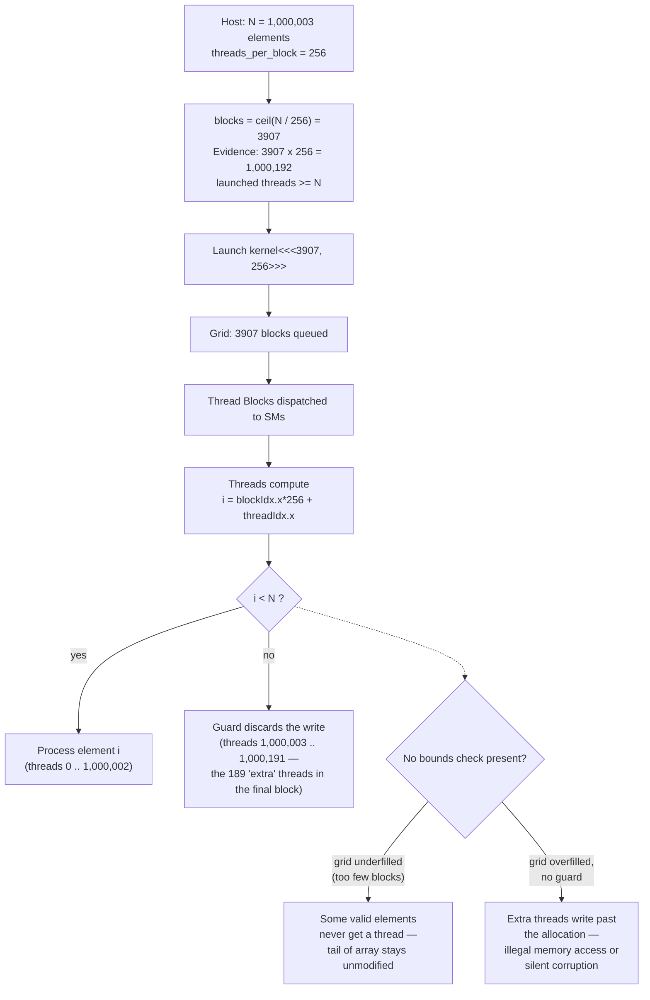
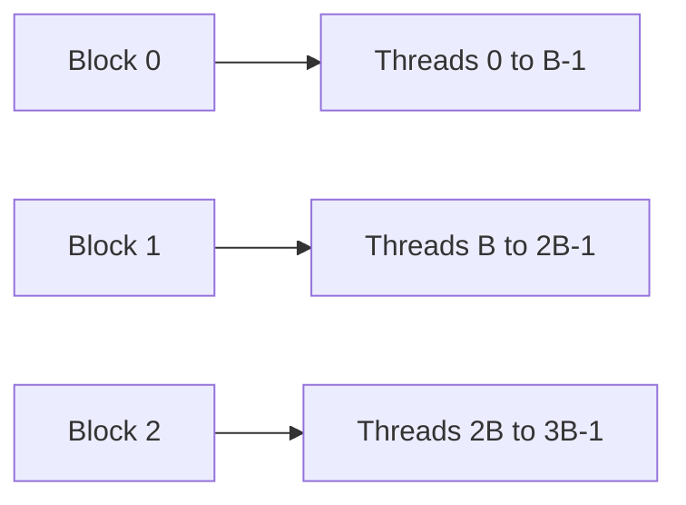
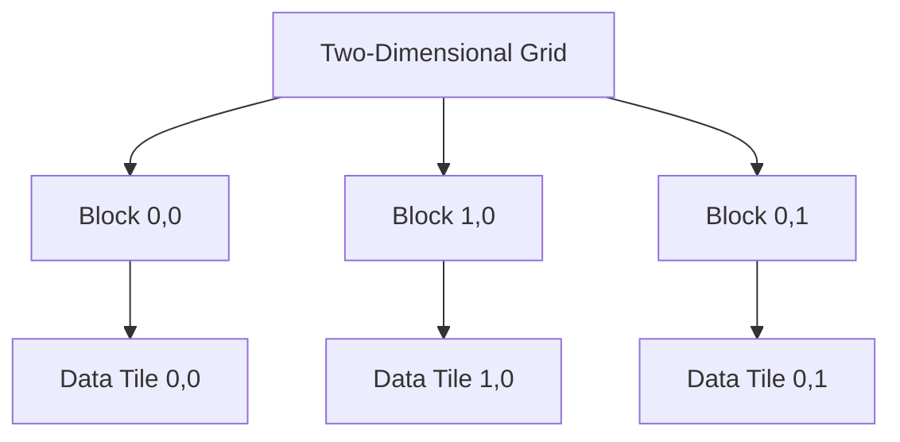
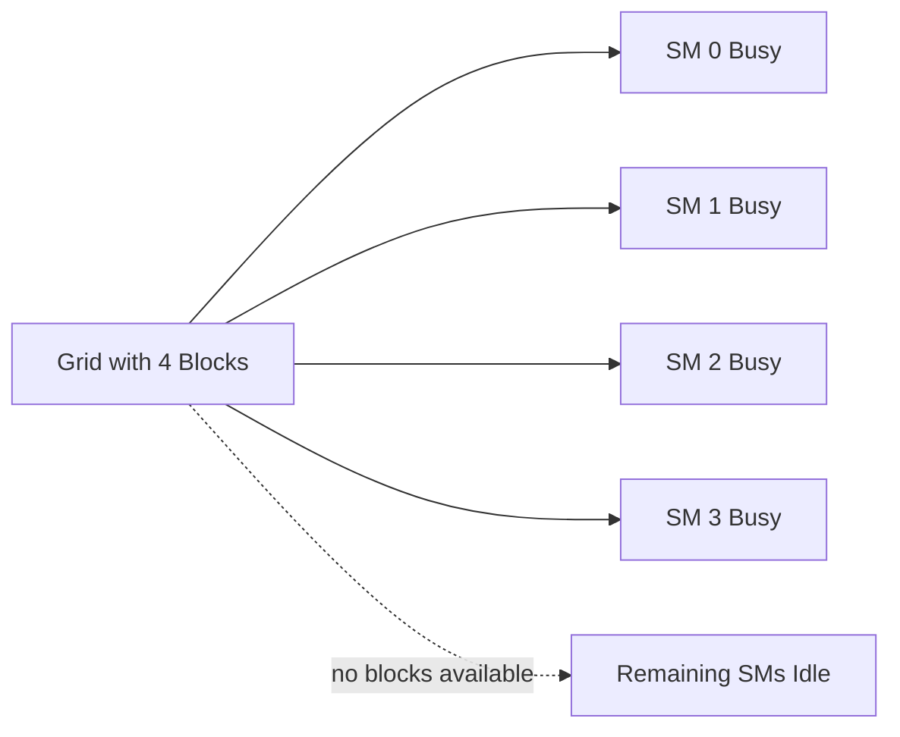

# Kernel Launch Configuration and Indexing

## Introduction

A CUDA kernel does not decide how many times it runs. The host application launches the kernel with an execution configuration that describes a grid of thread blocks. Every logical thread executes the same kernel function, but built-in coordinates allow each thread to select a different element, tile, row, column, or region of data.

This separation is one of CUDA's most important design choices. The algorithm describes what one logical worker does. The launch configuration describes how much parallel work exists. If the mapping is correct, the same kernel can process a small array on one GPU or a much larger array on a different GPU without binding application logic to a specific number of Streaming Multiprocessors.

Launch geometry is therefore not cosmetic syntax. It determines whether every element is processed exactly once, whether the GPU receives enough independent work, whether memory accesses are efficient, and whether resource limits reduce residency.

| Chapter field | Value |
|---|---|
| Volume | 03 — CUDA Fundamentals |
| Difficulty | Foundation |
| Estimated reading time | 45 minutes |
| Primary focus | Grid, block, and thread indexing |
| Previous | CUDA Programming and Execution Model |
| Next | CUDA Memory Management and Data Movement |

## Story

A team ports a CPU loop to CUDA. The program works for an array of one million elements but fails when the input size changes. Some outputs remain untouched. When the team increases the block size, the program begins writing beyond the end of the allocation.

The kernel contains a correct arithmetic expression, but the launch and indexing logic are incomplete. The application assumes that the number of threads always matches the number of elements. Production workloads rarely preserve that assumption.

The robust pattern is to launch enough threads, compute a global index, and guard accesses that fall outside the logical problem size.

## Learning Objectives

After completing this chapter, you will be able to:

- Explain the relationship between a grid, block, and thread.
- Calculate one-dimensional and multidimensional global indices.
- Select a launch configuration that covers an arbitrary problem size.
- Explain why bounds checks are required.
- Recognize underfilled grids, oversized blocks, and indexing defects.
- Describe grid-stride loops and when they are useful.

## Big Picture



**Figure 3.4.1 — Launch-to-data mapping with the bounds-check decision made explicit.** The diagram now carries real numbers from this chapter's own Story (a non-divisible array size) and shows the two concrete failure branches — underfilled grid (some data never processed) versus a missing guard on an overfilled grid (out-of-bounds write) — rather than a single static arrow chain.

## The Execution Configuration

A common launch uses the form:

```cpp
kernel<<<grid_dim, block_dim>>>(arguments);
```

The launch parameters describe dimensions, not physical processors.

- `block_dim` specifies the number and shape of threads in each block.
- `grid_dim` specifies the number and shape of blocks in the grid.
- An optional dynamic shared-memory size may be supplied.
- An optional stream identifies the execution queue.

The runtime schedules blocks onto available SMs. The application does not choose a particular SM for a block.

## One-Dimensional Indexing

For an array, each thread commonly computes:

```cpp
int index = blockIdx.x * blockDim.x + threadIdx.x;
```

The expression combines:

- the block's position in the grid,
- the number of threads per block,
- the thread's position in the block.



**Figure 3.4.2 — One-dimensional global indexing.** Each block owns a contiguous range of logical thread indices when the standard formula is used.

For a problem containing `N` elements, the number of blocks is commonly calculated with ceiling division:

```cpp
int blocks = (N + threads_per_block - 1) / threads_per_block;
```

This creates enough threads to cover the final partial block.

## Bounds Checks

When `N` is not divisible by the block size, the final block contains threads whose indices exceed the valid range. Those threads must not access the array.

```cpp
__global__ void scale(float* values, int n, float factor) {
    int i = blockIdx.x * blockDim.x + threadIdx.x;

    if (i < n) {
        values[i] *= factor;
    }
}
```

The branch is not an optional defensive feature. It is part of the logical mapping between execution capacity and problem size.

:::caution
A kernel can complete without reporting an obvious error while still corrupting adjacent device memory. Correct launch coverage does not replace bounds validation.
:::

## Two-Dimensional Indexing

Images, matrices, and grids are naturally represented with two-dimensional blocks and grids.

```cpp
int column = blockIdx.x * blockDim.x + threadIdx.x;
int row = blockIdx.y * blockDim.y + threadIdx.y;
```

A row-major matrix element can then be addressed as:

```cpp
int offset = row * width + column;
```

Both dimensions require bounds checks:

```cpp
if (row < height && column < width) {
    output[row * width + column] = input[row * width + column];
}
```



**Figure 3.4.3 — Two-dimensional tiling.** Blocks map naturally to rectangular regions while threads map to positions inside each tile.

## Three-Dimensional Indexing

Three-dimensional launch dimensions are useful for volumes, simulation domains, batched tensors, and other structured data. The same principle applies: combine block and thread coordinates for each dimension, then convert the coordinates to the application's memory layout.

The GPU does not know whether `x`, `y`, and `z` represent width, height, depth, batches, channels, or another abstraction. The application defines that meaning.

## Selecting Threads Per Block

There is no universal block size. The choice must satisfy correctness and architectural constraints.

Common considerations include:

| Consideration | Why it matters |
|---|---|
| Warp size | Blocks are divided into warps; partially filled warps waste lanes |
| Registers per thread | High use can reduce resident blocks and warps |
| Shared memory per block | Large allocations reduce residency |
| Work shape | Two-dimensional tiles may match matrix or image access |
| Memory access | Adjacent lanes should ideally access adjacent data |
| Total block count | The grid must expose enough work for all SMs |

A multiple of the warp size is often a reasonable starting point for one-dimensional work, but measurement should decide the final configuration.

## Too Few Blocks

A large block does not compensate for a grid containing too few blocks. Blocks cannot be split across SMs. If a launch creates four blocks on a GPU with many more SMs, most of the device may remain idle.



**Figure 3.4.4 — Grid underfill.** The hardware cannot manufacture parallel work that the application did not launch.

## Oversized Blocks

A block must remain within architectural limits, including maximum threads per block and per-dimension limits. Even a legal block can perform poorly if its register or shared-memory demand permits too few resident blocks.

An oversized block may also reduce scheduling flexibility. If one long-running block monopolizes resources, the SM may have fewer independent warps available to hide latency.

## Grid-Stride Loops

A grid-stride loop lets one thread process multiple elements separated by the total number of threads in the grid.

```cpp
__global__ void scale(float* values, int n, float factor) {
    for (int i = blockIdx.x * blockDim.x + threadIdx.x;
         i < n;
         i += blockDim.x * gridDim.x) {
        values[i] *= factor;
    }
}
```

This pattern is useful when:

- the input may be much larger than a practical fixed grid,
- the application wants to control the number of blocks,
- each thread can safely process multiple independent elements,
- persistent or reusable worker patterns are beneficial.

Grid-stride loops do not remove the need for efficient memory access. The first iteration should still map adjacent lanes to adjacent data where practical.

## Launches Are Asynchronous

A kernel launch normally queues work and returns control to the host before the GPU finishes. This behavior allows overlap, but it also means an error may not become visible at the launch statement.

The host must distinguish:

1. launch-configuration errors detected immediately,
2. execution errors reported when the stream or device is synchronized.

Later chapters cover streams and asynchronous execution in depth. For now, remember that a successful function return does not prove that the kernel completed correctly.

## Production Architecture

In production frameworks, launch geometry is usually generated by libraries or compiled kernels rather than written directly by platform engineers. Even so, launch behavior appears in operational evidence:

- many tiny kernels create launch overhead and synchronization pressure,
- grids with too few blocks underfill larger GPUs,
- large resource-heavy blocks reduce residency,
- incorrect shape assumptions cause memory faults,
- new input dimensions expose indexing defects,
- dynamic batching changes grid dimensions and execution efficiency.

Platform teams should preserve workload shape, software version, kernel trace, and profiler evidence when escalating a performance regression.

## Production Troubleshooting

### Problem: Some output elements are unchanged

**Symptoms**

- Correct values at the beginning of the array
- Missing values near the end
- Behavior changes with input size

**Likely cause**

The grid does not launch enough threads, or the indexing expression does not cover the full problem.

**Diagnosis**

Calculate:

```text
total threads = gridDim.x × blockDim.x
```

Compare the result with the logical element count and inspect the bounds condition.

**Evidence — reproducing the underfill with real numbers:**

```text
$ python3 -c "
N = 1_000_003
threads_per_block = 256
blocks_truncated = N // threads_per_block          # buggy: integer truncation
blocks_ceiling = -(-N // threads_per_block)         # correct: ceiling division
print('truncated blocks:', blocks_truncated, '-> covers', blocks_truncated*threads_per_block, 'threads')
print('ceiling   blocks:', blocks_ceiling,  '-> covers', blocks_ceiling*threads_per_block, 'threads')
print('elements left unprocessed by truncation:', N - blocks_truncated*threads_per_block)
"
truncated blocks: 3906 -> covers 999936 threads
ceiling   blocks: 3907 -> covers 1000192 threads
elements left unprocessed by truncation: 67
```

This is the exact defect from this chapter's Story: `blocks = N / threads_per_block` (integer division, which truncates) instead of ceiling division silently drops the last 67 elements — no crash, no error, just a tail of the output array that is never written. The fix is not a bounds check, it's launching enough blocks in the first place; the bounds check protects the *other* direction (writes past the end).

### Problem: Illegal memory access after changing block size

**Likely cause**

The kernel lacks a correct bounds check, or multidimensional coordinates are converted to a linear offset incorrectly.

**Resolution**

Validate each dimension before accessing memory and test non-divisible input sizes.

**Evidence — the same array without a bounds check, reproduced:**

```text
$ ./vector_add-no-bounds 1000003 256
CUDA error at vector_add-no-bounds.cu:207: an illegal memory access was encountered
```

With `threads_per_block=256` and `N=1000003`, ceiling division launches 3907 blocks = 1,000,192 threads — 189 more than `N`. Without `if (i &lt; n)`, those 189 threads write past the end of a buffer sized for exactly `N` floats. Whether this manifests as a hard `illegal memory access` (as above) or as silent heap corruption depends on allocator layout — which is precisely why "it ran without crashing" is not proof of correctness for an unguarded kernel.

### Problem: Larger GPU gives little improvement

Check:

- total blocks,
- blocks per SM,
- kernel duration,
- resource use per block,
- synchronization between launches,
- whether the workload is memory-bound.

**Evidence — a fixed grid size across two GPU generations:**

| GPU | SM count | Blocks launched | Blocks per SM (best case) | SMs left idle |
|---|---:|---:|---:|---:|
| A10 | 72 | 64 | ~1 | 8 |
| H100 SXM5 | 132 | 64 | &lt;1 | 68 |

A grid hard-coded to 64 blocks — sized for an old maximum image resolution, as in this chapter's Customer Scenario — fills the A10 reasonably well but leaves more than half the H100's SMs with zero assigned blocks for the kernel's entire duration. `nvidia-smi dmon -s pucvmet` on the H100 run would show `sm%` well below 100 on a compute-bound kernel — that ceiling is the signature of a launch-geometry problem, not a memory-bandwidth or driver problem, and no amount of kernel-level tuning fixes it without changing the grid dimensions.

## Customer Scenario

A customer migrates an image-processing service to a newer GPU. The kernels use a fixed grid sized for the previous maximum image resolution. Larger images silently leave rows unprocessed, while smaller images waste substantial work.

The architect recommends deriving grid dimensions from each request shape, validating both image dimensions, and adding correctness tests for odd widths and heights. Performance tuning begins only after the mapping is proven correct.

## Interview Preparation

### Conceptual Questions

1. **What is the difference between grid dimensions and block dimensions?**
   "Block dimensions describe how many threads sit inside one block and their shape — say, 256 threads in a line, or 16x16 for a tile. Grid dimensions describe how many of those blocks exist for the whole launch. I always think of it as two separate knobs: block shape controls cooperation and resource use per SM, grid size controls how much total parallel work exists and whether it's enough to fill every SM on the device. Getting the total count right — grid times block — matters for correctness; how you split that total between the two matters for performance."

2. **Why is a bounds check necessary when using ceiling division?**
   "Because ceiling division exists specifically to guarantee you launch *enough* threads to cover a size that isn't a clean multiple of your block size — and doing that necessarily means the last block contains some threads whose computed index is past the end of the array. Ceiling division solves underfill; the bounds check solves the overfill it creates as a side effect. They're a matched pair — using one without the other just trades one bug for the other."

3. **Why can too few blocks underutilize a large GPU?**
   "Because a block is the atomic unit of placement — the scheduler assigns a whole block to one SM and can't split it across SMs. If I launch 64 blocks on a GPU with 132 SMs, at best 64 SMs get exactly one block and the other 68 get nothing for that kernel's entire runtime — there's no mechanism to redistribute work at finer grain. So a grid sized for a smaller or older GPU literally cannot use a newer, bigger one without changing the launch configuration, no matter how fast that bigger GPU is per-SM."

### Architecture Questions

1. **Draw the mapping from a kernel launch to a one-dimensional array.**
   "I'd draw the array as a line of N boxes, then show it partitioned into contiguous chunks of `threads_per_block` size, one chunk per block. Underneath, I'd write the index formula: `blockIdx.x * blockDim.x + threadIdx.x`. Then I'd deliberately make N not divisible by the block size, ceiling-divide to get one extra partial block, and shade the boxes past N in that last block — those are the threads the bounds check has to catch."

2. **Explain how a two-dimensional block maps to a row-major matrix.**
   "I'd compute column from `blockIdx.x * blockDim.x + threadIdx.x` and row from `blockIdx.y * blockDim.y + threadIdx.y`, then convert those two coordinates to a single linear offset with `row * width + column` because the matrix is stored row-major in memory. The key thing I'd call out is that both dimensions need their own bounds check — `row &lt; height && column &lt; width` — because a matrix that isn't an exact multiple of the block's tile size in *either* dimension needs guarding on that dimension independently."

3. **Describe the trade-offs involved in selecting block size.**
   "There's no single best number — it's a balancing act. A multiple of 32 avoids wasting warp lanes. Too many registers or too much shared memory per thread reduces how many blocks can be resident per SM, hurting latency hiding. Too small a block wastes scheduling overhead relative to useful work. Too large a block can reduce scheduling flexibility if it monopolizes an SM's resources. In practice I pick a reasonable starting point — often 128 or 256 for one-dimensional work — and then actually measure occupancy and throughput rather than assuming a number from a different kernel transfers over."

### Scenario Questions

1. **An application works only when `N` is divisible by 256. What is wrong?**
   "That's the signature of missing or incorrect ceiling division combined with a missing bounds check — when N happens to be an exact multiple of the block size, every launched thread maps to a valid element, so the bug never gets exercised. The moment N isn't a clean multiple, either the tail of the array goes unprocessed or threads write past the buffer, depending on which half of the ceiling-division-plus-bounds-check pair is missing. I'd immediately test with N, N-1, and N+1 relative to a block-size multiple to confirm and localize it."

2. **A kernel launches one block per GPU. What utilization pattern do you expect?**
   "Almost total idleness — one block occupies exactly one SM, so on a GPU with dozens or well over a hundred SMs, everything else sits unused for the kernel's entire duration. I'd expect `nvidia-smi dmon` to show low `sm%` even if that one SM is pegged at 100% doing real work, because the utilization metric across the whole device reflects how few of its execution units are actually active."

3. **A block size increase reduces runtime on one GPU but worsens it on another. Why?**
   "Because block size interacts with per-SM resource limits, and those limits differ by architecture — register file size, shared memory capacity, max resident blocks. A larger block might improve occupancy on a GPU with a roomier resource budget per SM, while on a different GPU the same block size might push per-SM resource usage past a threshold and actually reduce the number of resident blocks, hurting latency hiding. This is exactly why I don't trust a single 'optimal block size' number across hardware generations without re-measuring."

## Summary

CUDA launch geometry describes logical parallel work using grids, blocks, and threads. Each thread derives a unique data coordinate from built-in indices. Correct code launches enough threads, validates boundaries, and maps coordinates to memory without overlap or omission.

Performance requires more than correctness. The grid must expose enough blocks, the block must respect resource limits, and adjacent lanes should access data efficiently. Launch configuration is therefore both a correctness contract and a performance decision.

## Key Takeaways

- A kernel launch creates a grid of thread blocks.
- Threads compute data indices from block and thread coordinates.
- Ceiling division requires bounds checks in the final partial block.
- Too few blocks can leave many SMs idle.
- Block size must balance work shape, memory access, and resource use.
- Grid-stride loops support scalable processing with controlled grid size.

## Cross References

- Previous: [CUDA Programming and Execution Model](./chapter-03-cuda-programming-and-execution-model)
- Next: [CUDA Memory Management and Data Movement](./chapter-05-cuda-memory-management-and-data-movement)
- Related lab: [Build and Validate a CUDA Vector Pipeline](./labs/lab-02-build-and-validate-a-cuda-vector-pipeline)
