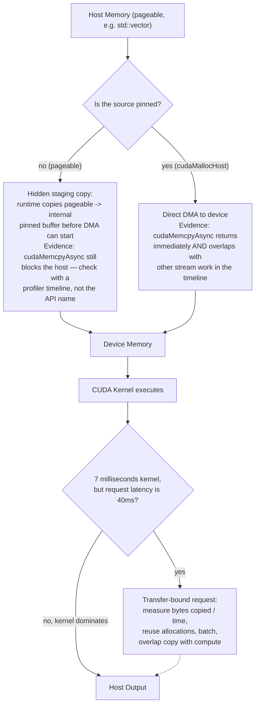
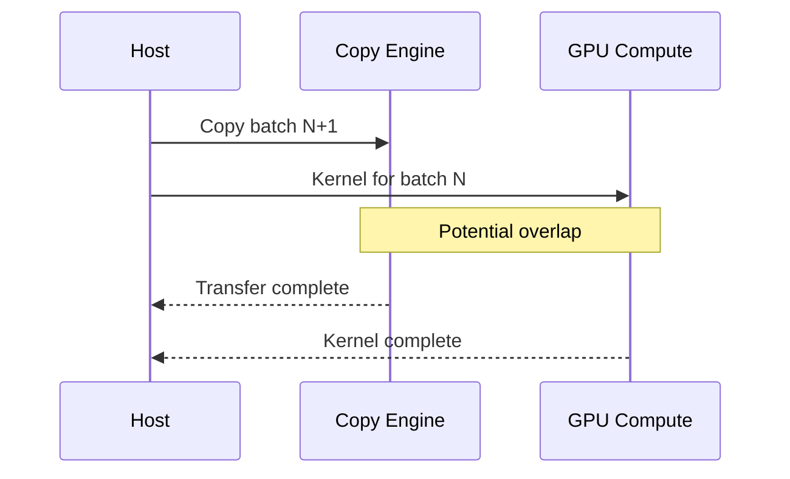
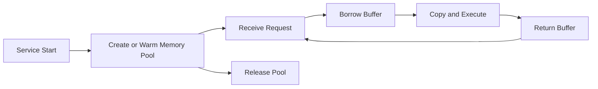

# CUDA Memory Management and Data Movement

## Introduction

A GPU can execute a kernel quickly and still deliver poor end-to-end performance when data movement dominates the request. CUDA applications must allocate storage, move input data to the device, execute work, and return results. Each step consumes time, bandwidth, and memory capacity.

Memory management is therefore not housekeeping around the computation. It is part of the computation's architecture. The application must decide where data lives, when it moves, which component owns it, and whether transfers can overlap with useful work.

| Chapter field | Value |
|---|---|
| Volume | 03 — CUDA Fundamentals |
| Difficulty | Foundation |
| Estimated reading time | 50 minutes |
| Primary focus | Allocation, transfer, and memory ownership |
| Previous | Kernel Launch Configuration and Indexing |
| Next | Synchronization, Errors, and Correctness |

## Story

A team accelerates a preprocessing function. The GPU kernel completes in less than a millisecond, but the service becomes only slightly faster. Profiling shows that every request allocates device buffers, copies small inputs to the GPU, launches one kernel, copies results back, and frees the buffers.

The kernel is not the bottleneck. The application spends most of its time preparing and moving data. Reusing allocations, batching requests, pinning transfer buffers, and overlapping copies with computation produce a larger improvement than rewriting the arithmetic.

## Learning Objectives

After completing this chapter, you will be able to:

- Explain the difference between host and device memory.
- Describe allocation and ownership with `cudaMalloc` and `cudaFree`.
- Explain synchronous and asynchronous memory copies.
- Compare pageable, pinned, mapped, and unified memory.
- Identify transfer-dominated workloads.
- Design a lifecycle that avoids leaks, repeated allocation, and hidden migration.

## Big Picture



**Figure 3.5.1 — Data movement lifecycle as a decision tree.** The pinned-vs-pageable branch is the mechanism this chapter's Story turns on: `cudaMemcpyAsync` is asynchronous *by name* on either path, but only the pinned branch actually avoids a hidden, blocking staging copy. The second decision point captures the chapter's other core lesson — a fast kernel does not prove a fast request when transfer time dominates end-to-end latency.

## Separate Memory Domains

In the explicit CUDA model, the CPU and GPU use distinct memory domains. Host code allocates host memory. CUDA APIs allocate device memory. The application explicitly copies data between them.

This separation provides control and predictable ownership, but it creates responsibilities:

- allocations must be paired with cleanup,
- transfer direction must be correct,
- the destination must be large enough,
- the application must not free memory while work still uses it,
- synchronization must preserve dependencies.

## Device Allocation

A typical device allocation uses:

```cpp
float* device_values = nullptr;
cudaError_t status = cudaMalloc(&device_values, bytes);
```

The allocation reserves device-addressable memory. It does not initialize the memory and does not copy host data.

Cleanup uses:

```cpp
cudaFree(device_values);
```

Production code must handle allocation failures and release previously allocated resources on every error path.

:::important
A non-null pointer is not proof that the complete workflow is healthy. Capacity fragmentation, concurrent allocations, framework caches, and asynchronous use all affect whether an allocation lifecycle is safe.
:::

## Explicit Memory Copies

The common copy directions are:

```cpp
cudaMemcpy(device_ptr, host_ptr, bytes, cudaMemcpyHostToDevice);
cudaMemcpy(host_ptr, device_ptr, bytes, cudaMemcpyDeviceToHost);
cudaMemcpy(device_b, device_a, bytes, cudaMemcpyDeviceToDevice);
```

A synchronous copy blocks the calling host thread until the operation reaches the API's completion semantics. This is simple but may serialize the pipeline.

The application should measure:

- bytes transferred,
- transfer frequency,
- effective bandwidth,
- time spent waiting,
- whether the same data is copied repeatedly,
- whether copies overlap with kernels.

## Pageable Host Memory

Ordinary memory returned by common host allocators is usually pageable. The operating system can move its pages, so the GPU transfer path cannot always use it directly. The CUDA runtime may stage data through an internal pinned buffer.

Pageable memory is convenient and appropriate for many control structures, but repeated large transfers may benefit from pinned host memory.

## Pinned Host Memory

Pinned, or page-locked, memory remains resident in physical memory for the duration of the allocation.

```cpp
float* host_values = nullptr;
cudaMallocHost(&host_values, bytes);
```

Cleanup uses:

```cpp
cudaFreeHost(host_values);
```

Pinned memory can:

- support efficient DMA transfers,
- enable true asynchronous host-device copies under appropriate conditions,
- reduce staging overhead.

It also has costs. Excessive pinned memory reduces the memory available for normal operating-system paging and can degrade host stability.

| Host memory type | Advantages | Risks |
|---|---|---|
| Pageable | Simple, widely available | May require staging for GPU copies |
| Pinned | Better transfer path, async capable | Scarce host resource; allocation is more expensive |
| Mapped pinned | GPU can address selected host memory | Access latency and bandwidth may be poor |
| Unified | Simplifies one address space | Migration and placement can become implicit |

## Asynchronous Copies

`cudaMemcpyAsync` queues a transfer in a CUDA stream.

```cpp
cudaMemcpyAsync(device_ptr, host_ptr, bytes,
                cudaMemcpyHostToDevice, stream);
```

Asynchronous syntax does not guarantee overlap. Effective overlap depends on factors such as:

- pinned host memory,
- separate work in other streams,
- available copy engines,
- dependency ordering,
- hardware and runtime capabilities.



**Figure 3.5.2 — Transfer-compute overlap.** A pipeline can copy one batch while computing another when memory, streams, and dependencies are configured correctly.

## Unified Memory

Unified memory exposes an allocation that CPUs and GPUs can access through a unified virtual address.

```cpp
float* values = nullptr;
cudaMallocManaged(&values, bytes);
```

The simplified programming model is valuable, but physical placement still matters. Pages may migrate or fault when accessed from a processor that does not currently own the preferred location.

Unified memory is useful when:

- development simplicity matters,
- access patterns are difficult to manage explicitly,
- oversubscription or shared access is required,
- migration behavior is understood and measured.

It can perform poorly when access alternates unpredictably between processors or when page migration appears on a latency-sensitive path.

## Memory Initialization

Device allocations contain unspecified data. Initialization may use a kernel or an API such as:

```cpp
cudaMemset(device_ptr, 0, bytes);
```

`cudaMemset` operates on bytes. It is appropriate for zero initialization and selected byte patterns, but not for assigning arbitrary typed values.

## Allocation Reuse

Repeated allocation and deallocation inside a request path introduce overhead and make capacity behavior harder to predict. Production systems commonly reuse buffers or use memory pools.

The lifecycle becomes:



**Figure 3.5.3 — Reusable allocation model.** Long-lived services avoid repeated device allocation by borrowing buffers from managed pools.

## Capacity Is Not the Same as Working Set

A model may fit in memory at startup yet fail under concurrency because runtime memory also includes:

- activations,
- temporary workspaces,
- communication buffers,
- KV cache,
- framework allocator reservations,
- graph-capture pools,
- duplicated model instances.

Capacity planning must use peak representative workload behavior rather than static model size alone.

**Worked example — why "the model fits" is not the same question as "the request fits":** a 7-billion-parameter model at FP16 (2 bytes/parameter) needs approximately `7,000,000,000 × 2 ≈ 14 GB` for weights alone. On a 40 GB GPU that looks like 26 GB of headroom. But a single inference request at batch size 8, sequence length 2048, with a KV cache of roughly `2 (K and V) × 32 layers × 8 batch × 2048 tokens × 4096 hidden × 2 bytes ≈ 8.6 GB` (illustrative architecture numbers) consumes over half the remaining capacity — and that is one request's cache, before framework allocator reservations, activation memory, or a second concurrent request are counted. The 14 GB weight estimate answers "does the model fit at startup," not "does this GPU support the concurrency this service needs" — those are different capacity-planning questions with different answers.

## Architecture Trade-offs

### Explicit copies versus unified memory

Explicit copies provide control and easier transfer accounting. Unified memory reduces programming complexity but can hide migration costs.

### Pinned memory versus host flexibility

Pinned memory improves the transfer path but consumes a constrained host resource. Use bounded pools rather than pinning arbitrary application memory.

### Fine-grained transfers versus batching

Small transfers reduce buffering delay but waste fixed overhead. Larger transfers improve efficiency but may increase latency and memory demand.

### Reuse versus isolation

Shared pools reduce allocation overhead. They also require lifecycle controls so one request cannot reuse memory still owned by another stream.

## Production Troubleshooting

### Problem: Fast kernel, slow application

**Symptoms**

- Kernel duration is small.
- End-to-end latency remains high.
- Host-to-device and device-to-host copies dominate traces.

**Resolution path**

Measure transfer size and frequency, reuse allocations, batch work, keep intermediate data on the GPU, and overlap copies with compute where possible.

**Evidence — the exact pattern from this chapter's Story, quantified:**

```text
$ nsys stats --report cuda_api_sum profile-report.nsys-rep
 Time(%)  Total Time (ns)  Num Calls  Avg (ns)   Name
 -------  ---------------  ---------  ---------  ------------------
    71.2       182,340,000       4000     45,585  cudaMalloc
    18.6        47,610,000       4000     11,903  cudaMemcpy
     6.4        16,392,000       4000      4,098  cudaFree
     3.8         9,730,000       4000      2,433  cudaLaunchKernel
```

Reading this table top to bottom: `cudaMalloc` and `cudaFree` together consume **77.6%** of CUDA API time across 4,000 requests — more than eight times the time spent in the kernel launch itself. This is the chapter's Story made numeric: the kernel is not the bottleneck, the per-request allocate/free cycle is. The fix is allocation reuse (a warmed buffer pool), which removes the `cudaMalloc`/`cudaFree` rows from the hot path entirely rather than trying to make the kernel faster.

### Problem: `cudaErrorMemoryAllocation`

Inspect:

- free and used device memory,
- concurrent processes,
- framework allocator reservations,
- model replicas,
- fragmentation and memory pools,
- recent workload-size changes.

Do not treat process memory reports as complete proof of available contiguous capacity.

**Evidence — free memory does not mean a contiguous block is available:**

```text
$ nvidia-smi --query-gpu=memory.used,memory.free,memory.total --format=csv
memory.used [MiB], memory.free [MiB], memory.total [MiB]
71232 MiB, 9727 MiB, 80960 MiB
```

`9727 MiB` free looks like plenty of headroom for a 4 GB allocation request — yet the request can still fail with `cudaErrorMemoryAllocation` if the framework's caching allocator holds that free space as many small, non-contiguous reserved blocks (common with PyTorch's caching allocator under repeated variable-size allocation). `nvidia-smi` reports device-wide free memory, not the largest contiguous span the CUDA allocator can actually satisfy — the next diagnostic step is the framework's own allocator summary (e.g. `torch.cuda.memory_summary()`), not another `nvidia-smi` snapshot.

### Problem: Unified memory latency spikes

Look for page faults, migration, host access between kernels, oversubscription, and alternating CPU/GPU ownership.

### Problem: Host becomes unstable

Check whether the application pins excessive memory. Bound pinned-memory pools and include their size in host capacity planning.

## Customer Scenario

A customer deploys an inference service with one process per model. Each request allocates three device buffers and performs four small copies. GPU utilization appears as brief spikes, while CPU utilization and request latency remain high.

The architect recommends a persistent worker model with reusable device buffers, pinned host staging pools, dynamic batching, and a pipeline that keeps intermediate tensors on the GPU. The recommendation addresses the data path rather than purchasing a larger accelerator.

## Interview Preparation

### Conceptual Questions

1. **Why can pinned memory improve host-device transfer?**
   "Because a DMA engine needs a stable physical address to copy from or to, and ordinary pageable memory can be moved by the OS at any time — so if the source is pageable, the runtime has to first copy it into an internal pinned staging buffer before the real device transfer can even start. That staging copy is hidden CPU work that shows up as extra latency and blocks true asynchronous overlap. Pinned memory removes that hidden step entirely, which is why it's the precondition for real `cudaMemcpyAsync` overlap, not just a nice-to-have."

2. **Why is unified memory not the same as physically shared memory?**
   "Because under the hood the CPU and GPU still have physically separate memory — unified memory just gives you one virtual pointer that both can use, and the runtime migrates or maps the underlying pages between physical locations based on which processor touches them. It simplifies the *pointer*, not the physics. If my access pattern bounces between CPU and GPU rapidly, I can pay real migration cost repeatedly even though the code looks like it's just dereferencing one simple pointer."

3. **What is the difference between memory capacity and transfer bandwidth?**
   "Capacity is whether the data fits — the size of the allocation versus the size of device memory. Bandwidth is how fast data can move once it's there or while it's being copied. `nvidia-smi`'s memory-used number tells you about capacity and allocation, nothing about bandwidth. I've seen people treat a memory-used number near the ceiling as evidence of a bandwidth problem, and those are just not the same measurement — you need a profiler's memory-throughput counters to actually assess bandwidth."

### Architecture Questions

1. **Draw an overlapped double-buffered transfer pipeline.**
   "Two pinned host buffers, two device buffers, two streams. While stream 0 is copying batch A's input to the device and then computing on it, stream 1 is already copying batch B's input in parallel — as long as both source buffers are pinned and the streams are independent with no hidden synchronization between them. I'd label the arrows with what has to be true for the overlap to be real: pinned memory, separate buffers, and a completion event per slot so the host never reuses a buffer before the device is done with it."

2. **Compare pageable, pinned, and unified memory.**
   "Pageable is the default, simplest, but may force a hidden staging copy for GPU transfers. Pinned removes that staging step and enables true async overlap, but it's a scarce, lockable host resource I have to pool and bound. Unified gives me one pointer both CPU and GPU can use and simplifies the programming model, but placement and migration become implicit — I trade explicit control for convenience, and I still have to reason about locality if performance matters."

3. **Explain why allocation reuse matters in a long-running inference service.**
   "Because `cudaMalloc` and `cudaFree` are not free — in the profiler evidence I've seen, they can dominate CUDA API time far more than the actual kernel does when a service allocates and frees per request. A long-running service should allocate its buffers once at warm-up and borrow-and-return them from a pool per request. That turns a repeated allocation cost into a one-time startup cost and also makes memory behavior predictable instead of subject to allocator fragmentation over the service's lifetime."

### Scenario Questions

1. **Kernel time is 5% of request latency. What do you investigate?**
   "The other 95% first, obviously — I'd profile the full request timeline, not just the kernel, and look specifically at allocation calls, transfer time, and host-side preprocessing. Given how often this turns out to be per-request `cudaMalloc`/`cudaFree` or unpinned transfer staging, those are exactly where I'd start looking before touching the kernel at all."

2. **Unified memory works in testing but produces tail-latency spikes in production. Why?**
   "Most likely because test traffic doesn't exercise the access pattern that triggers migration under production load — maybe production has multiple concurrent requests touching overlapping managed ranges from different GPUs, or the production working set exceeds what fits comfortably resident, triggering eviction and refaulting. Testing at low concurrency and low data volume can hide exactly the locality problems that appear once real traffic creates contention for the same pages."

3. **A service consumes more GPU memory as concurrency rises. What additional allocations may exist?**
   "Beyond the model weights, each concurrent request likely needs its own activation memory and KV cache if this is an LLM-style workload, plus the framework's caching allocator may reserve additional pooled memory it doesn't immediately release. I'd also check for per-request temporary buffers that aren't being reused, and whether the service is creating a new CUDA context or duplicate model instance per worker rather than sharing across replicas."

## Summary

CUDA memory management defines where data lives and how it moves. Explicit device allocations provide control, pinned host memory improves transfer capability, asynchronous copies support overlap, and unified memory simplifies addressing while preserving physical placement concerns.

The central architectural rule is simple: move data only when necessary, reuse allocations, measure the complete pipeline, and make ownership explicit.

## Key Takeaways

- Device allocation does not initialize or populate memory.
- Host-device transfer can dominate end-to-end performance.
- Pinned memory enables a stronger transfer path but must be bounded.
- Asynchronous copies require appropriate memory, streams, and hardware to overlap.
- Unified memory simplifies code but can expose migration costs.
- Production systems should reuse buffers and plan for peak working set.

## Cross References

- Previous: [Kernel Launch Configuration and Indexing](./chapter-04-kernel-launch-configuration-and-indexing)
- Next: [Synchronization, Errors, and Correctness](./chapter-06-synchronization-errors-and-correctness)
- Related lab: [Build and Validate a CUDA Vector Pipeline](./labs/lab-02-build-and-validate-a-cuda-vector-pipeline)
