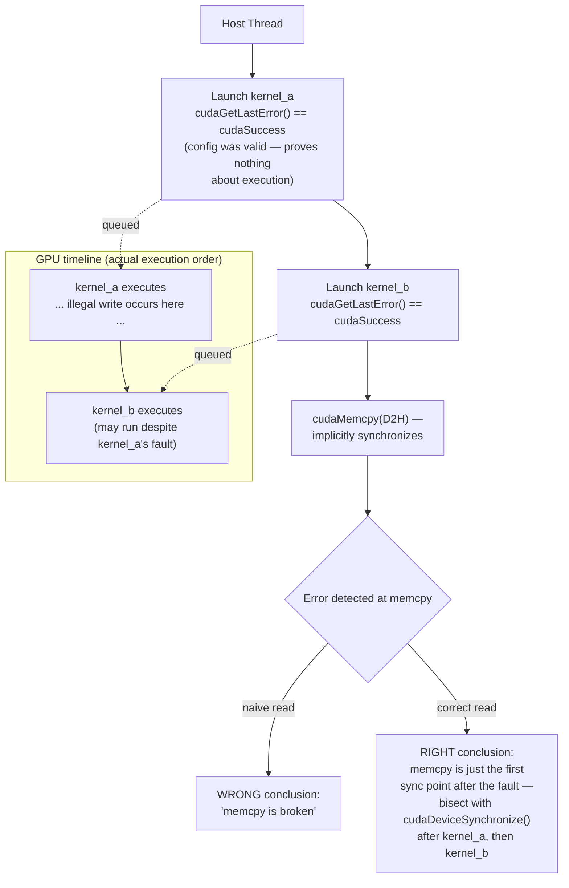
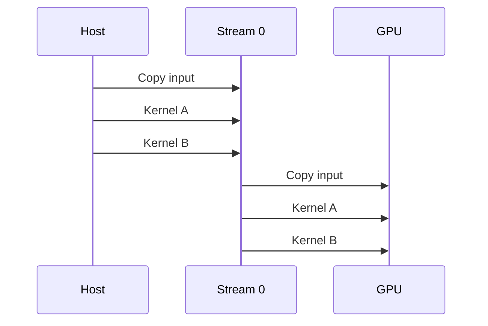
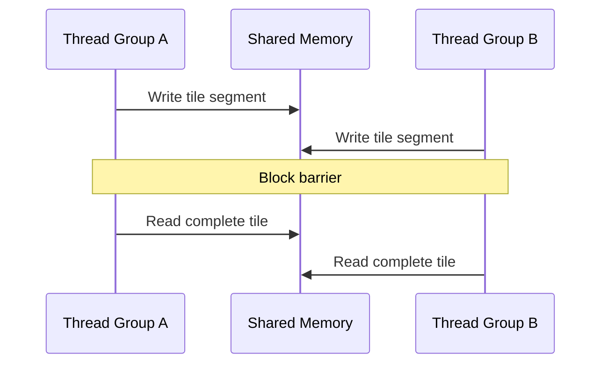

# Synchronization, Errors, and Correctness

## Introduction

CUDA is asynchronous by design. The host can enqueue work and continue while the GPU executes. Different streams can progress independently. Threads inside a block can cooperate, but only through defined synchronization rules. These capabilities improve utilization, yet they also make defects harder to observe.

A program can launch successfully and fail later. A memory copy can appear to fix a race only because it introduced an accidental synchronization point. A kernel can return correct values for one input size and corrupt data under a different schedule.

Correct CUDA software must make dependencies explicit, check errors at the correct time, and distinguish host ordering, stream ordering, block synchronization, and device-wide synchronization.

| Chapter field | Value |
|---|---|
| Volume | 03 — CUDA Fundamentals |
| Difficulty | Intermediate |
| Estimated reading time | 50 minutes |
| Primary focus | Ordering, synchronization, and error handling |
| Previous | CUDA Memory Management and Data Movement |
| Next | Streams, Events, and Asynchronous Pipelines |

## Story

A service occasionally returns corrupted results after a performance optimization. The team replaced a blocking copy with an asynchronous copy and removed a device synchronization call. Unit tests still pass most of the time.

Tracing reveals that the host reuses an input buffer before the transfer finishes. In another path, a second kernel reads an output from a different stream without waiting for the producing event. The previous implementation was slower, but its blocking calls accidentally enforced the required order.

The failure is not random. The program contains missing dependencies that the old execution pattern happened to hide.

## Learning Objectives

After completing this chapter, you will be able to:

- Explain host, stream, block, and device synchronization scopes.
- Distinguish launch errors from asynchronous execution errors.
- Use CUDA error checks without serializing every operation.
- Explain barriers, memory visibility, and race conditions.
- Design explicit dependencies between copies and kernels.
- Build a correctness validation strategy for CUDA workloads.

## Big Picture



**Figure 3.6.1 — Asynchronous error visibility, with the misdiagnosis trap made explicit.** The API call that reports an error (`cudaMemcpy` here) is frequently not the operation that caused it — the diagram shows the queued launches racing ahead of the host while the actual fault happens earlier on the GPU timeline, and contrasts the wrong read of the evidence against the bisection method that finds the true origin.

## Ordering Is Scoped

CUDA does not provide one universal ordering rule. Ordering depends on where work is submitted and which synchronization primitive is used.

| Scope | What it coordinates |
|---|---|
| Thread | Operations inside one logical GPU thread |
| Warp | Execution lanes participating in warp-level operations |
| Block | Threads sharing one block and shared memory |
| Stream | Commands submitted to one ordered queue |
| Event dependency | Selected work across streams |
| Device | All preceding work on the selected device |
| Host thread | CPU-side control flow and API calls |

A correct design uses the narrowest scope that satisfies the dependency. Device-wide synchronization is simple but often destroys concurrency.

## Stream Ordering

Commands in one stream execute in issue order. A later kernel in the same stream observes completion of earlier work in that stream according to CUDA ordering semantics.



**Figure 3.6.2 — In-stream ordering.** Commands submitted to the same stream form an ordered dependency chain without requiring a host synchronization between every operation.

Different streams may overlap or execute in an order that differs from host submission. Dependencies between them must be stated with events or other supported mechanisms.

## Device Synchronization

`cudaDeviceSynchronize()` waits until preceding work on the current device completes and returns an execution error if one occurred.

```cpp
cudaError_t status = cudaDeviceSynchronize();
```

This is useful for:

- simple educational programs,
- correctness checkpoints,
- isolating a failing kernel,
- shutdown and lifecycle boundaries.

It is expensive when placed in a hot path because it prevents useful overlap and forces the host to wait for all outstanding device work.

## Stream Synchronization

`cudaStreamSynchronize(stream)` waits only for work in the selected stream. It narrows the waiting scope but still blocks the host thread.

For polling or nonblocking control flow, an application may query stream or event completion and perform other host work until the dependency is satisfied.

## Block Barriers

Threads in one block can synchronize with a barrier such as `__syncthreads()`.

A common pattern is:

1. each thread loads part of a tile,
2. the block waits until the tile is complete,
3. all threads consume the shared data,
4. the block waits before overwriting the tile.



**Figure 3.6.3 — Block-level cooperation.** The barrier protects a phase transition so all participating threads observe the expected shared-memory state.

All non-exited threads in the block must reach a block barrier in a compatible control path. Placing a barrier inside divergent logic can deadlock or produce undefined behavior.

## Synchronization Is Not Communication by Itself

A barrier coordinates timing and memory visibility within its defined scope. It does not move data, choose ownership, or make unrelated memory safe automatically.

Correct cooperation requires:

- a shared storage location,
- one or more writers,
- a defined synchronization point,
- readers that access only after the dependency,
- no conflicting writes without ordering.

## Race Conditions

A race occurs when multiple execution agents access the same location, at least one access is a write, and the ordering is not defined.

Common CUDA races include:

- multiple threads writing one output element,
- reading shared memory before all writers finish,
- reusing a host buffer before an async copy completes,
- consuming data in another stream without an event dependency,
- freeing memory while queued work still references it.

Race conditions may disappear during debugging because instrumentation changes timing. Correctness must come from explicit ordering, not repeated successful runs.

## Atomic Operations

Atomic operations serialize a specific memory update so concurrent threads do not lose modifications. They are appropriate for counters, reductions, queues, and selected coordination patterns.

Atomics have trade-offs:

- contention can limit throughput,
- operation support depends on data type and architecture,
- atomicity does not automatically establish every surrounding dependency,
- a different algorithm may scale better.

Use atomics to protect the required operation, not as a substitute for understanding ownership.

## Error Categories

### Immediate API errors

These include invalid arguments, unsupported configurations, failed allocations, and other conditions detected during the API call.

### Kernel launch errors

An invalid launch configuration may be detected immediately after the launch.

```cpp
kernel<<<blocks, threads>>>(arguments);
cudaError_t launch_status = cudaGetLastError();
```

### Asynchronous execution errors

Illegal memory access, device-side assertion, and similar failures occur while the GPU executes. They are commonly reported by a later synchronization or API call.

```cpp
cudaError_t execution_status = cudaDeviceSynchronize();
```

Both checks are necessary during diagnosis because they answer different questions.

## A Practical Error-Checking Pattern

```cpp
#define CUDA_CHECK(call)                                                   \
    do {                                                                   \
        cudaError_t error = (call);                                        \
        if (error != cudaSuccess) {                                        \
            fprintf(stderr, "CUDA error at %s:%d: %s\n",                 \
                    __FILE__, __LINE__, cudaGetErrorString(error));        \
            exit(EXIT_FAILURE);                                            \
        }                                                                  \
    } while (0)
```

Use the wrapper for API calls, then check the launch and synchronize at meaningful correctness boundaries during development.

Production systems may propagate errors instead of terminating, but they must preserve the same information: operation, device, stream, software version, and error string.

## Avoiding Accidental Serialization

A naive debug pattern calls `cudaDeviceSynchronize()` after every operation. This makes failures easier to localize but removes overlap and changes timing.

A disciplined workflow is:

1. use aggressive synchronization while isolating correctness,
2. identify the exact dependency,
3. replace global waits with stream ordering or events,
4. retain error checks at lifecycle boundaries,
5. remeasure both correctness and performance.

## Correctness Validation

GPU output should be compared with an independent reference when practical.

A useful strategy includes:

- deterministic small inputs with known answers,
- CPU reference computation,
- random and adversarial sizes,
- non-divisible dimensions,
- zero-length and boundary cases,
- tolerance appropriate to floating-point behavior,
- repeated runs under concurrency,
- memory and race analysis tools where available.

Do not validate only the average output. Compare every required element and report the first mismatch with index and values.

## Floating-Point Correctness

Parallel reductions may combine values in a different order than CPU code. Floating-point addition is not mathematically associative, so small differences can be legitimate.

Validation should use absolute and relative tolerances chosen for the algorithm. A tolerance must not be so wide that it hides genuine corruption.

## Production Architecture

Production CUDA services need an error policy, not only logging.

Decisions include:

- whether one failed request can be isolated,
- when a worker process must restart,
- whether the device context remains trustworthy,
- how the scheduler drains unhealthy replicas,
- which telemetry captures XID and application errors,
- how input shape and model version are attached to incidents.

A device-side fault can leave subsequent work failing until the process or context is recreated. Recovery should be tested rather than improvised during an outage.

## Production Troubleshooting

### Problem: Error appears on an unrelated API call

**Explanation**

A previous asynchronous operation failed. The later call is the point where the runtime reports the pending error.

**Diagnosis**

Temporarily synchronize after suspected kernels, check each launch, and narrow the failing interval.

**Evidence — bisection in practice:**

```text
// Add temporarily, remove after locating the fault:
kernel_a<<<...>>>(buf);
CUDA_CHECK(cudaDeviceSynchronize());   // <-- checkpoint 1
kernel_b<<<...>>>(buf);
CUDA_CHECK(cudaDeviceSynchronize());   // <-- checkpoint 2
```

```text
$ ./service_debug
CUDA error at service.cu:142: an illegal memory access was encountered
```

If the error now appears at checkpoint 1 (right after `kernel_a`), the fault is in `kernel_a`, not in whatever call originally reported it (a later `cudaMemcpy` in production, per the diagram above). If it appears at checkpoint 2 instead, `kernel_a` is clean and `kernel_b` is the suspect. Remove the synchronize calls once located — they exist only to narrow the search, not as a permanent fix.

### Problem: Results change between runs

Inspect shared-memory barriers, output ownership, atomics, cross-stream dependencies, host-buffer reuse, and memory initialization.

**Evidence — a race that only shows up under specific scheduling:**

```text
Run 1: sum = 483920.125000   validation: FAIL (expected 512000.000000)
Run 2: sum = 501234.875000   validation: FAIL (expected 512000.000000)
Run 3: sum = 512000.000000   validation: PASS
```

Three different wrong-or-right answers across three identical runs of the same binary and input is the classic race-condition fingerprint — a deterministic bug produces the same wrong answer every time. Here the cause is typically a reduction kernel missing an atomic add or a block barrier: concurrent threads write the same output location and whichever write happens to land last (which varies by scheduling) wins. Confirm with `cuda-memcheck`/`compute-sanitizer`'s race-detection tool rather than "running it again until it passes."

### Problem: Performance collapses after adding error checks

Determine whether device-wide synchronization was added inside the steady-state path. Keep immediate launch checks, but place blocking execution checks at justified boundaries.

**Evidence — the cost of checking correctly, isolated:**

| Configuration | Requests/sec | Notes |
|---|---:|---|
| No error checks | 4,120 | baseline, unsafe |
| `cudaGetLastError()` after every launch only | 4,095 | ~0.6% overhead — safe to keep always on |
| `cudaDeviceSynchronize()` after every launch | 612 | ~85% throughput loss — removes all overlap |

`cudaGetLastError()` is a cheap, non-blocking check of launch-configuration validity and belongs in every build. `cudaDeviceSynchronize()` forces the host to wait for the entire device queue to drain — it is the right tool for isolating a bug during development, and the wrong tool to leave in a steady-state hot path, which is exactly the throughput collapse this row's symptom describes.

### Problem: Service continues failing after one illegal access

The CUDA context may be unhealthy. Capture the original error, stop accepting new work, recreate the worker or context according to the service recovery design, and verify device health.

## Customer Scenario

A customer runs two inference stages in separate streams. Stage B sometimes reads incomplete output from Stage A. The team adds a global device synchronization, which fixes correctness but cuts throughput in half.

The architect replaces the device-wide barrier with an event recorded after Stage A and waited on by Stage B. The data dependency remains explicit while unrelated work can continue.

## Interview Preparation

### Conceptual Questions

1. **Why can a kernel error appear during a later API call?**
   "Because kernel execution is asynchronous — the launch call just queues the work and returns, so if the kernel faults, that fault happens on the GPU's own timeline, potentially after the host has already issued several more calls. CUDA reports the error at the next point the host actually synchronizes or queries device state, which could be a completely unrelated memcpy several operations later. I always treat the reporting call as a witness, not necessarily the culprit, and bisect backward with temporary synchronization when I need to find the real source."

2. **What is the difference between block and device synchronization?**
   "Block synchronization — `__syncthreads()` — coordinates only the threads inside one block, at a barrier they all have to reach, and it's about memory visibility within that block's shared memory. Device synchronization — `cudaDeviceSynchronize()` — is host-side and waits for every preceding operation on the whole device to complete, across all streams. They operate at completely different scopes and for different purposes: one is an on-device correctness primitive for cooperating threads, the other is a host-side completion boundary that happens to also be a blunt performance hammer if overused."

3. **Why can a program become correct after adding a blocking copy?**
   "Because a blocking `cudaMemcpy` happens to force a synchronization point as a side effect — it accidentally enforces an ordering the program actually needed but never expressed explicitly. That's the trap: the program looks fixed, but what actually happened is a missing dependency got papered over by a coincidentally-blocking call. If someone later 'optimizes' that call to its async form without understanding why it was there, the original race comes right back — which is literally the incident in this chapter's Story."

### Architecture Questions

1. **Design an error-checking strategy for an asynchronous service.**
   "I'd wrap every CUDA API call, including launches, with an immediate `cudaGetLastError()` check — that's cheap and catches configuration errors right away. For execution errors, I would not sprinkle `cudaDeviceSynchronize()` through the hot path; instead I'd rely on the natural synchronization points that already exist — event waits, the final output copy — and check status there. I'd also define what happens on failure: is the context still trustworthy, does this worker need to restart, how do I preserve the original error text before recovery destroys the evidence."

2. **Draw an event dependency between two streams.**
   "Stream A does its work and calls `cudaEventRecord()` on a 'ready' event. Stream B calls `cudaStreamWaitEvent()` on that same event before it starts the work that depends on A's output. I'd draw this as two parallel timelines with a single diagonal arrow from the event marker on A's timeline to the wait point on B's timeline — everything else on both streams continues independently, which is the whole point versus a blunt device-wide synchronization."

3. **Explain why all threads must reach a block barrier safely.**
   "`__syncthreads()` requires every non-exited thread in the block to actually reach it, because the barrier's job is to guarantee all threads see a consistent memory state before proceeding — if some threads take a divergent branch that skips the barrier while others hit it, you get undefined behavior or a hang, because the hardware is waiting for arrivals that will never come. That's why I never put a block barrier inside a conditional unless I've proven every thread in the block takes the same path through that conditional."

### Scenario Questions

1. **Results vary between runs but no API call fails. What do you investigate?**
   "This is the classic race-condition signature — no error, just non-deterministic wrong answers. I'd look at anywhere multiple threads or streams write to the same memory location without an explicit ordering: missing atomics in a reduction, a barrier missing before consuming shared memory, cross-stream output without an event dependency, or a host buffer reused before its async copy completed. I'd also run it under `compute-sanitizer`'s race checker rather than trying to eyeball it from output alone."

2. **Adding `cudaDeviceSynchronize()` fixes corruption. What does that imply?**
   "It implies there's a missing dependency somewhere that the blocking call happens to paper over — not that the bug is fixed. Something is racing: probably a cross-stream data dependency, or a buffer being reused before earlier work using it has actually completed. My next step is to find exactly which dependency is missing and replace the blunt device-wide wait with a narrow, explicit one — an event wait scoped to just that dependency — so I get correctness back without destroying the concurrency."

3. **An illegal access causes all later requests to fail. How should the service respond?**
   "Treat the CUDA context as untrustworthy after a device-side fault like that — continuing to serve requests on a context that already had an illegal access can produce misleading secondary failures, not real results. The service should stop accepting new work on that worker, capture the original error and enough context to diagnose it, and recreate the worker or context according to a recovery path that's been tested ahead of time — not improvised live during the incident."

## Summary

CUDA correctness depends on explicit ordering. Streams order their own commands, events connect selected streams, barriers coordinate threads in a block, and device synchronization creates a broad host-visible completion point.

Errors must be checked twice: once for launch validity and again when asynchronous execution completes. Correctness must be proven with reference results, boundary cases, race analysis, and recovery testing.

## Key Takeaways

- CUDA work is asynchronous, so error reporting may be delayed.
- Synchronization has scope; use the narrowest scope that satisfies the dependency.
- A successful launch does not prove successful execution.
- Race conditions require ownership and ordering fixes, not repeated testing.
- Device-wide synchronization is useful for diagnosis but expensive in steady state.
- Production systems need a tested policy for context and worker recovery.

## Cross References

- Previous: [CUDA Memory Management and Data Movement](./chapter-05-cuda-memory-management-and-data-movement)
- Volume introduction: [CUDA Fundamentals](./index)
- Related lab: [Build and Validate a CUDA Vector Pipeline](./labs/lab-02-build-and-validate-a-cuda-vector-pipeline)
