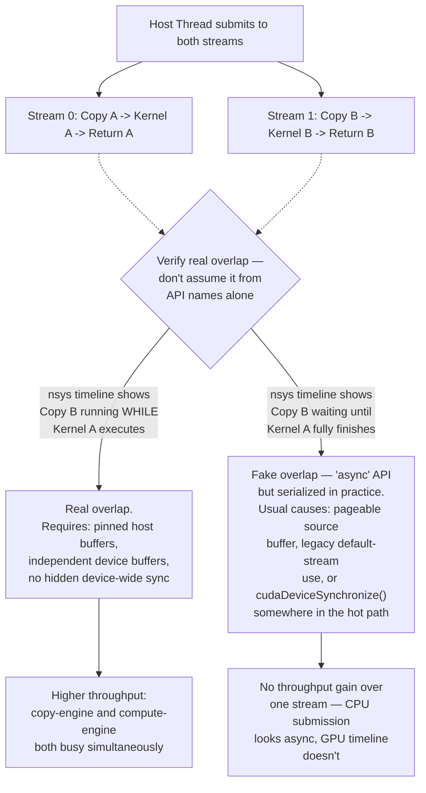
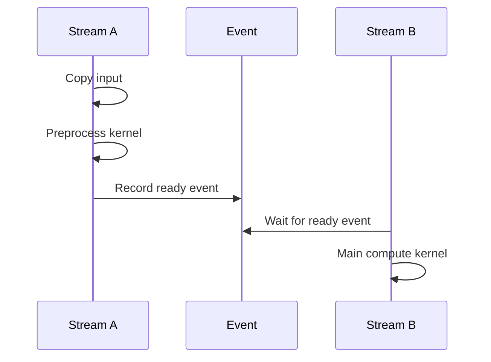
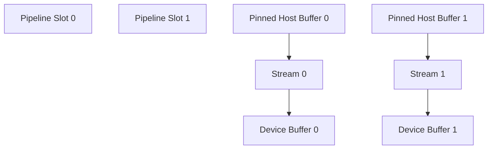

# Streams, Events, and Asynchronous Execution

## Introduction

A GPU is valuable because it can keep many execution and data-movement resources busy at the same time. Yet a program that submits every operation to one serial queue and waits after each step can reduce an expensive accelerator to a sequence of isolated tasks.

CUDA streams provide ordered work queues. CUDA events provide device-side timeline markers. Together they allow applications to express dependencies without forcing the entire host process or device to stop.

The difficult part is not creating a stream. The difficult part is proving that the operations are independent, that memory remains valid, that synchronization occurs at the correct boundary, and that apparent overlap is real rather than assumed.

| Chapter field | Value |
|---|---|
| Volume | 03 — CUDA Fundamentals |
| Difficulty | Intermediate |
| Estimated reading time | 50 minutes |
| Primary focus | Ordering, concurrency, overlap, and timing |
| Previous | Synchronization, Errors, and Correctness |
| Next | Pinned Memory and Transfer Overlap |

## Story

An inference service copies input to the GPU, launches preprocessing, runs model execution, copies output back, and then starts the next request. GPU utilization oscillates between transfer and compute activity. Latency is acceptable, but throughput remains far below the device's expected capacity.

The service is correct but unnecessarily serialized. Engineers introduce two streams and divide requests into batches. While one batch executes, the next batch begins transferring. Throughput improves only after they also replace pageable host buffers with pinned memory and remove a hidden device-wide synchronization.

The lesson is architectural: concurrency appears only when the full dependency chain allows it.

## Learning Objectives

After completing this chapter, you will be able to:

- Explain the ordering guarantees of a CUDA stream.
- Distinguish host asynchrony from device concurrency.
- Use events to express dependencies and measure device elapsed time.
- Identify operations that accidentally serialize multiple streams.
- Design a multi-stream pipeline with explicit ownership and synchronization.
- Troubleshoot overlap failures using timeline evidence.

## Big Picture



**Figure 3.7.1 — Independent ordered queues, with the overlap-verification step made explicit.** Two streams *can* overlap, but the diagram now shows this as a question the timeline has to answer, not a guarantee the API syntax provides — matching this chapter's core warning that overlap must never be inferred from asynchronous-sounding function names alone.

## What a Stream Represents

A CUDA stream is an ordered sequence of operations submitted to a device. If operations A, B, and C are placed in the same stream, B begins only after the required completion of A, and C follows B.

That ordering guarantee is local to the stream. Two streams do not automatically wait for each other.

Typical stream operations include:

- Kernel launches
- Asynchronous memory copies
- Memory-set operations
- Event recording
- Stream waits on events
- Host callbacks or host functions where supported

A stream is not a CPU thread, hardware queue, or dedicated slice of the GPU. The runtime and driver map submitted work onto available hardware engines.

## Host Asynchrony Versus Device Concurrency

These terms are related but not identical.

| Concept | Meaning |
|---|---|
| Host-asynchronous API | The host call may return before device work completes |
| Device concurrency | Multiple device operations make progress during overlapping time windows |
| Overlap | Compute and transfer, or multiple kernels, execute concurrently |
| Parallel submission | Host threads submit work at the same time |

A call can be asynchronous from the host's perspective while the device still executes work serially. Conversely, the device can overlap operations even if one host thread submitted them sequentially to different streams.

:::important
Never infer device overlap from API names alone. Verify it using a profiler timeline or event-based measurements designed for the dependency graph.
:::

## Default Stream Behavior

CUDA supports a default stream and explicitly created non-default streams. Default-stream semantics can vary depending on compilation mode and runtime configuration, particularly around whether the default stream behaves as a process-wide legacy stream or a per-thread default stream.

For production code, ambiguity is dangerous. Teams should document which semantics they rely on and prefer explicit streams when concurrency and dependencies matter.

Legacy default-stream interactions can introduce synchronization with other streams. This may explain why a multi-stream design still behaves serially.

## Creating and Destroying Streams

A simplified lifecycle is:

```cpp
cudaStream_t stream;
cudaStreamCreate(&stream);

// Submit asynchronous work to stream.

cudaStreamSynchronize(stream);
cudaStreamDestroy(stream);
```

The production version should check every return value and define who owns the stream.

Useful creation options may include non-blocking behavior or priorities where the platform supports them. Stream priority influences scheduling preference but does not create hard real-time guarantees or preempt already executing work arbitrarily.

## Events as Timeline Markers

A CUDA event is recorded into a stream. It becomes complete when all earlier operations in that stream reach the required completion point.

Events support two major purposes:

1. **Dependency expression** — another stream waits for the event.
2. **Timing** — elapsed device time is measured between recorded events.



**Figure 3.7.2 — Cross-stream dependency.** Stream B waits only for the required milestone instead of synchronizing the entire device.

A common pattern is:

```cpp
cudaEventRecord(inputReady, producerStream);
cudaStreamWaitEvent(consumerStream, inputReady, 0);
```

This preserves concurrency elsewhere while enforcing one dependency.

## Device Timing with Events

Host clocks can include submission overhead, scheduler delay, CPU activity, or unrelated synchronization. CUDA events measure time on the device timeline between two recorded markers.

```cpp
cudaEventRecord(start, stream);
myKernel<<<grid, block, 0, stream>>>(...);
cudaEventRecord(stop, stream);
cudaEventSynchronize(stop);

float milliseconds = 0.0f;
cudaEventElapsedTime(&milliseconds, start, stop);
```

Event timing is useful for a defined device interval. It is not automatically an end-to-end service latency measurement. Both are necessary in production.

## Synchronization Options

CUDA provides synchronization at different scopes.

| Mechanism | Scope | Typical use |
|---|---|---|
| `cudaDeviceSynchronize()` | All preceding work on the device for the process context | Debugging, phase boundary, broad completion |
| `cudaStreamSynchronize()` | One stream | Reuse stream-owned buffers or consume results |
| `cudaEventSynchronize()` | One event milestone | Wait for a specific dependency |
| `cudaStreamWaitEvent()` | Device-side stream dependency | Preserve host asynchrony and narrow dependency |
| Event query | Non-blocking completion check | Polling or progress logic |

Device-wide synchronization is simple but expensive because it removes overlap across independent streams.

## Designing a Pipeline

A robust pipeline assigns ownership and lifetime explicitly.



**Figure 3.7.3 — Double-buffered ownership.** Each stream owns a separate host and device buffer slot until its completion event indicates safe reuse.

For each slot, define:

- Host input buffer
- Device input buffer
- Device output buffer
- Host output buffer
- Stream
- Completion event
- State: free, submitted, executing, complete

Without ownership rules, the host may overwrite a buffer while the device is still reading it.

## Conditions Required for Overlap

Overlap depends on several conditions:

- Operations must be in different streams when independence is required.
- Dependencies must not force serialization.
- Host buffers used by asynchronous copies usually need to be page-locked.
- The device must expose relevant copy and compute engine capability.
- Transfers must be large enough for overlap benefits to exceed overhead.
- Kernels must not consume all resources in a way that prevents useful concurrency.
- Hidden synchronization must be removed.

## Common Serialization Sources

| Source | Effect |
|---|---|
| Device-wide synchronization after every launch | Removes pipeline overlap |
| Legacy default-stream interaction | May synchronize otherwise independent streams |
| Pageable host memory for async copy | Runtime may stage or block |
| Reusing one buffer too early | Forces synchronization or causes corruption |
| Allocations in the hot path | Can add synchronization and allocator overhead |
| Dependency through shared output | Requires ordering even across streams |
| Very short operations | Launch and queue overhead dominate |

## Architecture Trade-offs

### More streams

More streams can expose concurrency, but they also increase queue depth, memory consumption, event management, and debugging complexity. Beyond a point, additional streams add overhead without increasing useful overlap.

### Latency versus throughput

Batching and pipelining often improve throughput by increasing concurrency. They may increase queueing latency. The correct design follows the service-level objective.

### Determinism versus utilization

Highly asynchronous pipelines can maximize device use but make failure attribution and timing more complex. Production systems need trace identifiers and per-stage metrics.

## Production Observability

A useful observability model includes:

- Host request latency
- Queueing time before GPU submission
- Host-to-device transfer duration
- Kernel duration
- Device-to-host transfer duration
- Stream queue depth
- Outstanding pipeline slots
- Completion-event latency
- GPU copy-engine activity
- GPU compute activity

A timeline should show whether idle gaps occur on the host, copy engines, or compute engines.

## Production Troubleshooting

### Problem: Multiple streams do not improve throughput

**Symptoms**

- Similar runtime with one and several streams
- Timeline shows serialized transfers and kernels
- CPU submission appears asynchronous

**Diagnosis**

1. Confirm buffers are pinned.
2. Check for default-stream work.
3. Search for `cudaDeviceSynchronize()` in the hot path.
4. Confirm operations use distinct buffers.
5. Inspect the profiler timeline for actual overlap.
6. Verify operation sizes and device engine capability.

**Root cause patterns**

- Hidden global synchronization
- Pageable host memory
- Dependency chain is inherently serial
- Work units are too small
- Kernel resource use prevents useful concurrency

**Evidence — two streams, zero real overlap:**

```text
$ nsys stats --report cuda_gpu_trace overlap-report.nsys-rep | head -8
 Start (ns)     Duration (ns)  Name                  Stream
 -------------  -------------  --------------------  ------
 1,200,000      480,000        [CUDA memcpy H2D]     14
 1,680,412      612,304        transform(float*,...)  14
 2,292,900      471,200        [CUDA memcpy D2H]     14
 2,764,300      478,900        [CUDA memcpy H2D]     15
 3,243,600      609,100        transform(float*,...)  15
```

Reading the `Start (ns)` column: stream 15's copy begins at `2,764,300 ns`, which is *after* stream 14's D2H copy finishes at `2,292,900 + 471,200 = 2,764,100 ns` — the two streams ran back-to-back, not concurrently, despite being separate stream IDs. Compare this against `nvidia-smi --query-gpu=utilization.gpu --format=csv -lms 100` sampled during the run: a flat, uninterrupted busy signal with no gaps between the two streams' work is consistent with serialization, while true overlap would show copy-engine and compute-engine activity columns (visible in `dmon` on supported GPUs) both non-zero simultaneously. The most common cause of exactly this pattern, per this chapter, is a pageable source buffer forcing an internal staging copy that ends up serializing the two streams' H2D operations against the same internal staging resource.

### Problem: Intermittent corruption after adding streams

The likely cause is buffer reuse before completion. Add per-slot completion events, remove shared mutable buffers, and make ownership visible in code.

**Evidence — the exact fingerprint of premature reuse:**

```text
run 1: validated 67108864 elements in 812.4 ms using 2 streams
run 2: validation failed at index 4194305: expected=1.024000 actual=0.000000
run 3: validated 67108864 elements in 809.1 ms using 2 streams
```

Passing two out of three runs with the same binary and input is itself the signal — a deterministic indexing bug fails every time, but this fails intermittently because it depends on GPU scheduling timing. Index `4194305` lands exactly one element past `chunkElements = 4,194,304` in the Lab 03 program — i.e., the first element of slot 1's *next* chunk, consistent with slot 1's host buffer being overwritten by the next chunk's `std::copy_n` before its previous D2H copy had actually completed.

### Problem: Timing results appear impossible

Confirm start and stop events are recorded in the intended stream and that the measured interval includes the expected dependencies. Event timing does not include host work outside the interval.

## Customer Scenario

A customer serves image requests using one GPU. Their application reaches only moderate utilization even though requests queue during peaks. Profiling reveals a repeated pattern: host copy, preprocessing, inference, output copy, device synchronization.

The recommended design introduces bounded pipeline slots, pinned buffers, explicit streams, and event-based dependencies. The architect also preserves a single-stream mode for debugging and compares end-to-end latency percentiles, not only kernel time.

## Interview Preparation

### Conceptual Questions

1. **What guarantee does a stream provide?**
   "In-order execution of the operations submitted to that specific stream — if I enqueue a copy, then a kernel, then another copy into the same stream, they execute in that order, one completing before the next starts. That's the entire guarantee. It says nothing about timing relative to any other stream, and it says nothing about how long any operation takes — it's purely an ordering contract within one queue."

2. **Why does an asynchronous API not guarantee overlap?**
   "Because 'asynchronous' describes what the host does — the call returns without waiting — not what the device does. Real overlap between two streams additionally requires pinned host memory so no hidden staging copy serializes things, independent buffers so there's no dependency forcing order, available hardware copy and compute engines, and the absence of anything that accidentally synchronizes the whole device. An async-named function with a pageable source buffer, for example, can still end up blocking and serialized under the hood — the name is a hint about the API, not a promise about the hardware timeline."

3. **What is the difference between stream synchronization and device synchronization?**
   "`cudaStreamSynchronize()` waits only for the operations queued in one specific stream — everything else on the device keeps running. `cudaDeviceSynchronize()` waits for every preceding operation across the entire device and every stream. I default to the narrowest one that actually satisfies my dependency, because device-wide sync throws away all the concurrency I might have built with multiple streams — it's the right tool for a debugging checkpoint or a shutdown boundary, and the wrong tool inside a steady-state pipeline."

### Architecture Questions

1. **Draw a double-buffered copy-and-compute pipeline.**
   "Two complete slots, each with its own pinned host buffer, device buffer, stream, and completion event. Slot 0 copies batch A in, computes on it, copies the result out, records its completion event. While that's happening, slot 1 is doing the same for batch B in its own stream. The critical detail I'd annotate on the diagram: a slot cannot be reused for the next batch until the host has confirmed — via that slot's completion event — that the previous batch's work fully finished, otherwise you get exactly the intermittent corruption this chapter describes."

2. **Explain how events connect producer and consumer streams.**
   "The producer stream calls `cudaEventRecord()` after the operation the consumer needs to wait for. The consumer stream calls `cudaStreamWaitEvent()` on that same event before its dependent work — that creates a device-side dependency between exactly those two operations without forcing either stream to wait on anything else. It's the narrow-scope alternative to a device-wide synchronize: I express precisely the one dependency that's real and leave everything else free to overlap."

3. **Describe how you would measure device time and end-to-end latency separately.**
   "For device time, I bracket just the GPU work with `cudaEventRecord()` before and after, then `cudaEventElapsedTime()` between them — that's a device-timeline measurement, immune to host scheduling noise. For end-to-end latency, I use a host wall-clock timer around the entire request, including queueing, preprocessing, and the response path. I report both, because a request can have fast device time and still be slow end-to-end if the host side or the queue is the actual bottleneck — collapsing them into one number hides exactly the information a bottleneck investigation needs."

### Scenario Questions

1. **Four streams perform no better than one. What do you inspect?**
   "In order: are the source buffers pinned, is anything routing through the legacy default stream and accidentally synchronizing them, is there a `cudaDeviceSynchronize()` sitting in the hot path, do the streams actually use independent buffers, and finally — the ground truth — what does the profiler timeline actually show. I don't guess at which of these it is; I pull the timeline first because it directly shows whether the operations overlapped or just ran back-to-back with async-looking code."

2. **A service corrupts results only under concurrency. What ownership error is likely?**
   "A buffer being reused before the previous work using it actually completed — most commonly a host or device buffer overwritten by the next request's data while an earlier async copy or kernel is still reading or writing it. The fix is a completion event per buffer slot that the host must wait on before reuse, and code that makes ownership state explicit — free, submitted, executing, complete — rather than implicit and easy to get wrong under timing pressure."

3. **A timeline shows compute idle while copies run. Which design changes might help?**
   "That's evidence the pipeline is serialized on the transfer stage — I'd look at introducing enough pipeline depth that a copy for the next batch can proceed while the current batch computes, which needs the buffers pinned and in separate streams. If the copies are already async and pinned but compute still sits idle, I'd check whether the copy-compute dependency chain is inherently serial for this workload — sometimes there genuinely isn't independent work available, and the fix is restructuring the algorithm's batching, not the CUDA plumbing."

## Summary

Streams express ordered device work. Events mark completion points, measure device intervals, and create narrow cross-stream dependencies. They enable concurrency only when the application exposes independent work, uses suitable memory, avoids hidden synchronization, and preserves buffer lifetime.

The production goal is not the largest stream count. It is a bounded, observable pipeline that satisfies latency and throughput requirements without sacrificing correctness.

## Key Takeaways

- Operations are ordered within a stream.
- Different streams may overlap, but overlap is not guaranteed.
- Events provide precise device milestones and dependencies.
- Device-wide synchronization commonly destroys concurrency.
- Buffer ownership and lifetime are central to correctness.
- Profiler timelines are the evidence for real overlap.

## Cross References

- Previous: [Synchronization, Errors, and Correctness](./chapter-06-synchronization-errors-and-correctness)
- Next: [Pinned Memory and Transfer Overlap](./chapter-08-pinned-memory-and-transfer-overlap)
- Related lab: [Build an Overlapped CUDA Pipeline](./labs/lab-03-build-an-overlapped-cuda-pipeline)
