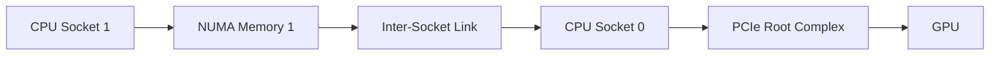
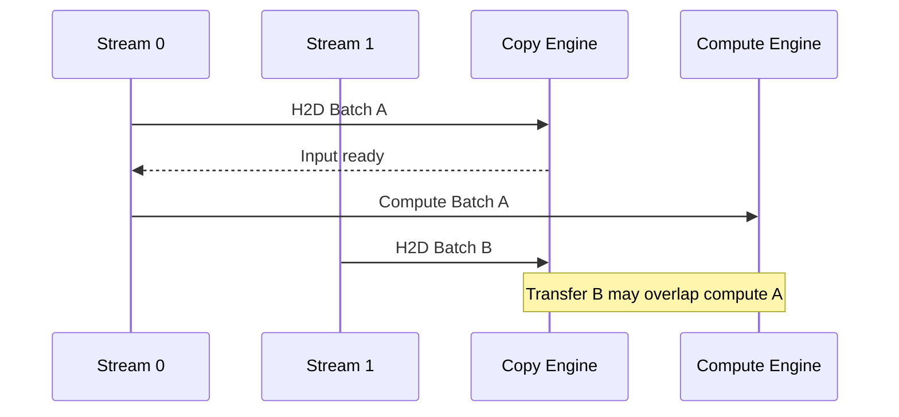
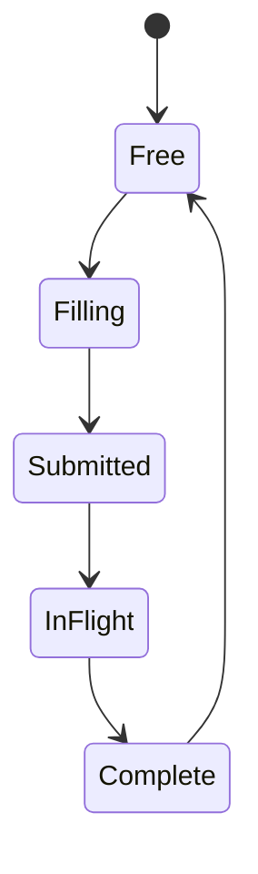

# Pinned Memory and Transfer Overlap

## Introduction

A GPU cannot execute useful work until data reaches device memory. For many applications, host-to-device and device-to-host movement is therefore part of the critical path.

Ordinary host allocations are pageable. The operating system may move their physical pages, while a DMA engine needs stable physical mappings for a transfer. CUDA resolves this mismatch by staging or pinning memory. Explicit page-locked, or pinned, host memory gives the runtime a stable source or destination and enables the most predictable asynchronous transfer behavior.

Pinned memory is not simply “faster RAM.” It is a limited operating-system resource with allocation cost, security implications, NUMA placement concerns, and failure modes. Production systems must use it deliberately.

| Chapter field | Value |
|---|---|
| Volume | 03 — CUDA Fundamentals |
| Difficulty | Intermediate |
| Estimated reading time | 50 minutes |
| Primary focus | Host memory type, DMA, transfer efficiency, and overlap |
| Previous | Streams, Events, and Asynchronous Execution |
| Next | Unified Memory and Demand Paging |

## Story

A preprocessing service allocates a fresh host buffer for every request and calls `cudaMemcpyAsync`. Engineers expect transfers to overlap with compute, but the profiler shows long CPU stalls and serialized copies.

The API is asynchronous in name, yet the source memory is pageable. The runtime must stage data through page-locked memory before the device copy can proceed. Frequent allocation also creates allocator pressure.

The team replaces per-request allocation with a bounded pool of pinned buffers, aligns each pool slot with a CUDA stream, and binds preprocessing threads near the GPU's NUMA node. Throughput becomes stable and tail latency improves.

## Learning Objectives

After completing this chapter, you will be able to:

- Explain why DMA engines require stable host-memory mappings.
- Compare pageable, pinned, registered, mapped, and managed memory.
- Describe how pageable-memory staging affects asynchronous copies.
- Design a bounded pinned-memory pool.
- Explain how NUMA locality influences host-to-device transfers.
- Diagnose transfer bottlenecks using timeline and topology evidence.

## Big Picture


**Figure 3.8.1 — Pageable transfer path.** A pageable source may require an internal staging copy before the device transfer can begin.

With explicit pinned memory, the staging step can be removed from the application-visible path.


**Figure 3.8.2 — Pinned transfer path.** Stable page mappings allow the transfer engine to access host memory directly through the supported platform path.

## Pageable Host Memory

Most allocations returned by general-purpose host allocators are pageable. The operating system can reclaim or remap physical pages while preserving the process's virtual address space.

This flexibility is essential for general system memory management. It conflicts with long-running DMA operations that require stable mappings.

When a CUDA copy originates from pageable memory, the runtime may need to:

1. Obtain or reuse a page-locked staging region.
2. Copy data from the pageable allocation into that region.
3. Submit the DMA transfer from the staging region to the device.
4. Return or recycle the staging region.

The exact implementation is runtime-dependent, but the architectural consequence is stable: hidden host work may reduce overlap and increase variance.

## Pinned Host Memory

Pinned memory is locked into physical memory for the duration of the registration. The operating system cannot page it out in the normal way.

CUDA applications can obtain pinned memory through allocation APIs or register an existing host range where supported.

Conceptual examples:

```cpp
void* buffer = nullptr;
cudaHostAlloc(&buffer, bytes, cudaHostAllocDefault);
```

or:

```cpp
void* buffer = std::malloc(bytes);
cudaHostRegister(buffer, bytes, cudaHostRegisterDefault);
```

Every call must be checked, and every successful allocation or registration must have a defined cleanup path.

## Allocation Versus Registration

| Method | Characteristics | Typical use |
|---|---|---|
| CUDA pinned allocation | Runtime creates page-locked region | Dedicated transfer buffers |
| Host registration | Existing allocation is pinned | Integration with external allocators or frameworks |
| Pageable allocation | Managed by normal OS paging | General CPU data not on critical transfer path |

Registration can fail because of alignment, size, platform policy, container restrictions, or pinned-memory limits. Applications should fail clearly rather than silently assuming registration succeeded.

## Mapped Host Memory and Zero Copy

Some systems allow host memory to be mapped into the device address space. A kernel can access mapped host memory without an explicit copy.

This is sometimes called zero-copy access, but “zero copy” does not mean zero cost. Access may traverse PCIe or another host interconnect for each transaction. Latency and bandwidth are usually different from device-local memory.

Mapped memory can be appropriate when:

- The data set is small.
- Access is infrequent or streaming.
- Avoiding an explicit copy matters more than repeated access cost.
- The platform provides suitable coherency and addressability.

It is usually a poor choice for repeatedly accessed working sets that belong in device memory.

## NUMA Locality

Pinned memory is allocated from host NUMA memory. If the allocating CPU thread runs on a socket far from the GPU's PCIe root complex, the data path may cross an inter-socket link before reaching the GPU.



**Figure 3.8.3 — Remote NUMA transfer.** A pinned allocation can still be poorly placed if its physical pages are remote from the GPU's I/O path.

Production transfer pools should be created by threads with intentional CPU and memory affinity when topology matters.

## Transfer Granularity

Very small copies waste fixed submission overhead. Extremely large copies can monopolize a copy engine and increase latency for other work.

Applications commonly improve efficiency by:

- Batching adjacent values into larger contiguous transfers.
- Reusing buffers rather than allocating per request.
- Avoiding redundant host-device round trips.
- Keeping persistent data on the device.
- Partitioning large transfers into pipeline chunks when overlap is beneficial.

The optimal chunk size must be measured for the workload and platform.

## Copy Directions

CUDA systems commonly move data through several directions:

- Host to device
- Device to host
- Device to device
- Peer device to peer device
- Host memory mapped into device space

Each direction can use different engines and paths. Peer copies may traverse NVLink, PCIe, host bridges, or staged paths depending on topology and peer-access configuration.

## Overlapping Transfer and Compute

A transfer can overlap with compute only when the dependency graph and platform allow it.



**Figure 3.8.4 — Copy-compute overlap.** Independent buffers and streams permit the next transfer to proceed while an earlier batch computes.

Required conditions usually include:

- Pinned host memory
- Non-default streams with intended semantics
- Independent buffers
- Asynchronous copy APIs
- Sufficient work duration
- No hidden device-wide synchronization
- Hardware support for concurrent copy and execution

## Bounded Buffer Pools

Pinned memory should normally be pooled.

A production pool defines:

- Number of slots
- Bytes per slot
- NUMA placement
- Ownership state
- Associated stream and event
- Maximum wait time
- Metrics for pool exhaustion
- Cleanup during process shutdown



**Figure 3.8.5 — Pinned-buffer lifecycle.** A slot must not return to the free pool until its device completion event confirms safe reuse.

Unbounded pinned allocation can reduce memory available to the operating system and destabilize the host.

## Architecture Trade-offs

### Pinned memory versus OS flexibility

Pinned memory improves transfer predictability but reduces the memory manager's ability to reclaim pages. A few reusable buffers are better than many transient allocations.

### Larger pools versus memory pressure

More slots can increase concurrency and absorb bursts. They also consume locked memory and may increase queueing. Size the pool from measured concurrency, not maximum theoretical demand.

### Explicit copy versus mapped access

Explicit copies add a transfer step but move data into device-local memory. Mapped access avoids the copy but may pay remote access cost repeatedly.

## Production Observability

Track:

- Bytes transferred by direction
- Transfer count and average size
- P50, P95, and P99 transfer duration
- Pinned-pool occupancy
- Pool wait time
- Registration failures
- Host memory pressure
- NUMA placement
- Copy-engine utilization
- End-to-end request latency

A bandwidth number without transfer-size distribution can be misleading.

## Production Troubleshooting

### Problem: `cudaMemcpyAsync` blocks the host

**Diagnosis**

- Confirm the source or destination is pinned.
- Check whether the copy direction and API support the intended behavior.
- Inspect for allocation or registration in the hot path.
- Profile the CPU and GPU timelines together.

**Root cause pattern**

The runtime stages pageable memory or performs synchronization required by the operation.

### Problem: Transfer throughput varies by process placement

Inspect CPU affinity, memory policy, GPU NUMA node, and PCIe topology. The same pinned allocation strategy can behave differently when pages are placed on a remote socket.

### Problem: Host becomes unstable under load

Check total locked memory and whether buffers are leaked. Replace unbounded allocation with a fixed pool and enforce request backpressure.

### Problem: Pinned memory shows no improvement

Possible causes include transfers that are too small, a saturated interconnect, dominant kernel time, poor NUMA placement, or measurement that includes unrelated work.

## Customer Scenario

A customer deploys a real-time inference service on dual-socket servers. Identical GPUs show different input transfer latency depending on which CPU workers serve them. The application uses pinned memory correctly, but all workers allocate buffers from one NUMA node.

The architecture fix pairs worker pools with GPUs, applies CPU and memory affinity, creates one bounded pinned pool per locality domain, and verifies the result using transfer percentiles and topology-aware profiling.

## Interview Preparation

### Conceptual Questions

1. Why can pageable memory interfere with asynchronous copies?
2. What does page locking change from the DMA engine's perspective?
3. Why is mapped host memory not automatically faster than copying?

### Architecture Questions

1. Design a bounded pinned-memory pool for four CUDA streams.
2. Explain how NUMA locality affects host-to-device transfer.
3. Compare pinned allocation and host registration.

### Scenario Questions

1. A service leaks pinned buffers. What host-level symptoms might appear?
2. Transfers are fast on one CPU socket and slow on another. What do you inspect?
3. `cudaMemcpyAsync` does not overlap with compute. List the required checks.

## Summary

Pinned host memory provides stable physical mappings for DMA and enables predictable asynchronous transfer behavior. It removes hidden staging from the application path, but it consumes a constrained host resource and must be pooled, bounded, and placed with NUMA awareness.

Transfer optimization is a pipeline problem. Memory type, buffer ownership, stream dependencies, operation size, topology, and hardware capability all determine whether useful overlap occurs.

## Key Takeaways

- Pageable memory may require staging before a device transfer.
- Pinned memory supports stable DMA mappings and asynchronous copies.
- Pinned memory is limited and should be pooled.
- NUMA locality affects transfer performance.
- Mapped host memory avoids explicit copies but not remote access cost.
- Overlap must be verified using timeline evidence.

## Cross References

- Previous: [Streams, Events, and Asynchronous Execution](./chapter-07-streams-events-and-asynchronous-execution)
- Next: [Unified Memory and Demand Paging](./chapter-09-unified-memory-and-demand-paging)
- Related lab: [Build an Overlapped CUDA Pipeline](./labs/lab-03-build-an-overlapped-cuda-pipeline)
