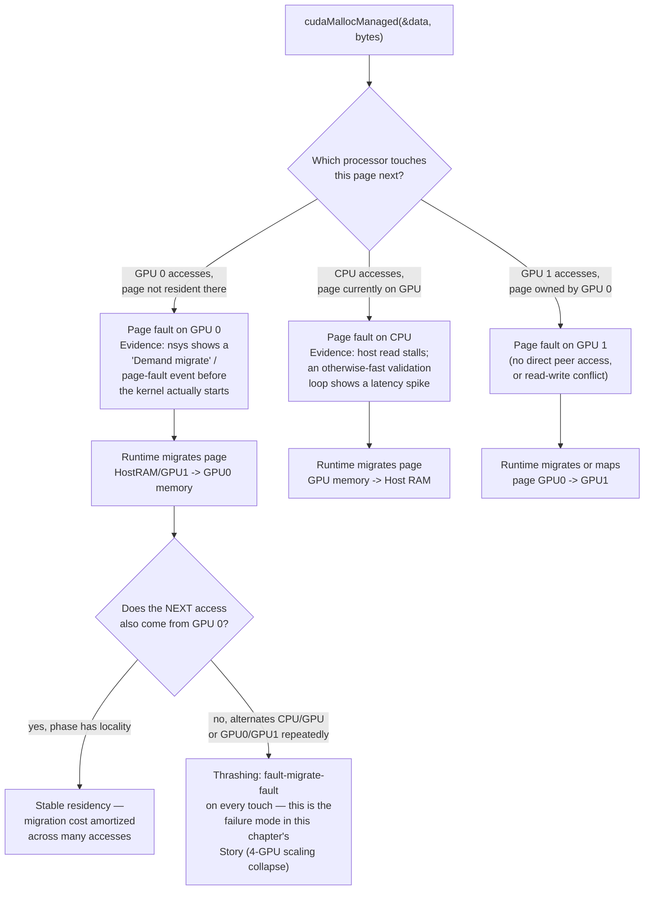
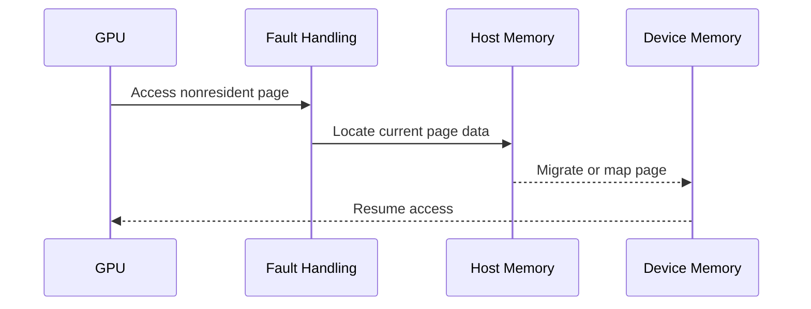
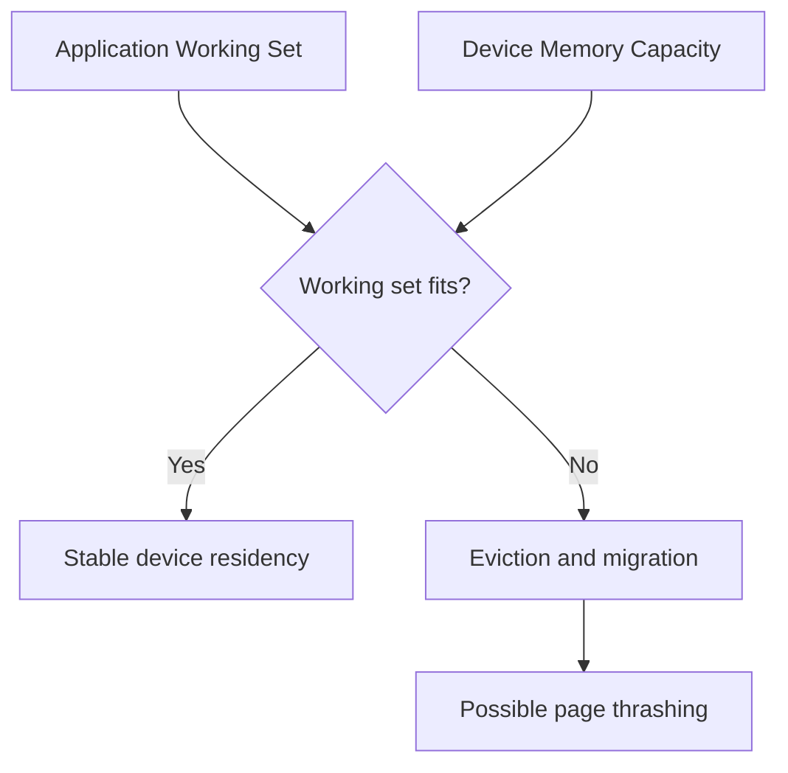

# Unified Memory and Demand Paging

## Introduction

Explicit memory management forces an application to decide where data lives and when it moves. That control can produce excellent performance, but it also creates complexity: duplicate pointers, transfer scheduling, lifetime rules, and platform-specific placement logic.

CUDA Unified Memory introduces a managed allocation that can be accessed by CPUs and GPUs through a unified virtual address space. The system migrates or maps pages according to access, architecture, operating-system support, and runtime policy.

Unified Memory simplifies ownership. It does not eliminate data movement. In production, the key question is whether page placement and migration follow the workload's access pattern or fight it.

| Chapter field | Value |
|---|---|
| Volume | 03 — CUDA Fundamentals |
| Difficulty | Intermediate |
| Estimated reading time | 50 minutes |
| Primary focus | Managed allocation, page migration, and placement policy |
| Previous | Pinned Memory and Transfer Overlap |
| Next | CUDA Graphs and Repeated Execution |

## Story

A scientific application moves from one GPU to four GPUs. The code uses managed memory and runs correctly without major changes, but multi-GPU scaling is inconsistent. Profiling shows repeated page faults and migrations between processors.

The application treats Unified Memory as if it were a large shared cache. In reality, different phases repeatedly touch the same pages from different locations. The runtime is following the access pattern correctly, but the access pattern itself is hostile to locality.

Engineers add phase-aware prefetching, establish preferred locations, and remove CPU inspection from the hot path. Performance stabilizes without abandoning managed memory.

## Learning Objectives

After completing this chapter, you will be able to:

- Explain the difference between unified virtual addressing and Unified Memory.
- Describe managed allocation and page migration.
- Identify page-fault and migration costs.
- Explain oversubscription and eviction behavior conceptually.
- Use prefetch and access advice as placement hints.
- Decide when explicit copies provide a better production model.

## Big Picture



**Figure 3.9.1 — Unified memory as a fault-and-migrate decision, not a static three-way share.** The diagram now shows the actual triggering event (a page fault on access) and names the profiler evidence that confirms it, then forks on the question that determines whether Unified Memory performs well or badly for a given workload: does the access pattern have locality, or does it alternate ownership on every touch.

## Unified Virtual Addressing Versus Unified Memory

These concepts are related but distinct.

| Concept | Meaning |
|---|---|
| Unified Virtual Addressing | Host and device pointers participate in a unified virtual-address model on supported systems |
| Unified Memory | Runtime-managed allocation accessible from CPUs and GPUs, with migration or mapping behavior |

Unified addressing helps identify memory locations consistently. Managed memory adds placement and movement policy.

## Managed Allocation

A managed allocation is created with a CUDA managed-memory API and freed through the normal CUDA deallocation path.

```cpp
float* data = nullptr;
cudaMallocManaged(&data, bytes);

// CPU and GPU may access data according to synchronization rules.

cudaFree(data);
```

The pointer is easier to share across code paths, but correctness still requires ordering. A CPU must not read values while a GPU is updating them unless the program establishes a valid synchronization boundary.

## Page Migration

Managed memory is commonly handled at page granularity. When a processor accesses a page that is not resident or accessible in the required location, the platform may fault, migrate, map, or duplicate that page according to capabilities and policy.



**Figure 3.9.2 — Simplified demand migration.** A first touch may trigger fault handling and movement before execution resumes.

A fault is not automatically an error. It can be expected behavior. Large numbers of faults in latency-sensitive phases are a performance signal.

## Access Locality

Unified Memory performs best when access has locality. A phase runs primarily on one processor, the working set fits, and pages remain near the active processor long enough to amortize migration cost.

Poor patterns include:

- CPU and GPU alternating writes to the same pages.
- Multiple GPUs repeatedly touching the same pages without a clear ownership model.
- Large first-touch bursts on a latency-critical request.
- Working sets that exceed available device memory and churn continuously.
- Host logging or validation that forces pages away from the GPU.

## Prefetching

Prefetching requests that a managed range move toward a processor before the next access phase.

Conceptually:

```cpp
cudaMemPrefetchAsync(data, bytes, device, stream);
```

Prefetching converts some demand-fault cost into an explicit, schedulable operation. It works best when the application knows the upcoming phase and can overlap movement with other work.

A prefetch is a policy request, not a permanent lock. Later accesses may change placement.

## Memory Advice

CUDA exposes advice mechanisms that can describe expected use, such as:

- Preferred location
- Read-mostly behavior
- Expected access by a processor

Advice helps the runtime choose placement and mapping strategies. It does not repair a fundamentally conflicting access pattern.

## Oversubscription

Managed memory can make allocations larger than device memory usable by allowing pages to reside in host memory and move as required. This is oversubscription.

Oversubscription increases capacity flexibility but does not turn host memory into HBM. If the active working set repeatedly exceeds device capacity, page migration can dominate runtime.



**Figure 3.9.3 — Oversubscription risk.** Capacity can exceed device memory, but performance depends on whether the active subset remains local.

## Multi-GPU Considerations

Managed memory in a multi-GPU process introduces placement questions:

- Which GPU owns or primarily accesses each range?
- Is peer access available between the devices?
- Are pages migrating between GPU memories?
- Is data read-mostly or frequently written?
- Does the application partition work cleanly?

A shared pointer does not imply uniform access cost from every GPU.

## Correctness and Synchronization

Managed memory reduces pointer-management complexity, not synchronization requirements.

Incorrect pattern:

1. Launch a kernel that writes managed memory.
2. Immediately read the same data on the CPU.
3. Assume the pointer's accessibility guarantees completion.

Correctness requires an event, stream synchronization, device synchronization, or another valid dependency before the CPU consumes results.

## Architecture Trade-offs

### Productivity versus placement control

Managed memory simplifies programming and enables incremental ports. Explicit copies make movement visible and often easier to budget for strict latency targets.

### Capacity versus predictability

Oversubscription enables larger data sets but introduces migration and eviction. Dedicated device allocations provide firmer capacity boundaries.

### Portability versus platform tuning

Unified Memory can reduce platform-specific code, but behavior still depends on GPU architecture, driver, operating system, topology, and access pattern.

## Production Observability

Track:

- Managed-memory page faults
- Bytes migrated by direction
- Prefetch duration
- Device-memory pressure
- Eviction activity
- CPU touches during GPU phases
- Per-GPU access ownership
- Request latency around first touch
- Working-set size versus device capacity

A timeline should correlate migrations with application phases.

## Production Troubleshooting

### Problem: First iteration is much slower

The first iteration may fault and migrate pages. Compare warm and cold runs, then test prefetching before the measured phase.

**Evidence — cold versus warm, and the effect of prefetching:**

```text
$ ./managed_bench --mode=cold
iteration 1: 812.4 ms   (first touch: page faults dominate)
iteration 2: 41.2 ms
iteration 3: 40.8 ms

$ ./managed_bench --mode=prefetch
prefetch:    38.9 ms    (cudaMemPrefetchAsync before the measured region)
iteration 1: 41.6 ms
iteration 2: 40.9 ms
```

Iteration 1 in cold mode is roughly 20x slower than steady state — that gap *is* the fault-and-migrate cost for the whole allocation happening on first touch, not algorithmic overhead. Explicitly prefetching before the timed region converts that hidden 812 ms fault cost into a visible, schedulable 38.9 ms operation that iteration 1 no longer has to pay — the total work is the same, but it's now measured and can be overlapped with unrelated setup instead of silently inflating the first request's latency.

### Problem: Performance collapses when data grows

Check whether the active working set exceeds device memory. Repeated eviction and refaulting can create thrashing.

**Evidence — the exact tipping point:**

| Working set | vs. 40 GB device memory | Throughput |
|---|---|---:|
| 24 GB | 60% | 118 GB/s effective |
| 36 GB | 90% | 104 GB/s effective |
| 44 GB | 110% (oversubscribed) | 9 GB/s effective |

The collapse from 104 GB/s to 9 GB/s between the 36 GB and 44 GB rows is not gradual degradation — it's the working set crossing device capacity and the runtime beginning to evict and refault pages continuously (thrashing) rather than holding the active set resident. `nvidia-smi --query-gpu=memory.used --format=csv -lms 500` sampled during the 44 GB run would show memory-used oscillating near the device ceiling rather than settling, which is the operational signature to look for before the throughput number itself confirms it.

### Problem: Multi-GPU scaling is erratic

Inspect which GPU first touches each range, whether pages migrate between GPUs, and whether work partitioning matches data ownership.

### Problem: CPU inspection causes large stalls

A CPU read can force synchronization and page movement. Move validation outside the hot path, copy a small summary, or separate CPU-owned metadata from GPU-owned data.

**Evidence — one debug print costing more than the kernel it's checking:**

```text
$ ./managed_bench --mode=with-cpu-check
kernel:      4.1 ms
cpu check:   96.7 ms   (std::cout << data[0] forces a page fault + sync)
```

A single CPU read of one element (`data[0]`) costs more than 23x the kernel it was meant to sanity-check — because that read forces the runtime to synchronize outstanding GPU work and migrate the touched page back to host memory before the CPU can see it. This is why "just print a value to check it's not NaN" is a dangerous debugging habit inside a hot managed-memory path — the debug statement itself becomes the bottleneck.

## Customer Scenario

A customer uses managed memory to accelerate a large analytics application. The approach works well on one GPU but misses latency objectives after the data set grows beyond device capacity.

The architect separates cold and hot data, explicitly prefetches the hot working set, leaves archival pages in host memory, and establishes a capacity alert before migration thrashing begins. The recommendation keeps Unified Memory for programmability while making locality explicit.

## Interview Preparation

### Conceptual Questions

1. **Does Unified Memory eliminate data movement?**
   "No — it eliminates the *explicit copy call* from the code, but the underlying pages still have to physically move between host and device memory whenever a processor accesses data it doesn't currently hold locally. I've seen people treat `cudaMallocManaged` as if it makes movement free; it doesn't, it just makes movement implicit and driven by access pattern instead of by an explicit `cudaMemcpy` call. If anything, that makes the cost harder to see, not smaller."

2. **What is the difference between unified virtual addressing and managed memory?**
   "Unified virtual addressing just means host and device pointers live in one consistent virtual address space — it's an addressing convenience, so a pointer value means the same thing whether you're looking at it from the CPU or the GPU. Managed memory is a separate, additional thing built on top: an actual allocation type where the runtime takes responsibility for migrating and mapping pages across processors as they're accessed. You can have unified addressing without opting into managed memory's migration behavior at all."

3. **Why can first-touch latency be high?**
   "Because the first time any processor accesses a managed allocation's pages, none of them are resident where that processor needs them yet — so that first access has to pay the full page-fault-and-migrate cost for potentially the whole working set, all at once, on whatever's the critical path at that moment. In a request-serving context, if that first touch happens to be the first real user request rather than a warm-up phase, that request eats the entire migration bill."

### Architecture Questions

1. **Draw a managed page moving from host memory to GPU memory.**
   "GPU issues an access to a page that isn't currently resident on the device. That triggers a page fault, which is handled by locating the current copy — say, in host memory — and migrating or mapping it into GPU memory before the GPU instruction that triggered the fault is allowed to resume. I'd draw this as a four-step sequence: access attempt, fault, migrate, resume — and note that this whole sequence is exactly what a prefetch call lets you move earlier and off the critical path."

2. **Explain how prefetching changes the execution timeline.**
   "Without prefetching, the migration cost is implicit and shows up as a stall at the moment of first access — often right when you least want extra latency. `cudaMemPrefetchAsync` converts that same cost into an explicit, schedulable operation you issue ahead of time, ideally overlapped with unrelated setup work in another stream. The total bytes moved don't change — what changes is whether that cost is hidden inside your measured critical path or paid off the clock beforehand."

3. **Compare managed memory with explicit host-device copies.**
   "Managed memory gives you one pointer and lets the runtime figure out placement — great for getting a CPU codebase running on GPU quickly, or for access patterns that are genuinely hard to predict. Explicit copies force you to decide exactly when and how much data moves, which is more code but gives you a hard, predictable latency budget — I'd reach for explicit copies whenever the service has a strict tail-latency target, because implicit migration timing is much harder to bound and test for."

### Scenario Questions

1. **A managed-memory application slows dramatically beyond a data-size threshold. Why?**
   "That threshold is almost certainly device memory capacity — below it, the working set stays resident on the GPU and performance is stable; cross it, and the runtime starts evicting and refaulting pages continuously to keep the active set within device memory, which is thrashing. I'd confirm by watching `nvidia-smi` memory-used oscillate near the device ceiling during the slow runs versus settling cleanly during the fast ones, and I'd fix it by separating hot and cold data rather than assuming Unified Memory can transparently absorb unlimited oversubscription."

2. **Two GPUs repeatedly access the same writable pages. What behavior might occur?**
   "Repeated migration back and forth between the two GPUs' memories, or fault-driven remapping on every alternating write, depending on whether peer access is configured between them — either way it's expensive, because each GPU is effectively evicting the other's copy on every touch. The real fix is architectural: partition the data so each GPU clearly owns a range and works within it, rather than relying on managed memory to make shared mutable access between GPUs free — it isn't."

3. **CPU logging unexpectedly hurts GPU throughput. How could managed memory be involved?**
   "If that log statement reads a value from a managed allocation the GPU is actively working on, the CPU read forces a synchronization point and a page migration back to host memory before the read can even happen — even a single-element debug print can cost far more than the kernel it was checking, because it's not just a read, it's a full synchronize-and-migrate. I'd move any CPU-side inspection out of the hot path entirely, or explicitly separate CPU-owned summary data from the GPU-owned working set so routine logging never touches managed pages the GPU cares about."

## Summary

Unified Memory provides a managed allocation accessible by CPUs and GPUs through a unified virtual address model. Physical pages still reside somewhere, and access can trigger migration, mapping, duplication, eviction, or fault handling.

It is most effective when application phases have clear locality. Prefetching and memory advice can improve placement, but explicit copies may remain preferable when latency, bandwidth, and ownership must be tightly controlled.

## Key Takeaways

- Unified Memory simplifies access, not physics.
- Page migration follows access and placement policy.
- First touch and oversubscription can create large latency costs.
- Prefetching can make movement explicit and schedulable.
- Multi-GPU managed memory requires a data-ownership model.
- Synchronization remains mandatory for correctness.

## Cross References

- Previous: [Pinned Memory and Transfer Overlap](./chapter-08-pinned-memory-and-transfer-overlap)
- Next: [CUDA Graphs and Repeated Execution](./chapter-10-cuda-graphs-and-repeated-execution)
- Related lab: [Profile and Diagnose a CUDA Application](./labs/lab-04-profile-and-diagnose-a-cuda-application)
