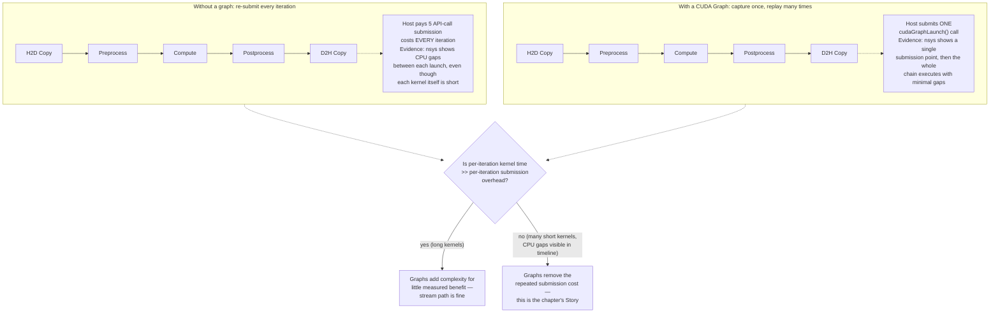
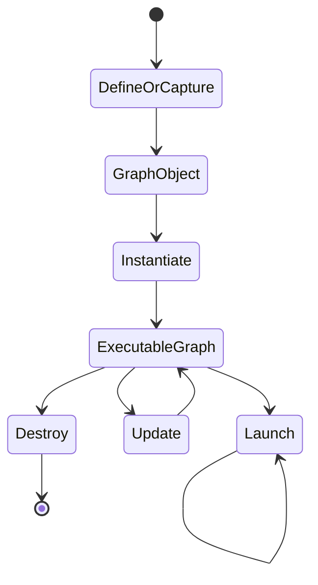
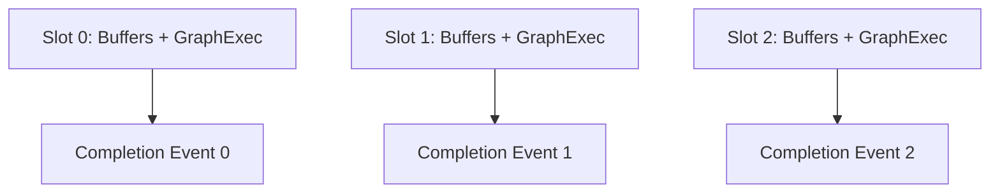

# CUDA Graphs and Repeated Execution

## Introduction

Many GPU applications repeat the same sequence of kernels, copies, and dependencies thousands of times. The device work may be efficient while the host repeatedly rebuilds and submits the same schedule.

CUDA Graphs allow an application to define or capture that schedule as a graph of operations and dependencies. The graph can be instantiated once and launched repeatedly, reducing recurring submission work and making the dependency structure explicit.

Graphs are not a universal replacement for streams. They are most useful when the workflow is stable, repeated, and sensitive to launch overhead. Dynamic control flow, changing buffer lifetimes, and irregular request shapes may require careful graph updates or a conventional stream path.

| Chapter field | Value |
|---|---|
| Volume | 03 — CUDA Fundamentals |
| Difficulty | Intermediate |
| Estimated reading time | 45 minutes |
| Primary focus | Graph capture, instantiation, replay, and lifecycle |
| Previous | Unified Memory and Demand Paging |
| Next | Compilation, Binaries, and Compatibility |

## Story

A low-latency inference service runs many short kernels for each request. The GPU is not saturated, but CPU submission overhead and launch variance consume a significant share of latency.

The team captures the stable preprocessing and execution sequence into a CUDA Graph. Replay reduces repeated host work, but the first design fails under concurrency because graph parameters reference buffers that are reused too early.

The final design creates one graph-execution instance per pipeline slot, updates only approved parameters, and preserves an uncaptured path for diagnostics.

## Learning Objectives

After completing this chapter, you will be able to:

- Explain why repeated launch overhead matters.
- Describe graph nodes, edges, instantiation, and replay.
- Compare explicit graph construction with stream capture.
- Identify graph-capture restrictions and lifecycle risks.
- Design graph instances around stable buffer ownership.
- Decide when graphs are inappropriate.

## Big Picture



**Figure 3.10.1 — Repeated dependency graph shown as a before/after comparison with the decision it's meant to inform.** The stream path and the graph path execute the identical five operations — the diagram's point is that the difference is entirely in *host submission cost*, which is only visible in a timeline as CPU gaps between short kernels, and the decision box states plainly when adopting a graph is and isn't worth it.

## Why Launch Overhead Matters

Kernel launch is asynchronous, but the host still performs API calls, argument preparation, dependency management, and driver submission. For long kernels, this cost is usually small relative to execution. For many short kernels, it can become material.

A repeated workflow may show:

- CPU gaps between kernels
- Low GPU utilization despite queued requests
- High variance in short-request latency
- Significant host time in runtime or driver submission
- Limited benefit from additional streams

Graphs target the repeated submission path. They do not make an inefficient kernel efficient.

## Graph Components

A CUDA Graph contains nodes and dependency edges.

Common node categories include:

- Kernel launches
- Memory copies
- Memory-set operations
- Events or external synchronization where supported
- Host nodes where appropriate
- Child graphs

Edges define required ordering. Independent nodes may execute concurrently if the platform and resources allow it.

## Graph Lifecycle



**Figure 3.10.2 — Graph lifecycle.** A graph definition becomes an executable graph after instantiation and can then be launched repeatedly.

Instantiation validates and prepares the graph. It should usually occur outside the latency-critical request path.

## Explicit Construction Versus Stream Capture

| Method | Strength | Risk |
|---|---|---|
| Explicit graph APIs | Full control over nodes and edges | More code and lifecycle management |
| Stream capture | Converts an existing stream workflow into a graph | Capture restrictions and hidden dependencies |

Stream capture is attractive for existing pipelines. However, APIs that synchronize broadly, allocate unexpectedly, or interact with unsupported external state can invalidate capture.

A capture-safe code path should be designed deliberately rather than discovered in production.

## Graph Parameters and Updates

Repeated workflows often keep the same topology while changing:

- Input and output pointers
- Scalar values
- Grid dimensions
- Copy sizes

Some graph parameters can be updated without rebuilding the entire graph, subject to runtime and node constraints. Production code must check update results and fall back safely when the requested change is incompatible.

Updates should not be treated as arbitrary graph mutation. Stable topology remains the primary use case.

## Buffer Ownership

A graph stores operation parameters that may reference memory. Those buffers must remain valid for every launch that uses them.

A safe design often uses one executable graph per pipeline slot:



**Figure 3.10.3 — Graph instances aligned with ownership.** Each slot owns stable buffers and cannot be reused until its completion signal arrives.

## Concurrency and Multiple Graph Launches

A graph launch is submitted to a stream. Multiple executable graphs may run concurrently when dependencies and resources permit.

Graph replay does not override normal scheduling constraints. A large kernel can still consume most execution resources. Transfers still depend on memory type and copy engines. Stream and event reasoning remains relevant.

## Error Behavior

Errors in graph workflows can occur during:

- Definition or capture
- Instantiation
- Parameter update
- Launch submission
- Asynchronous node execution

The application should record which lifecycle stage failed. Reporting only “graph launch failed” hides valuable evidence.

After an asynchronous failure, the error may surface at a later synchronization boundary, just as with conventional streams.

## Architecture Trade-offs

### Lower overhead versus reduced flexibility

Graphs reduce recurring submission work but prefer stable topology. Highly dynamic workflows may spend more time rebuilding or updating graphs than they save.

### Faster path versus operational complexity

Graph instances add lifecycle, ownership, cache, and fallback logic. The performance improvement must justify the complexity.

### Capture convenience versus hidden assumptions

Capture can accelerate adoption but may include operations or dependencies unintentionally. Explicit review of the captured workflow is essential.

## Production Design Pattern

A graph-enabled service should define:

- Eligibility criteria for graph use
- Graph cache key, such as model, shape, and batch class
- Maximum cached graph instances
- Memory owned by each instance
- Warm-up and instantiation behavior
- Update policy
- Fallback path
- Metrics for hit, miss, update, rebuild, and failure

Unbounded graph caches can become a memory leak in variable-shape services.

## Production Observability

Track:

- Graph cache hit rate
- Instantiation time
- Launch time
- Update success and failure
- Rebuild count
- Fallback count
- Per-shape latency
- Memory retained by graph instances
- GPU timeline gaps before and after graph adoption

Measure end-to-end latency, not only launch API duration.

## Production Troubleshooting

### Problem: Graph capture fails

Look for unsupported calls, broad synchronization, allocation inside capture, cross-thread behavior, or external library operations that are not capture-safe.

**Evidence — a typical capture failure and what it points at:**

```text
$ ./graph_service --capture
terminate called after throwing an instance of 'std::runtime_error'
  what():  cudaStreamEndCapture failed: operation not permitted while stream
           is capturing
```

This generic-looking error is the runtime rejecting something that happened *inside* the capture window — commonly a `cudaMalloc` call, a call into a library that internally synchronizes, or a second thread submitting to the captured stream. The fix is not to retry — it's to bisect the captured region by commenting out suspect calls (library calls first, since they're the least visible source) until capture succeeds, then move the offending call outside the capture window.

### Problem: Graph path returns stale data

Check whether node parameters still point to old buffers, whether updates succeeded, and whether pipeline slots are reused before completion.

**Evidence — an update call whose failure went unchecked:**

```text
$ ./graph_service --shape=512
cudaGraphExecUpdate result: cudaGraphExecUpdateErrorTopologyChanged
falling back to full rebuild... done
$ ./graph_service --shape=513 --skip-update-check   # bug: ignoring the result
request shape=513 executed using stale shape=512 buffers
validation: FAIL
```

`cudaGraphExecUpdate` can fail — for instance when a shape change alters the node topology rather than just its parameters — and a service that doesn't check its return value keeps launching the *old* executable graph against buffers that no longer match the current request. The second run above shows exactly that: the update silently failed, the service launched the stale graph anyway, and validation caught data computed against the wrong shape. Always branch on the update result and fall back to a full rebuild (as the first run correctly does) rather than assuming update success.

### Problem: Graphs provide no improvement

The workload may be dominated by long kernels, transfers, queueing, or network latency. Compare host submission gaps before and after adoption.

**Evidence — graphs applied to the wrong bottleneck:**

```text
$ nsys stats --report cuda_api_sum stream-baseline.nsys-rep | head -3
 Time(%)  Total Time (ns)  Num Calls  Name
    2.1        4,120,000       500    cudaLaunchKernel
   97.3      189,340,000       500    cudaMemcpyAsync   <- one large 512MB transfer per iteration
```

Here submission overhead (`cudaLaunchKernel` at 2.1%) was never the bottleneck — a single large transfer dominates each iteration at 97.3% of API time. Wrapping this workflow in a CUDA Graph would remove almost none of that time, because graphs target repeated *submission* cost, not transfer bandwidth. This is the diagnostic step this row's symptom demands: compare where time actually goes before adopting graphs, not after a benchmark shows a promising number on a different workload shape.

### Problem: Memory grows with request diversity

A graph cache keyed by arbitrary shapes may grow without bound. Introduce shape classes, admission limits, eviction, and fallback execution.

## Customer Scenario

A customer serves variable-length requests. They want CUDA Graphs because a benchmark showed lower latency. The architect finds that only a small set of batch and sequence-length classes dominate traffic.

The design creates graph instances for those stable classes and retains a normal stream path for uncommon shapes. Metrics show graph hit rate and memory retained per class. This captures most of the benefit without turning every unique request into a cached graph.

## Interview Preparation

### Conceptual Questions

1. **What problem do CUDA Graphs solve?**
   "Repeated host submission overhead for a stable, recurring sequence of GPU operations. Every kernel launch and copy submission costs the host real time — argument marshaling, driver interaction — and for a workflow of many short operations run thousands of times, that adds up to measurable CPU time and launch-to-launch gaps. A graph lets you pay that submission cost once, at capture and instantiation time, and then replay the whole sequence with a single launch call. It's specifically a submission-overhead fix, not a kernel-efficiency fix."

2. **How does graph replay differ from launching the same kernels manually?**
   "Manually, the host issues a separate API call for every kernel and copy, every single iteration — full argument preparation and driver submission each time. With a graph, that entire sequence and its dependency structure was captured and validated once during instantiation; replay is a single call that tells the driver 'run the graph you already know about.' The dependency edges are also explicit and pre-validated in a graph, versus implicitly re-derived from stream-ordering semantics on every manual launch."

3. **Why must graph-referenced buffers have stable lifetimes?**
   "Because a graph node stores the memory addresses it operates on at instantiation time — it's not re-resolving pointers fresh on every replay the way a manually-issued call would. If the buffer a node references gets freed, reused for something else, or overwritten by a different in-flight request before that node's next replay, you get stale data or an outright invalid access. That's why the safe pattern is one executable graph per pipeline slot, where the slot owns stable buffers for its whole lifetime rather than buffers being shared or recycled unpredictably across requests."

### Architecture Questions

1. **Draw the graph lifecycle from capture to replay.**
   "Define or capture the operations and dependencies into a graph object, instantiate that into an executable graph — this is where validation and preparation happen, and it should sit outside the request-latency path — then launch the executable graph repeatedly. I'd also draw the update path as a loop back into the executable-graph state for parameter changes that don't alter topology, and a destroy path at shutdown. The key annotation: instantiation is expensive and belongs at warm-up, replay is cheap and belongs in the hot path."

2. **Design a graph cache for a variable-shape inference service.**
   "I wouldn't key the cache by exact shape — that grows unbounded with request diversity. Instead I'd bucket requests into a small number of shape classes that cover the traffic distribution, cache one graph instance per class with a bounded maximum instance count, and keep a normal stream-based fallback path for shapes outside the cached classes. I'd track cache hit rate, memory retained per instance, and rebuild/fallback counts as the operational signals that tell me whether the bucketing is actually matching real traffic."

3. **Explain how graphs and streams work together.**
   "A graph launch is itself submitted to a stream — graphs don't replace streams, they replace the *manual submission* of a repeated sequence that would otherwise go through a stream one call at a time. Multiple executable graphs can run concurrently on different streams if dependencies and resources allow, following the exact same overlap rules as any other stream-submitted work. So all the stream reasoning from earlier chapters — buffer ownership, hidden synchronization, engine capability — still applies fully to graph-based pipelines."

### Scenario Questions

1. **Capture fails after adding a library call. What do you investigate?**
   "Whether that library call is capture-safe — specifically whether it allocates memory, performs broad synchronization, or touches state outside the captured stream internally, any of which can invalidate capture. I'd isolate it by capturing with and without that specific call to confirm it's the trigger, then check the library's documentation or source for capture-safety guarantees rather than assuming any CUDA-adjacent call is automatically fine inside a capture window."

2. **Memory grows with every new request shape. What is wrong?**
   "The graph cache is almost certainly keyed by exact request shape with no admission limit or eviction policy — so every unique shape the service has ever seen accumulates its own retained executable graph and buffers, forever. The fix is bucketing into shape classes with a bounded cache size, an eviction policy for cold entries, and a fallback stream path for shapes that don't justify their own cached graph — not caching every shape that happens to walk in the door."

3. **Graph replay is faster at the API layer but service latency is unchanged. Why?**
   "Because graphs only remove host submission overhead — if that was never the bottleneck for this service, removing it doesn't move the needle on end-to-end latency. I'd check whether the dominant cost is actually transfer time, queueing, network, or a genuinely long-running kernel — any of which a graph does nothing for. The API-layer win is real but local; I always measure the customer-visible metric before crediting an optimization with anything."

## Summary

CUDA Graphs represent repeated device workflows as nodes and dependencies that can be instantiated and replayed. They are valuable when launch overhead is material and workflow topology is stable.

A production implementation must manage capture safety, buffer lifetime, graph caching, updates, concurrency, metrics, and fallback behavior. Graphs optimize submission; they do not replace workload profiling or sound stream design.

## Key Takeaways

- Graphs reduce repeated submission work for stable workflows.
- Nodes represent operations and edges represent dependencies.
- Instantiation belongs outside the hot path when possible.
- Buffers referenced by graph nodes require explicit ownership.
- Dynamic workloads need bounded caches and fallback paths.
- Measure end-to-end impact before accepting the added complexity.

## Cross References

- Previous: [Unified Memory and Demand Paging](./chapter-09-unified-memory-and-demand-paging)
- Next: [Compilation, Binaries, and Compatibility](./chapter-11-compilation-binaries-and-compatibility)
- Related lab: [Profile and Diagnose a CUDA Application](./labs/lab-04-profile-and-diagnose-a-cuda-application)
