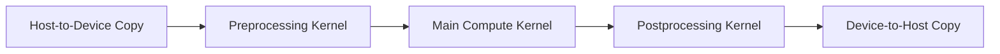
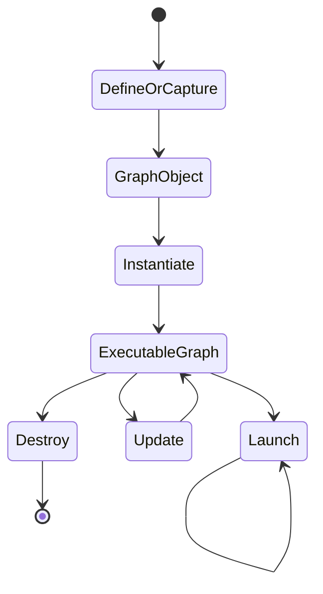
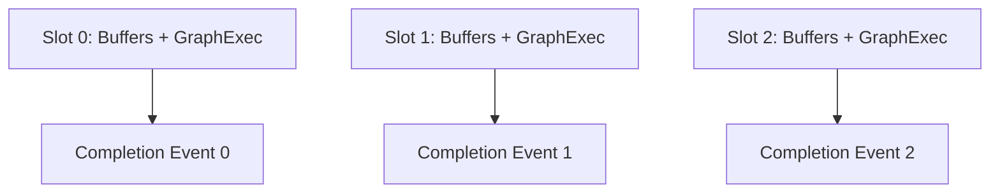

# CUDA Graphs and Repeated Execution

## Introduction

Many GPU applications repeat the same sequence of kernels, copies, and dependencies thousands of times. The device work may be efficient while the host repeatedly rebuilds and submits the same schedule.

CUDA Graphs allow an application to define or capture that schedule as a graph of operations and dependencies. The graph can be instantiated once and launched repeatedly, reducing recurring submission work and making the dependency structure explicit.

Graphs are not a universal replacement for streams. They are most useful when the workflow is stable, repeated, and sensitive to launch overhead. Dynamic control flow, changing buffer lifetimes, and irregular request shapes may require careful graph updates or a conventional stream path.

| Chapter field | Value |
|---|---|
| Volume | 03 — CUDA Fundamentals |
| Difficulty | Intermediate |
| Estimated reading time | 45 minutes |
| Primary focus | Graph capture, instantiation, replay, and lifecycle |
| Previous | Unified Memory and Demand Paging |
| Next | Compilation, Binaries, and Compatibility |

## Story

A low-latency inference service runs many short kernels for each request. The GPU is not saturated, but CPU submission overhead and launch variance consume a significant share of latency.

The team captures the stable preprocessing and execution sequence into a CUDA Graph. Replay reduces repeated host work, but the first design fails under concurrency because graph parameters reference buffers that are reused too early.

The final design creates one graph-execution instance per pipeline slot, updates only approved parameters, and preserves an uncaptured path for diagnostics.

## Learning Objectives

After completing this chapter, you will be able to:

- Explain why repeated launch overhead matters.
- Describe graph nodes, edges, instantiation, and replay.
- Compare explicit graph construction with stream capture.
- Identify graph-capture restrictions and lifecycle risks.
- Design graph instances around stable buffer ownership.
- Decide when graphs are inappropriate.

## Big Picture

**Figure 3.10.1 — Repeated dependency graph.** The application can instantiate this stable workflow once and replay it for many iterations.

## Why Launch Overhead Matters

Kernel launch is asynchronous, but the host still performs API calls, argument preparation, dependency management, and driver submission. For long kernels, this cost is usually small relative to execution. For many short kernels, it can become material.

A repeated workflow may show:

- CPU gaps between kernels
- Low GPU utilization despite queued requests
- High variance in short-request latency
- Significant host time in runtime or driver submission
- Limited benefit from additional streams

Graphs target the repeated submission path. They do not make an inefficient kernel efficient.

## Graph Components

A CUDA Graph contains nodes and dependency edges.

Common node categories include:

- Kernel launches
- Memory copies
- Memory-set operations
- Events or external synchronization where supported
- Host nodes where appropriate
- Child graphs

Edges define required ordering. Independent nodes may execute concurrently if the platform and resources allow it.

## Graph Lifecycle

**Figure 3.10.2 — Graph lifecycle.** A graph definition becomes an executable graph after instantiation and can then be launched repeatedly.

Instantiation validates and prepares the graph. It should usually occur outside the latency-critical request path.

## Explicit Construction Versus Stream Capture

| Method | Strength | Risk |
|---|---|---|
| Explicit graph APIs | Full control over nodes and edges | More code and lifecycle management |
| Stream capture | Converts an existing stream workflow into a graph | Capture restrictions and hidden dependencies |

Stream capture is attractive for existing pipelines. However, APIs that synchronize broadly, allocate unexpectedly, or interact with unsupported external state can invalidate capture.

A capture-safe code path should be designed deliberately rather than discovered in production.

## Graph Parameters and Updates

Repeated workflows often keep the same topology while changing:

- Input and output pointers
- Scalar values
- Grid dimensions
- Copy sizes

Some graph parameters can be updated without rebuilding the entire graph, subject to runtime and node constraints. Production code must check update results and fall back safely when the requested change is incompatible.

Updates should not be treated as arbitrary graph mutation. Stable topology remains the primary use case.

## Buffer Ownership

A graph stores operation parameters that may reference memory. Those buffers must remain valid for every launch that uses them.

A safe design often uses one executable graph per pipeline slot:

**Figure 3.10.3 — Graph instances aligned with ownership.** Each slot owns stable buffers and cannot be reused until its completion signal arrives.

## Concurrency and Multiple Graph Launches

A graph launch is submitted to a stream. Multiple executable graphs may run concurrently when dependencies and resources permit.

Graph replay does not override normal scheduling constraints. A large kernel can still consume most execution resources. Transfers still depend on memory type and copy engines. Stream and event reasoning remains relevant.

## Error Behavior

Errors in graph workflows can occur during:

- Definition or capture
- Instantiation
- Parameter update
- Launch submission
- Asynchronous node execution

The application should record which lifecycle stage failed. Reporting only “graph launch failed” hides valuable evidence.

After an asynchronous failure, the error may surface at a later synchronization boundary, just as with conventional streams.

## Architecture Trade-offs

### Lower overhead versus reduced flexibility

Graphs reduce recurring submission work but prefer stable topology. Highly dynamic workflows may spend more time rebuilding or updating graphs than they save.

### Faster path versus operational complexity

Graph instances add lifecycle, ownership, cache, and fallback logic. The performance improvement must justify the complexity.

### Capture convenience versus hidden assumptions

Capture can accelerate adoption but may include operations or dependencies unintentionally. Explicit review of the captured workflow is essential.

## Production Design Pattern

A graph-enabled service should define:

- Eligibility criteria for graph use
- Graph cache key, such as model, shape, and batch class
- Maximum cached graph instances
- Memory owned by each instance
- Warm-up and instantiation behavior
- Update policy
- Fallback path
- Metrics for hit, miss, update, rebuild, and failure

Unbounded graph caches can become a memory leak in variable-shape services.

## Production Observability

Track:

- Graph cache hit rate
- Instantiation time
- Launch time
- Update success and failure
- Rebuild count
- Fallback count
- Per-shape latency
- Memory retained by graph instances
- GPU timeline gaps before and after graph adoption

Measure end-to-end latency, not only launch API duration.

## Production Troubleshooting

### Problem: Graph capture fails

Look for unsupported calls, broad synchronization, allocation inside capture, cross-thread behavior, or external library operations that are not capture-safe.

### Problem: Graph path returns stale data

Check whether node parameters still point to old buffers, whether updates succeeded, and whether pipeline slots are reused before completion.

### Problem: Graphs provide no improvement

The workload may be dominated by long kernels, transfers, queueing, or network latency. Compare host submission gaps before and after adoption.

### Problem: Memory grows with request diversity

A graph cache keyed by arbitrary shapes may grow without bound. Introduce shape classes, admission limits, eviction, and fallback execution.

## Customer Scenario

A customer serves variable-length requests. They want CUDA Graphs because a benchmark showed lower latency. The architect finds that only a small set of batch and sequence-length classes dominate traffic.

The design creates graph instances for those stable classes and retains a normal stream path for uncommon shapes. Metrics show graph hit rate and memory retained per class. This captures most of the benefit without turning every unique request into a cached graph.

## Interview Preparation

### Conceptual Questions

1. What problem do CUDA Graphs solve?
2. How does graph replay differ from launching the same kernels manually?
3. Why must graph-referenced buffers have stable lifetimes?

### Architecture Questions

1. Draw the graph lifecycle from capture to replay.
2. Design a graph cache for a variable-shape inference service.
3. Explain how graphs and streams work together.

### Scenario Questions

1. Capture fails after adding a library call. What do you investigate?
2. Memory grows with every new request shape. What is wrong?
3. Graph replay is faster at the API layer but service latency is unchanged. Why?

## Summary

CUDA Graphs represent repeated device workflows as nodes and dependencies that can be instantiated and replayed. They are valuable when launch overhead is material and workflow topology is stable.

A production implementation must manage capture safety, buffer lifetime, graph caching, updates, concurrency, metrics, and fallback behavior. Graphs optimize submission; they do not replace workload profiling or sound stream design.

## Key Takeaways

- Graphs reduce repeated submission work for stable workflows.
- Nodes represent operations and edges represent dependencies.
- Instantiation belongs outside the hot path when possible.
- Buffers referenced by graph nodes require explicit ownership.
- Dynamic workloads need bounded caches and fallback paths.
- Measure end-to-end impact before accepting the added complexity.

## Cross References

- Previous: [Unified Memory and Demand Paging](./chapter-09-unified-memory-and-demand-paging)
- Next: [Compilation, Binaries, and Compatibility](./chapter-11-compilation-binaries-and-compatibility)
- Related lab: [Profile and Diagnose a CUDA Application](./labs/lab-04-profile-and-diagnose-a-cuda-application)
