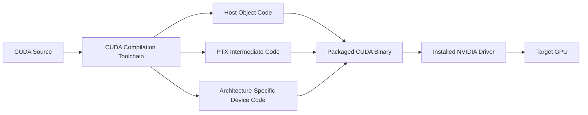
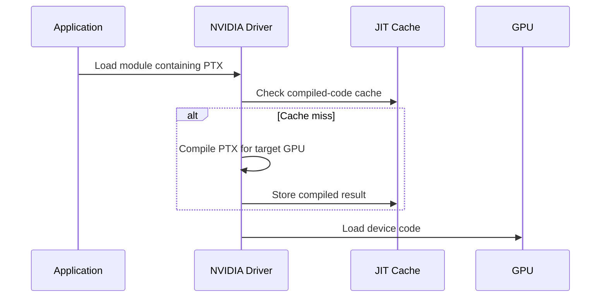
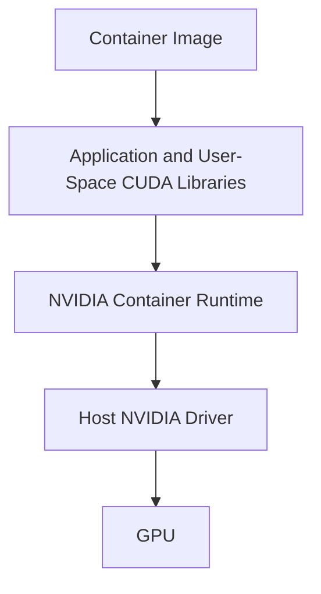

# Compilation, Binaries, and Compatibility

## Introduction

A CUDA application can compile successfully and still fail when deployed to a different GPU, driver, operating system, or container image. The reason is that CUDA delivery crosses several compatibility boundaries: source code becomes intermediate and machine code, libraries are selected at build and runtime, and the installed driver must execute the resulting device program.

Infrastructure engineers do not need to memorize compiler switches. They do need a reliable mental model for answering four questions: What was built? Which GPU architectures does it target? Which libraries are loaded? Can the installed driver execute it?

| Chapter field | Value |
|---|---|
| Volume | 03 — CUDA Fundamentals |
| Difficulty | Intermediate |
| Estimated reading time | 50 minutes |
| Primary focus | Build artifacts, GPU targets, runtime loading, and deployment compatibility |
| Previous | CUDA Graphs and Repeated Execution |
| Next | Profiling and Production Troubleshooting |

## Story

A container passes testing on one GPU generation and fails on a newer production node with an error indicating that no suitable kernel image is available. The team initially suspects Kubernetes device exposure because `nvidia-smi` works.

Inspection shows that the application was built with machine code for only one architecture and without a compatible PTX fallback. The container sees the GPU and driver correctly; the device program simply cannot be loaded for that target.

The incident is a build-governance failure, not a cluster failure.

## Learning Objectives

After completing this chapter, you will be able to:

- Explain the roles of host code, device code, PTX, and architecture-specific machine code.
- Describe why applications package multiple GPU targets.
- Explain just-in-time compilation conceptually.
- Distinguish toolkit, runtime-library, and driver compatibility questions.
- Inspect binaries and loaded libraries during deployment diagnosis.
- Design a production build and validation matrix.

## Big Picture



**Figure 3.11.1 — CUDA build and load path.** A deployment artifact may include host code, architecture-specific device code, and intermediate code that the driver can compile for a target GPU.

## Host and Device Compilation

CUDA source can contain code intended for the CPU and code intended for the GPU. The toolchain separates and compiles these paths, then packages the results into an application or library.

The host compiler produces normal CPU objects. The CUDA toolchain produces device artifacts and metadata used at runtime.

This separation explains why a binary can start normally, parse configuration, and fail only when the first GPU kernel is loaded or launched.

## PTX

PTX is a virtual instruction-set representation used as an intermediate form in the CUDA toolchain. It is not the final native instruction stream executed by the GPU.

When compatible PTX is included, the installed driver may just-in-time compile it into device-specific machine code for the target GPU.

PTX improves forward deployment flexibility, but it introduces considerations:

- First-use compilation latency
- Driver support for the PTX version
- Cache behavior
- Differences between ahead-of-time and JIT-generated code
- Operational need to warm workloads before measuring latency

## Architecture-Specific Code

Ahead-of-time device code targets a particular compute capability or architecture family. It can avoid JIT work and provide predictable startup, but it runs only on compatible targets.

A production artifact often contains multiple target images, sometimes called a fat binary.

| Packaging strategy | Advantage | Trade-off |
|---|---|---|
| One architecture target | Small artifact, simple validation | Narrow hardware compatibility |
| Multiple native targets | Predictable startup across known fleet | Larger artifact and build matrix |
| Native targets plus PTX | Broad compatibility and fallback | JIT latency and additional validation |

The correct policy follows the supported GPU fleet and rollout strategy.

## Compute Capability as a Contract

Compute capability identifies a GPU architecture's programming features and instruction support at a useful abstraction level. It helps the build system select device targets and helps the runtime determine whether an image is compatible.

Do not use compute capability as a complete performance description. Two GPUs with related capability can differ substantially in SM count, memory capacity, bandwidth, clocks, topology, and specialized units.

## Just-in-Time Compilation



**Figure 3.11.2 — Simplified JIT path.** PTX may be compiled at module load, with the result cached for later use.

A read-only filesystem, small cache, ephemeral container storage, or frequent image changes can cause repeated JIT work. Startup latency should therefore be observed, not assumed.

## Toolkit, Libraries, and Driver

The word “CUDA version” is often ambiguous.

| Layer | Example question |
|---|---|
| Build toolkit | Which compiler and headers produced the artifact? |
| Runtime libraries | Which shared libraries are packaged or mounted? |
| Framework build | Which CUDA support was the framework built against? |
| NVIDIA driver | Can the host driver support the required runtime and PTX behavior? |
| GPU architecture | Does the binary include compatible device code? |

`nvidia-smi` may display a CUDA compatibility value associated with the driver. It does not prove that a complete toolkit is installed inside the host or container.

## Dynamic Libraries

Applications may load CUDA runtime libraries and domain libraries dynamically. Problems include:

- Missing libraries
- Wrong library search path
- Host libraries overriding container libraries
- Incompatible library combinations
- Framework plugin loading a different build than expected

Useful inspection commands include:

```bash
ldd ./application
readelf -d ./application
ldconfig -p | grep -i cuda
```

Inside a container, inspect the container's namespace rather than assuming host paths apply.

## Container Compatibility

A common container model packages user-space CUDA libraries while the host supplies the kernel driver and selected driver-facing components through the NVIDIA container runtime.



**Figure 3.11.3 — Container compatibility boundary.** The image and host driver must form a supported execution path; bundling a kernel driver inside the image does not replace the host driver.

## Build Matrix Design

A mature CUDA project defines:

- Supported GPU generations
- Minimum driver branch or capability policy
- Toolkit used for each release
- Native architecture targets
- PTX fallback policy
- Supported operating systems and CPU architectures
- Framework and library versions
- Container base image
- Test hardware for each supported class

The matrix should be version-controlled and validated in CI or release qualification.

## Reproducibility

Record:

- Compiler version
- Build command or build-system configuration
- Source revision
- Container image digest
- Target architecture flags
- Library versions
- Link mode
- Release and debug variants

Without this evidence, a compatibility incident becomes guesswork.

## Architecture Trade-offs

### Broad binary versus small binary

Supporting many native targets increases artifact size and build time. Supporting too few targets increases deployment risk.

### PTX fallback versus startup predictability

PTX increases forward flexibility but may introduce JIT delay. Latency-sensitive services often warm the graph or module before accepting traffic.

### Bundled libraries versus platform-provided libraries

Bundling improves reproducibility. Platform integration may reduce image size and centralize updates. Mixing the two without a documented boundary is dangerous.

## Production Troubleshooting

### Problem: No suitable kernel image

**Diagnosis**

1. Identify the GPU and compute capability.
2. Inspect the binary's embedded targets using appropriate CUDA binary tools.
3. Confirm whether PTX is included.
4. Verify the host driver supports the artifact's requirements.
5. Reproduce on the failing GPU class.

### Problem: First request is slow

Check for module load, JIT compilation, library initialization, context creation, and cache persistence. Warm-up should be explicit and monitored.

### Problem: Works on host, fails in container

Compare loaded libraries, device exposure, container-runtime configuration, image architecture, and host-driver compatibility. Do not compare only `nvidia-smi` output.

### Problem: Behavior changed after base-image update

Resolve the image by digest, compare library manifests, and verify that search paths did not select a new runtime or domain library.

## Customer Scenario

A customer operates mixed GPU generations during a rolling hardware refresh. They need one application release to run across both groups.

The architect defines native targets for the current fleet, includes a tested PTX fallback for the planned generation, warms each workload at startup, and validates the exact container digest on every hardware class before rollout. Compatibility becomes a release property rather than an incident-time discovery.

## Interview Preparation

### Conceptual Questions

1. What is the difference between PTX and native device code?
2. Why can an application fail only at the first kernel launch?
3. What does a fat binary contain conceptually?

### Architecture Questions

1. Draw the path from CUDA source to GPU execution.
2. Design a build matrix for three GPU generations.
3. Explain the compatibility boundary between a CUDA container and the host driver.

### Scenario Questions

1. `nvidia-smi` works, but the app reports no suitable kernel image. Why?
2. Every pod restart causes a long first request. What do you inspect?
3. The same image loads different CUDA libraries on two hosts. How can that happen?

## Summary

CUDA deployment artifacts combine CPU code, device code, libraries, and metadata. Device code may be packaged as native architecture targets, PTX, or both. At runtime, the installed driver loads or compiles that code for the target GPU.

Compatibility must be designed across toolkit, libraries, driver, container runtime, and GPU architecture. A tested build matrix is more reliable than a vague statement that two systems “use CUDA 12.”

## Key Takeaways

- Host startup success does not prove device-code compatibility.
- PTX is an intermediate representation, not final GPU machine code.
- Native targets improve startup predictability but narrow compatibility.
- Containers rely on the host NVIDIA driver.
- Library resolution is part of the compatibility chain.
- Release qualification must cover every supported GPU class.

## Cross References

- Previous: [CUDA Graphs and Repeated Execution](./chapter-10-cuda-graphs-and-repeated-execution)
- Next: [Profiling and Production Troubleshooting](./chapter-12-profiling-and-production-troubleshooting)
- Related lab: [Profile and Diagnose a CUDA Application](./labs/lab-04-profile-and-diagnose-a-cuda-application)
