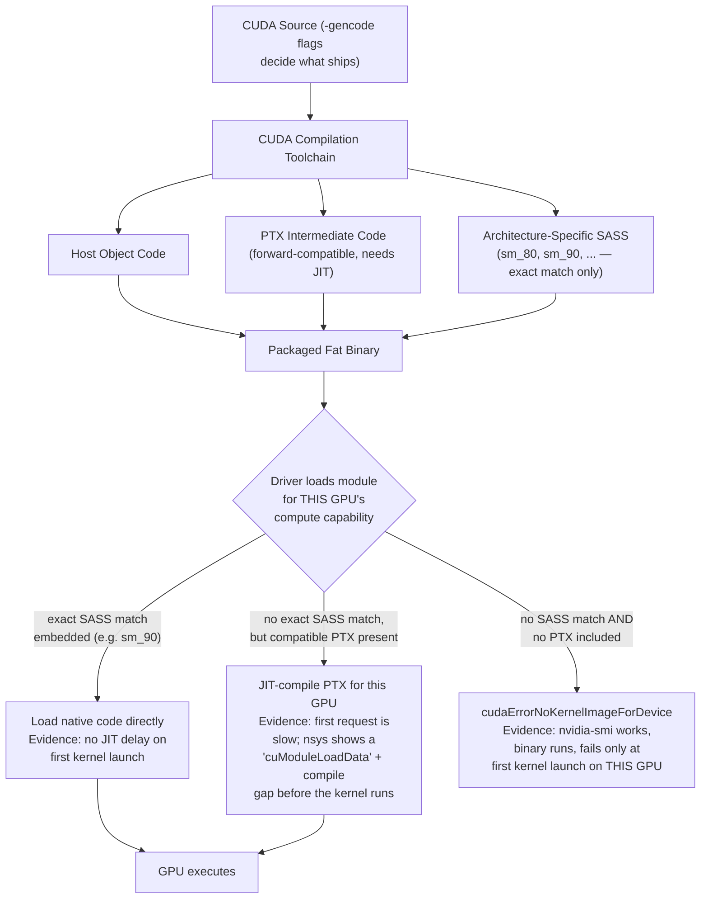
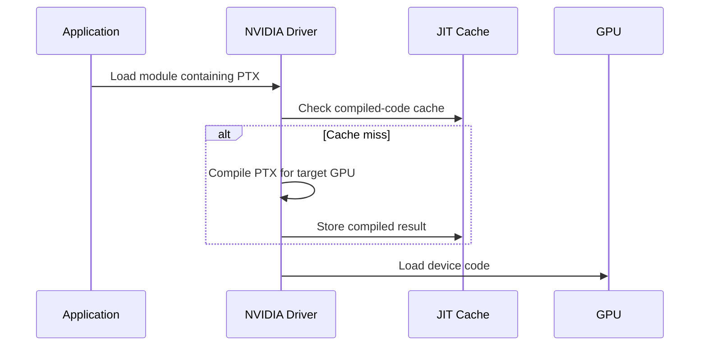
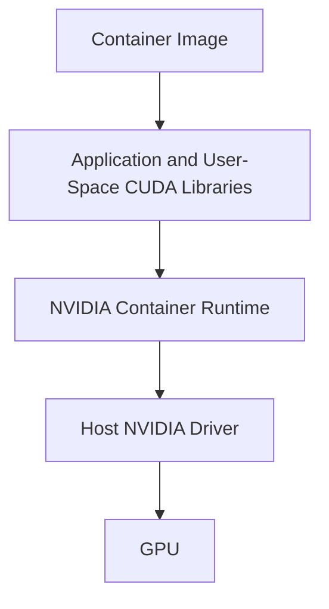

# Compilation, Binaries, and Compatibility

## Introduction

A CUDA application can compile successfully and still fail when deployed to a different GPU, driver, operating system, or container image. The reason is that CUDA delivery crosses several compatibility boundaries: source code becomes intermediate and machine code, libraries are selected at build and runtime, and the installed driver must execute the resulting device program.

Infrastructure engineers do not need to memorize compiler switches. They do need a reliable mental model for answering four questions: What was built? Which GPU architectures does it target? Which libraries are loaded? Can the installed driver execute it?

| Chapter field | Value |
|---|---|
| Volume | 03 — CUDA Fundamentals |
| Difficulty | Intermediate |
| Estimated reading time | 50 minutes |
| Primary focus | Build artifacts, GPU targets, runtime loading, and deployment compatibility |
| Previous | CUDA Graphs and Repeated Execution |
| Next | Profiling and Production Troubleshooting |

## Story

A container passes testing on one GPU generation and fails on a newer production node with an error indicating that no suitable kernel image is available. The team initially suspects Kubernetes device exposure because `nvidia-smi` works.

Inspection shows that the application was built with machine code for only one architecture and without a compatible PTX fallback. The container sees the GPU and driver correctly; the device program simply cannot be loaded for that target.

The incident is a build-governance failure, not a cluster failure.

## Learning Objectives

After completing this chapter, you will be able to:

- Explain the roles of host code, device code, PTX, and architecture-specific machine code.
- Describe why applications package multiple GPU targets.
- Explain just-in-time compilation conceptually.
- Distinguish toolkit, runtime-library, and driver compatibility questions.
- Inspect binaries and loaded libraries during deployment diagnosis.
- Design a production build and validation matrix.

## Big Picture



**Figure 3.11.1 — CUDA build and load path as a compatibility decision at load time, not just a build-time diagram.** The three outcomes at the bottom map directly onto this chapter's three most common production symptoms — silent fast path, silently slow first request, and a hard failure — each tagged with the specific evidence (or absence of a JIT delay) that tells them apart.

## Host and Device Compilation

CUDA source can contain code intended for the CPU and code intended for the GPU. The toolchain separates and compiles these paths, then packages the results into an application or library.

The host compiler produces normal CPU objects. The CUDA toolchain produces device artifacts and metadata used at runtime.

This separation explains why a binary can start normally, parse configuration, and fail only when the first GPU kernel is loaded or launched.

## PTX

PTX is a virtual instruction-set representation used as an intermediate form in the CUDA toolchain. It is not the final native instruction stream executed by the GPU.

When compatible PTX is included, the installed driver may just-in-time compile it into device-specific machine code for the target GPU.

PTX improves forward deployment flexibility, but it introduces considerations:

- First-use compilation latency
- Driver support for the PTX version
- Cache behavior
- Differences between ahead-of-time and JIT-generated code
- Operational need to warm workloads before measuring latency

## Architecture-Specific Code

Ahead-of-time device code targets a particular compute capability or architecture family. It can avoid JIT work and provide predictable startup, but it runs only on compatible targets.

A production artifact often contains multiple target images, sometimes called a fat binary.

| Packaging strategy | Advantage | Trade-off |
|---|---|---|
| One architecture target | Small artifact, simple validation | Narrow hardware compatibility |
| Multiple native targets | Predictable startup across known fleet | Larger artifact and build matrix |
| Native targets plus PTX | Broad compatibility and fallback | JIT latency and additional validation |

The correct policy follows the supported GPU fleet and rollout strategy.

## Compute Capability as a Contract

Compute capability identifies a GPU architecture's programming features and instruction support at a useful abstraction level. It helps the build system select device targets and helps the runtime determine whether an image is compatible.

Do not use compute capability as a complete performance description. Two GPUs with related capability can differ substantially in SM count, memory capacity, bandwidth, clocks, topology, and specialized units.

## Just-in-Time Compilation



**Figure 3.11.2 — Simplified JIT path.** PTX may be compiled at module load, with the result cached for later use.

A read-only filesystem, small cache, ephemeral container storage, or frequent image changes can cause repeated JIT work. Startup latency should therefore be observed, not assumed.

## Toolkit, Libraries, and Driver

The word “CUDA version” is often ambiguous.

| Layer | Example question |
|---|---|
| Build toolkit | Which compiler and headers produced the artifact? |
| Runtime libraries | Which shared libraries are packaged or mounted? |
| Framework build | Which CUDA support was the framework built against? |
| NVIDIA driver | Can the host driver support the required runtime and PTX behavior? |
| GPU architecture | Does the binary include compatible device code? |

`nvidia-smi` may display a CUDA compatibility value associated with the driver. It does not prove that a complete toolkit is installed inside the host or container.

## Dynamic Libraries

Applications may load CUDA runtime libraries and domain libraries dynamically. Problems include:

- Missing libraries
- Wrong library search path
- Host libraries overriding container libraries
- Incompatible library combinations
- Framework plugin loading a different build than expected

Useful inspection commands include:

```bash
ldd ./application
readelf -d ./application
ldconfig -p | grep -i cuda
```

Inside a container, inspect the container's namespace rather than assuming host paths apply.

## Container Compatibility

A common container model packages user-space CUDA libraries while the host supplies the kernel driver and selected driver-facing components through the NVIDIA container runtime.



**Figure 3.11.3 — Container compatibility boundary.** The image and host driver must form a supported execution path; bundling a kernel driver inside the image does not replace the host driver.

## Build Matrix Design

A mature CUDA project defines:

- Supported GPU generations
- Minimum driver branch or capability policy
- Toolkit used for each release
- Native architecture targets
- PTX fallback policy
- Supported operating systems and CPU architectures
- Framework and library versions
- Container base image
- Test hardware for each supported class

The matrix should be version-controlled and validated in CI or release qualification.

## Reproducibility

Record:

- Compiler version
- Build command or build-system configuration
- Source revision
- Container image digest
- Target architecture flags
- Library versions
- Link mode
- Release and debug variants

Without this evidence, a compatibility incident becomes guesswork.

## Architecture Trade-offs

### Broad binary versus small binary

Supporting many native targets increases artifact size and build time. Supporting too few targets increases deployment risk.

### PTX fallback versus startup predictability

PTX increases forward flexibility but may introduce JIT delay. Latency-sensitive services often warm the graph or module before accepting traffic.

### Bundled libraries versus platform-provided libraries

Bundling improves reproducibility. Platform integration may reduce image size and centralize updates. Mixing the two without a documented boundary is dangerous.

## Production Troubleshooting

### Problem: No suitable kernel image

**Diagnosis**

1. Identify the GPU and compute capability.
2. Inspect the binary's embedded targets using appropriate CUDA binary tools.
3. Confirm whether PTX is included.
4. Verify the host driver supports the artifact's requirements.
5. Reproduce on the failing GPU class.

**Evidence — reproducing this chapter's Story exactly:**

```text
$ nvidia-smi --query-gpu=name,compute_cap --format=csv
name, compute_cap
NVIDIA H100 80GB HBM3, 9.0

$ cuobjdump --list-elf ./inference_engine | grep -i sm_
	arch = sm_80
	arch = sm_86
```

The binary embeds native SASS for `sm_80` (A100) and `sm_86` (A10/A40) — nothing for `sm_90` (H100) — and:

```text
$ cuobjdump --list-ptx ./inference_engine
(no output)
```

No PTX fallback is embedded either. The application call:

```text
>>> engine.run(batch)
RuntimeError: CUDA error: no kernel image is available for execution on the device
```

This is the diagnosis in one sequence: `nvidia-smi` proves the H100 is healthy and driver-visible (compute capability 9.0 reported correctly), `cuobjdump` proves the binary simply never shipped code this GPU can run, native or JIT-able — confirming this is a build-matrix gap, not a Kubernetes or driver incident, exactly as the chapter's opening Story concludes.

### Problem: First request is slow

Check for module load, JIT compilation, library initialization, context creation, and cache persistence. Warm-up should be explicit and monitored.

**Evidence — a PTX-only build's cold start:**

```text
$ ./inference_engine --request-count=5
request 1: 2,340.6 ms   <- JIT compiling PTX for this GPU, first module load
request 2: 12.8 ms
request 3: 11.4 ms
request 4: 11.9 ms
request 5: 12.1 ms
```

Request 1 is roughly 190x slower than steady state. In a build that ships only PTX (no matching native SASS for this GPU), that gap is JIT compilation happening synchronously on the first module load — confirm with `CUDA_CACHE_DISABLE=0` and checking whether `~/.nv/ComputeCache` (or the configured JIT cache path) is writable and persistent; an ephemeral or read-only container filesystem forces this cost to repeat on every pod restart instead of being paid once.

### Problem: Works on host, fails in container

Compare loaded libraries, device exposure, container-runtime configuration, image architecture, and host-driver compatibility. Do not compare only `nvidia-smi` output.

### Problem: Behavior changed after base-image update

Resolve the image by digest, compare library manifests, and verify that search paths did not select a new runtime or domain library.

**Evidence — comparing library manifests across the update:**

```text
$ diff <(ldd ./inference_engine | sort) reports/pre-update-ldd.txt
< 	libcudart.so.12 => /usr/local/cuda-12.4/lib64/libcudart.so.12
---
> 	libcudart.so.12 => /usr/local/cuda-12.6/lib64/libcudart.so.12
```

The base-image update changed which `libcudart.so.12` the dynamic linker resolves — same major version string, different point release, potentially different default algorithm selection or bug fixes inside a library the application never explicitly pinned. Resolving the image by digest and diffing `ldd` output against a saved pre-update baseline turns "behavior changed, no idea why" into a one-line, attributable cause.

## Customer Scenario

A customer operates mixed GPU generations during a rolling hardware refresh. They need one application release to run across both groups.

The architect defines native targets for the current fleet, includes a tested PTX fallback for the planned generation, warms each workload at startup, and validates the exact container digest on every hardware class before rollout. Compatibility becomes a release property rather than an incident-time discovery.

## Interview Preparation

### Conceptual Questions

1. **What is the difference between PTX and native device code?**
   "Native device code — SASS — is the actual machine instructions for one specific GPU architecture; it runs immediately with no extra compilation step, but only on GPUs that architecture target covers. PTX is a virtual, forward-compatible intermediate representation — the installed driver can JIT-compile it into native code for whatever GPU it's actually running on, including architectures newer than the PTX was generated against. The trade is upfront predictability versus flexibility: native code is fast to start but narrow, PTX is broad but pays a JIT cost on first load unless that's been warmed and cached."

2. **Why can an application fail only at the first kernel launch?**
   "Because everything before that — process start, argument parsing, even framework import and device enumeration — can succeed without the driver ever needing to actually load a device-code module. It's only when a kernel genuinely needs to execute that the driver looks for a compatible SASS image or PTX to JIT, and that's the first point an architecture mismatch becomes visible. Host-side success is not evidence about device-code compatibility at all — they're checked at completely different times."

3. **What does a fat binary contain conceptually?**
   "Multiple device-code images bundled into one artifact — potentially several native SASS targets for different specific architectures, plus optionally a PTX fallback for forward compatibility — alongside the regular host object code. At load time the driver picks whichever embedded image best matches the actual GPU: an exact native match if present, or JIT-compiles the PTX if not, or fails if neither exists. It's the packaging strategy that lets one build serve a mixed GPU fleet."

### Architecture Questions

1. **Draw the path from CUDA source to GPU execution.**
   "Source goes into the CUDA toolchain, which splits into host object code on one path and device code on the other — device code compiles to both PTX and one or more native SASS targets depending on the build flags. All of that packages into a fat binary. At runtime, the binary loads, and the installed driver picks the matching native SASS if it's there, or JIT-compiles the PTX if not, then hands the resulting code to the GPU. I'd specifically mark the load-time decision point as where compatibility either holds or breaks — everything before it is just packaging."

2. **Design a build matrix for three GPU generations.**
   "I'd list the three architectures explicitly — say Ampere, Hopper, and whatever's next — decide native SASS targets for the currently-deployed two, and include PTX for forward compatibility toward the third, planned generation. I'd pin a toolkit version and minimum driver policy per release, define which operating systems and container base images are supported, and require CI to actually build and smoke-test against representative hardware for every listed generation before a release ships — not just compile successfully."

3. **Explain the compatibility boundary between a CUDA container and the host driver.**
   "The container packages the application, its device-code binary, and usually the CUDA user-space libraries it was built against. The host supplies the kernel driver and whatever driver-facing components the container runtime integration exposes. The boundary is: the container's user-space CUDA version and the binary's device-code targets have to be compatible with what the host driver can actually support — and no amount of bundling inside the container image changes what kernel driver is running underneath it, because that's a host-level, not container-level, fact."

### Scenario Questions

1. **`nvidia-smi` works, but the app reports no suitable kernel image. Why?**
   "`nvidia-smi` only proves the driver can talk to the hardware — it says nothing about whether the application binary includes device code for that specific GPU's architecture. The likely cause is a build that shipped native SASS for older or different architectures with no PTX fallback, so when it hits a GPU generation it was never compiled for, there's simply nothing loadable. I'd confirm with `cuobjdump --list-elf` and `--list-ptx` on the binary and compare against the GPU's actual compute capability from `nvidia-smi`."

2. **Every pod restart causes a long first request. What do you inspect?**
   "Whether the deployment relies on PTX and pays JIT compilation cost on every cold start, and specifically whether the JIT cache is actually persisting across restarts — an ephemeral container filesystem or a fresh writable layer on every restart means the compiled-code cache never survives, so every restart replays the full JIT cost. I'd check the cache path's persistence and consider whether a native target for this fleet's actual hardware would remove the JIT dependency entirely, or add an explicit warm-up step before the pod accepts traffic."

3. **The same image loads different CUDA libraries on two hosts. How can that happen?**
   "If the image relies on library resolution rather than fully bundling and pinning its dependencies, the dynamic linker's search path can pick up a different library version mounted or installed differently on each host — especially if host paths leak into the container's resolution order. I'd diff `ldd` output between the two hosts to confirm exactly which library differs, then decide whether to bundle that dependency explicitly inside the image or standardize the host-side version across the fleet, rather than relying on both hosts happening to agree."

## Summary

CUDA deployment artifacts combine CPU code, device code, libraries, and metadata. Device code may be packaged as native architecture targets, PTX, or both. At runtime, the installed driver loads or compiles that code for the target GPU.

Compatibility must be designed across toolkit, libraries, driver, container runtime, and GPU architecture. A tested build matrix is more reliable than a vague statement that two systems “use CUDA 12.”

## Key Takeaways

- Host startup success does not prove device-code compatibility.
- PTX is an intermediate representation, not final GPU machine code.
- Native targets improve startup predictability but narrow compatibility.
- Containers rely on the host NVIDIA driver.
- Library resolution is part of the compatibility chain.
- Release qualification must cover every supported GPU class.

## Cross References

- Previous: [CUDA Graphs and Repeated Execution](./chapter-10-cuda-graphs-and-repeated-execution)
- Next: [Profiling and Production Troubleshooting](./chapter-12-profiling-and-production-troubleshooting)
- Related lab: [Profile and Diagnose a CUDA Application](./labs/lab-04-profile-and-diagnose-a-cuda-application)
