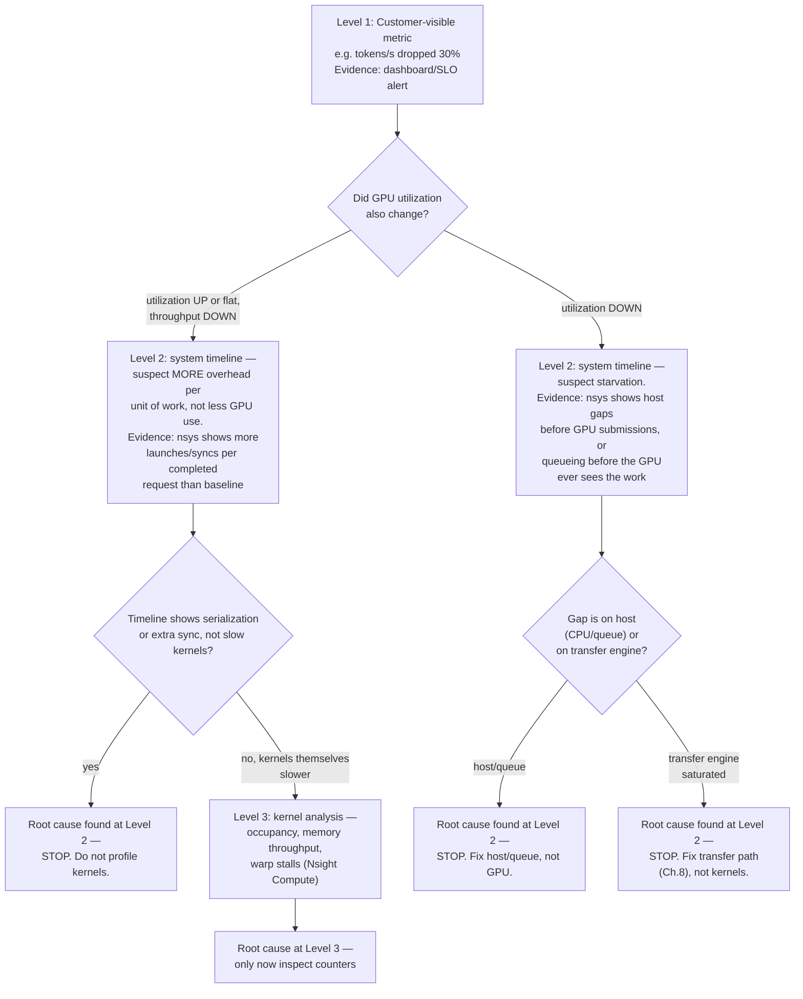
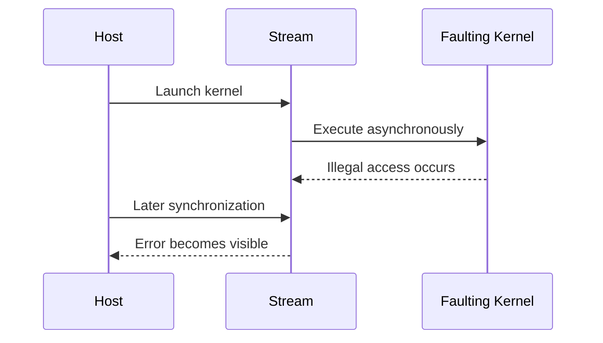
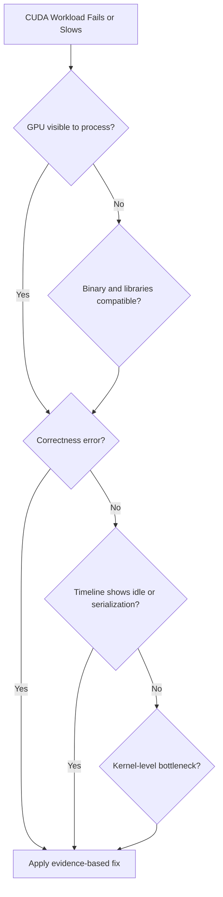
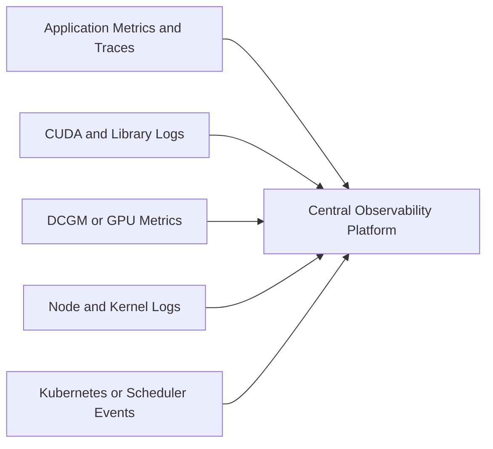

# Profiling and Production Troubleshooting

## Introduction

CUDA incidents often begin with a vague symptom: the GPU is slow, utilization is low, memory is exhausted, or the first request fails. Those symptoms do not identify the faulty layer.

A productive investigation moves from end-to-end behavior toward increasingly specific evidence. It first separates queueing, host work, transfer, kernel execution, synchronization, and external dependencies. Only then does it inspect individual kernels or low-level counters.

Profiling is therefore not a final optimization step. It is the method used to prevent infrastructure, application, and model teams from changing unrelated components based on intuition.

| Chapter field | Value |
|---|---|
| Volume | 03 — CUDA Fundamentals |
| Difficulty | Advanced |
| Estimated reading time | 60 minutes |
| Primary focus | Measurement hierarchy, incident diagnosis, and operational evidence |
| Previous | Compilation, Binaries, and Compatibility |
| Next | Volume 03 Summary |

## Story

A training job becomes 25 percent slower after a routine platform update. GPU utilization remains high, so the operations team concludes that the GPU is healthy. Application engineers blame storage.

A system timeline shows that kernel execution time is unchanged. The slowdown comes from additional synchronization between input preparation and device submission. A library update changed the pipeline's execution behavior without changing the model or GPU counters significantly.

The incident is resolved only after the teams compare the full timeline before and after the update.

## Learning Objectives

After completing this chapter, you will be able to:

- Build a layered CUDA profiling workflow.
- Distinguish end-to-end, system-timeline, and kernel-level analysis.
- Explain why utilization alone is insufficient.
- Identify asynchronous error propagation.
- Collect a minimum incident evidence bundle.
- Diagnose common CUDA deployment and performance failures.
- Define production baselines and regression gates.

## Big Picture



**Figure 3.12.1 — Profiling funnel as a decision tree with explicit stop conditions.** The chapter's central warning — "do not begin at Level 3 when the timeline already shows large host gaps" — is now an enforced branch: three of the four paths terminate at Level 2 with a named fix, and only the fourth genuinely requires kernel-level counters. This mirrors the Customer Scenario below, where higher utilization masked more overhead, not better GPU use.

## Why Utilization Is Not a Diagnosis

A utilization sample indicates that the GPU was active during part of an interval. It does not explain whether the active work was useful, efficient, memory-bound, stalled, or serving the correct workload.

| Observation | Possible interpretation |
|---|---|
| Low utilization | Input starvation, small batches, synchronization, idle demand, or short kernels |
| High utilization | Useful compute, memory stalls, inefficient kernels, or oversubscribed service |
| High memory use | Model weights, activations, cache, fragmentation, leak, or reserved allocator pool |
| High power | Sustained execution, but not necessarily good throughput |
| Low power during latency | Waiting on host, memory, dependency, or throttled workload |

Always connect device metrics to completed work and latency.

## Three Profiling Levels

### Level 1 — End-to-End Measurement

Measure what the customer or service cares about:

- Requests per second
- Samples or tokens per second
- Training step time
- Time to first token
- P50, P95, and P99 latency
- Cost per completed unit
- Error and timeout rate

Use representative data, warm-up policy, and fixed concurrency.

### Level 2 — System Timeline

A system timeline shows:

- CPU threads
- CUDA API calls
- Streams
- Memory copies
- Kernel launches
- Synchronization
- Library activity
- Network or storage markers where integrated

This level answers whether the GPU is starved, serialized, or waiting.

### Level 3 — Kernel Analysis

Kernel-level profiling examines:

- Duration and launch count
- Occupancy and resource use
- Memory throughput
- Cache behavior
- Warp issue and stall reasons
- Branch efficiency
- Instruction mix
- Tensor Core eligibility or use where relevant

Do not begin here when the timeline already shows large host gaps.

## Establishing a Baseline

A baseline must record more than one runtime number.

| Category | Baseline evidence |
|---|---|
| Workload | Model, input shape, batch, sequence length, concurrency |
| Software | Image digest, framework, libraries, compiler, source revision |
| Platform | GPU model, driver, firmware, CPU, NUMA, runtime |
| Performance | Throughput, latency percentiles, transfer and kernel time |
| Resource | Power, memory, utilization, clocks, temperature |
| Topology | PCIe, NVLink, NUMA, peer path |

A baseline without workload identity cannot support regression analysis.

## Measurement Hygiene

Before comparing runs:

- Warm up context creation, library initialization, JIT, and caches.
- Fix input dimensions and concurrency.
- Record clock and power policies.
- Avoid unrelated workloads on the device.
- Repeat enough iterations to expose variance.
- Separate cold-start and steady-state results.
- Synchronize only where the measurement requires completion.
- Report distributions rather than one best result.

## Asynchronous Error Propagation

Many CUDA operations return before device execution completes. An illegal memory access in one kernel may surface at a later synchronization or API call.



**Figure 3.12.2 — Deferred error visibility.** The API call reporting an error may not be the operation that caused it.

For diagnosis, record the last successful operation and temporarily introduce narrow synchronization boundaries. Remove broad debug synchronization after the fault is located.

## Minimum Incident Evidence Bundle

Collect before restarting or replacing the node when safe:

1. Exact timestamp and workload identity
2. Container image digest and command
3. GPU inventory and driver version
4. `nvidia-smi -q` output
5. Application logs with complete CUDA error text
6. Kernel logs for NVIDIA XID or driver events
7. Kubernetes Pod, node, and event details where applicable
8. Reproduction input or shape class
9. Recent software, driver, firmware, or configuration changes
10. Timeline or profile from a representative failing run

Evidence should be sanitized before sharing externally.

## Troubleshooting Decision Flow



**Figure 3.12.3 — Investigation order.** Validate visibility and correctness before spending time on micro-optimization.

## Common Failure: No CUDA Device

### Symptoms

- Framework reports zero GPUs
- `cudaGetDeviceCount` fails
- GPU works on host but not in container

### Diagnosis

- Run `nvidia-smi` in the same execution context.
- Inspect device nodes and container runtime configuration.
- Check environment variables that filter visible devices.
- Verify permissions, runtime class, and scheduler allocation.
- Compare user-space libraries inside the container.

**Evidence — the exact same-context comparison, host versus pod:**

```text
$ nvidia-smi -L
GPU 0: NVIDIA A100-SXM4-40GB (UUID: GPU-3f9a1c...)

$ kubectl exec -it inference-pod-7c9 -- nvidia-smi -L
Failed to initialize NVML: Unknown Error
```

`Unknown Error` from NVML inside the pod, while the host enumerates the GPU cleanly, is the specific fingerprint of a container-runtime/device-injection gap rather than a driver problem — check next:

```text
$ kubectl exec -it inference-pod-7c9 -- env | grep NVIDIA_VISIBLE_DEVICES
NVIDIA_VISIBLE_DEVICES=

$ kubectl describe pod inference-pod-7c9 | grep -A3 Limits
Limits:
  cpu:     4
  memory:  16Gi
  # note: no nvidia.com/gpu limit present
```

Two findings in one pass: `NVIDIA_VISIBLE_DEVICES` is empty (silently filters every device), and the Pod spec never actually requested `nvidia.com/gpu` — the GPU Operator's device plugin never had a reason to inject anything. This is a scheduling/manifest defect, not a driver or NVML defect, and no driver reinstall would touch it.

### Root Causes

- GPU not assigned to the workload
- NVIDIA container runtime not active
- Device visibility filter
- Driver initialization failure
- Incompatible or missing user-space library

## Common Failure: Out of Memory

### Symptoms

- Allocation failure
- Framework OOM exception
- Process killed after memory pressure

### Diagnosis

Separate:

- Allocated memory
- Reserved allocator pools
- Fragmentation
- Model weights
- Activations
- KV cache
- Temporary workspace
- Other processes on the device

An OOM does not prove total memory is physically full; the allocator may be unable to satisfy one contiguous request or configured limit.

**Evidence — reading `nvidia-smi -q` memory section against a framework's own allocator summary:**

```text
$ nvidia-smi -q -d MEMORY | grep -A4 "FB Memory Usage"
FB Memory Usage
    Total                            : 40960 MiB
    Reserved                         : 405 MiB
    Used                             : 38660 MiB
    Free                             : 1895 MiB
```

`1895 MiB` free looks tight but nonzero — yet the very next allocation can still fail:

```text
>>> torch.cuda.memory_summary()
|      Requested   |  |  |  |
|      Allocated   |  38112 MiB  |  ...
|      Reserved but unallocated |  1240 MiB (fragmented across 340 blocks)
|===========================================================================|
RuntimeError: CUDA out of memory. Tried to allocate 512.00 MiB
```

The framework's own summary shows 1,240 MiB reserved-but-unallocated, fragmented across 340 small blocks — none of which is a single contiguous 512 MiB span. `nvidia-smi`'s device-wide `Free` number and the allocator's *usable contiguous* free space are two different quantities; treating the first as proof the second exists is exactly the trap this row warns against.

## Common Failure: Illegal Memory Access

### Symptoms

- Error appears at synchronization
- Later CUDA calls fail
- Process may require context restart

### Diagnosis

- Reproduce with debug synchronization.
- Use memory-checking tools appropriate to the build.
- Validate grid bounds and pointer lifetimes.
- Check stream ownership and asynchronous reuse.
- Compare release and debug builds.

**Evidence — `compute-sanitizer` pinpointing the exact faulting line, versus the vague production error:**

```text
$ ./inference_engine 2>&1 | tail -2
CUDA error: an illegal memory access was encountered (at synchronization)
```

That alone only tells you *that* something faulted, not *what*. Re-run the same binary under the sanitizer to get a precise answer:

```text
$ compute-sanitizer --tool=memcheck ./inference_engine
========= Invalid __global__ write of size 4 bytes
=========     at scale_kernel(float*, int, float)+0x50 in scale.cu:14
=========     by thread (287,0,0) in block (3906,0,0)
=========     Address 0x7f2a1c003c9c is out of bounds
=========     Device Frame: scale_kernel
```

`thread (287,0,0) in block (3906,0,0)` with `blockDim.x=256` computes global index `3906*256+287 = 1,000,223` — past an array sized for `1,000,003` elements. This is the same underfilled-bounds-check defect from Chapter 4, now caught with a tool that names the exact kernel, line, and offending thread instead of forcing a manual bisection through synchronization points.

After a severe device error, continuing to trust the context can produce misleading secondary failures.

## Common Failure: Slow Transfers

Inspect:

- Transfer size and count
- Pageable versus pinned memory
- NUMA placement
- PCIe link state
- Peer path
- Hidden staging
- Copy-compute overlap
- Redundant round trips

Do not compare achieved bandwidth with peak link bandwidth unless direction, protocol overhead, payload size, and topology are understood.

## Common Failure: Low GPU Utilization

A practical sequence is:

1. Confirm demand exists.
2. Measure host queueing.
3. Inspect CPU preprocessing.
4. Inspect transfer gaps.
5. Check stream synchronization.
6. Check batch size and launch count.
7. Inspect kernel duration and grid scale.
8. Inspect memory and execution bottlenecks.

Adding GPUs before this analysis often multiplies idle capacity.

## Common Failure: High Utilization, Low Throughput

This pattern may indicate:

- Memory-bound kernels
- Excess recomputation
- Divergence
- Inefficient precision or algorithm
- Contention between tenants
- Thermal or power limits
- Frequent retries or discarded work

Normalize throughput by workload unit and compare kernel composition.

## Production Regression Gates

Release qualification should include:

- Functional correctness tests
- Representative GPU classes
- Cold-start and steady-state measurement
- Latency and throughput thresholds
- Memory ceiling
- Error-free stress duration
- Profile comparison for critical paths
- Compatibility verification
- Rollback criteria

A statistically noisy benchmark should not block releases without a defined tolerance and repeat policy.

## Observability Architecture



**Figure 3.12.4 — Correlated evidence.** GPU metrics become useful when aligned with application, node, and platform timelines.

## Customer Scenario

A customer reports that a model upgrade reduced throughput. GPU utilization increased, so they assume the new model uses the hardware better.

A baseline comparison shows more kernel launches, smaller average kernel duration, increased synchronization, and lower completed requests per joule. The higher utilization reflects overhead, not value. The recommended action is to profile the new execution graph, fuse or batch suitable work, and restore a release gate based on completed requests.

## Interview Preparation

### Conceptual Questions

1. **Why is GPU utilization not a performance diagnosis?**
   "Because it only tells you the SMs were active during some fraction of the sampling window — it says nothing about whether that activity was useful compute, a memory-bound stall pattern, retried work, or a kernel serving the wrong shape of request. I've personally seen a case where utilization went up after a regression and throughput went down at the same time, because the new code issued more, smaller kernels — more busy-looking activity, less actual work per unit time. Utilization is a clue that something is happening on the device, not a verdict on whether it's the right thing."

2. **What is the difference between a system timeline and kernel profiling?**
   "A system timeline — what Nsight Systems gives you — shows the whole picture across time: CPU threads, CUDA API calls, streams, copies, kernel launches, all correlated together, and it answers whether the GPU is starved, serialized, or waiting on something else. Kernel profiling — Nsight Compute — goes deep into one specific kernel's occupancy, memory throughput, and warp-stall reasons. I always start with the system timeline, because if it shows large host gaps or serialization, the kernel is innocent and profiling it in detail is wasted effort."

3. **Why can a CUDA error surface after the operation that caused it?**
   "Because most CUDA work is asynchronous — a kernel or copy can fault on the device well after the host has moved on to issue more calls, and the runtime only reports that fault at the next point the host actually synchronizes or queries status. So the API call attached to the error message is frequently just a messenger, not the culprit, and I always ask 'what was still outstanding on the device when this call ran' before I trust the error's apparent location."

### Architecture Questions

1. **Design a profiling workflow for a slow inference service.**
   "Start at Level 1 with the customer-visible number — tokens per second, P95 latency, whatever the SLO actually is — and establish a clean baseline with fixed input shape and concurrency. Then Level 2: capture a system timeline and look specifically for host gaps, serialization, and where time is actually spent between submission and completion. Only if that timeline points at a specific kernel do I drop to Level 3 and profile that kernel's occupancy and memory behavior. I'd refuse to skip straight to kernel counters just because that's the most 'technical-sounding' step — it's usually the least efficient place to start."

2. **Define the evidence bundle for a CUDA incident.**
   "Exact timestamp and workload identity, the container image digest and launch command, GPU inventory and driver version, a fresh `nvidia-smi -q` snapshot, the complete application error text — not a truncated summary — kernel logs for XID events, the relevant Kubernetes Pod and node state if it's orchestrated, a reproduction input or shape class, and a timeline from a representative failing run. I collect this before any disruptive recovery action, because restarting the pod or resetting the GPU can destroy the only evidence that explains what actually happened."

3. **Explain how application traces and GPU metrics should be correlated.**
   "By timestamp and request identity, in one observability platform, not as separate dashboards someone has to mentally align. Application traces tell me what the service was doing — which request, what shape, what stage. GPU metrics from DCGM or `nvidia-smi` tell me the device's state at that same moment. Neither one alone answers 'was this specific slow request actually starved for GPU resources' — I need both stitched together by time and, ideally, by a shared trace ID, to answer that."

### Scenario Questions

1. **High utilization accompanies lower throughput. What do you investigate?**
   "I don't trust the utilization number as a sign of health — I go straight to a baseline comparison: kernel count and average duration before and after, synchronization frequency, and completed-work-per-joule or per-second. In the pattern this chapter describes, higher utilization actually reflected *more overhead* — more, smaller kernel launches and more synchronization — not better GPU use. I'd look for exactly that signature: more launches, shorter average kernel duration, same or higher utilization, fewer completed requests."

2. **An illegal access appears at a copy call. Why might the copy be innocent?**
   "Because CUDA operations execute asynchronously, and the copy call is very often just the first point where the host actually synchronizes with the device after an earlier kernel already faulted — the runtime reports the pending error at that synchronization point, not at its true origin. I'd bisect backward with temporary `cudaDeviceSynchronize()` calls between the copy and the kernels that ran before it, or just run the whole thing under `compute-sanitizer` once to get the actual faulting kernel and line directly instead of guessing."

3. **A release is slow only on one GPU generation. How do you separate compatibility and performance?**
   "First I check whether the binary even runs its intended code path on that generation — a missing native target forcing JIT compilation, or worse, silently falling back to a less-optimized kernel variant, would look like a 'performance' regression but is actually a compatibility and build-matrix issue. Only once I've confirmed the same code path executes on both generations do I treat it as a genuine performance question and start comparing kernel occupancy, memory bandwidth, and architecture-specific resource limits between the two."

## Summary

CUDA profiling should move from customer-visible outcomes to system timelines and then to kernel detail. This order prevents teams from optimizing the wrong layer.

Production troubleshooting depends on reproducible workload identity, version evidence, topology, logs, metrics, and timelines. The objective is not merely to find a slow kernel. It is to explain why the complete system misses its reliability or performance target.

## Key Takeaways

- Start with throughput, latency, and correctness.
- Use timelines to find idle gaps and serialization.
- Use kernel metrics only after locating the responsible work.
- Treat asynchronous errors as deferred evidence.
- Preserve incident data before disruptive recovery.
- Build performance and compatibility checks into release qualification.

## Cross References

- Previous: [Compilation, Binaries, and Compatibility](./chapter-11-compilation-binaries-and-compatibility)
- Next: [Volume 03 Summary](./chapter-13-volume-03-summary)
- Related lab: [Profile and Diagnose a CUDA Application](./labs/lab-04-profile-and-diagnose-a-cuda-application)
