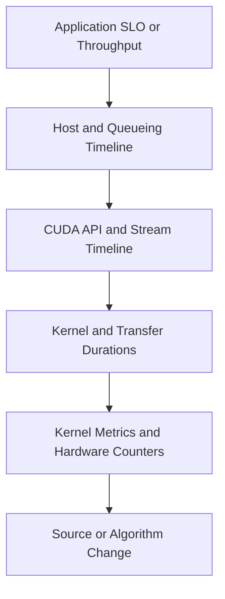
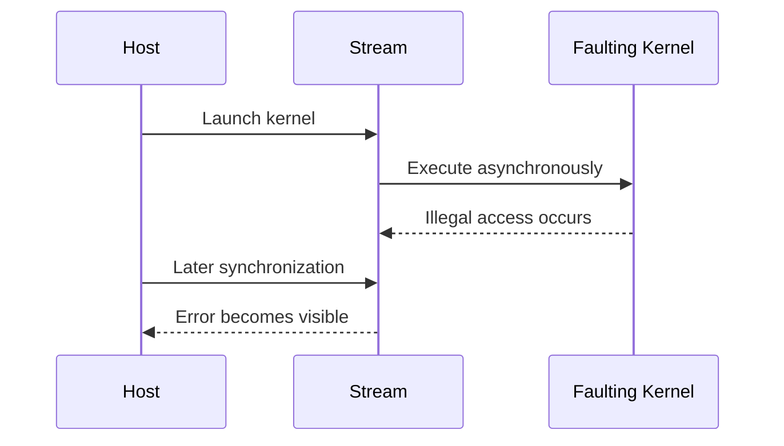
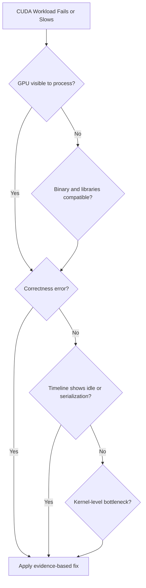
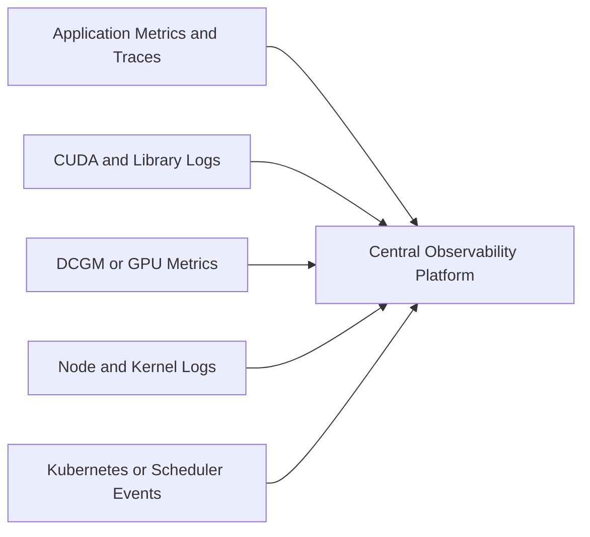

# Profiling and Production Troubleshooting

## Introduction

CUDA incidents often begin with a vague symptom: the GPU is slow, utilization is low, memory is exhausted, or the first request fails. Those symptoms do not identify the faulty layer.

A productive investigation moves from end-to-end behavior toward increasingly specific evidence. It first separates queueing, host work, transfer, kernel execution, synchronization, and external dependencies. Only then does it inspect individual kernels or low-level counters.

Profiling is therefore not a final optimization step. It is the method used to prevent infrastructure, application, and model teams from changing unrelated components based on intuition.

| Chapter field | Value |
|---|---|
| Volume | 03 — CUDA Fundamentals |
| Difficulty | Advanced |
| Estimated reading time | 60 minutes |
| Primary focus | Measurement hierarchy, incident diagnosis, and operational evidence |
| Previous | Compilation, Binaries, and Compatibility |
| Next | Volume 03 Summary |

## Story

A training job becomes 25 percent slower after a routine platform update. GPU utilization remains high, so the operations team concludes that the GPU is healthy. Application engineers blame storage.

A system timeline shows that kernel execution time is unchanged. The slowdown comes from additional synchronization between input preparation and device submission. A library update changed the pipeline's execution behavior without changing the model or GPU counters significantly.

The incident is resolved only after the teams compare the full timeline before and after the update.

## Learning Objectives

After completing this chapter, you will be able to:

- Build a layered CUDA profiling workflow.
- Distinguish end-to-end, system-timeline, and kernel-level analysis.
- Explain why utilization alone is insufficient.
- Identify asynchronous error propagation.
- Collect a minimum incident evidence bundle.
- Diagnose common CUDA deployment and performance failures.
- Define production baselines and regression gates.

## Big Picture

**Figure 3.12.1 — Profiling funnel.** Begin with the user-visible objective and narrow only when evidence identifies the responsible layer.

## Why Utilization Is Not a Diagnosis

A utilization sample indicates that the GPU was active during part of an interval. It does not explain whether the active work was useful, efficient, memory-bound, stalled, or serving the correct workload.

| Observation | Possible interpretation |
|---|---|
| Low utilization | Input starvation, small batches, synchronization, idle demand, or short kernels |
| High utilization | Useful compute, memory stalls, inefficient kernels, or oversubscribed service |
| High memory use | Model weights, activations, cache, fragmentation, leak, or reserved allocator pool |
| High power | Sustained execution, but not necessarily good throughput |
| Low power during latency | Waiting on host, memory, dependency, or throttled workload |

Always connect device metrics to completed work and latency.

## Three Profiling Levels

### Level 1 — End-to-End Measurement

Measure what the customer or service cares about:

- Requests per second
- Samples or tokens per second
- Training step time
- Time to first token
- P50, P95, and P99 latency
- Cost per completed unit
- Error and timeout rate

Use representative data, warm-up policy, and fixed concurrency.

### Level 2 — System Timeline

A system timeline shows:

- CPU threads
- CUDA API calls
- Streams
- Memory copies
- Kernel launches
- Synchronization
- Library activity
- Network or storage markers where integrated

This level answers whether the GPU is starved, serialized, or waiting.

### Level 3 — Kernel Analysis

Kernel-level profiling examines:

- Duration and launch count
- Occupancy and resource use
- Memory throughput
- Cache behavior
- Warp issue and stall reasons
- Branch efficiency
- Instruction mix
- Tensor Core eligibility or use where relevant

Do not begin here when the timeline already shows large host gaps.

## Establishing a Baseline

A baseline must record more than one runtime number.

| Category | Baseline evidence |
|---|---|
| Workload | Model, input shape, batch, sequence length, concurrency |
| Software | Image digest, framework, libraries, compiler, source revision |
| Platform | GPU model, driver, firmware, CPU, NUMA, runtime |
| Performance | Throughput, latency percentiles, transfer and kernel time |
| Resource | Power, memory, utilization, clocks, temperature |
| Topology | PCIe, NVLink, NUMA, peer path |

A baseline without workload identity cannot support regression analysis.

## Measurement Hygiene

Before comparing runs:

- Warm up context creation, library initialization, JIT, and caches.
- Fix input dimensions and concurrency.
- Record clock and power policies.
- Avoid unrelated workloads on the device.
- Repeat enough iterations to expose variance.
- Separate cold-start and steady-state results.
- Synchronize only where the measurement requires completion.
- Report distributions rather than one best result.

## Asynchronous Error Propagation

Many CUDA operations return before device execution completes. An illegal memory access in one kernel may surface at a later synchronization or API call.

**Figure 3.12.2 — Deferred error visibility.** The API call reporting an error may not be the operation that caused it.

For diagnosis, record the last successful operation and temporarily introduce narrow synchronization boundaries. Remove broad debug synchronization after the fault is located.

## Minimum Incident Evidence Bundle

Collect before restarting or replacing the node when safe:

1. Exact timestamp and workload identity
2. Container image digest and command
3. GPU inventory and driver version
4. `nvidia-smi -q` output
5. Application logs with complete CUDA error text
6. Kernel logs for NVIDIA XID or driver events
7. Kubernetes Pod, node, and event details where applicable
8. Reproduction input or shape class
9. Recent software, driver, firmware, or configuration changes
10. Timeline or profile from a representative failing run

Evidence should be sanitized before sharing externally.

## Troubleshooting Decision Flow

**Figure 3.12.3 — Investigation order.** Validate visibility and correctness before spending time on micro-optimization.

## Common Failure: No CUDA Device

### Symptoms

- Framework reports zero GPUs
- `cudaGetDeviceCount` fails
- GPU works on host but not in container

### Diagnosis

- Run `nvidia-smi` in the same execution context.
- Inspect device nodes and container runtime configuration.
- Check environment variables that filter visible devices.
- Verify permissions, runtime class, and scheduler allocation.
- Compare user-space libraries inside the container.

### Root Causes

- GPU not assigned to the workload
- NVIDIA container runtime not active
- Device visibility filter
- Driver initialization failure
- Incompatible or missing user-space library

## Common Failure: Out of Memory

### Symptoms

- Allocation failure
- Framework OOM exception
- Process killed after memory pressure

### Diagnosis

Separate:

- Allocated memory
- Reserved allocator pools
- Fragmentation
- Model weights
- Activations
- KV cache
- Temporary workspace
- Other processes on the device

An OOM does not prove total memory is physically full; the allocator may be unable to satisfy one contiguous request or configured limit.

## Common Failure: Illegal Memory Access

### Symptoms

- Error appears at synchronization
- Later CUDA calls fail
- Process may require context restart

### Diagnosis

- Reproduce with debug synchronization.
- Use memory-checking tools appropriate to the build.
- Validate grid bounds and pointer lifetimes.
- Check stream ownership and asynchronous reuse.
- Compare release and debug builds.

After a severe device error, continuing to trust the context can produce misleading secondary failures.

## Common Failure: Slow Transfers

Inspect:

- Transfer size and count
- Pageable versus pinned memory
- NUMA placement
- PCIe link state
- Peer path
- Hidden staging
- Copy-compute overlap
- Redundant round trips

Do not compare achieved bandwidth with peak link bandwidth unless direction, protocol overhead, payload size, and topology are understood.

## Common Failure: Low GPU Utilization

A practical sequence is:

1. Confirm demand exists.
2. Measure host queueing.
3. Inspect CPU preprocessing.
4. Inspect transfer gaps.
5. Check stream synchronization.
6. Check batch size and launch count.
7. Inspect kernel duration and grid scale.
8. Inspect memory and execution bottlenecks.

Adding GPUs before this analysis often multiplies idle capacity.

## Common Failure: High Utilization, Low Throughput

This pattern may indicate:

- Memory-bound kernels
- Excess recomputation
- Divergence
- Inefficient precision or algorithm
- Contention between tenants
- Thermal or power limits
- Frequent retries or discarded work

Normalize throughput by workload unit and compare kernel composition.

## Production Regression Gates

Release qualification should include:

- Functional correctness tests
- Representative GPU classes
- Cold-start and steady-state measurement
- Latency and throughput thresholds
- Memory ceiling
- Error-free stress duration
- Profile comparison for critical paths
- Compatibility verification
- Rollback criteria

A statistically noisy benchmark should not block releases without a defined tolerance and repeat policy.

## Observability Architecture

**Figure 3.12.4 — Correlated evidence.** GPU metrics become useful when aligned with application, node, and platform timelines.

## Customer Scenario

A customer reports that a model upgrade reduced throughput. GPU utilization increased, so they assume the new model uses the hardware better.

A baseline comparison shows more kernel launches, smaller average kernel duration, increased synchronization, and lower completed requests per joule. The higher utilization reflects overhead, not value. The recommended action is to profile the new execution graph, fuse or batch suitable work, and restore a release gate based on completed requests.

## Interview Preparation

### Conceptual Questions

1. Why is GPU utilization not a performance diagnosis?
2. What is the difference between a system timeline and kernel profiling?
3. Why can a CUDA error surface after the operation that caused it?

### Architecture Questions

1. Design a profiling workflow for a slow inference service.
2. Define the evidence bundle for a CUDA incident.
3. Explain how application traces and GPU metrics should be correlated.

### Scenario Questions

1. High utilization accompanies lower throughput. What do you investigate?
2. An illegal access appears at a copy call. Why might the copy be innocent?
3. A release is slow only on one GPU generation. How do you separate compatibility and performance?

## Summary

CUDA profiling should move from customer-visible outcomes to system timelines and then to kernel detail. This order prevents teams from optimizing the wrong layer.

Production troubleshooting depends on reproducible workload identity, version evidence, topology, logs, metrics, and timelines. The objective is not merely to find a slow kernel. It is to explain why the complete system misses its reliability or performance target.

## Key Takeaways

- Start with throughput, latency, and correctness.
- Use timelines to find idle gaps and serialization.
- Use kernel metrics only after locating the responsible work.
- Treat asynchronous errors as deferred evidence.
- Preserve incident data before disruptive recovery.
- Build performance and compatibility checks into release qualification.

## Cross References

- Previous: [Compilation, Binaries, and Compatibility](./chapter-11-compilation-binaries-and-compatibility)
- Next: [Volume 03 Summary](./chapter-13-volume-03-summary)
- Related lab: [Profile and Diagnose a CUDA Application](./labs/lab-04-profile-and-diagnose-a-cuda-application)
