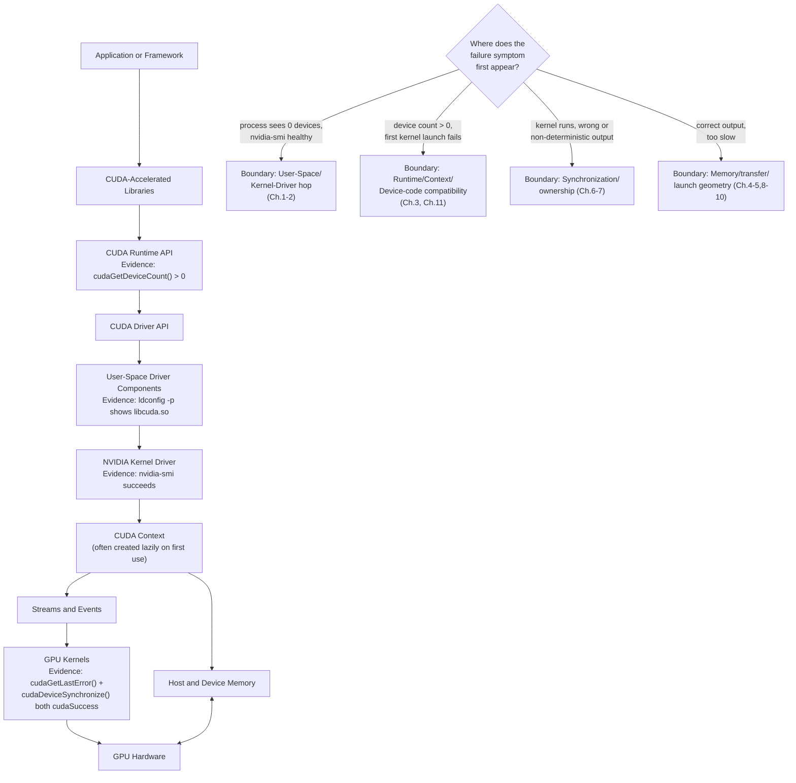
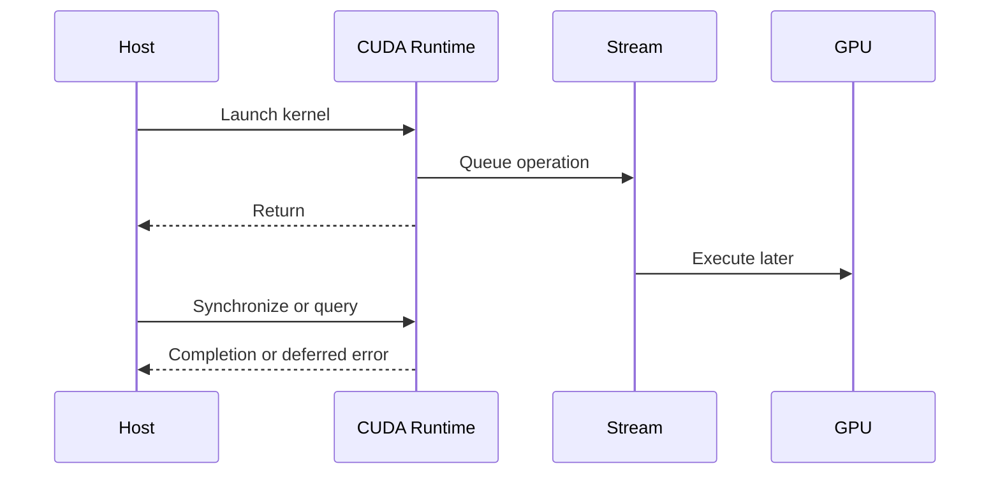

# Volume 03 Summary

## Introduction

CUDA is the software path through which applications turn GPU hardware into useful computation. It includes programming abstractions, runtime and driver APIs, memory-management models, streams, events, libraries, compilation artifacts, and the operating boundary between containers and the host driver.

This volume began with a simple question: why was CUDA needed? It ends with a production question: when a GPU application fails or underperforms, can you identify which layer owns the evidence?

A reliable answer requires more than API knowledge. It requires an execution model.

| Volume field | Value |
|---|---|
| Volume | 03 — CUDA Fundamentals |
| Difficulty reached | Intermediate to Advanced |
| Primary outcome | Trace CUDA work and failures from application to GPU |
| Labs completed | Environment validation, vector pipeline, overlap, profiling |
| Next learning direction | NVIDIA hardware portfolio and platform architecture |

## The Complete CUDA Path



**Figure 3.13.1 — CUDA production stack as a fault-isolation map for the whole volume.** Every arrow that mattered enough to get its own chapter now carries the specific evidence that proves it healthy, and the decision diamond routes a symptom directly to the chapter range that owns that boundary — this is the diagram meant to be redrawn from memory in an incident, not just studied once.

## Mental Model 1 — CUDA Is a Layered Platform

CUDA should not be reduced to one compiler or one runtime library.

| Layer | Responsibility | Typical evidence |
|---|---|---|
| Application or framework | Workload logic, shapes, batching, device selection | Application logs and traces |
| CUDA libraries | Optimized domain operations | Library versions and algorithm selection |
| Runtime and Driver APIs | Context, memory, launch, stream, and module management | API errors and traces |
| User-space driver | Driver-facing implementation | Loaded libraries and compatibility |
| Kernel driver | Device control and OS integration | Kernel logs and device state |
| GPU hardware | Execution, memory, copy engines | Metrics, topology, and profiler counters |

A symptom may surface in one layer even when the cause originated earlier.

## Mental Model 2 — Kernel Launch Is Deferred Work

A kernel launch usually submits work and returns before execution completes. Correctness and error interpretation therefore depend on synchronization boundaries.



**Figure 3.13.2 — Asynchronous execution.** Submission, execution, and error visibility can occur at different times.

The debugging implication is critical: the API call that reports an error may not be the call that caused it.

## Mental Model 3 — Memory Movement Is Part of Execution

GPU performance depends on where data resides and how it moves.

| Memory model | Strength | Primary risk |
|---|---|---|
| Explicit device allocation | Clear ownership and transfer control | More code and lifecycle complexity |
| Pageable host memory | Simple general-purpose allocation | Hidden staging and inconsistent overlap |
| Pinned host memory | Predictable DMA and async transfer | Locked-memory pressure and NUMA mistakes |
| Mapped host memory | Avoids explicit copy for selected patterns | Repeated remote-access cost |
| Unified Memory | Simplifies shared access and incremental ports | Page faults, migration, and thrashing |

No memory API removes topology or bandwidth constraints.

## Mental Model 4 — Streams Express Dependencies

A stream is an ordered queue. Multiple streams expose possible concurrency but do not guarantee it.

Useful concurrency requires:

- Independent work
- Separate buffer ownership
- Suitable host memory
- Correct event dependencies
- No hidden device-wide synchronization
- Sufficient operation duration
- Hardware engines capable of overlap

The profiler timeline is the source of truth.

## Mental Model 5 — Compatibility Is a Chain

A CUDA workload depends on the compatibility of several components.


**Figure 3.13.3 — Compatibility chain.** A valid GPU assignment cannot compensate for incompatible device code or libraries.

The phrase “CUDA version” is insufficient unless the speaker identifies the toolkit, runtime libraries, framework build, driver, and target GPU.

## Mental Model 6 — Performance Is a Pipeline Property

The complete application pipeline may contain:

- Input queueing
- CPU preprocessing
- Host allocation
- Host-to-device copy
- Kernel launch and execution
- Synchronization
- Device-to-host copy
- Postprocessing
- Network response

A fast kernel cannot compensate for an idle GPU or serialized data path. Start profiling from end-to-end objectives and narrow toward kernel detail.

## Architecture Summary by Chapter

| Chapter | Architectural lesson |
|---|---|
| Why CUDA Exists | Programmability converts GPU throughput into a general compute platform |
| CUDA Software Stack | Application work crosses several APIs and driver boundaries |
| Programming and Execution Model | Grids, blocks, and threads express scalable parallel work |
| Launch and Indexing | Launch geometry maps logical data to hardware work |
| Memory Management | Placement and movement must be explicit or managed intentionally |
| Synchronization and Correctness | Asynchrony requires dependency and lifetime discipline |
| Streams and Events | Narrow ordering preserves concurrency |
| Pinned Memory | DMA efficiency depends on stable mappings and NUMA locality |
| Unified Memory | Shared addressing does not remove physical page placement |
| CUDA Graphs | Stable repeated workflows can reduce submission overhead |
| Compilation and Compatibility | Device code and libraries must match the driver and GPU fleet |
| Profiling and Troubleshooting | Evidence moves from SLO to timeline to kernel detail |

## Production Readiness Checklist

A CUDA workload is not production-ready until the team can answer:

### Build and Compatibility

- Which source revision and image digest are deployed?
- Which GPU architectures are included in the binary?
- Is PTX present and tested where required?
- Which minimum driver policy applies?
- Which libraries are loaded at runtime?

### Memory

- Which data remains on the device?
- Which host buffers are pinned?
- Are pinned buffers bounded and NUMA-local?
- Is managed-memory migration measured?
- Is peak memory demand known?

### Execution

- Which streams exist and who owns them?
- Which events define dependencies?
- Where does device-wide synchronization occur?
- Are buffer lifetimes safe under concurrency?
- Is graph use bounded and observable?

### Operations

- What is the steady-state performance baseline?
- What is the cold-start profile?
- Which logs and metrics are retained?
- What error causes a context or process restart?
- What is the rollback criterion?

## Troubleshooting Quick Reference

| Symptom | First evidence to collect |
|---|---|
| No GPU visible | Same-context `nvidia-smi`, device assignment, runtime configuration |
| First GPU operation fails | Context creation, loaded libraries, driver compatibility |
| No suitable kernel image | GPU capability and embedded binary targets |
| Out of memory | Allocation ownership, reserved pools, fragmentation, competing processes |
| Illegal memory access | Last successful operation, bounds, pointer lifetime, stream ownership |
| Async copies serialize | Host memory type, stream use, synchronization, timeline |
| Managed memory stalls | Faults, migrations, prefetch, working-set size |
| Low utilization | Demand, CPU gaps, batching, transfers, launch geometry |
| High utilization and low throughput | Memory stalls, inefficient work, retries, contention |

**Evidence for the two rows that recur most often across this volume's chapters:**

*No GPU visible* — same-context comparison, from Chapter 12's incident:
```text
$ nvidia-smi -L
GPU 0: NVIDIA A100-SXM4-40GB (UUID: GPU-3f9a1c...)
$ kubectl exec -it inference-pod-7c9 -- nvidia-smi -L
Failed to initialize NVML: Unknown Error
```
Host healthy, process blind — that gap is always below `nvidia-smi`'s own layer: device injection, `NVIDIA_VISIBLE_DEVICES`, or a Pod spec that never requested `nvidia.com/gpu`.

*Illegal memory access* — `compute-sanitizer` naming the exact line, from Chapter 12:
```text
$ compute-sanitizer --tool=memcheck ./inference_engine
========= Invalid __global__ write of size 4 bytes
=========     at scale_kernel(float*, int, float)+0x50 in scale.cu:14
=========     by thread (287,0,0) in block (3906,0,0)
```
This is strictly more actionable than "an illegal memory access was encountered" reported at a downstream synchronization call — always reach for the sanitizer before manual bisection when the tool is available.

## Customer Conversation Framework

When a customer says, “CUDA is slow,” ask:

1. What business metric is slow?
2. What changed?
3. Does the issue occur at cold start, steady state, or both?
4. Which GPU, driver, image, framework, and input shape are involved?
5. Is the GPU idle, transferring, computing, or waiting?
6. Does the timeline show serialization?
7. Is the same behavior reproducible outside orchestration?
8. Which layer has evidence of the first failure?

These questions transform a vague complaint into an architecture investigation.

## Interview Preparation

### Knowledge Questions

1. **Explain the difference between the CUDA Runtime API and Driver API.**
   "Runtime API is the higher-level, more convenient interface most applications use directly — it manages context creation implicitly. Driver API sits underneath and gives explicit control over devices, contexts, and modules — frameworks and advanced tooling reach for it when they need that control. Every Runtime API call ultimately depends on Driver API capabilities beneath it."

2. **Why can pageable memory limit asynchronous copy behavior?**
   "Because a DMA engine needs a physically stable address to transfer against, and pageable memory can be relocated by the OS at any time — so the runtime has to stage it through an internal pinned buffer first. That staging copy is hidden, blocking CPU work sitting right behind an API call that looks fully asynchronous from the outside."

3. **What is PTX and when is it used?**
   "PTX is a virtual, forward-compatible intermediate instruction representation — not the final machine code the GPU executes. It's used when a build wants to run on GPU architectures newer than what was available at compile time; the installed driver JIT-compiles it for the actual target GPU the first time a module using it loads."

4. **What guarantee does a stream provide?**
   "In-order execution of the operations submitted to that one stream — nothing about timing relative to other streams, and no guarantee of overlap. Overlap requires additional conditions: pinned memory, independent buffers, and no hidden synchronization."

5. **Does Unified Memory eliminate transfers?**
   "No — it eliminates the explicit copy call from the code, but pages still physically migrate between host and device memory as different processors access them. It changes who's responsible for movement, not whether movement happens."

### Architecture Questions

1. **Draw the path from a framework call to GPU execution.**
   "Framework call into the CUDA Runtime API, down into the Driver API, into the user-space driver library, across the device-file boundary into the NVIDIA kernel driver, which controls the GPU. I'd annotate each hop with the evidence that proves it's healthy — device count for the runtime hop, library resolution for user-space, `nvidia-smi` for the kernel-driver hop."

2. **Design a double-buffered transfer and compute pipeline.**
   "Two slots, each with a pinned host buffer, device buffer, dedicated stream, and completion event. While slot 0 computes, slot 1's input transfer proceeds concurrently — but a slot can't be reused for the next batch until its own completion event confirms the previous work is actually done. That ownership rule is the entire difference between real overlap and intermittent corruption."

3. **Design a compatibility matrix for a mixed GPU fleet.**
   "List every GPU generation actually in the fleet, decide native SASS targets for the currently-deployed ones plus a tested PTX fallback for anything newer or less common, pin a minimum driver policy, and require CI to build and smoke-test against representative hardware for each listed class before release — not just compile cleanly."

4. **Explain how CUDA Graphs fit into an inference service.**
   "They target host submission overhead for stable, frequently-repeated request shapes — I'd bucket traffic into a small number of shape classes, cache one graph instance per class with a bounded total, and keep a normal stream fallback for anything outside the cached classes, rather than trying to cache every unique shape that ever arrives."

5. **Define a profiling hierarchy for a slow training job.**
   "Customer-visible metric first — step time or samples per second — then a system timeline to see whether the GPU is starved, serialized, or genuinely compute-bound, and only then kernel-level counters if the timeline actually points at a specific kernel rather than at host gaps or synchronization."

### Scenario Questions

1. **`nvidia-smi` works but a container reports no device.**
   "`nvidia-smi` on the host only proves the kernel driver is healthy — it says nothing about whether the container's process can see the device. I'd check device-node exposure inside the container, `NVIDIA_VISIBLE_DEVICES`, and whether the container runtime's GPU integration actually ran, before touching anything on the host."

2. **A kernel error appears during a later memory copy.**
   "The copy is very likely just the first synchronization point after an earlier kernel actually faulted asynchronously — I'd bisect backward with temporary `cudaDeviceSynchronize()` calls, or just run once under `compute-sanitizer` to get the true origin directly instead of guessing from where the error surfaced."

3. **Four streams perform no better than one.**
   "I'd check pinned memory, legacy default-stream interaction, a stray `cudaDeviceSynchronize()` in the hot path, and distinct buffer ownership — then confirm with the actual profiler timeline, because that's the only evidence that proves overlap happened rather than merely being permitted by the API."

4. **A managed-memory workload collapses above a data-size threshold.**
   "That threshold is almost certainly device memory capacity — below it the working set stays resident, above it the runtime starts evicting and refaulting pages continuously. I'd confirm with memory-used oscillating near the device ceiling during the slow runs and fix it by separating hot and cold data rather than assuming Unified Memory scales transparently past device capacity."

5. **A new GPU generation rejects an existing binary.**
   "That's a build-matrix gap, not a runtime incident — the binary's embedded device code, native or PTX, simply doesn't cover this architecture. I'd confirm with `cuobjdump` against the GPU's actual compute capability, then fix it at the build level by adding the target or a PTX fallback, not by touching the deployment or the driver."

## Quick Revision Sheet

```text
CUDA stack:
Application → Libraries → Runtime → Driver API → Driver → GPU

Execution:
Grid → Blocks → Threads
Stream → Ordered operations
Event → Device milestone or dependency

Memory:
Pageable → May stage
Pinned → Stable DMA source/destination
Managed → Runtime-controlled page placement
Device → Explicit GPU-local allocation

Compatibility:
Toolkit ≠ Runtime libraries ≠ Driver ≠ GPU target

Profiling:
SLO → System timeline → Operation duration → Kernel counters
```

## Lab Checklist

You should now be able to:

- Inspect driver, toolkit, libraries, and device visibility.
- Compile and verify a simple CUDA workload.
- Validate indexing and result correctness.
- Compare pageable and pinned transfers.
- Build a multi-stream pipeline with events.
- Identify synchronization that prevents overlap.
- Capture a system timeline.
- Explain whether a bottleneck belongs to host, transfer, kernel, or compatibility.

## Summary

Volume 03 established CUDA as a complete execution platform rather than a single programming API. Applications submit asynchronous work through runtime and driver layers, move data through several memory models, express dependencies with streams and events, and deploy device code through a compatibility chain.

The enduring skill is evidence-based reasoning. When a CUDA system fails, trace the first broken contract. When it is slow, measure the complete pipeline. When it must support a fleet, make compatibility and performance explicit release properties.

## Key Takeaways

- CUDA connects applications to GPU execution through multiple layers.
- Asynchrony improves utilization but increases ownership and debugging requirements.
- Data placement and movement are first-class architecture decisions.
- Streams, events, and graphs express schedules, not guaranteed performance.
- Binary and driver compatibility must be validated across the fleet.
- Production profiling begins with completed work and customer-visible latency.

## Cross References

- Volume introduction: [CUDA Fundamentals](./index)
- Previous: [Profiling and Production Troubleshooting](./chapter-12-profiling-and-production-troubleshooting)
- Lab: [Build an Overlapped CUDA Pipeline](./labs/lab-03-build-an-overlapped-cuda-pipeline)
- Lab: [Profile and Diagnose a CUDA Application](./labs/lab-04-profile-and-diagnose-a-cuda-application)
