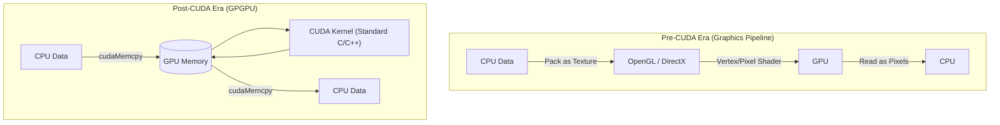

# Chapter 1 — Why CUDA Exists

| Chapter metadata | Value |
|---|---|
| Volume | 03 — CUDA and Execution Stack |
| Difficulty | Advanced |
| Estimated reading time | 30 minutes |
| Primary audience | DevOps, SRE, Platform, Cloud and Infrastructure Engineers |
| Core question | Why did the industry standardize on CUDA, and why is it so difficult for competitors to displace NVIDIA's software moat? |

## Introduction

In Volume 1 and Volume 2, we mapped the physical realities of the data center and the GPU silicon. We explored NVLink, Tensor Cores, Streaming Multiprocessors, and High-Bandwidth Memory. 

But silicon, no matter how advanced, is just sand. Without a way to instruct those billions of transistors to perform useful work, a GPU is nothing more than an expensive space heater. 

In the early 2000s, researchers realized GPUs had massive mathematical potential. But to use them, scientists had to disguise their physics simulations as 3D graphics, mapping math equations into OpenGL or DirectX pixel shaders. It was agonizingly difficult.

In 2006, NVIDIA introduced **CUDA (Compute Unified Device Architecture)**. CUDA fundamentally changed computing. It was not just an API; it was a parallel computing platform and programming model that allowed developers to write standard C/C++ code that executed directly on the GPU.

Understanding why CUDA exists—and why it remains the undisputed king of AI computing—is the first step to mastering the AI software stack.

## 1. The GPGPU Problem

Before CUDA, **GPGPU** (General-Purpose computing on Graphics Processing Units) was a fringe academic exercise. 
A researcher simulating fluid dynamics had to translate their data into 2D textures, pretend the fluid particles were pixels, and push them through a graphics rendering pipeline. 

This caused several critical bottlenecks:
1. **Memory Addressing:** Graphics APIs did not allow "Scatter and Gather" memory operations. You couldn't easily write arbitrary data to arbitrary locations in memory.
2. **No Hardware Debugging:** If your math equation failed, the GPU simply rendered a black pixel. There was no way to `print()` or throw an exception.
3. **Floating Point Accuracy:** Early GPUs cut corners on IEEE-standard floating-point math because a slightly inaccurate pixel color is invisible to the human eye. But a slightly inaccurate calculation in a physics simulation causes the simulation to explode.

## 2. The CUDA Revolution

CUDA solved all of this by exposing the GPU not as a graphics pipeline, but as a parallel co-processor. 

NVIDIA added hardware support for standard C/C++ pointers, allowing developers to read and write memory exactly as they would on a CPU. They enforced strict IEEE 754 floating-point standards. They built a C compiler (`nvcc`) that could take a single file of C++ code, split it in half, send the serial parts to the host CPU, and send the parallel parts to the GPU.

## 3. The Software Moat

Today, hardware competitors build GPUs that rival or exceed NVIDIA's raw teraFLOPS. Why hasn't the industry switched?

The answer is the **CUDA Ecosystem**.

Over 15 years, NVIDIA built heavily optimized libraries on top of CUDA:
* **cuBLAS:** For dense linear algebra (Matrix math).
* **cuDNN:** For Deep Neural Networks (Convolutions, Activations).
* **NCCL:** For multi-GPU distributed communication.
* **cuFFT:** For Fast Fourier Transforms.

When Google or Meta releases a new AI framework (like TensorFlow or PyTorch), they do not write raw machine code. They write Python that calls C++, which calls NVIDIA's `cuDNN` and `cuBLAS`. 

**The Infrastructure Reality:** If a competitor releases a faster GPU, it doesn't matter unless PyTorch, Triton, and JAX can compile and run flawlessly on it. Translating 15 years of heavily optimized, architecture-specific CUDA code into a competitor's language (like AMD's ROCm or Intel's SYCL) is a monumental software engineering challenge.

## Customer Scenario (Senior Level)

**The Situation:** 
A startup's CFO says: "NVIDIA H100s are too expensive and the lead times are 6 months. A competitor is offering their new AI accelerators for half the price, and they claim they have 20% more raw Compute TFLOPS. We should switch our entire Kubernetes cluster to use them."

**The Senior Architect Response:**
"Raw hardware TFLOPS are irrelevant if the software stack cannot efficiently utilize them. 

Our engineers currently use PyTorch and DeepSpeed. DeepSpeed relies heavily on NVIDIA's NCCL library for distributed multi-node communication, and PyTorch relies on FlashAttention, which is written in raw CUDA explicitly targeting NVIDIA Tensor Cores. 

If we switch to the competitor's hardware, we must ensure their translation layer (e.g., ROCm/HIP) perfectly supports our exact versions of PyTorch and FlashAttention. Often, these translation layers suffer from unoptimized memory kernels, resulting in 50% lower real-world utilization despite having 20% more theoretical hardware capability. Furthermore, our entire SRE observability stack relies on DCGM (Data Center GPU Manager) to alert on thermal throttling. We would have to rewrite our entire Prometheus monitoring stack. 

The Total Cost of Ownership (TCO) of migrating the software stack and retraining the platform team will likely vastly exceed the hardware savings."

## Interview Preparation

**Conceptual:** Why is mapping math to OpenGL/DirectX (Pre-CUDA) inefficient for AI? *(Hint: Lack of arbitrary memory pointers, strict graphic-pipeline ordering, and no hardware debugging/exception handling).*

**Ecosystem:** What is the difference between CUDA and cuDNN? *(Hint: CUDA is the parallel computing platform/compiler. cuDNN is a specialized library built ON TOP OF CUDA containing optimized algorithms specifically for Deep Learning, like convolutions).*

## Summary

CUDA is the invisible glue that holds the AI revolution together. It is not just an API; it is a fundamental redesign of how software interacts with parallel silicon. By providing a C/C++ interface, arbitrary memory pointers, and a suite of highly optimized mathematical libraries, NVIDIA transformed the GPU from a niche gaming component into the dominant computational engine of the 21st century.
