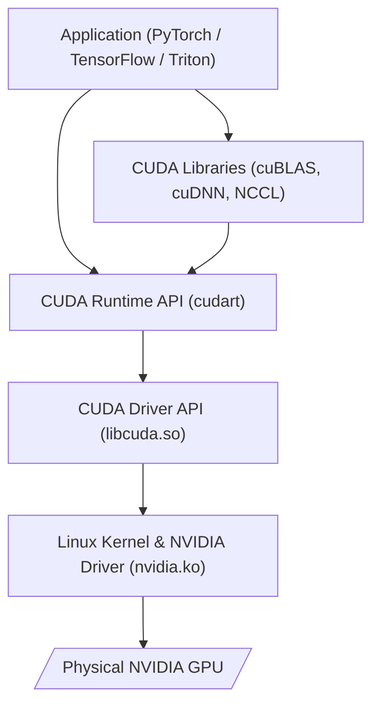

# Chapter 2 — The CUDA Software Stack

| Chapter metadata | Value |
|---|---|
| Volume | 03 — CUDA and Execution Stack |
| Difficulty | Advanced |
| Estimated reading time | 35 minutes |
| Primary audience | DevOps, SRE, Platform, Cloud and Infrastructure Engineers |
| Core question | When a PyTorch container runs, how does the Python code safely cross the boundary into the Linux kernel and reach the physical GPU? |

## Introduction

In an AI Factory, infrastructure engineers rarely write raw CUDA C++ code. However, you are entirely responsible for the stack that *runs* that code. 

When a data scientist deploys a containerized PyTorch job that crashes with a `CUDA initialization error`, you cannot troubleshoot it if you do not understand the boundaries of the software stack. You must know where the Python library ends, where the user-space CUDA Runtime begins, how it talks to the NVIDIA Driver, and how the driver commands the silicon.

This chapter dissects the NVIDIA software stack from the application layer all the way down to the Linux kernel module.

## 1. The Stack Hierarchy

The CUDA software ecosystem is strictly layered. An application never talks directly to the hardware. 

### 1.1 The CUDA Runtime API (`libcudart.so`)
Most developers interact with the **Runtime API**. This is a high-level C++ API that handles the heavy lifting of GPU memory allocation (`cudaMalloc`), data transfers (`cudaMemcpy`), and thread management. It is designed to be easy to use.

### 1.2 The CUDA Driver API (`libcuda.so`)
The Runtime API secretly compiles down into calls to the **Driver API**. The Driver API is a much lower-level C API. It provides extreme, fine-grained control over GPU contexts and memory modules. Frameworks that need absolute control (like the Triton Inference Server or specialized compilers) often bypass the Runtime API and interact with the Driver API directly.

### 1.3 The NVIDIA Kernel Module (`nvidia.ko`)
Both APIs ultimately send instructions down into the Linux Kernel. The **NVIDIA Display Driver (Linux Kernel Module)** is the actual software that has ring-0 privileges to manipulate the physical GPU hardware via the PCIe bus. 
* *Note: NVIDIA recently open-sourced their kernel modules (OpenRM) to better integrate with modern Linux distributions.*

## 2. Containers and the NVIDIA Container Toolkit

In modern infrastructure, AI workloads run in Docker containers (via Kubernetes or Slurm/Pyxis). 
Containers, by default, provide isolation. A standard Docker container cannot see the host's physical GPU or the host's `/dev/nvidia0` device files.

To solve this, NVIDIA built the **NVIDIA Container Toolkit** (formerly `nvidia-docker`).

When you launch a container and request a GPU (`--gpus all`), the Container Toolkit intercepts the launch:
1. It mounts the physical GPU device files (e.g., `/dev/nvidia0`, `/dev/nvidiactl`) into the container.
2. It automatically maps the host's user-space NVIDIA Driver libraries (like `libcuda.so`) into the container.
3. This allows the PyTorch code running *inside* the container to seamlessly communicate with the kernel driver *outside* the container.

## Customer Scenario (Senior Level)

**The Situation:**
A Platform team upgrades the NVIDIA drivers on their Kubernetes worker nodes to Version 535. However, the data science team is running legacy Docker containers containing CUDA Toolkit Version 11.4. The data scientists panic, stating: "We have to rebuild all our Docker images to match your new Host driver, otherwise PyTorch will crash!"

**The Senior Architect Response:**
"You do not need to rebuild your containers. The CUDA software stack is designed with **Forward Compatibility**. 

NVIDIA maintains strict separation between the **CUDA Toolkit/Runtime** (which lives inside your Docker container) and the **NVIDIA Driver** (which lives on the host OS). The host NVIDIA Driver is backward-compatible. A modern Version 535 host driver perfectly understands API calls coming from an older CUDA 11.4 Runtime inside a container. 

The only time a conflict occurs is if you try to run a container with a *newer* CUDA Toolkit (e.g., CUDA 12.2) on an *older* host driver (e.g., Version 450) that lacks the necessary kernel features. Because we upgraded the host drivers to the latest version, your legacy containers will continue to operate flawlessly."

## Interview Preparation

**Conceptual:** Explain the difference between the CUDA Runtime API and the NVIDIA Linux Kernel Driver. *(Hint: The Runtime API is user-space software that provides easy functions like `cudaMalloc`. The Linux Kernel Driver runs in OS kernel-space and is the only component with privileges to actually instruct the hardware over PCIe).*

**Troubleshooting:** A container crashes with `libcuda.so: cannot open shared object file: No such file or directory`. What infrastructure component is misconfigured? *(Hint: The NVIDIA Container Toolkit is failing to mount the host's driver libraries into the container at launch).*
