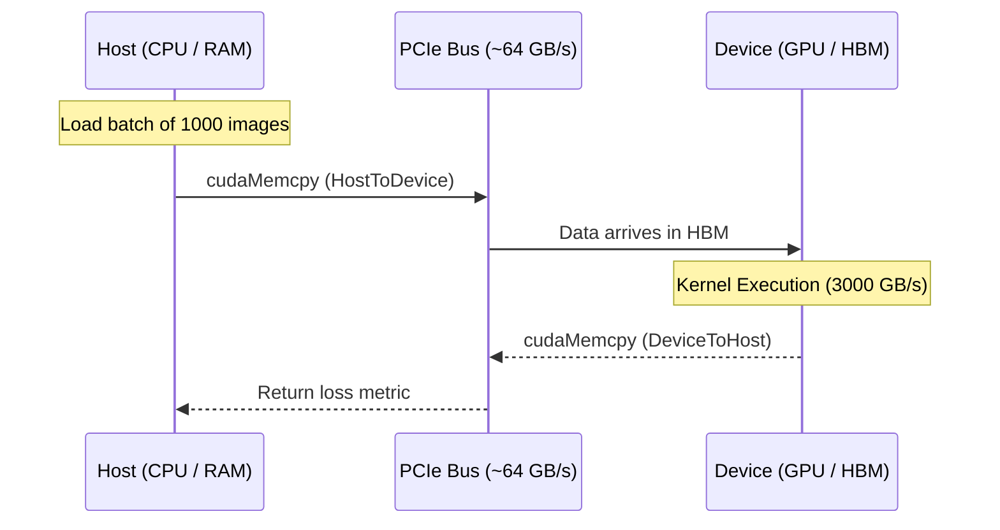

# Chapter 5 — Memory Management and Data Movement

| Chapter metadata | Value |
|---|---|
| Volume | 03 — CUDA and Execution Stack |
| Difficulty | Intermediate |
| Estimated reading time | 35 minutes |
| Primary audience | DevOps, SRE, Platform, Cloud and Infrastructure Engineers |
| Core question | If the GPU cannot access the CPU's RAM, how do we get terabytes of training data into the GPU? |

## Introduction

In modern servers, the CPU and the GPU live in isolation. 
The CPU manages System RAM (DDR5) and NVMe storage. 
The GPU manages its own High-Bandwidth Memory (HBM). 

A GPU cannot (natively) read files from a hard drive, nor can it execute a `SELECT` statement against a PostgreSQL database. If you have 100 gigabytes of images for training, the CPU must read them from disk, load them into System RAM, and explicitly push them across the PCIe bus into the GPU's HBM. 

This process—explicit memory management and data movement—is the #1 bottleneck in poorly optimized AI software. If a developer moves data inefficiently, an H100 will run slower than a laptop CPU.

## 1. Explicit Memory Allocation (`cudaMalloc`)

In standard C/C++, a developer allocates memory using `malloc()`. This reserves bytes in the Host (CPU) RAM. 

To allocate memory on the Device (GPU), CUDA provides a mirror function: `cudaMalloc()`.

```cpp
float *d_A; // The 'd_' naming convention means "Device pointer"
int size = 1000 * sizeof(float);

// Allocate memory on the GPU's HBM
cudaMalloc((void**)&d_A, size);
```

**The Danger:** If a CPU tries to read the variable `d_A`, or if a GPU tries to read a standard CPU pointer, the program will trigger a Segmentation Fault. The pointer address space is physically separated.

## 2. Moving the Data (`cudaMemcpy`)

Once memory is allocated on the GPU, the CPU must push data into it. This is done using `cudaMemcpy()`.

```cpp
float *h_A = ...; // Host (CPU) array
float *d_A;       // Device (GPU) array
cudaMalloc((void**)&d_A, size);

// Copy from CPU RAM, over the PCIe bus, into GPU HBM
cudaMemcpy(d_A, h_A, size, cudaMemcpyHostToDevice);

// ... launch kernel ...

// Copy results back from GPU HBM, over PCIe, to CPU RAM
cudaMemcpy(h_A, d_A, size, cudaMemcpyDeviceToHost);
```

### The PCIe Bottleneck
`cudaMemcpy` is a synchronous, blocking operation. 
When the CPU calls `cudaMemcpy`, the program pauses. The data travels over the PCIe bus. A PCIe Gen5 x16 slot has a theoretical maximum bandwidth of ~64 GB/s. 
If an AI engineer writes a script that constantly copies small variables back and forth (e.g., inside a training loop to check the loss metric), the GPU compute cores will constantly pause and wait for the slow PCIe bus. 

## Architectural Diagram: The Memory Transfer Bottleneck


*If the Kernel Execution takes 2 milliseconds, but the `cudaMemcpy` takes 100 milliseconds, the GPU is 98% idle.*

## 3. Best Practices for Infrastructure Architects

As a Senior Architect, you must guide software teams to avoid the PCIe bottleneck.
1. **Minimize Transfers:** Do not move data back and forth. Push the data to the GPU once, perform thousands of operations on it, and only copy the final result back to the CPU.
2. **Batching:** Moving 1,000 tiny tensors over PCIe requires 1,000 separate PCIe handshake overheads. Combine them into one massive tensor and issue a single `cudaMemcpy`.
3. **Pin Memory:** Standard CPU memory is "pageable" (the OS can swap it to disk). The GPU cannot safely DMA (Direct Memory Access) pageable memory. It must first copy it to a hidden "pinned" staging area. Developers should use `cudaMallocHost` to allocate "Pinned Memory" directly, doubling PCIe transfer speeds. (Covered deeply in Chapter 8).

## Customer Scenario (Senior Level)

**The Situation:** 
A junior data scientist says: "I wrote a PyTorch script to normalize a dataset of 1 billion numbers. I put `.to('cuda')` in my code, so it is using the GPU! But it takes 15 minutes. When I run it without `.to('cuda')` on the CPU, it takes 2 minutes. The GPUs in this cluster are defective."

**The Senior Architect Response:**
"The GPUs are highly functional; the script is bottlenecked by the physical limitations of the PCIe bus. 

Normalizing a number is an incredibly simple mathematical operation (e.g., division). When you execute this on the CPU, the CPU reads the data directly from its attached DDR5 RAM at 300 GB/s and performs the math instantly.

When you add `.to('cuda')`, you are forcing the CPU to package those 1 billion numbers and stream them across the motherboard's PCIe bus. The PCIe bus operates at a maximum of 64 GB/s. The GPU receives the data, completes the normalization math in a fraction of a millisecond, and then must stream the 1 billion answers *back* across the PCIe bus to the CPU.

You are paying an astronomical latency tax for data movement to perform a trivial amount of math. The Arithmetic Intensity is too low. GPUs are designed for heavy matrix multiplication, not simple array manipulation. This specific task should remain on the CPU, or the data should be generated natively on the GPU to avoid the PCIe transfer entirely."

## Interview Preparation

**Conceptual:** Why is `cudaMemcpy` considered the most dangerous function in a poorly optimized AI workload? *(Hint: It relies on the PCIe bus, which is orders of magnitude slower than GPU HBM, causing the massive compute cores to stall while waiting for data).*

**Architecture:** A developer asks if they can pass a standard C++ pointer directly into a CUDA `__global__` kernel. What happens? *(Hint: The kernel will crash with an Illegal Memory Access. The GPU cannot resolve a pointer that points to Host RAM; data must explicitly be moved to Device memory via `cudaMalloc` and `cudaMemcpy`).*
