# Chapter 7 — Streams, Events, and Asynchronous Execution

| Chapter metadata | Value |
|---|---|
| Volume | 03 — CUDA and Execution Stack |
| Difficulty | Expert |
| Estimated reading time | 35 minutes |
| Primary audience | DevOps, SRE, Platform, Cloud and Infrastructure Engineers |
| Core question | If `cudaMemcpy` halts the CPU, how can we keep the GPU math cores running while moving data? |

## Introduction

In Chapter 5, we identified the #1 infrastructure bottleneck: moving data over the PCIe bus. 

If your code executes sequentially:
`Copy Batch 1 to GPU` -> `Compute Batch 1` -> `Copy Result 1 to CPU` -> `Copy Batch 2 to GPU` ...

The GPU's math cores sit idle while the data moves. The PCIe bus sits idle while the math executes. You are paying for a multi-million-dollar AI Factory, but only using half the hardware at any given second.

To fix this, we must transition from Synchronous execution to **Asynchronous Execution**. We must tell the GPU to copy Batch 2 *at the exact same time* it is computing Batch 1. 

NVIDIA enables this via **CUDA Streams**.

## 1. What is a CUDA Stream?

A **CUDA Stream** is simply a queue of operations (memory copies and kernel launches). 

Operations placed inside the *same* Stream are guaranteed to execute strictly in order.
Operations placed in *different* Streams can execute simultaneously, in parallel.

### The Default Stream (Stream 0)
If a developer writes standard CUDA code and calls `cudaMemcpy` or launches a kernel `<<<...>>>`, it goes into the **Default Stream** (Stream 0). 
The Default Stream is special: it is synchronous. If you put a memory copy in the Default Stream, the CPU will freeze and wait until the copy is 100% complete before moving to the next line of code.

## 2. Custom Streams and Asynchronous Copies

To unlock overlap, a Senior Engineer creates custom streams.
```cpp
cudaStream_t stream1, stream2;
cudaStreamCreate(&stream1);
cudaStreamCreate(&stream2);
```

Instead of using the blocking `cudaMemcpy`, we use the non-blocking `cudaMemcpyAsync`. We also add a 4th parameter to the kernel launch configuration to specify the stream: `<<<Blocks, Threads, SharedMem, Stream>>>`.

```cpp
// Both operations return to the CPU instantly!
cudaMemcpyAsync(d_A, h_A, size, cudaMemcpyHostToDevice, stream1);
kernel<<<blocks, threads, 0, stream1>>>(d_A);
```

## 3. The Holy Grail: Copy-Compute Overlap

Modern GPUs have multiple independent hardware engines:
* **The Compute Engine (SMs):** Does the math.
* **The Copy Engine (DMA Controllers):** Moves data over PCIe.

Because they are physically separate silicon chips, they can run simultaneously. 

By splitting data into chunks and assigning them to different streams, we can achieve perfect **Copy-Compute Overlap**.

```mermaid
gantt
    title Synchronous vs Asynchronous Execution
    dateFormat  s
    axisFormat %S
    
    section Synchronous (Default Stream)
    Copy Batch 1  :a1, 0, 2s
    Compute 1     :a2, after a1, 3s
    Copy Batch 2  :a3, after a2, 2s
    Compute 2     :a4, after a3, 3s
    
    section Async (2 Streams)
    Copy Batch 1 (Str 1) :b1, 0, 2s
    Compute 1 (Str 1)    :b2, after b1, 3s
    Copy Batch 2 (Str 2) :b3, after b1, 2s
    Compute 2 (Str 2)    :b4, after b3, 3s
```


*Notice the Async graph: The moment Copy 1 finishes, Compute 1 begins. But simultaneously, Copy 2 begins on the PCIe bus. The total execution time is drastically reduced.*

## 4. CUDA Events (Synchronization)

If streams are executing randomly in parallel, how do we know when the work is actually done? 

We use **CUDA Events**. An event is a marker dropped into a Stream. The CPU can poll this event, or command another Stream to wait for this event before proceeding.

```cpp
cudaEvent_t start, stop;
cudaEventCreate(&start);

// Drop the marker into Stream 1
cudaEventRecord(start, stream1);

// Force the CPU to pause here until Stream 1 hits the marker
cudaEventSynchronize(start);
```

## Customer Scenario (Senior Level)

**The Situation:**
An inference team implements multiple Custom Streams to overlap their HBM data loading with their model computation. They deploy to production, but the NVIDIA Nsight Systems profiler shows zero overlap. The PCIe copies and the CUDA kernels are still executing completely sequentially. They claim the A100 DMA Copy Engines are broken.

**The Senior Architect Response:**
"The hardware Copy Engines are perfectly functional. You have failed to overlap the operations because you are attempting to asynchronously DMA copy **Pageable Memory**.

When you allocate memory on the Host CPU using standard `malloc()` in C++ (or standard numpy arrays in Python), the Linux OS considers that memory 'pageable'—meaning Linux can randomly swap it to the hard drive. 

The GPU's DMA Copy Engine cannot safely pull data from pageable memory without OS intervention. Therefore, when you call `cudaMemcpyAsync` on pageable memory, the CUDA driver secretly creates a blocking, synchronous staging buffer. It copies your data from pageable RAM to a hidden Pinned RAM buffer, and then DMAs it to the GPU. This secret synchronous copy breaks the async streams and forces sequential execution.

To fix this, you must allocate your Host memory using `cudaMallocHost()` (Pinned Memory). This locks the RAM into physical memory, allowing the GPU DMA controllers to pull it asynchronously, restoring your Stream overlap."

## Interview Preparation

**Conceptual:** What is a CUDA Stream? *(Hint: A sequence of operations that execute in order on the GPU. Operations in different streams can execute concurrently).*

**Troubleshooting:** Explain how it is physically possible for a GPU to copy data from the CPU at the exact same time it is multiplying matrices. *(Hint: They use completely different hardware blocks on the GPU die. The DMA Copy Engines handle the PCIe transfer while the Streaming Multiprocessors handle the math).*
