# Chapter 10 — CUDA Graphs and Repeated Execution

| Chapter metadata | Value |
|---|---|
| Volume | 03 — CUDA and Execution Stack |
| Difficulty | Expert |
| Estimated reading time | 25 minutes |
| Primary audience | DevOps, SRE, Platform, Cloud and Infrastructure Engineers |
| Core question | If a GPU kernel only takes 5 microseconds to execute, why does the CPU take 15 microseconds just to launch it? |

## Introduction

In the quest for maximum AI performance, we have eliminated memory bottlenecks, avoided warp divergence, and overlapped PCIe transfers. 

But there is one bottleneck remaining: **The CPU itself**.

Every time you launch a kernel (using `<<<Blocks, Threads>>>`), the CPU must do work. It allocates memory structures, interacts with the CUDA driver, and sends commands over the PCIe bus to the GPU's GigaThread Engine. 
This CPU overhead takes roughly **5 to 15 microseconds**.

For training massive models, 15 microseconds is irrelevant. The kernel runs for milliseconds or seconds. 
But for **LLM Inference**, particularly the Decode Phase (generating tokens one-by-one), the GPU performs tiny, incredibly fast matrix calculations. A kernel might only take 3 microseconds to execute on the GPU. 
If the CPU takes 15 microseconds to launch a 3-microsecond kernel, your system is **CPU Bound**. You are wasting 80% of your time managing the GPU rather than using it.

NVIDIA solved this with **CUDA Graphs**.

## 1. The Overhead Crisis

Imagine a complex inference pipeline. The CPU launches Kernel A, waits, launches Kernel B, copies data, and launches Kernel C. 

```mermaid
gantt
    title Standard Kernel Launch Overhead
    dateFormat  s
    axisFormat %S
    
    section CPU Overhead
    Launch A (15µs) :a1, 0, 15s
    Launch B (15µs) :a2, after b1, 15s
    Launch C (15µs) :a3, after b2, 15s
    
    section GPU Execution
    Kernel A (3µs)  :b1, after a1, 3s
    Kernel B (3µs)  :b2, after a2, 3s
    Kernel C (3µs)  :b3, after a3, 3s
```

*The GPU sits entirely idle during the massive red blocks of CPU launch overhead.*

## 2. CUDA Graphs (Capture and Replay)

A CUDA Graph is a mechanism to pre-define a workflow (a graph of nodes and edges) and submit it to the GPU in a single massive operation. 

Instead of launching Kernel A, B, and C individually, the programmer tells the CUDA driver to enter **Capture Mode**.
1. The driver records the execution sequence of Kernel A, B, and C without actually executing them. 
2. It builds a directed acyclic graph (DAG) representing the dependencies.
3. The programmer "instantiates" the graph.
4. The programmer "launches" the graph.

### The Performance Reality
When a CUDA Graph is launched, the CPU issues *one single command* to the GPU. The GPU takes the entire graph and schedules the execution internally on the silicon, entirely bypassing the CPU for the duration of the workflow.

The 45 microseconds of CPU launch overhead is reduced to 3 microseconds. The GPU executes kernels seamlessly back-to-back.

## Customer Scenario (Senior Level)

**The Situation:**
A Platform team deploys a new conversational AI model using Triton Inference Server. They profile the service and note that the GPU is only at 20% utilization, but the CPU cores are pinned at 100%. They are convinced the Kubernetes networking CNI is consuming the CPU.

**The Senior Architect Response:**
"The Kubernetes network is not consuming the CPU; the CUDA driver is consuming the CPU.

LLM decoding is an autoregressive loop. To generate a 500-word response, the system must launch the entire sequence of neural network layers 500 times. If the model has 80 layers, the CPU is launching 40,000 individual CUDA kernels in less than a second. The CPU is completely suffocating under the overhead of API calls and PCIe command dispatches.

To fix this, we must enable **CUDA Graphs** within the Triton configuration. When enabled, Triton will perform a dummy run of the inference request, capture the entire sequence of 80 layers into a single compiled CUDA Graph, and then replay that graph 500 times. The CPU will drop from 100% to near idle, and the GPU will execute the layers internally, drastically dropping the Time Per Output Token (TPOT)."

## Interview Preparation

**Conceptual:** What is the primary problem that CUDA Graphs solve? *(Hint: CPU launch overhead. By submitting a batch of kernels as a single graph, the GPU schedules them internally without waiting for the CPU to dispatch each one).*

**Troubleshooting:** An inference workload has ultra-fast kernels (2µs) but overall execution is slow. Why does standard profiling show huge gaps between kernel executions on the GPU timeline? *(Hint: The gaps are the CPU struggling to prepare and launch the next kernel. CUDA Graphs close these gaps).*
