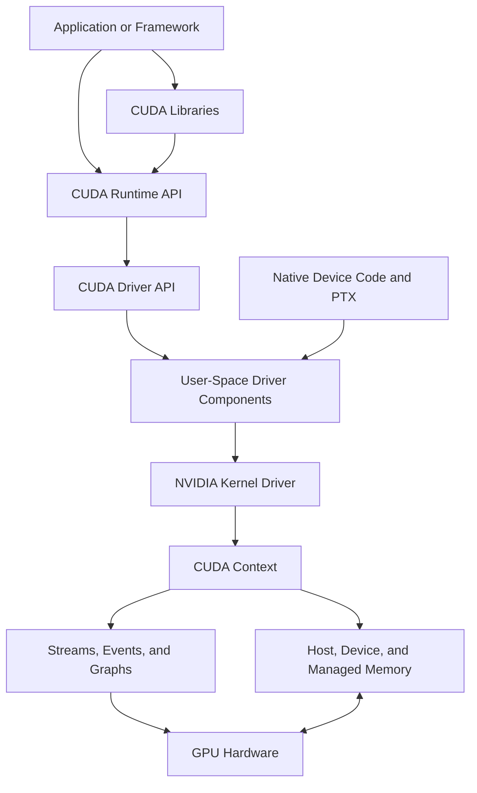

# Volume 03 — CUDA Fundamentals

Volume 02 explained what exists inside a GPU. Volume 03 explains how software asks that hardware to perform useful work.

CUDA is often introduced as a programming language or toolkit. That description is incomplete. In production systems, CUDA is a layered execution platform connecting applications, libraries, runtime APIs, the user-space driver interface, the kernel driver, device memory, streams, events, compilation artifacts, and GPU hardware. A failure at any boundary can surface as an application error, container problem, scheduling symptom, or infrastructure incident.

This volume builds a systems-level understanding of that path. The goal is not to turn every reader into a kernel developer. The goal is to make infrastructure engineers capable of reasoning about device discovery, compatibility, launch configuration, memory movement, synchronization, concurrency, profiling, and application-visible failure.

| Volume field | Value |
|---|---|
| Difficulty | Foundation to Advanced |
| Estimated reading time | 14–18 hours |
| Primary focus | CUDA software stack, execution, memory, concurrency, and operations |
| Prerequisite | Volume 02 — GPU Architecture |
| Chapters | 13 |
| Labs | 4 |
| Outcome | Trace CUDA work and failures from application code to GPU execution and back |

## The Big Picture

**Figure 3.0.1 — CUDA production path.** Applications reach the GPU through software, compatibility, execution, and memory boundaries that must all remain healthy.

## Reading Map

### Part I — Why CUDA Exists and How the Stack Is Organized

1. [Why CUDA Exists](./chapter-01-why-cuda-exists)
2. [The CUDA Software Stack](./chapter-02-cuda-software-stack)
3. [The CUDA Programming and Execution Model](./chapter-03-cuda-programming-and-execution-model)

### Part II — Launch, Memory, and Correctness

4. [Kernel Launch Configuration and Indexing](./chapter-04-kernel-launch-configuration-and-indexing)
5. [CUDA Memory Management and Data Movement](./chapter-05-cuda-memory-management-and-data-movement)
6. [Synchronization, Errors, and Correctness](./chapter-06-synchronization-errors-and-correctness)

### Part III — Concurrency and Advanced Memory Behavior

7. [Streams, Events, and Asynchronous Execution](./chapter-07-streams-events-and-asynchronous-execution)
8. [Pinned Memory and Transfer Overlap](./chapter-08-pinned-memory-and-transfer-overlap)
9. [Unified Memory and Demand Paging](./chapter-09-unified-memory-and-demand-paging)
10. [CUDA Graphs and Repeated Execution](./chapter-10-cuda-graphs-and-repeated-execution)

### Part IV — Deployment, Profiling, and Operations

11. [Compilation, Binaries, and Compatibility](./chapter-11-compilation-binaries-and-compatibility)
12. [Profiling and Production Troubleshooting](./chapter-12-profiling-and-production-troubleshooting)
13. [Volume 03 Summary](./chapter-13-volume-03-summary)

## Labs

1. [Lab 01 — Inspect and Validate a CUDA Environment](./labs/lab-01-inspect-and-validate-a-cuda-environment)
2. [Lab 02 — Build and Validate a CUDA Vector Pipeline](./labs/lab-02-build-and-validate-a-cuda-vector-pipeline)
3. [Lab 03 — Build an Overlapped CUDA Pipeline](./labs/lab-03-build-an-overlapped-cuda-pipeline)
4. [Lab 04 — Profile and Diagnose a CUDA Application](./labs/lab-04-profile-and-diagnose-a-cuda-application)

## Learning Progression

**Figure 3.0.2 — Volume learning progression.** Correctness and compatibility come before concurrency and optimization.

## Production Perspective

CUDA problems rarely belong to one team automatically.

| Symptom | Possible layer |
|---|---|
| `nvidia-smi` works but application reports no device | Container exposure, runtime configuration, device selection, library loading |
| First GPU operation fails | Lazy context creation, binary compatibility, missing library, driver boundary |
| Unsupported kernel image | Build target, PTX policy, or GPU architecture mismatch |
| Kernel fails only under concurrency | Buffer lifetime, stream ownership, race, deferred error |
| Transfers dominate runtime | Host memory type, NUMA placement, staging, copy granularity |
| Managed memory stalls | Page faults, migration, oversubscription, conflicting access |
| Multiple streams do not overlap | Hidden synchronization, pageable memory, dependency, hardware limitation |
| High utilization with low throughput | Inefficient kernels, memory stalls, retries, or useless work |

The volume develops the evidence chain needed to locate these failures accurately.

## Volume Completion Criteria

Before moving forward, you should be able to:

- Explain why CUDA exists and how it differs from GPU hardware.
- Trace an application call through runtime and driver layers.
- Explain grids, blocks, threads, contexts, streams, and events.
- Build and validate a simple CUDA program.
- Distinguish pageable, pinned, device, mapped, and managed memory.
- Explain asynchronous error visibility.
- Design a safe multi-stream buffer lifecycle.
- Explain PTX, native device code, and fleet compatibility.
- Capture a timeline and identify the dominant bottleneck layer.
- Produce a minimum CUDA incident evidence bundle.

If these outcomes are not yet comfortable, revisit the relevant chapter and lab before proceeding.
