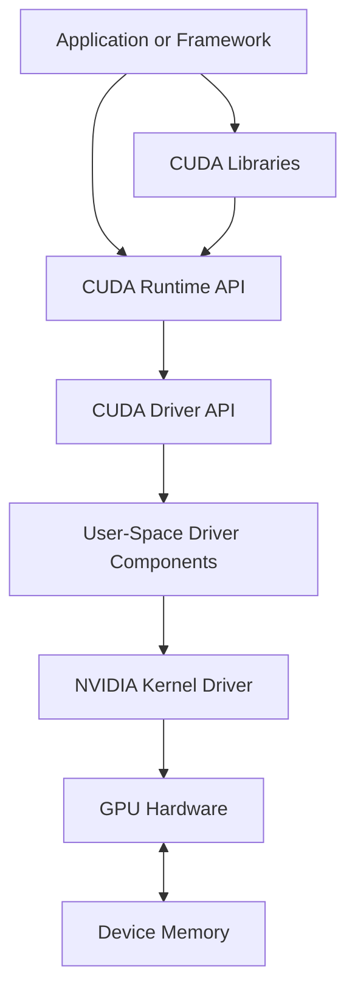

# Volume 03 — CUDA Fundamentals

Volume 02 explained what exists inside a GPU. Volume 03 explains how software asks that hardware to perform useful work.

CUDA is often introduced as a programming language or toolkit. That description is incomplete. In production systems, CUDA is a layered execution platform that connects applications, libraries, runtime APIs, the user-space driver interface, the kernel driver, device memory, streams, events, and GPU hardware. A failure at any boundary can surface as an application error, a container problem, a scheduling symptom, or an infrastructure incident.

This volume builds a systems-level understanding of that path. The goal is not to turn every reader into a CUDA kernel developer. The goal is to make infrastructure engineers capable of reasoning about device discovery, compatibility, kernel launch, memory movement, synchronization, and application-visible failure.

| Volume field | Value |
|---|---|
| Difficulty | Foundation to Intermediate |
| Estimated reading time | 10–12 hours |
| Primary focus | CUDA software stack and execution model |
| Prerequisite | Volume 02 — GPU Architecture |
| Outcome | Trace CUDA work from application code to GPU execution and back |

## The Big Picture

**Figure 3.0.1 — CUDA software path.** Applications may call framework libraries or CUDA APIs, but execution eventually crosses the driver boundary before work reaches the GPU.

## Chapters in This Batch

1. [Why CUDA Exists](./chapter-01-why-cuda-exists)
2. [The CUDA Software Stack](./chapter-02-cuda-software-stack)
3. [The CUDA Programming and Execution Model](./chapter-03-cuda-programming-and-execution-model)
4. [Lab 01 — Inspect and Validate a CUDA Environment](./labs/lab-01-inspect-and-validate-a-cuda-environment)

## What the Full Volume Will Cover

Later batches will extend this foundation into:

- Runtime API and Driver API responsibilities
- Context creation and device selection
- Kernel launch semantics
- Host and device memory
- Pinned memory and asynchronous transfer
- Streams, events, and synchronization
- Unified memory
- Error handling
- CUDA graphs
- Compilation and binary compatibility
- Profiling and operational troubleshooting

## Production Perspective

CUDA problems rarely belong to one team automatically.

| Symptom | Possible layer |
|---|---|
| `nvidia-smi` works but application reports no device | Container exposure, runtime configuration, application device selection |
| Application reports an unsupported binary | Build target and GPU architecture mismatch |
| Kernel launch fails only under load | Resource exhaustion, asynchronous error, prior illegal access |
| Transfers dominate runtime | Host memory type, synchronization, data pipeline design |
| Framework imports successfully but first GPU operation fails | Lazy context creation, library loading, driver compatibility |

The rest of the volume develops the evidence chain needed to locate these failures accurately.
