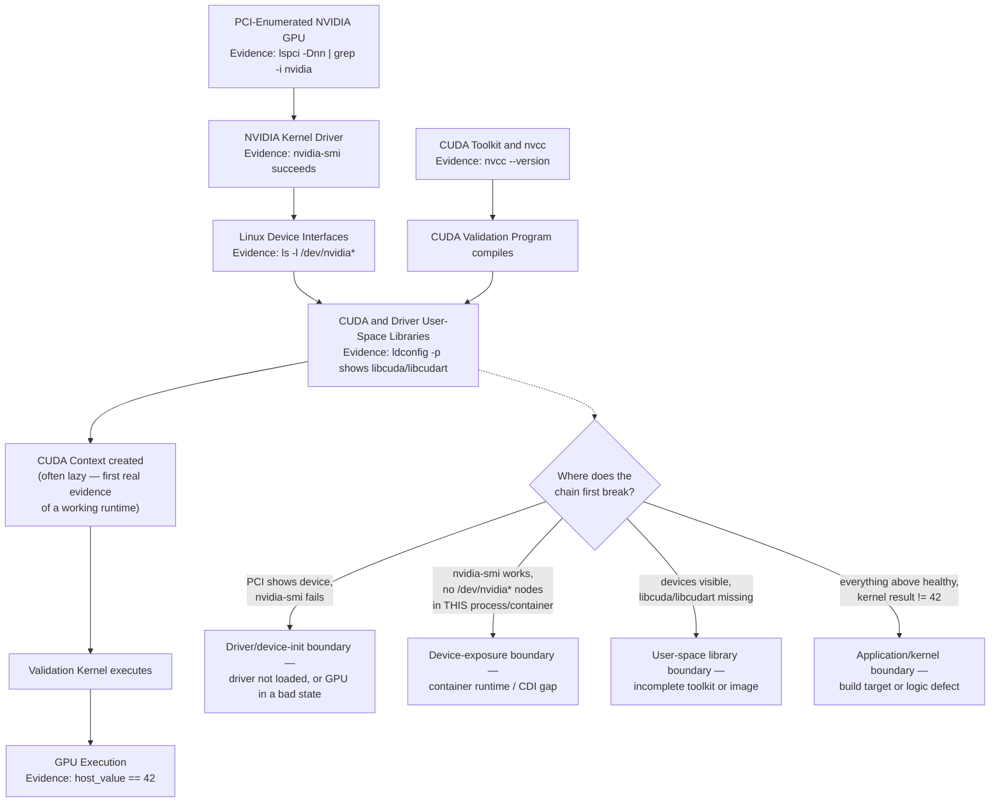

# Lab 01 — Inspect and Validate a CUDA Environment

## Lab Metadata

| Field | Value |
|---|---|
| Volume | 03 — CUDA Fundamentals |
| Difficulty | Beginner |
| Estimated time | 75–100 minutes |
| Lab level | L1 — Exploration and Validation |
| Target platform | Ubuntu or compatible Linux host with an NVIDIA GPU |
| Primary tools | `nvidia-smi`, `nvcc`, `ldconfig`, `lspci`, CUDA samples or a minimal CUDA program |

## 1. Objective

Validate each layer required for a CUDA application to discover a GPU, create runtime state, execute device code, and return a result.

The goal is not merely to prove that `nvidia-smi` works. The lab creates a layered evidence chain covering hardware enumeration, kernel-driver health, device access, toolkit presence, library resolution, compilation, runtime initialization, and actual kernel execution.

## 2. Background

A CUDA environment can be partially healthy. Common examples include:

- Linux sees the PCI device, but the NVIDIA driver did not initialize it.
- `nvidia-smi` works, but the CUDA compiler is not installed.
- The compiler exists, but runtime libraries are missing from the execution environment.
- A binary starts, but its device code does not support the installed GPU.
- The host works, but a container lacks device or library exposure.

This lab avoids treating any single command as complete validation.

## 3. Learning Outcomes

After completing this lab, you will be able to:

- Confirm hardware and driver visibility independently.
- Distinguish the installed driver from the installed CUDA toolkit.
- Locate CUDA compiler and runtime libraries.
- Compile or run a minimal CUDA validation program.
- Interpret common initialization and compatibility failures.
- Produce a repeatable CUDA environment report.

## 4. Architecture



**Figure 3.L1.1 — CUDA validation chain as a fault-isolation ladder.** Each arrow is now labeled with the exact command this lab uses to prove that hop, and the decision diamond maps directly onto Section 14's troubleshooting entries — the point of this lab is to walk this ladder in order rather than jumping straight to "reinstall the driver."

## 5. Prerequisites

### Hardware

- One NVIDIA GPU supported by the installed driver
- Local or remote shell access

### Software

- Linux
- NVIDIA driver
- Optional but recommended: CUDA toolkit and compiler
- Build tools such as `gcc`, `g++`, and `make`

### Permissions

- Read access to system logs and device files
- `sudo` for package inspection or installation when required

:::caution
Do not install or replace a production driver during this lab. Driver changes require compatibility review, maintenance planning, and rollback procedures.
:::

## 6. Environment

Record the host baseline.

### Purpose

Capture operating-system, kernel, and CPU information before inspecting CUDA.

### Commands

```bash
cat /etc/os-release
uname -r
uname -m
lscpu | sed -n '1,20p'
```

### Expected Output

The commands should identify the distribution, running kernel, architecture, and basic CPU topology. Exact values depend on the host.

### Common Errors

Minimal container images may not include `lscpu`. Run the inventory from the host or install the appropriate utilities in a disposable lab environment.

## 7. Components

| Component | Role in this lab |
|---|---|
| PCI subsystem | Proves the host enumerates the physical device |
| NVIDIA kernel driver | Controls the GPU |
| Device files | Expose GPU interfaces to processes |
| Driver-facing user library | Connects applications to the kernel driver |
| CUDA runtime library | Implements common runtime operations |
| CUDA compiler | Builds host and device code |
| Validation program | Forces context creation and device execution |

## 8. Deployment Steps

### Step 1 — Confirm PCI Enumeration

#### Purpose

Verify that Linux detects NVIDIA hardware independently of CUDA runtime health.

#### Command

```bash
lspci -Dnn | grep -i nvidia
```

#### Expected Output

```text
0000:07:00.0 3D controller [0302]: NVIDIA Corporation GA100 [A100 SXM4 40GB] [10de:20b0] (rev a1)
```

Read this left to right: `0000:07:00.0` is the PCI domain:bus:device.function address (you will need this exact string later to correlate against `nvidia-smi`'s `Bus-Id` field). `3D controller [0302]` is the PCI device class — NVIDIA data-center GPUs register as this class, not as a display adapter. `[10de:20b0]` is the vendor:device ID pair — `10de` is NVIDIA's PCI vendor ID on every NVIDIA GPU you will ever see here, and `20b0` identifies this specific chip (A100). One or more lines in this shape is a pass; no output at all means the device did not enumerate on the PCIe bus, which is a hardware/firmware/BIOS boundary issue below the driver entirely.

#### Explanation

PCI visibility proves hardware enumeration. It does not prove that the NVIDIA driver initialized the GPU successfully.

### Step 2 — Confirm Driver Communication

#### Purpose

Verify that the NVIDIA management utility can communicate with the loaded driver and GPU.

#### Command

```bash
nvidia-smi
```

#### Expected Healthy State

The command should display one or more GPUs without a driver communication error. Model names and reported fields vary by product.

#### Common Problems

- Command not found: management utilities are absent.
- Driver communication failure: kernel module, device initialization, or version mismatch issue.
- Fewer GPUs than `lspci`: one or more devices failed driver initialization.

### Step 3 — Record Driver and Device Identity

#### Purpose

Create script-friendly inventory data.

#### Command

```bash
nvidia-smi --query-gpu=index,name,uuid,pci.bus_id,driver_version,memory.total --format=csv
```

#### Expected Output

```text
index, name, uuid, pci.bus_id, driver_version, memory.total [MiB]
0, NVIDIA A100-SXM4-40GB, GPU-3f9a1c7e-88b2-4a5d-9e11-6c4f2a0d9b31, 00000000:07:00.0, 550.90.07, 40960 MiB
```

Cross-check `pci.bus_id` (`00000000:07:00.0`) against the `lspci` address from Step 1 (`0000:07:00.0`) — the domain padding differs cosmetically but the bus:device.function (`07:00.0`) must match. That match is your proof this is the *same physical device* both tools are describing, not a coincidence of both commands happening to succeed independently.

#### Explanation

Do not rely only on GPU indexes for persistent identification. UUIDs and PCI bus IDs are more stable evidence — an index can be reassigned across reboots or `CUDA_VISIBLE_DEVICES` remapping, but the UUID above (`GPU-3f9a1c7e-...`) identifies this specific physical card regardless of enumeration order.

### Step 4 — Inspect Kernel Modules and Logs

#### Purpose

Confirm module presence and search for initialization or XID evidence.

#### Commands

```bash
lsmod | grep -E '^nvidia'
journalctl -k | grep -iE 'nvrm|nvidia|xid' | tail -n 50
```

#### Expected Output

```text
$ lsmod | grep -E '^nvidia'
nvidia_uvm           1789952  0
nvidia_drm             77824  4
nvidia_modeset       1204224  1 nvidia_drm
nvidia              56213504  219 nvidia_uvm,nvidia_modeset

$ journalctl -k | grep -iE 'nvrm|nvidia|xid' | tail -n 50
Mar 03 09:12:04 gpu-node-07 kernel: nvidia: loading out-of-tree module taints kernel.
Mar 03 09:12:04 gpu-node-07 kernel: NVRM: loading NVIDIA UNIX x86_64 Kernel Module  550.90.07
```

The `219` in the `nvidia` module's usage count is the number of other kernel structures currently referencing it — non-zero and stable across repeated checks is healthy; a count that keeps climbing without bound between otherwise-idle checks is worth investigating for a resource leak. A clean load message with no `Xid` lines is the healthy case; any line containing `Xid` (for example `NVRM: Xid (PCI:0000:07:00): 79, ...`) indicates the driver logged a GPU error event and the specific Xid number should be looked up against NVIDIA's Xid error reference before continuing.

#### Interpretation

An empty filtered log is not automatically a problem. Error messages, repeated resets, or XID events require investigation in the context of the host and workload.

### Step 5 — Inspect Device Interfaces

#### Purpose

Verify that expected NVIDIA device nodes exist and inspect permissions.

#### Command

```bash
ls -l /dev/nvidia* 2>/dev/null || true
```

#### Expected Output

```text
crw-rw-rw- 1 root root 195,   0 Mar  3 09:12 /dev/nvidia0
crw-rw-rw- 1 root root 195, 255 Mar  3 09:12 /dev/nvidiactl
crw-rw-rw- 1 root root 195, 254 Mar  3 09:12 /dev/nvidia-modeset
crw-rw-rw- 1 root root 234,   0 Mar  3 09:12 /dev/nvidia-uvm
crw-rw-rw- 1 root root 234,   1 Mar  3 09:12 /dev/nvidia-uvm-tools
```

`/dev/nvidia0` is this specific GPU (index 0 — a second GPU would appear as `/dev/nvidia1`). `/dev/nvidiactl` is the control device every CUDA process opens first. `/dev/nvidia-uvm` backs Unified Memory (Chapter 9) — its absence with everything else present will specifically break managed-memory allocations while leaving ordinary `cudaMalloc`-based code unaffected. GPU hosts commonly expose control and device-specific entries in this shape; exact nodes vary with platform features and driver configuration.

#### Common Problem

A container may not receive the same device interfaces visible on the host. Compare host and container output when diagnosing exposure.

### Step 6 — Check for the CUDA Toolkit

#### Purpose

Determine whether the CUDA compiler is installed.

#### Commands

```bash
command -v nvcc || true
nvcc --version 2>/dev/null || true
```

#### Expected Output

```text
/usr/local/cuda-12.4/bin/nvcc
nvcc: NVIDIA (R) Cuda compiler driver
Copyright (c) 2005-2024 NVIDIA Corporation
Built on Tue_Feb_27_16:19:38_PST_2024
Cuda compilation tools, release 12.4, V12.4.99
Build cuda_12.4.r12.4/compiler.33961263_0
```

Compare `release 12.4` here against `nvidia-smi`'s reported `CUDA Version: 12.4` from Step 2 — a healthy match means the installed toolkit's compiler and the driver's reported compatibility ceiling agree. They are allowed to differ (a driver can support a *higher* CUDA version than the toolkit installed alongside it), but a toolkit newer than the driver's reported CUDA Version is a real compatibility risk worth flagging before deployment.

If `nvcc` is absent, both commands print nothing useful — `command -v nvcc` returns empty and the second line is suppressed by `2>/dev/null`. That is a normal, expected state on a runtime-only host; it is not itself a failure.

#### Explanation

The driver and toolkit are separate. `nvidia-smi` can work on a host that does not have `nvcc` installed.

### Step 7 — Inspect Runtime Libraries

#### Purpose

Confirm that the dynamic linker can locate CUDA-related libraries.

#### Command

```bash
ldconfig -p | grep -E 'libcuda\.so|libcudart\.so' || true
```

#### Expected Output

```text
	libcudart.so.12 (libc6,x86-64) => /usr/local/cuda-12.4/lib64/libcudart.so.12
	libcudart.so (libc6,x86-64) => /usr/local/cuda-12.4/lib64/libcudart.so
	libcuda.so.1 (libc6,x86-64) => /usr/lib/x86_64-linux-gnu/libcuda.so.1
	libcuda.so (libc6,x86-64) => /usr/lib/x86_64-linux-gnu/libcuda.so
```

Note the different install roots: `libcudart` (the runtime library, from the toolkit) resolves from `/usr/local/cuda-12.4/...`, while `libcuda` (the driver-facing library) resolves from `/usr/lib/x86_64-linux-gnu/...` — a path typically owned and mounted by the driver package, not the toolkit. This is exactly the split described in Chapter 2: two libraries with similar names, shipped by different components, resolved from different paths.

#### Interpretation

- `libcuda.so` is associated with the installed driver interface.
- `libcudart.so` is the CUDA runtime library and may be supplied by the toolkit or application environment.

Library paths can differ between hosts, containers, and package layouts. An empty result for `libcuda` specifically — while `libcudart` resolves fine — is the signature this lab's Step 14 troubleshooting table calls out as a missing driver-facing user library.

### Step 8 — Create a Minimal CUDA Program

Create `cuda-validate.cu`:

```cpp
#include <cuda_runtime.h>
#include <iostream>

__global__ void write_value(int* output) {
    if (threadIdx.x == 0 && blockIdx.x == 0) {
        *output = 42;
    }
}

int main() {
    int device_count = 0;
    cudaError_t status = cudaGetDeviceCount(&device_count);
    if (status != cudaSuccess) {
        std::cerr << "cudaGetDeviceCount failed: "
                  << cudaGetErrorString(status) << "\n";
        return 1;
    }

    std::cout << "CUDA devices: " << device_count << "\n";
    if (device_count < 1) {
        return 2;
    }

    cudaDeviceProp properties{};
    status = cudaGetDeviceProperties(&properties, 0);
    if (status != cudaSuccess) {
        std::cerr << "cudaGetDeviceProperties failed: "
                  << cudaGetErrorString(status) << "\n";
        return 3;
    }

    std::cout << "Device 0: " << properties.name << "\n";

    int* device_value = nullptr;
    status = cudaMalloc(&device_value, sizeof(int));
    if (status != cudaSuccess) {
        std::cerr << "cudaMalloc failed: "
                  << cudaGetErrorString(status) << "\n";
        return 4;
    }

    write_value<<<1, 1>>>(device_value);

    status = cudaGetLastError();
    if (status != cudaSuccess) {
        std::cerr << "Kernel launch failed: "
                  << cudaGetErrorString(status) << "\n";
        cudaFree(device_value);
        return 5;
    }

    status = cudaDeviceSynchronize();
    if (status != cudaSuccess) {
        std::cerr << "Kernel execution failed: "
                  << cudaGetErrorString(status) << "\n";
        cudaFree(device_value);
        return 6;
    }

    int host_value = 0;
    status = cudaMemcpy(&host_value, device_value, sizeof(int), cudaMemcpyDeviceToHost);
    cudaFree(device_value);

    if (status != cudaSuccess) {
        std::cerr << "cudaMemcpy failed: "
                  << cudaGetErrorString(status) << "\n";
        return 7;
    }

    std::cout << "Kernel result: " << host_value << "\n";
    return host_value == 42 ? 0 : 8;
}
```

#### Why This Program Is Useful

The program validates more than enumeration. It forces:

- Runtime initialization
- Device discovery
- Device property retrieval
- Device-memory allocation
- Kernel launch
- Synchronization
- Device-to-host copy

### Step 9 — Compile the Program

#### Command

```bash
nvcc -O2 -o cuda-validate cuda-validate.cu
```

#### Expected Output

A successful compilation may produce no terminal output and should create an executable named `cuda-validate`.

#### Common Errors

- `nvcc` not found: toolkit compiler is absent or not in `PATH`.
- Host compiler unsupported: inspect the toolkit's supported compiler requirements.
- Permission error: compile in a writable directory.

### Step 10 — Run the Program

#### Command

```bash
./cuda-validate
```

#### Expected Healthy Output

```text
CUDA devices: 1
Device 0: NVIDIA A100-SXM4-40GB
Kernel result: 42
```

The device count and name depend on the environment — on the reference host used for this write-up it matches the `nvidia-smi` identity from Step 3 exactly (`NVIDIA A100-SXM4-40GB`), which is itself a useful cross-check: if the name reported here differs from `nvidia-smi`'s, or if `Device 0` is not the GPU you expected, `CUDA_VISIBLE_DEVICES` or device ordering is remapping which physical card index 0 refers to. `Kernel result: 42` is the only line that actually proves the kernel executed and wrote back correctly — `CUDA devices: 1` only proves enumeration, and printing the device name only proves property retrieval, neither of which requires a kernel to run successfully.

## 9. Validation

Validation succeeds only when the evidence chain is complete:

1. PCI device appears.
2. Driver communicates with the GPU.
3. Device interfaces are available to the process.
4. Required libraries resolve.
5. The program compiles or a trusted prebuilt validation binary is available.
6. Runtime initialization succeeds.
7. A kernel executes and returns the expected value.

## 10. Verification

Record the executable's dynamic dependencies:

```bash
ldd ./cuda-validate
```

Then compare the program's device identity with:

```bash
nvidia-smi --query-gpu=index,name,uuid --format=csv
```

The runtime program and management utility should describe the expected device environment.

## 11. Observability

Run a second terminal while executing the validation program:

```bash
watch -n 1 nvidia-smi
```

The program is very short, so activity may be difficult to observe. This is expected and illustrates why coarse sampling can miss brief kernels.

For logs:

```bash
journalctl -k | grep -iE 'nvrm|xid|nvidia' | tail -n 50
```

## 12. Performance Measurements

This lab is a correctness validation, not a benchmark. Do not infer GPU performance from its runtime.

Capture only:

- Program startup behavior
- Whether initialization succeeds
- Whether kernel execution succeeds
- Whether repeated runs remain consistent

Later labs will use CUDA events and profilers for meaningful timing.

## 13. Failure Injection

### Failure Scenario — Hide the GPU from the Process

When running in a disposable shell or container environment, set a device visibility variable to exclude GPUs:

```bash
CUDA_VISIBLE_DEVICES="" ./cuda-validate
```

### Expected Broken Behavior

The program should report zero visible CUDA devices or an environment-specific discovery failure.

### Lesson

Host health and process-level visibility are separate conditions. A GPU can remain healthy while one process is intentionally prevented from using it.

Unset the variable:

```bash
unset CUDA_VISIBLE_DEVICES
```

## 14. Troubleshooting

### Problem — `nvidia-smi` works, but device count is zero

**Diagnosis**

```bash
printf 'CUDA_VISIBLE_DEVICES=%s\n' "${CUDA_VISIBLE_DEVICES-<unset>}"
ls -l /dev/nvidia* 2>/dev/null || true
ldconfig -p | grep libcuda
```

**Evidence — the exact failure this diagnosis catches, reproduced:**

```text
$ CUDA_VISIBLE_DEVICES="" ./cuda-validate
CUDA devices: 0
```

```text
$ printf 'CUDA_VISIBLE_DEVICES=%s\n' "${CUDA_VISIBLE_DEVICES-<unset>}"
CUDA_VISIBLE_DEVICES=
$ ls -l /dev/nvidia* 2>/dev/null || true
crw-rw-rw- 1 root root 195, 0 Mar  3 09:12 /dev/nvidia0
crw-rw-rw- 1 root root 195, 255 Mar  3 09:12 /dev/nvidiactl
$ ldconfig -p | grep libcuda
	libcuda.so.1 (libc6,x86-64) => /usr/lib/x86_64-linux-gnu/libcuda.so.1
```

Device nodes are present and `libcuda` resolves fine, but `CUDA_VISIBLE_DEVICES` is set to an empty string rather than unset — that is the entire explanation for `CUDA devices: 0` here, and it is diagnosed in three commands without touching the driver. Compare this against a case where `ls -l /dev/nvidia*` itself returns nothing — that would point at container device exposure instead, a different row in the same table.

**Possible causes**

- Device filtering
- Container device exposure
- Missing driver-facing user library
- Process permissions

### Problem — Kernel launch succeeds, synchronization fails

**Interpretation**

The launch was accepted, but execution failed asynchronously. Investigate the kernel, binary compatibility, and the first execution error.

### Problem — Program builds but reports unsupported device code

**Possible cause**

The binary was compiled without code usable by the installed GPU architecture.

**Resolution**

Rebuild using an appropriate target configuration after confirming the required deployment GPU set.

### Problem — Host works, container fails

Compare:

- Device files
- `nvidia-smi`
- Library resolution
- Environment variables
- Container runtime configuration
- Validation program behavior

## 15. Cleanup

```bash
rm -f cuda-validate cuda-validate.cu
unset CUDA_VISIBLE_DEVICES
```

No persistent system configuration should have been changed.

## 16. Summary

You validated the CUDA path from PCI enumeration to actual kernel execution. The lab demonstrated why hardware visibility, driver health, toolkit presence, library resolution, process-level exposure, and runtime execution must be checked separately.

## 17. Challenge Exercises

1. Run the validation inside a GPU-enabled container and compare the evidence chain with the host.
2. Extend the program to list every visible device.
3. Record context initialization time separately from steady-state execution.
4. Add structured JSON output for automated node conformance testing.
5. Intentionally select an invalid device index and document the resulting error.

## 18. Further Reading

- [Volume 03 Introduction](../index)
- [Why CUDA Exists](../chapter-01-why-cuda-exists)
- [The CUDA Software Stack](../chapter-02-cuda-software-stack)
- [CUDA Programming and Execution Model](../chapter-03-cuda-programming-and-execution-model)
