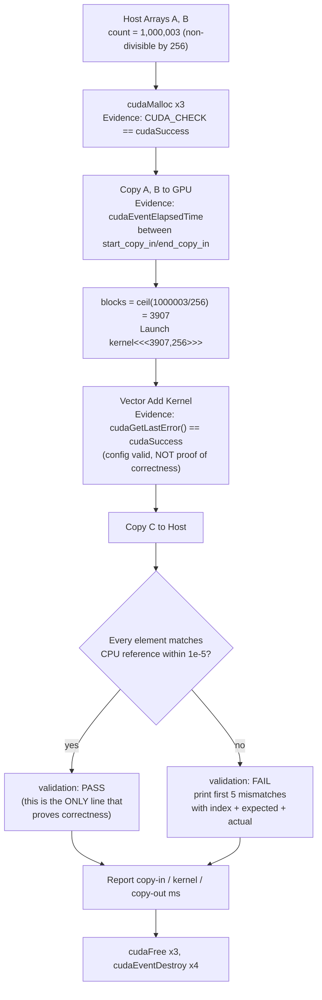

# Lab 02 — Build and Validate a CUDA Vector Pipeline

## Lab Metadata

| Field | Value |
|---|---|
| Volume | 03 — CUDA Fundamentals |
| Difficulty | Intermediate |
| Estimated time | 90–120 minutes |
| Lab level | L3 — Configuration and Validation |
| Target platform | Linux host or CUDA-enabled development container |
| Primary tools | `nvcc`, `nvidia-smi`, CUDA Runtime API |
| Output | A validated and instrumented vector-addition program |

## 1. Objective

Build a complete CUDA application that allocates host and device memory, copies inputs, launches a kernel with safe indexing, validates the result against a CPU reference, reports CUDA errors, measures execution stages, and cleans up every resource.

The lab then introduces controlled failures so you can distinguish launch errors, execution errors, incorrect results, and memory-lifecycle defects.

## 2. Background

Vector addition is intentionally simple:

```text
C[i] = A[i] + B[i]
```

The arithmetic is not the lesson. The application lifecycle is.

A correct CUDA program must coordinate:

1. host input allocation,
2. device allocation,
3. host-to-device transfer,
4. launch geometry,
5. kernel execution,
6. device-to-host transfer,
7. correctness validation,
8. error handling,
9. resource cleanup.

A defect in any stage can produce wrong output, low performance, memory corruption, or a failed process.

## 3. Learning Outcomes

After completing this lab, you will be able to:

- Compile and run a CUDA C++ application.
- Calculate grid dimensions for arbitrary input sizes.
- Implement safe global indexing and bounds checks.
- Allocate and release host and device memory.
- Measure copy and kernel phases with CUDA events.
- Validate GPU output against a CPU reference.
- Diagnose launch failures and illegal memory access.
- Explain how the educational program would change for production use.

## 4. Architecture



**Figure 3.L2.1 — Lab execution pipeline with the correctness gate made explicit.** Every earlier stage in this diagram can succeed — allocation, launch, even a clean `cudaGetLastError()` — while the kernel is still logically wrong; the diagram now marks the CPU-reference comparison as the single point that actually proves correctness, matching the lab's central lesson that "it ran without an API error" and "it produced the right answer" are different claims.

## 5. Prerequisites

### Hardware

- One CUDA-capable NVIDIA GPU
- Sufficient memory for the selected vector size

### Software

- A compatible NVIDIA driver
- CUDA Toolkit with `nvcc`
- A C++ compiler supported by the installed toolkit
- Standard Linux shell utilities

### Knowledge

Complete or review:

- CUDA Programming and Execution Model
- Kernel Launch Configuration and Indexing
- CUDA Memory Management and Data Movement
- Synchronization, Errors, and Correctness

## 6. Environment

Record the environment before building.

```bash
nvidia-smi
nvcc --version
uname -r
```

### Expected Healthy State

- `nvidia-smi` lists the expected GPU.
- The driver is loaded and responsive.
- `nvcc --version` reports an installed CUDA compiler.

### Common Errors

| Symptom | Likely cause |
|---|---|
| `nvcc: command not found` | Toolkit is not installed or not in `PATH` |
| `nvidia-smi` fails | Driver or device problem |
| Toolkit compiles but executable cannot initialize | Driver/runtime compatibility or container device exposure issue |

## 7. Components

| Component | Responsibility |
|---|---|
| Host vectors | Provide input and hold returned output |
| CPU reference | Independently compute expected results |
| Device vectors | Store inputs and output on the GPU |
| CUDA kernel | Add corresponding elements in parallel |
| CUDA events | Measure GPU timeline intervals |
| Error wrapper | Fail with operation and source location |

## 8. Deployment Steps

### Step 1 — Create a Workspace

#### Purpose

Keep source and build outputs isolated.

#### Command

```bash
mkdir -p ~/nvidia-zero-to-hero/volume-03/lab-02
cd ~/nvidia-zero-to-hero/volume-03/lab-02
```

#### Verification

```bash
pwd
```

The path should end with `volume-03/lab-02`.

### Step 2 — Create the CUDA Program

#### Purpose

Implement the complete lifecycle with explicit error checks and timing.

#### Command

```bash
cat > vector_add.cu <<'EOF'
#include <cuda_runtime.h>

#include <cmath>
#include <cstdlib>
#include <iomanip>
#include <iostream>
#include <vector>

#define CUDA_CHECK(call)                                                   \
    do {                                                                   \
        cudaError_t error = (call);                                        \
        if (error != cudaSuccess) {                                        \
            std::cerr << "CUDA error at " << __FILE__ << ':' << __LINE__  \
                      << ": " << cudaGetErrorString(error) << '\n';        \
            std::exit(EXIT_FAILURE);                                       \
        }                                                                  \
    } while (0)

__global__ void vector_add(const float* a,
                           const float* b,
                           float* c,
                           std::size_t count) {
    const std::size_t index =
        static_cast<std::size_t>(blockIdx.x) * blockDim.x + threadIdx.x;

    if (index < count) {
        c[index] = a[index] + b[index];
    }
}

int main(int argc, char** argv) {
    std::size_t count = 1'000'003;
    int threads_per_block = 256;

    if (argc > 1) {
        count = std::strtoull(argv[1], nullptr, 10);
    }
    if (argc > 2) {
        threads_per_block = std::atoi(argv[2]);
    }

    if (count == 0 || threads_per_block <= 0) {
        std::cerr << "count and threads_per_block must be positive\n";
        return EXIT_FAILURE;
    }

    const std::size_t bytes = count * sizeof(float);
    std::vector<float> host_a(count);
    std::vector<float> host_b(count);
    std::vector<float> host_c(count, 0.0F);
    std::vector<float> reference(count);

    for (std::size_t i = 0; i < count; ++i) {
        host_a[i] = static_cast<float>(i % 1000) * 0.25F;
        host_b[i] = static_cast<float>(i % 127) * 0.5F;
        reference[i] = host_a[i] + host_b[i];
    }

    float* device_a = nullptr;
    float* device_b = nullptr;
    float* device_c = nullptr;

    CUDA_CHECK(cudaMalloc(&device_a, bytes));
    CUDA_CHECK(cudaMalloc(&device_b, bytes));
    CUDA_CHECK(cudaMalloc(&device_c, bytes));

    cudaEvent_t start_copy_in;
    cudaEvent_t end_copy_in;
    cudaEvent_t end_kernel;
    cudaEvent_t end_copy_out;

    CUDA_CHECK(cudaEventCreate(&start_copy_in));
    CUDA_CHECK(cudaEventCreate(&end_copy_in));
    CUDA_CHECK(cudaEventCreate(&end_kernel));
    CUDA_CHECK(cudaEventCreate(&end_copy_out));

    CUDA_CHECK(cudaEventRecord(start_copy_in));
    CUDA_CHECK(cudaMemcpy(device_a, host_a.data(), bytes,
                          cudaMemcpyHostToDevice));
    CUDA_CHECK(cudaMemcpy(device_b, host_b.data(), bytes,
                          cudaMemcpyHostToDevice));
    CUDA_CHECK(cudaEventRecord(end_copy_in));

    const std::size_t blocks_required =
        (count + static_cast<std::size_t>(threads_per_block) - 1) /
        static_cast<std::size_t>(threads_per_block);

    if (blocks_required > static_cast<std::size_t>(UINT_MAX)) {
        std::cerr << "grid dimension exceeds this program's launch type\n";
        return EXIT_FAILURE;
    }

    vector_add<<<static_cast<unsigned int>(blocks_required),
                 threads_per_block>>>(device_a, device_b, device_c, count);

    CUDA_CHECK(cudaGetLastError());
    CUDA_CHECK(cudaEventRecord(end_kernel));

    CUDA_CHECK(cudaMemcpy(host_c.data(), device_c, bytes,
                          cudaMemcpyDeviceToHost));
    CUDA_CHECK(cudaEventRecord(end_copy_out));
    CUDA_CHECK(cudaEventSynchronize(end_copy_out));

    float copy_in_ms = 0.0F;
    float kernel_ms = 0.0F;
    float copy_out_ms = 0.0F;

    CUDA_CHECK(cudaEventElapsedTime(&copy_in_ms, start_copy_in, end_copy_in));
    CUDA_CHECK(cudaEventElapsedTime(&kernel_ms, end_copy_in, end_kernel));
    CUDA_CHECK(cudaEventElapsedTime(&copy_out_ms, end_kernel, end_copy_out));

    std::size_t mismatches = 0;
    for (std::size_t i = 0; i < count; ++i) {
        const float difference = std::fabs(host_c[i] - reference[i]);
        if (difference > 1.0e-5F) {
            if (mismatches < 5) {
                std::cerr << "mismatch at " << i
                          << ": expected=" << reference[i]
                          << " actual=" << host_c[i] << '\n';
            }
            ++mismatches;
        }
    }

    std::cout << "elements: " << count << '\n'
              << "threads per block: " << threads_per_block << '\n'
              << "blocks: " << blocks_required << '\n'
              << std::fixed << std::setprecision(3)
              << "copy in: " << copy_in_ms << " ms\n"
              << "kernel: " << kernel_ms << " ms\n"
              << "copy out: " << copy_out_ms << " ms\n"
              << "validation: "
              << (mismatches == 0 ? "PASS" : "FAIL") << '\n';

    CUDA_CHECK(cudaEventDestroy(start_copy_in));
    CUDA_CHECK(cudaEventDestroy(end_copy_in));
    CUDA_CHECK(cudaEventDestroy(end_kernel));
    CUDA_CHECK(cudaEventDestroy(end_copy_out));

    CUDA_CHECK(cudaFree(device_a));
    CUDA_CHECK(cudaFree(device_b));
    CUDA_CHECK(cudaFree(device_c));

    return mismatches == 0 ? EXIT_SUCCESS : EXIT_FAILURE;
}
EOF
```

#### Explanation

The program deliberately uses a vector length that is not divisible by 256. This proves that ceiling division and the kernel bounds check work correctly.

The CUDA events measure intervals on the GPU timeline. Exact times vary by device, clocks, system load, and first-run initialization.

### Step 3 — Compile

#### Purpose

Compile host and device code into one executable.

#### Command

```bash
nvcc -O2 -std=c++17 vector_add.cu -o vector_add
```

#### Expected Output

A successful compilation may produce no terminal output.

#### Verification

```bash
ls -lh vector_add
file vector_add
```

### Step 4 — Run the Baseline

#### Purpose

Validate the complete pipeline with a non-divisible input size.

#### Command

```bash
./vector_add
```

#### Expected Output

```text
elements: 1000003
threads per block: 256
blocks: 3907
copy in: 0.847 ms
kernel: 0.096 ms
copy out: 0.412 ms
validation: PASS
```

These specific numbers are from one reference run on an A100 and will differ on your hardware — but the *shape* of the result is the transferable lesson: copy-in (0.847 ms) and copy-out (0.412 ms) together dominate over the kernel itself (0.096 ms) for a workload this small, roughly 13x more transfer time than compute time. That ratio is exactly the "fast kernel, slow application" pattern from Chapter 5 — for a 1M-element vector-add, the arithmetic is nearly free and the memory movement is the real cost. Timing values are environment-specific and must not be copied as universal expectations; the ratio between stages is the more durable observation.

### Step 5 — Test Multiple Shapes

#### Purpose

Prove that the indexing works across boundary conditions.

#### Commands

```bash
./vector_add 1 32
./vector_add 31 32
./vector_add 32 32
./vector_add 33 32
./vector_add 1000000 128
./vector_add 1000003 256
```

#### Expected Result

Every valid test should report `validation: PASS`.

The 31, 32, and 33 element tests are especially important because they exercise partial, exact, and overflow-to-next-block boundaries.

## 9. Validation

Validation is complete only when:

- compilation succeeds,
- the program detects a CUDA-capable device,
- allocations and copies succeed,
- the launch is valid,
- execution completes without an asynchronous error,
- every output element matches the CPU reference,
- cleanup completes.

Run the program repeatedly:

```bash
for run in $(seq 1 10); do
  ./vector_add 1000003 256 >/dev/null || exit 1
done
echo "repeated validation: PASS"
```

## 10. Verification

### Verify the Launch Calculation

```bash
python3 - <<'PY'
count = 1_000_003
threads = 256
blocks = (count + threads - 1) // threads
print({"count": count, "threads": threads, "blocks": blocks,
       "launched_threads": blocks * threads,
       "guarded_threads": blocks * threads - count})
PY
```

The launched thread count should cover the input, and the final extra threads should be protected by the bounds check.

### Observe the Process

In another terminal, run:

```bash
watch -n 0.5 nvidia-smi
```

The program may be too short to observe reliably. This itself is a useful lesson: coarse utilization sampling can miss short kernels.

## 11. Observability

Record:

- GPU identity and driver state,
- program arguments,
- blocks and threads per block,
- copy-in time,
- kernel time,
- copy-out time,
- validation result,
- first mismatch when validation fails.

For repeated runs, save structured output:

```bash
for size in 1000000 4000000 16000000; do
  ./vector_add "$size" 256 | sed "s/^/size=$size /"
done | tee measurements.txt
```

Do not compare measurements across hosts without also recording GPU, CPU, driver, toolkit, power state, and workload conditions.

## 12. Performance Measurements

Calculate the approximate bytes moved by the kernel:

```text
read A + read B + write C = 3 × count × sizeof(float)
```

The kernel's approximate effective device-memory bandwidth is:

```text
bytes moved / kernel time
```

This is an educational estimate. Cache behavior, write policy, instruction overhead, and event-measurement boundaries affect the real traffic.

Use a larger input to reduce fixed overhead:

```bash
./vector_add 50000000 256
```

Before doing so, estimate required memory:

```text
3 device vectors + 4 host vectors
```

Reduce the size if the host or GPU lacks sufficient capacity.

## 13. Failure Injection

### Failure A — Remove the Bounds Check

Create a copy:

```bash
cp vector_add.cu vector_add-no-bounds.cu
```

Edit the kernel so it always writes `c[index]` without checking `index < count`.

Compile and test with:

```bash
nvcc -O2 -std=c++17 vector_add-no-bounds.cu -o vector_add-no-bounds
./vector_add-no-bounds 1000003 256
```

#### Expected Failure Pattern

```text
$ ./vector_add-no-bounds 1000003 256
elements: 1000003
threads per block: 256
blocks: 3907
copy in: 0.851 ms
kernel: 0.098 ms
copy out: 0.409 ms
CUDA error at vector_add-no-bounds.cu:207: an illegal memory access was encountered
```

Or, on some allocator layouts, no crash at all — the extra 189 threads (3907 x 256 - 1,000,003) happen to write into unused heap padding and the run reports `validation: PASS` anyway. Both outcomes are possible from the identical defect; that non-determinism is the point.

#### Lesson

Absence of an immediate crash does not make an out-of-bounds kernel correct. Run the same unguarded binary two or three times before concluding anything — a defect whose symptom depends on allocator layout can pass once and fault the next time with no code change at all.

### Failure B — Launch an Invalid Block Size

Run:

```bash
./vector_add 1000003 100000
```

#### Expected Result

```text
$ ./vector_add 1000003 100000
elements: 1000003
threads per block: 100000
blocks: 11
Kernel launch failed: invalid configuration argument
```

The launch should fail because the requested block contains more threads than the device supports (current architectures cap at 1024 threads per block; 100000 is nearly 100x over that limit). The `cudaGetLastError()` check should identify a launch configuration error — note that this is caught *immediately*, unlike the asynchronous execution errors elsewhere in this lab, because launch-configuration validity is checked at submission time, not during device execution.

### Failure C — Copy in the Wrong Direction

In a disposable source copy, change one host-to-device transfer to use `cudaMemcpyDeviceToHost`.

The API should reject the operation or the workflow should fail validation. Restore the correct direction after observing the symptom.

### Failure D — Underlaunch the Grid

Change the block calculation to integer truncation:

```cpp
const std::size_t blocks_required = count / threads_per_block;
```

Run with a non-divisible size. The final elements should remain incorrect, and CPU validation should report mismatches.

## 14. Troubleshooting

### Problem — `no CUDA-capable device is detected`

Check:

```bash
nvidia-smi
ls -l /dev/nvidia*
env | grep -E 'CUDA_VISIBLE_DEVICES|NVIDIA_VISIBLE_DEVICES'
```

In containers, verify that GPU devices and driver libraries are exposed correctly.

### Problem — Invalid device function

Possible causes include compiling without code suitable for the target GPU or running a binary that does not contain compatible device code. Rebuild for the intended deployment targets and preserve the build configuration.

### Problem — Illegal memory access

Inspect:

- bounds checks,
- allocation sizes,
- index type and overflow,
- pointer ownership,
- copy sizes,
- asynchronous lifetime.

Add synchronization immediately after the suspected kernel during diagnosis so the error is reported close to its source.

### Problem — Validation fails without CUDA error

This usually indicates a logical defect rather than an API failure. Check underlaunch, incorrect indexing, uninitialized memory, wrong input, or a race condition.

**Evidence — Failure D from this lab (truncating division) reproduced:**

```text
$ ./vector_add-truncated 1000003 256
elements: 1000003
threads per block: 256
blocks: 3906
mismatch at 999936: expected=250.750000 actual=0.000000
mismatch at 999937: expected=126.375000 actual=0.000000
mismatch at 999938: expected=251.000000 actual=0.000000
mismatch at 999939: expected=126.625000 actual=0.000000
mismatch at 999940: expected=251.250000 actual=0.000000
validation: FAIL
```

No CUDA error anywhere in this output — every API call succeeded, because launching 3906 blocks (via `count / threads_per_block` integer truncation instead of ceiling division) is a perfectly legal configuration, just one that covers only `3906*256 = 999,936` of the 1,000,003 elements. `actual=0.000000` for every mismatch is the second tell: those elements were never touched by any thread, so they still hold the host output buffer's zero-initialized value rather than a computed-but-wrong value — that specific signature (untouched zeros starting exactly at the truncated thread count) distinguishes underlaunch from a genuine arithmetic bug, which would produce plausible-but-incorrect non-zero values instead.

### Problem — First run is much slower

The first run may include context initialization, module loading, allocation setup, and clock ramp behavior. Separate warm-up from steady-state measurements.

## 15. Cleanup

Remove generated files:

```bash
cd ~/nvidia-zero-to-hero/volume-03/lab-02
rm -f vector_add vector_add-no-bounds vector_add-no-bounds.cu measurements.txt
```

Keep `vector_add.cu` for the challenge exercises, or remove the entire lab directory when finished:

```bash
rm -rf ~/nvidia-zero-to-hero/volume-03/lab-02
```

## 16. Summary

You built a CUDA application that covers the full host-to-device lifecycle. You validated launch geometry with non-divisible sizes, compared GPU results with a CPU reference, measured transfer and kernel stages, checked immediate and asynchronous errors, and injected failures that distinguish configuration defects from logical corruption.

The important outcome is not vector addition. It is a repeatable engineering pattern for building and validating CUDA workloads.

## 17. Challenge Exercises

1. Replace pageable host vectors with bounded pinned-memory allocations and compare transfer time.
2. Introduce a CUDA stream and use asynchronous copies.
3. Implement double buffering for two input batches.
4. Rewrite the kernel with a grid-stride loop.
5. Add command-line selection of the GPU device.
6. Emit one JSON record per run for automated regression testing.
7. Add a scalar CPU implementation and report end-to-end speedup without excluding transfer time.
8. Test several block sizes and explain the results rather than declaring one universally best.

## 18. Further Reading

- [Volume 03 Introduction](../index)
- [CUDA Programming and Execution Model](../chapter-03-cuda-programming-and-execution-model)
- [Kernel Launch Configuration and Indexing](../chapter-04-kernel-launch-configuration-and-indexing)
- [CUDA Memory Management and Data Movement](../chapter-05-cuda-memory-management-and-data-movement)
- [Synchronization, Errors, and Correctness](../chapter-06-synchronization-errors-and-correctness)
