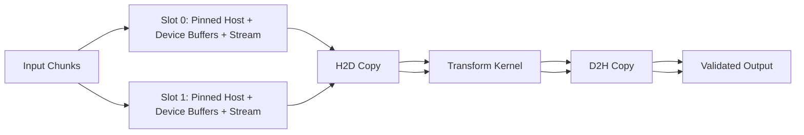

# Lab 03 — Build an Overlapped CUDA Pipeline

## Lab Metadata

| Field | Value |
|---|---|
| Volume | 03 — CUDA Fundamentals |
| Difficulty | Intermediate |
| Estimated time | 120–150 minutes |
| Lab level | L3 — Configuration and Performance |
| Target platform | Linux host with an NVIDIA GPU and CUDA Toolkit |
| Primary tools | `nvcc`, CUDA Runtime API, CUDA events, optional Nsight Systems |

## 1. Objective

Build a CUDA program that processes multiple data chunks through a host-to-device copy, kernel execution, and device-to-host copy pipeline. Establish a serial baseline, introduce pinned memory and multiple streams, verify correctness, measure overlap, inject a synchronization failure, and repair the design.

The goal is not to produce an impressive benchmark number. The goal is to prove which conditions create useful overlap and which mistakes silently serialize the workload.

## 2. Background

An asynchronous API call does not guarantee concurrent device execution. Copy-compute overlap requires suitable memory, independent buffers, separate streams, hardware support, and the absence of hidden global synchronization.

This lab uses a simple transformation kernel so the execution structure remains visible. The same design pattern appears in preprocessing pipelines, inference serving, video processing, and batched scientific workloads.

## 3. Learning Outcomes

After completing this lab, you will be able to:

- Build a serial CUDA copy-compute-copy baseline.
- Allocate and reuse pinned host memory.
- Create stream-owned pipeline slots.
- Record and synchronize CUDA events.
- Compare host elapsed time with device-stage timing.
- Verify whether operations overlap using a timeline.
- Diagnose hidden synchronization and premature buffer reuse.
- Explain how the lab design would change in production.

## 4. Architecture



**Figure 3.L3.1 — Double-buffered pipeline.** Each slot owns its buffers and stream until its completion event confirms safe reuse.

## 5. Prerequisites

### Hardware

- One CUDA-capable NVIDIA GPU
- Sufficient host and device memory for two pipeline slots

### Software

- Linux
- NVIDIA driver
- CUDA Toolkit with `nvcc`
- C++ compiler supported by the installed toolkit
- Optional: Nsight Systems command-line tooling

### Skills

- Compile a basic CUDA program
- Read C++ and CUDA Runtime API calls
- Understand grids, blocks, streams, and events

## 6. Environment

Record the environment:

```bash
nvidia-smi
nvcc --version
g++ --version
uname -r
```

Create a workspace:

```bash
mkdir -p ~/cuda-overlap-lab
cd ~/cuda-overlap-lab
```

## 7. Components

| Component | Purpose |
|---|---|
| Pageable baseline buffers | Demonstrate the conventional serial path |
| Pinned host buffers | Provide stable DMA source and destination memory |
| Device buffers | Hold one chunk per pipeline slot |
| CUDA streams | Maintain ordered work per slot |
| CUDA events | Mark slot completion and measure stages |
| Transform kernel | Apply deterministic work for correctness checks |
| Host timer | Measure end-to-end application duration |

## 8. Deployment Steps

### Step 1 — Create the Program

Create `overlap_pipeline.cu`:

```cpp
#include <cuda_runtime.h>

#include <chrono>
#include <cmath>
#include <cstdlib>
#include <iostream>
#include <stdexcept>
#include <vector>

#define CUDA_CHECK(call)                                                     \
    do {                                                                     \
        cudaError_t error__ = (call);                                         \
        if (error__ != cudaSuccess) {                                         \
            std::cerr << "CUDA error at " << __FILE__ << ':' << __LINE__     \
                      << ": " << cudaGetErrorString(error__) << std::endl;   \
            std::exit(EXIT_FAILURE);                                          \
        }                                                                    \
    } while (0)

__global__ void transform(const float* input, float* output, std::size_t n) {
    const std::size_t index = blockIdx.x * blockDim.x + threadIdx.x;
    if (index < n) {
        float value = input[index];
        for (int iteration = 0; iteration < 32; ++iteration) {
            value = value * 1.000001f + 0.000001f;
        }
        output[index] = value;
    }
}

float reference(float value) {
    for (int iteration = 0; iteration < 32; ++iteration) {
        value = value * 1.000001f + 0.000001f;
    }
    return value;
}

void validate(const float* input, const float* output, std::size_t n) {
    for (std::size_t i = 0; i < n; ++i) {
        const float expected = reference(input[i]);
        if (std::fabs(output[i] - expected) > 1e-4f) {
            throw std::runtime_error("validation failed at index " + std::to_string(i));
        }
    }
}

int main(int argc, char** argv) {
    const std::size_t totalElements = argc > 1 ? std::stoull(argv[1]) : (1ULL << 26);
    const std::size_t chunkElements = argc > 2 ? std::stoull(argv[2]) : (1ULL << 22);
    const int streamCount = 2;

    if (totalElements == 0 || chunkElements == 0) {
        std::cerr << "sizes must be greater than zero" << std::endl;
        return EXIT_FAILURE;
    }

    const std::size_t chunks = (totalElements + chunkElements - 1) / chunkElements;
    const std::size_t slotBytes = chunkElements * sizeof(float);

    std::vector<float> fullInput(totalElements);
    std::vector<float> fullOutput(totalElements, 0.0f);
    for (std::size_t i = 0; i < totalElements; ++i) {
        fullInput[i] = static_cast<float>(i % 1024) / 1024.0f;
    }

    float* hostInput[streamCount]{};
    float* hostOutput[streamCount]{};
    float* deviceInput[streamCount]{};
    float* deviceOutput[streamCount]{};
    cudaStream_t streams[streamCount]{};
    cudaEvent_t complete[streamCount]{};

    for (int slot = 0; slot < streamCount; ++slot) {
        CUDA_CHECK(cudaHostAlloc(&hostInput[slot], slotBytes, cudaHostAllocDefault));
        CUDA_CHECK(cudaHostAlloc(&hostOutput[slot], slotBytes, cudaHostAllocDefault));
        CUDA_CHECK(cudaMalloc(&deviceInput[slot], slotBytes));
        CUDA_CHECK(cudaMalloc(&deviceOutput[slot], slotBytes));
        CUDA_CHECK(cudaStreamCreateWithFlags(&streams[slot], cudaStreamNonBlocking));
        CUDA_CHECK(cudaEventCreateWithFlags(&complete[slot], cudaEventDisableTiming));
        CUDA_CHECK(cudaEventRecord(complete[slot], streams[slot]));
    }

    CUDA_CHECK(cudaDeviceSynchronize());
    const auto start = std::chrono::steady_clock::now();

    for (std::size_t chunk = 0; chunk < chunks; ++chunk) {
        const int slot = static_cast<int>(chunk % streamCount);
        const std::size_t offset = chunk * chunkElements;
        const std::size_t count = std::min(chunkElements, totalElements - offset);
        const std::size_t bytes = count * sizeof(float);

        CUDA_CHECK(cudaEventSynchronize(complete[slot]));

        std::copy_n(fullInput.data() + offset, count, hostInput[slot]);

        CUDA_CHECK(cudaMemcpyAsync(deviceInput[slot], hostInput[slot], bytes,
                                   cudaMemcpyHostToDevice, streams[slot]));

        const int threads = 256;
        const int blocks = static_cast<int>((count + threads - 1) / threads);
        transform<<<blocks, threads, 0, streams[slot]>>>(
            deviceInput[slot], deviceOutput[slot], count);
        CUDA_CHECK(cudaGetLastError());

        CUDA_CHECK(cudaMemcpyAsync(hostOutput[slot], deviceOutput[slot], bytes,
                                   cudaMemcpyDeviceToHost, streams[slot]));
        CUDA_CHECK(cudaEventRecord(complete[slot], streams[slot]));

        if (chunk >= static_cast<std::size_t>(streamCount)) {
            const std::size_t completedChunk = chunk - streamCount;
            const int completedSlot = static_cast<int>(completedChunk % streamCount);
            const std::size_t completedOffset = completedChunk * chunkElements;
            const std::size_t completedCount =
                std::min(chunkElements, totalElements - completedOffset);

            CUDA_CHECK(cudaEventSynchronize(complete[completedSlot]));
            std::copy_n(hostOutput[completedSlot], completedCount,
                        fullOutput.data() + completedOffset);
        }
    }

    const std::size_t drainStart = chunks > static_cast<std::size_t>(streamCount)
        ? chunks - streamCount : 0;

    for (std::size_t chunk = drainStart; chunk < chunks; ++chunk) {
        const int slot = static_cast<int>(chunk % streamCount);
        const std::size_t offset = chunk * chunkElements;
        const std::size_t count = std::min(chunkElements, totalElements - offset);
        CUDA_CHECK(cudaEventSynchronize(complete[slot]));
        std::copy_n(hostOutput[slot], count, fullOutput.data() + offset);
    }

    const auto stop = std::chrono::steady_clock::now();
    const double elapsedMs =
        std::chrono::duration<double, std::milli>(stop - start).count();

    validate(fullInput.data(), fullOutput.data(), totalElements);
    std::cout << "validated " << totalElements << " elements in "
              << elapsedMs << " ms using " << streamCount << " streams" << std::endl;

    for (int slot = 0; slot < streamCount; ++slot) {
        CUDA_CHECK(cudaEventDestroy(complete[slot]));
        CUDA_CHECK(cudaStreamDestroy(streams[slot]));
        CUDA_CHECK(cudaFree(deviceOutput[slot]));
        CUDA_CHECK(cudaFree(deviceInput[slot]));
        CUDA_CHECK(cudaFreeHost(hostOutput[slot]));
        CUDA_CHECK(cudaFreeHost(hostInput[slot]));
    }

    return EXIT_SUCCESS;
}
```

### Step 2 — Compile

```bash
nvcc -O3 -std=c++17 overlap_pipeline.cu -o overlap_pipeline
```

Expected result: a binary named `overlap_pipeline` and no compiler errors.

### Step 3 — Run the Pipeline

```bash
./overlap_pipeline
```

Expected output resembles:

```text
validated 67108864 elements in <measured> ms using 2 streams
```

The elapsed time is platform-specific. Do not publish it as a universal benchmark.

## 9. Validation

The program validates every output element against the CPU reference. A successful timing result without validation is not acceptable.

Run several sizes:

```bash
./overlap_pipeline $((1<<24)) $((1<<20))
./overlap_pipeline $((1<<26)) $((1<<22))
```

Confirm all runs report validation success.

## 10. Verification

### Verify Pinned Allocation

The source uses `cudaHostAlloc` for each pipeline slot. Confirm no per-chunk pinned allocation occurs inside the processing loop.

### Verify Stream Ownership

Each slot has distinct:

- Host input buffer
- Host output buffer
- Device input buffer
- Device output buffer
- Stream
- Completion event

### Verify Safe Reuse

The host waits for the slot's completion event before overwriting its pinned input or reading its pinned output.

## 11. Observability

If Nsight Systems is available, capture a timeline:

```bash
nsys profile --trace=cuda,nvtx,osrt --output=overlap-report ./overlap_pipeline
```

Open the generated report with the supported UI or inspect available command-line statistics.

Look for:

- Two CUDA streams
- Repeated H2D, kernel, and D2H sequences
- Copy activity overlapping kernel execution where supported
- Limited host gaps between submissions
- No device-wide synchronization inside the main loop

## 12. Performance Measurements

Record a table rather than one number:

| Run | Total elements | Chunk elements | Streams | End-to-end ms | Validation |
|---|---:|---:|---:|---:|---|
| A | | | 2 | | Pass/Fail |
| B | | | 2 | | Pass/Fail |

Repeat each configuration several times after warm-up. Report median and tail variation.

## 13. Failure Injection

### Failure A — Add Device-Wide Synchronization

Insert this line immediately after the kernel launch:

```cpp
CUDA_CHECK(cudaDeviceSynchronize());
```

Recompile and profile.

Expected effect: stream overlap decreases or disappears because every iteration waits for all preceding device work.

### Failure B — Remove Slot Completion Wait

Temporarily remove:

```cpp
CUDA_CHECK(cudaEventSynchronize(complete[slot]));
```

Do not use this version in production. Depending on timing, validation may fail because the host reuses a pinned buffer before the device finishes with it.

### Failure C — Replace Pinned Buffers

Replace `cudaHostAlloc` with ordinary host allocation and adjust cleanup. Profile the result. Depending on the runtime and transfer pattern, asynchronous behavior may be reduced or staging may appear.

## 14. Troubleshooting

### Problem — Compilation Fails

Check the toolkit and host compiler:

```bash
nvcc --version
g++ --version
```

Ensure the file extension is `.cu` and the toolkit supports the selected language standard.

### Problem — No CUDA Device

Run:

```bash
nvidia-smi
./overlap_pipeline
```

If `nvidia-smi` works but the application fails, inspect device visibility, container runtime, and loaded CUDA libraries in the same context.

### Problem — Validation Fails

Check:

- Slot reuse synchronization
- Chunk offsets and final partial chunk
- Error results after each kernel launch
- Whether an earlier asynchronous error surfaced late

### Problem — No Visible Overlap

Possible causes:

- Work units too small
- Kernel too short or too resource-intensive
- Hardware copy-engine limits
- Hidden synchronization
- Incorrect stream assignment
- Measurement after the pipeline has already serialized

### Problem — Host Memory Allocation Fails

The requested pinned pool may exceed policy or available locked memory. Reduce chunk size, inspect host limits, and avoid unbounded page-locked allocation.

## 15. Cleanup

```bash
cd ~
rm -rf ~/cuda-overlap-lab
```

If you need to retain results, archive only the source and sanitized profile report.

## 16. Summary

You built a bounded, double-buffered CUDA pipeline using pinned host memory, separate device buffers, non-blocking streams, and completion events. You validated correctness, measured end-to-end execution, and used failure injection to show how global synchronization and unsafe buffer reuse damage the design.

## 17. Challenge Exercises

1. Parameterize the stream count and compare 1, 2, 4, and 8 streams.
2. Add CUDA events around H2D, kernel, and D2H stages.
3. Add NVTX ranges for each chunk and slot.
4. Bind the process to the GPU-local NUMA node and compare transfer stability.
5. Replace the transform kernel with a memory-bound operation and explain the timeline.
6. Add a bounded work queue and backpressure policy.
7. Implement a single-stream debug mode selected by a command-line flag.

## 18. Further Reading

- [Streams, Events, and Asynchronous Execution](../chapter-07-streams-events-and-asynchronous-execution)
- [Pinned Memory and Transfer Overlap](../chapter-08-pinned-memory-and-transfer-overlap)
- [Synchronization, Errors, and Correctness](../chapter-06-synchronization-errors-and-correctness)
- [Profiling and Production Troubleshooting](../chapter-12-profiling-and-production-troubleshooting)
