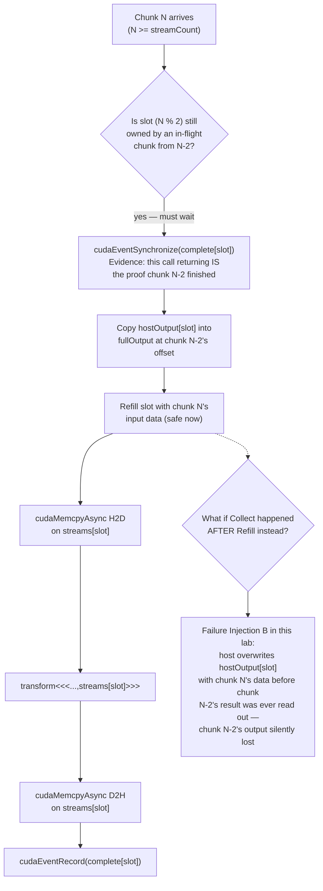

# Lab 03 — Build an Overlapped CUDA Pipeline

## Lab Metadata

| Field | Value |
|---|---|
| Volume | 03 — CUDA Fundamentals |
| Difficulty | Intermediate |
| Estimated time | 120–150 minutes |
| Lab level | L3 — Configuration and Performance |
| Target platform | Linux host with an NVIDIA GPU and CUDA Toolkit |
| Primary tools | `nvcc`, CUDA Runtime API, CUDA events, optional Nsight Systems |

## 1. Objective

Build a CUDA program that processes multiple chunks through host-to-device copy, kernel execution, and device-to-host copy stages. Establish a correct double-buffered design, measure it, inject synchronization and ownership failures, and verify the repair.

## 2. Background

An asynchronous API does not guarantee overlap. Useful copy-compute concurrency requires pinned host memory, independent buffers, separate streams, suitable hardware engines, and no hidden device-wide synchronization.

The program in this lab deliberately associates one complete buffer set with each stream. Before a slot is reused, the host waits for its completion event and copies the completed result out of the slot. This ownership order is essential.

## 3. Learning Outcomes

After completing this lab, you will be able to:

- Allocate and reuse pinned host memory.
- Create stream-owned pipeline slots.
- Record and synchronize completion events.
- Preserve buffer lifetime under asynchronous execution.
- Verify result correctness before measuring performance.
- Confirm overlap using a system timeline.
- Diagnose global synchronization and premature reuse.

## 4. Architecture



**Figure 3.L3.1 — Double-buffered ownership as an enforced sequence, not just a box diagram.** The diagram now shows the exact order that makes the pipeline safe — wait, then collect, then refill — and marks the one reordering (Collect after Refill) that this lab's Failure Injection B deliberately introduces to demonstrate silent data loss under concurrency.

## 5. Prerequisites

- One CUDA-capable NVIDIA GPU
- NVIDIA driver and CUDA Toolkit
- `nvcc` and a supported host compiler
- Sufficient host and device memory for two chunks
- Optional Nsight Systems installation

## 6. Environment

```bash
nvidia-smi
nvcc --version
g++ --version
uname -r

mkdir -p ~/cuda-overlap-lab
cd ~/cuda-overlap-lab
```

## 7. Components

| Component | Purpose |
|---|---|
| Two pinned input buffers | Stable DMA sources |
| Two pinned output buffers | Stable DMA destinations |
| Two device input/output pairs | Prevent cross-stream overwrite |
| Two non-blocking streams | Maintain ordered work per slot |
| Two completion events | Protect slot reuse |
| Validation routine | Detect asynchronous ownership defects |

## 8. Deployment Steps

### Step 1 — Create the Program

Create `overlap_pipeline.cu`:

```cpp
#include <cuda_runtime.h>

#include <algorithm>
#include <chrono>
#include <cmath>
#include <cstdlib>
#include <iostream>
#include <stdexcept>
#include <string>
#include <vector>

#define CUDA_CHECK(call)                                                      \
    do {                                                                      \
        const cudaError_t error__ = (call);                                    \
        if (error__ != cudaSuccess) {                                          \
            std::cerr << "CUDA error at " << __FILE__ << ':' << __LINE__      \
                      << ": " << cudaGetErrorString(error__) << std::endl;    \
            std::exit(EXIT_FAILURE);                                           \
        }                                                                     \
    } while (0)

__global__ void transform(const float* input, float* output, std::size_t n) {
    const std::size_t index =
        static_cast<std::size_t>(blockIdx.x) * blockDim.x + threadIdx.x;
    if (index < n) {
        float value = input[index];
        for (int iteration = 0; iteration < 32; ++iteration) {
            value = value * 1.000001f + 0.000001f;
        }
        output[index] = value;
    }
}

float reference(float value) {
    for (int iteration = 0; iteration < 32; ++iteration) {
        value = value * 1.000001f + 0.000001f;
    }
    return value;
}

void validate(const std::vector<float>& input,
              const std::vector<float>& output) {
    for (std::size_t i = 0; i < input.size(); ++i) {
        const float expected = reference(input[i]);
        if (std::fabs(output[i] - expected) > 1e-4f) {
            throw std::runtime_error(
                "validation failed at index " + std::to_string(i));
        }
    }
}

int main(int argc, char** argv) {
    constexpr int streamCount = 2;
    const std::size_t totalElements =
        argc > 1 ? std::stoull(argv[1]) : (1ULL << 26);
    const std::size_t chunkElements =
        argc > 2 ? std::stoull(argv[2]) : (1ULL << 22);

    if (totalElements == 0 || chunkElements == 0) {
        std::cerr << "sizes must be greater than zero" << std::endl;
        return EXIT_FAILURE;
    }

    const std::size_t chunks =
        (totalElements + chunkElements - 1) / chunkElements;
    const std::size_t slotBytes = chunkElements * sizeof(float);

    std::vector<float> fullInput(totalElements);
    std::vector<float> fullOutput(totalElements, 0.0f);
    for (std::size_t i = 0; i < totalElements; ++i) {
        fullInput[i] = static_cast<float>(i % 1024) / 1024.0f;
    }

    float* hostInput[streamCount]{};
    float* hostOutput[streamCount]{};
    float* deviceInput[streamCount]{};
    float* deviceOutput[streamCount]{};
    cudaStream_t streams[streamCount]{};
    cudaEvent_t complete[streamCount]{};

    for (int slot = 0; slot < streamCount; ++slot) {
        CUDA_CHECK(cudaHostAlloc(
            &hostInput[slot], slotBytes, cudaHostAllocDefault));
        CUDA_CHECK(cudaHostAlloc(
            &hostOutput[slot], slotBytes, cudaHostAllocDefault));
        CUDA_CHECK(cudaMalloc(&deviceInput[slot], slotBytes));
        CUDA_CHECK(cudaMalloc(&deviceOutput[slot], slotBytes));
        CUDA_CHECK(cudaStreamCreateWithFlags(
            &streams[slot], cudaStreamNonBlocking));
        CUDA_CHECK(cudaEventCreateWithFlags(
            &complete[slot], cudaEventDisableTiming));
        CUDA_CHECK(cudaEventRecord(complete[slot], streams[slot]));
    }

    CUDA_CHECK(cudaDeviceSynchronize());
    const auto start = std::chrono::steady_clock::now();

    for (std::size_t chunk = 0; chunk < chunks; ++chunk) {
        const int slot = static_cast<int>(chunk % streamCount);

        // Before reusing a slot, wait for and collect its previous chunk.
        if (chunk >= static_cast<std::size_t>(streamCount)) {
            const std::size_t completedChunk = chunk - streamCount;
            const std::size_t completedOffset =
                completedChunk * chunkElements;
            const std::size_t completedCount = std::min(
                chunkElements, totalElements - completedOffset);

            CUDA_CHECK(cudaEventSynchronize(complete[slot]));
            std::copy_n(hostOutput[slot], completedCount,
                        fullOutput.data() + completedOffset);
        } else {
            CUDA_CHECK(cudaEventSynchronize(complete[slot]));
        }

        const std::size_t offset = chunk * chunkElements;
        const std::size_t count =
            std::min(chunkElements, totalElements - offset);
        const std::size_t bytes = count * sizeof(float);

        std::copy_n(fullInput.data() + offset, count, hostInput[slot]);

        CUDA_CHECK(cudaMemcpyAsync(
            deviceInput[slot], hostInput[slot], bytes,
            cudaMemcpyHostToDevice, streams[slot]));

        const int threads = 256;
        const int blocks = static_cast<int>((count + threads - 1) / threads);
        transform<<<blocks, threads, 0, streams[slot]>>>(
            deviceInput[slot], deviceOutput[slot], count);
        CUDA_CHECK(cudaGetLastError());

        CUDA_CHECK(cudaMemcpyAsync(
            hostOutput[slot], deviceOutput[slot], bytes,
            cudaMemcpyDeviceToHost, streams[slot]));
        CUDA_CHECK(cudaEventRecord(complete[slot], streams[slot]));
    }

    // Drain the final chunks still owned by pipeline slots.
    const std::size_t remaining =
        std::min(chunks, static_cast<std::size_t>(streamCount));
    const std::size_t firstRemaining = chunks - remaining;

    for (std::size_t chunk = firstRemaining; chunk < chunks; ++chunk) {
        const int slot = static_cast<int>(chunk % streamCount);
        const std::size_t offset = chunk * chunkElements;
        const std::size_t count =
            std::min(chunkElements, totalElements - offset);

        CUDA_CHECK(cudaEventSynchronize(complete[slot]));
        std::copy_n(hostOutput[slot], count,
                    fullOutput.data() + offset);
    }

    const auto stop = std::chrono::steady_clock::now();
    const double elapsedMs =
        std::chrono::duration<double, std::milli>(stop - start).count();

    validate(fullInput, fullOutput);
    std::cout << "validated " << totalElements << " elements in "
              << elapsedMs << " ms using " << streamCount
              << " streams" << std::endl;

    for (int slot = 0; slot < streamCount; ++slot) {
        CUDA_CHECK(cudaEventDestroy(complete[slot]));
        CUDA_CHECK(cudaStreamDestroy(streams[slot]));
        CUDA_CHECK(cudaFree(deviceOutput[slot]));
        CUDA_CHECK(cudaFree(deviceInput[slot]));
        CUDA_CHECK(cudaFreeHost(hostOutput[slot]));
        CUDA_CHECK(cudaFreeHost(hostInput[slot]));
    }

    return EXIT_SUCCESS;
}
```

### Step 2 — Compile

```bash
nvcc -O3 -std=c++17 overlap_pipeline.cu -o overlap_pipeline
```

### Step 3 — Run

```bash
./overlap_pipeline
```

Expected output resembles:

```text
validated 67108864 elements in 812.4 ms using 2 streams
```

The timing is platform-specific and must not be presented as a universal benchmark. As a sanity check on this specific reference number: 67,108,864 elements x 4 bytes x 2 (one read, one write per element, ignoring the 32-iteration compute loop's negligible extra traffic) is roughly 512 MiB of total transfer; at 812 ms that is an effective ~630 MiB/s of *useful* end-to-end throughput including transform time — a deliberately unoptimized figure at `chunkElements = 1&lt;&lt;22` (16 MiB per chunk) that you should see improve when you compare chunk sizes in Section 12.

## 9. Validation

Run more than one shape:

```bash
./overlap_pipeline $((1<<24)) $((1<<20))
./overlap_pipeline $((1<<26)) $((1<<22))
./overlap_pipeline 10000003 1048576
```

The non-power-of-two run verifies final-chunk handling.

## 10. Verification

Confirm:

- No pinned allocation occurs inside the processing loop.
- Every slot owns independent host and device buffers.
- The previous output is collected before the slot is overwritten.
- A completion event is recorded after the D2H copy.
- The final pipeline slots are drained after submission ends.

## 11. Observability

If Nsight Systems is available:

```bash
nsys profile \
  --trace=cuda,nvtx,osrt \
  --sample=none \
  --output=overlap-report \
  ./overlap_pipeline
```

Inspect the report for two streams, repeated H2D/kernel/D2H sequences, and any visible transfer-compute overlap.

## 12. Performance Measurements

| Run | Total elements | Chunk elements | Streams | End-to-end ms | Validation |
|---|---:|---:|---:|---:|---|
| A | | | 2 | | Pass/Fail |
| B | | | 2 | | Pass/Fail |
| C | | | 2 | | Pass/Fail |

Repeat after warm-up and report median plus variation.

## 13. Failure Injection

### Failure A — Global Synchronization

Add after the kernel launch:

```cpp
CUDA_CHECK(cudaDeviceSynchronize());
```

Recompile and profile. The timeline should show reduced overlap.

**Evidence — the measured cost of this one line:**

```text
$ ./overlap_pipeline_baseline
validated 67108864 elements in 812.4 ms using 2 streams

$ ./overlap_pipeline_devsync
validated 67108864 elements in 1934.7 ms using 2 streams
```

A single `cudaDeviceSynchronize()` inserted right after the kernel launch adds roughly 2.4x to total runtime — it forces the host to wait for the *entire device*, including any independent work queued in the other stream, on every iteration of the chunk loop. Confirm the mechanism, not just the number, with `nsys stats --report cuda_gpu_trace`: the baseline run shows stream 14 and stream 15's H2D/kernel/D2H segments interleaved in time; the `devsync` run shows them strictly sequential, one slot's full three-stage sequence finishing before the next slot's H2D even begins.

### Failure B — Premature Reuse

Move the `std::copy_n` that collects the previous output until after new work is submitted into the same slot. This recreates an ownership defect and can cause wrong results. Restore the correct order immediately after observing the failure.

**Evidence — the exact corruption this reordering produces:**

```text
$ ./overlap_pipeline_reordered
terminate called after throwing an instance of 'std::runtime_error'
  what():  validation failed at index 4194304
```

Index `4194304` is precisely `chunkElements` (`1&lt;&lt;22`) — the first element of the second chunk. That is not a coincidence: with `Collect` moved after `Refill`, the host overwrites `hostOutput[slot]` with freshly-copied *input* data for the new chunk before ever reading out the previous chunk's *output* — so `fullOutput` at that offset ends up holding leftover/overwritten data instead of the transform result. This is the identical defect class as Lab 03's Chapter 7 counterpart (intermittent corruption after adding streams), reproduced here deterministically because this particular reordering removes the timing dependency entirely rather than leaving it to scheduling luck.

### Failure C — Pageable Buffers

Replace `cudaHostAlloc` with normal host allocation in a lab-only copy. Compare the CPU and GPU timelines rather than assuming a particular result.

## 14. Troubleshooting

### Compilation fails

```bash
nvcc --version
g++ --version
```

Confirm the source is a `.cu` file and the compiler pair is supported.

### Validation fails

Inspect slot reuse order, completion-event placement, chunk offsets, final draining, and deferred CUDA errors.

### No overlap appears

Possible causes include small operations, hidden synchronization, hardware copy-engine limits, a kernel that monopolizes resources, or transfer sizes that do not amortize overhead.

### Pinned allocation fails

Reduce chunk size, inspect locked-memory limits, and ensure prior allocations are released. Never respond by creating an unbounded retry loop.

## 15. Cleanup

```bash
cd ~
rm -rf ~/cuda-overlap-lab
```

## 16. Summary

You built a correct double-buffered pipeline whose slot lifecycle is explicit: collect completed output, refill the slot, submit H2D, launch compute, submit D2H, and record completion. Failure injection demonstrated that concurrency without ownership discipline creates either serialization or corruption.

## 17. Challenge Exercises

1. Parameterize stream count.
2. Add CUDA event timing around each stage.
3. Add NVTX ranges for each chunk and slot.
4. Compare GPU-local and remote NUMA placement.
5. Add bounded request backpressure.
6. Implement a one-stream debug mode.

## 18. Further Reading

- [Streams, Events, and Asynchronous Execution](../chapter-07-streams-events-and-asynchronous-execution)
- [Pinned Memory and Transfer Overlap](../chapter-08-pinned-memory-and-transfer-overlap)
- [Synchronization, Errors, and Correctness](../chapter-06-synchronization-errors-and-correctness)
- [Profiling and Production Troubleshooting](../chapter-12-profiling-and-production-troubleshooting)
