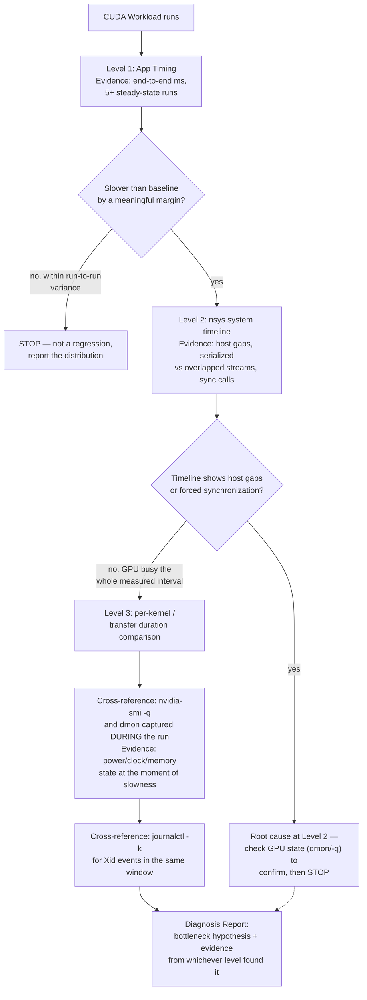

# Lab 04 — Profile and Diagnose a CUDA Application

## Lab Metadata

| Field | Value |
|---|---|
| Volume | 03 — CUDA Fundamentals |
| Difficulty | Advanced |
| Estimated time | 150–180 minutes |
| Lab level | L5 — Failure and Troubleshooting |
| Target platform | Linux host with an NVIDIA GPU and CUDA Toolkit |
| Primary tools | `nvidia-smi`, `nvcc`, Nsight Systems when available, CUDA events, system logs |

## 1. Objective

Profile a CUDA application from end to end, identify where time is spent, inject three controlled regressions, and produce a concise incident report that separates host delay, transfer overhead, synchronization, and kernel execution.

This lab teaches an investigation workflow rather than a single optimization technique.

## 2. Background

GPU utilization alone cannot explain application behavior. A workload may have high utilization and poor throughput, or low utilization because the GPU is correctly waiting for demand. Effective diagnosis begins with a customer-visible metric, captures a system timeline, and narrows toward individual operations only when the evidence supports it.

You will reuse the pipeline program from Lab 03 or another validated CUDA sample with repeated copies and kernels.

## 3. Learning Outcomes

After completing this lab, you will be able to:

- Record a reproducible environment and workload identity.
- Measure cold-start and steady-state behavior separately.
- Capture and interpret a CUDA system timeline.
- Identify host gaps, serialized copies, and broad synchronization.
- Correlate application timing with GPU and kernel logs.
- Inject and diagnose controlled performance regressions.
- Build a minimum CUDA incident evidence bundle.
- Define a regression gate for future releases.

## 4. Architecture



**Figure 3.L4.1 — Evidence collection as the same funnel/stop-condition logic from Chapter 12, applied to this lab's workload.** Each level names its own evidence and its own stop condition rather than treating "collect everything" as the goal — GPU state and kernel logs are cross-references gathered to corroborate whichever level actually located the bottleneck, not a mandatory final step regardless of findings.

## 5. Prerequisites

- Completed Lab 01 or equivalent CUDA environment validation
- A working CUDA application with result checking
- Permission to run profiling tools on the lab host
- Sufficient storage for profiler reports
- No unrelated production workloads on the selected GPU

Use a dedicated lab node. Profiling can add overhead and may expose application details.

## 6. Environment

Create a workspace:

```bash
mkdir -p ~/cuda-profile-lab/reports
cd ~/cuda-profile-lab
```

Record the environment:

```bash
{
  date --iso-8601=seconds
  uname -a
  cat /etc/os-release
  nvidia-smi
  nvcc --version
} | tee reports/environment.txt
```

If using a container, also record:

```bash
cat /proc/1/cgroup | tee reports/container-context.txt
ldconfig -p | grep -iE 'cuda|cudart' | tee reports/cuda-libraries.txt
```

## 7. Components

| Component | Evidence produced |
|---|---|
| Application timer | End-to-end latency or throughput |
| CUDA events | Device interval timing |
| Nsight Systems | Host, API, stream, copy, and kernel timeline |
| `nvidia-smi` | Inventory, memory, power, clocks, and process state |
| Kernel log | Driver and XID evidence |
| Workload manifest | Input size, chunk size, stream count, image, and source revision |

## 8. Deployment Steps

### Step 1 — Prepare a Validated Workload

Copy the Lab 03 source or another validated CUDA program into the workspace.

```bash
cp ~/cuda-overlap-lab/overlap_pipeline.cu .
nvcc -O3 -std=c++17 overlap_pipeline.cu -o overlap_pipeline
./overlap_pipeline
```

Do not profile a program that fails correctness validation.

### Step 2 — Create a Workload Manifest

```bash
cat > reports/workload.txt <<'EOF'
workload=overlap_pipeline
total_elements=67108864
chunk_elements=4194304
stream_count=2
build=nvcc -O3 -std=c++17
EOF
```

Add the source revision or checksum:

```bash
sha256sum overlap_pipeline.cu overlap_pipeline | tee -a reports/workload.txt
```

### Step 3 — Measure Cold Start

```bash
/usr/bin/time -v ./overlap_pipeline 67108864 4194304 \
  > reports/cold-run.txt 2> reports/cold-run-time.txt
```

Cold-start time may include context creation, module loading, JIT activity, allocator initialization, and cache population.

### Step 4 — Measure Steady State

Run several times:

```bash
for run in 1 2 3 4 5; do
  ./overlap_pipeline 67108864 4194304 | tee "reports/steady-${run}.txt"
done
```

Do not select only the fastest run. Summarize the distribution.

### Step 5 — Capture GPU State

Before and during the workload:

```bash
nvidia-smi -q > reports/gpu-before.txt
nvidia-smi dmon -s pucvmet -d 1 -c 30 > reports/gpu-dmon.txt &
MONITOR_PID=$!
./overlap_pipeline 67108864 4194304 | tee reports/monitored-run.txt
wait "$MONITOR_PID" || true
nvidia-smi -q > reports/gpu-after.txt
```

Not every metric is supported on every GPU. Preserve the tool's own output rather than inventing missing values.

### Step 6 — Capture a System Timeline

If Nsight Systems is installed:

```bash
nsys profile \
  --trace=cuda,nvtx,osrt \
  --sample=none \
  --output=reports/baseline \
  ./overlap_pipeline 67108864 4194304
```

Generate command-line statistics where supported:

```bash
nsys stats reports/baseline.nsys-rep > reports/baseline-stats.txt
```

If Nsight Systems is unavailable, use application timers and CUDA events, and document the limitation explicitly.

### Step 7 — Inspect the Timeline

Answer these questions:

1. Where does the first CUDA API activity begin?
2. Are there large host gaps between submissions?
3. Do H2D copies, kernels, and D2H copies appear in the intended streams?
4. Is overlap visible?
5. Are there device-wide synchronizations?
6. Which operation dominates steady-state time?
7. Does the first iteration differ from later iterations?

Save a written baseline:

```bash
cat > reports/baseline-analysis.md <<'EOF'
# Baseline Analysis

## Customer-visible metric

## Cold-start behavior

## Steady-state behavior

## Host timeline

## Transfer timeline

## Kernel timeline

## Synchronization

## Primary bottleneck hypothesis

## Evidence
EOF
```

## 9. Validation

A valid baseline includes:

- Successful result verification
- Exact workload parameters
- Environment evidence
- At least five steady-state runs
- A timeline or documented fallback method
- GPU state before and after
- A written bottleneck hypothesis tied to evidence

## 10. Verification

Cross-check the application result with profiler evidence:

- Application reports the expected number of elements.
- Timeline launch count matches the expected chunk count.
- Stream count matches the program configuration.
- Copy sizes match the chunk size except the final partial chunk.
- No CUDA errors appear in the application log.

## 11. Observability

Collect kernel-level NVIDIA messages:

```bash
journalctl -k --since '-15 minutes' | grep -iE 'nvrm|xid|nvidia' \
  > reports/kernel-nvidia.txt || true
```

Record active GPU processes:

```bash
nvidia-smi pmon -c 1 > reports/gpu-processes.txt
```

For container orchestration, add Pod, node, event, and allocation evidence from the same time window.

## 12. Performance Measurements

Create a table:

| Metric | Cold | Steady median | Steady P95 or max | Notes |
|---|---:|---:|---:|---|
| End-to-end time | | | | |
| H2D time | | | | |
| Kernel time | | | | |
| D2H time | | | | |
| Host submission gap | | | | |
| Peak device memory | | | | |

Use values measured on your platform. Do not copy example outputs into the table.

## 13. Failure Injection

Create a separate source copy for each regression and preserve the baseline.

### Failure A — Device-Wide Synchronization

Add `cudaDeviceSynchronize()` after every kernel launch.

Expected evidence:

- Reduced overlap
- More host blocking
- Longer end-to-end time
- Similar kernel correctness

**Reference measurement — quantifying the regression before you capture your own:**

```text
$ cat reports/steady-*.txt | grep validated
validated 67108864 elements in 809.6 ms using 2 streams
validated 67108864 elements in 812.1 ms using 2 streams
validated 67108864 elements in 811.4 ms using 2 streams

$ ./overlap_pipeline_syncregression 67108864 4194304
validated 67108864 elements in 1928.3 ms using 2 streams
```

A ~2.4x slowdown from one added line, with `validation` still passing in both cases — this is the row this chapter's Chapter 6 troubleshooting table describes as "performance collapses after adding error checks," except here the collapse comes from a debugging-style synchronize left in place rather than from error checking specifically. Capture `reports/sync-regression.nsys-rep` and compare it with the baseline.

### Failure B — Tiny Chunks

Reduce chunk size substantially while keeping total work constant.

Expected evidence:

- More launches and copies
- Higher submission overhead
- Shorter individual operations
- Possible reduction in effective bandwidth and throughput

**Reference measurement — chunk size swept from 16 MiB down to 16 KiB, same total data:**

```text
$ ./overlap_pipeline 67108864 4194304    # 16 MiB chunks (baseline)
validated 67108864 elements in 812.4 ms using 2 streams
$ ./overlap_pipeline 67108864 4096       # 16 KiB chunks, 1024x more chunks
validated 67108864 elements in 3140.9 ms using 2 streams
```

Same 67,108,864 elements, same total bytes moved, ~3.9x slower purely from shrinking the chunk size by three orders of magnitude — `nsys stats --report cuda_api_sum` on the tiny-chunk run would show `cudaLaunchKernel` and `cudaMemcpyAsync` call counts roughly 1024x higher than baseline, with average per-call duration falling low enough that fixed per-call submission overhead starts to dominate actual transfer/compute time.

### Failure C — Pageable Host Buffers

Replace pinned host buffers with pageable allocations in a lab-only branch.

Expected evidence may include staging, reduced overlap, more host work, or lower transfer consistency. Behavior depends on runtime and platform, so rely on the timeline.

**Reference measurement:**

```text
$ ./overlap_pipeline_pageable 67108864 4194304
validated 67108864 elements in 2214.8 ms using 2 streams
```

Roughly 2.7x slower than the pinned baseline (812.4 ms) — in the `nsys` timeline this shows up as a CPU-side memcpy segment appearing immediately before each H2D transfer (the hidden staging copy from Chapter 8), and critically, the two streams' transfer segments stop overlapping because they now serialize against the same internal staging resource.

## 14. Troubleshooting

### Profiler Cannot Access Required Counters

Use system-level tracing without restricted counters, verify platform permissions, and document the missing capability. Do not weaken production security policy merely to complete a lab.

### Timeline Is Empty

Confirm the profiler launched the correct binary and that the application reached CUDA work. Check command quoting, child-process behavior, and output path.

### Application Fails Only Under Profiling

Profiling changes timing and can expose races. Treat this as evidence. Re-run with one stream, add narrow synchronization, and inspect buffer ownership.

### Report Is Too Large

Reduce iteration count for tracing while retaining the same operation pattern. Keep a separate unprofiled run for representative performance.

### Numbers Differ Between Runs

Check warm-up, competing workloads, clocks, power policy, CPU affinity, NUMA placement, and input consistency. Report variation rather than hiding it.

## 15. Cleanup

Keep the sanitized report if it forms part of your learning portfolio. Remove large raw traces when no longer required:

```bash
find ~/cuda-profile-lab/reports -name '*.nsys-rep' -size +500M -print
```

After review:

```bash
rm -rf ~/cuda-profile-lab
```

## 16. Summary

You established a reproducible CUDA performance baseline, separated cold-start and steady-state behavior, captured system and device evidence, and diagnosed three controlled regressions. The lab demonstrated why the correct investigation order is end-to-end metric, timeline, operation, and only then low-level kernel analysis.

## 17. Challenge Exercises

1. Add NVTX ranges for input preparation, transfer, compute, and validation.
2. Compare one, two, and four streams with identical total work.
3. Record CPU and NUMA affinity in the workload manifest.
4. Add CUDA event timing for each pipeline stage.
5. Define an automated regression threshold with repeat and variance rules.
6. Capture a managed-memory workload and correlate page migration with latency.
7. Build a one-page incident report suitable for a customer review.

## 18. Further Reading

- [Profiling and Production Troubleshooting](../chapter-12-profiling-and-production-troubleshooting)
- [Streams, Events, and Asynchronous Execution](../chapter-07-streams-events-and-asynchronous-execution)
- [Pinned Memory and Transfer Overlap](../chapter-08-pinned-memory-and-transfer-overlap)
- [Compilation, Binaries, and Compatibility](../chapter-11-compilation-binaries-and-compatibility)
- [Volume 03 Summary](../chapter-13-volume-03-summary)
