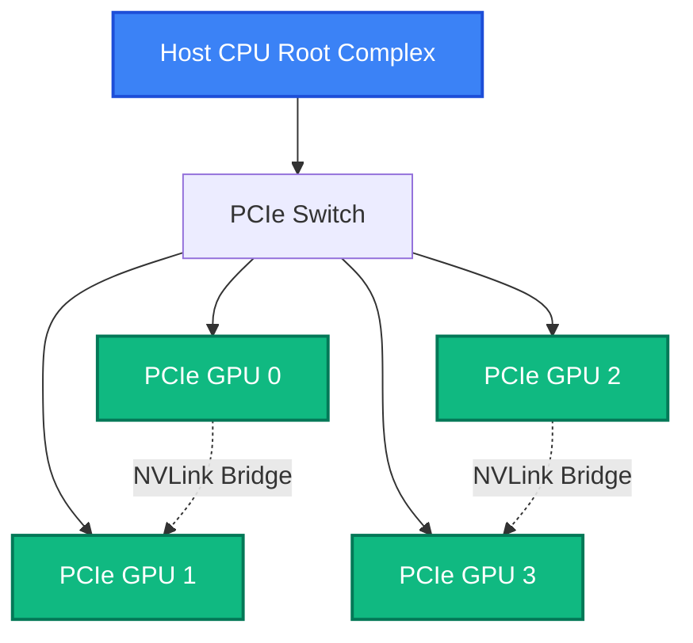

# Accelerator Architecture and Form Factors Masterclass

A platform team is asked to buy GPUs for three distinct workloads: low-latency recommendation inference, large-scale distributed LLM training, and high-fidelity physics simulations. Procurement demands a single standardized GPU SKU to simplify purchasing. 

Standardization is tempting, but a single accelerator cannot optimize every workload constraint simultaneously. A design maximizing memory capacity and scale-up bandwidth inevitably breaches the power envelope and cost justification for edge inference. Conversely, a compact PCIe card excelling in inference lacks the baseboard topology, interconnect bandwidth, and thermal dissipation required for multi-node distributed training. The NVIDIA portfolio splits precisely because physical constraints—power, thermals, topology, memory bandwidth, and physical volume—diverge.

## The Accelerator Portfolio Taxonomy

NVIDIA categorizes its data-center accelerators fundamentally by their primary optimization target, which inherently dictates their form factor and thermal constraints.

1. **Maximum Throughput and Scale-Up (SXM / HGX / OAM)**
   - **Examples:** V100, A100, H100, B200 (SXM variants).
   - **Design Goal:** Absolute maximum FLOPs, maximum memory bandwidth (HBM), and highest-speed inter-GPU communication (NVLink/NVSwitch).
   - **Trade-offs:** Extreme thermal density (300W to 1200W+ per die). Requires custom server chassis, advanced cooling (liquid), and operates outside standard ATX/PCIe server standards.

2. **Universal PCIe / Mainstream Compute**
   - **Examples:** A30, L40S.
   - **Design Goal:** High performance within the constraints of standard PCIe server slots (typically 250W–350W TDP). Balanced memory (GDDR) and compute.
   - **Trade-offs:** Lower GPU-to-GPU bandwidth (NVLink Bridges or PCIe bottleneck). Lower absolute memory bandwidth compared to HBM.

3. **Inference and Edge Density**
   - **Examples:** T4, L4.
   - **Design Goal:** Maximum requests per second per watt. Fits into low-profile, single-slot 70W-75W PCIe envelopes.
   - **Trade-offs:** Strict memory capacity limits (16GB-24GB) and lack of scale-up interconnects.

## Form Factor Physics: PCIe vs. SXM

Two GPUs from the exact same silicon generation can dictate completely different cluster topologies based solely on their form factor. 

### The PCIe Form Factor
PCIe (Peripheral Component Interconnect Express) is the universal server standard. 
- **Topology:** GPUs are independent endpoints on the CPU's PCIe root complex or separated by PCIe switches.
- **Power:** Capped practically at ~300W-350W for a double-wide card (utilizing 8-pin auxiliary or 12VHPWR connectors).
- **Communication:** GPU-to-GPU data transfers usually cross the host PCIe root complex, incurring high latency and severe bandwidth limitations (e.g., PCIe Gen4 x16 caps at ~32 GB/s per direction). NVLink bridges can connect *pairs* of PCIe cards (e.g., A100 PCIe with 600 GB/s), but not entire 8-GPU sets.
- **Cooling:** Relies on server chassis fans pushing air front-to-back over passive heatsinks.



### The SXM Form Factor (HGX Baseboards)
SXM (Server pcie eXtended Module) abandons the standard slot for a high-density socket on a custom baseboard.
- **Topology:** 4 or 8 GPUs mounted onto an HGX baseboard. GPUs communicate natively through on-board NVSwitches in a non-blocking all-to-all topology.
- **Power:** Unconstrained by PCIe limits. SXM variants push 400W (A100), 700W (H100), to over 1000W+ (B200).
- **Communication:** NVLink bandwidth reaches 900 GB/s (Hopper) or 1.8 TB/s (Blackwell) per GPU. Any GPU on the baseboard can read/write memory of any other GPU at near native HBM speeds.
- **Cooling:** Demands monumental air-flow (massive mid-plane fans) or Direct-to-Chip (D2C) liquid cooling.

## Architectural Generation Shifts

A hardware generation is not merely a bump in clock speed; it is an engineering response to the bottlenecks of the prior era.

- **Volta (V100):** Introduced Tensor Cores (mixed-precision matrix multiply units) to resolve the compute bottlenecks of deep learning.
- **Ampere (A100):** Addressed multi-tenancy and resource waste. Introduced Multi-Instance GPU (MIG) allowing physical hardware isolation for smaller inference workloads. Moved to TF32 to eliminate code changes while boosting performance.
- **Hopper (H100):** Confronted the transformer explosion. Introduced the Transformer Engine (dynamic scaling between FP8 and FP16), expanded SM (Streaming Multiprocessor) asynchronous execution to hide memory latency, and introduced PCIe Gen5 to alleviate host bottlenecks.
- **Blackwell (B200):** Tackled the physical reticle limit of silicon. Uses two compute reticles bound together via a 10 TB/s high-bandwidth interface (HBI), appearing as a single GPU to software, with native support for FP4 precision.

## Production Bottlenecks & Troubleshooting

**The "High Idle" Symptom in PCIe Systems:**
Often, data scientists complain of slow distributed training on PCIe nodes, despite `nvidia-smi` showing GPUs at 100% power limit intermittently. The bottleneck is the interconnect. If NCCL (NVIDIA Collective Communication Library) falls back to routing gradients over PCIe instead of NVLink, communication time dominates compute time. 

**Diagnostic:**
```bash
# Verify NVLink status
nvidia-smi nvlink -s
```
If this shows zero links or errors, NCCL will default to the host root complex, devastating performance.

## Senior Interview Scenarios

**Scenario:** You are deploying an 8-GPU node for serving a colossal language model (e.g., Llama 3 70B). Do you choose 8x L40S (PCIe) or 8x H100 (SXM)?

**Expert Answer:**
The selection hinges on the model's parallelization strategy. A 70B model requires roughly 140GB of VRAM merely for FP16 weights, forcing tensor parallelism across multiple GPUs. 
In a PCIe topology (L40S), tensor parallelism is crippled by PCIe bandwidth (64 GB/s aggregate). Every layer requires an all-reduce operation across GPUs. The L40S node will suffer massive communication latency, destroying Token-to-Token (TTFT) and generation speeds. 
The H100 SXM node uses NVSwitch (900 GB/s per GPU). Tensor parallelism operates synchronously without host-bus overhead. The SXM node is mandatory for latency-sensitive, multi-GPU LLM inference.
