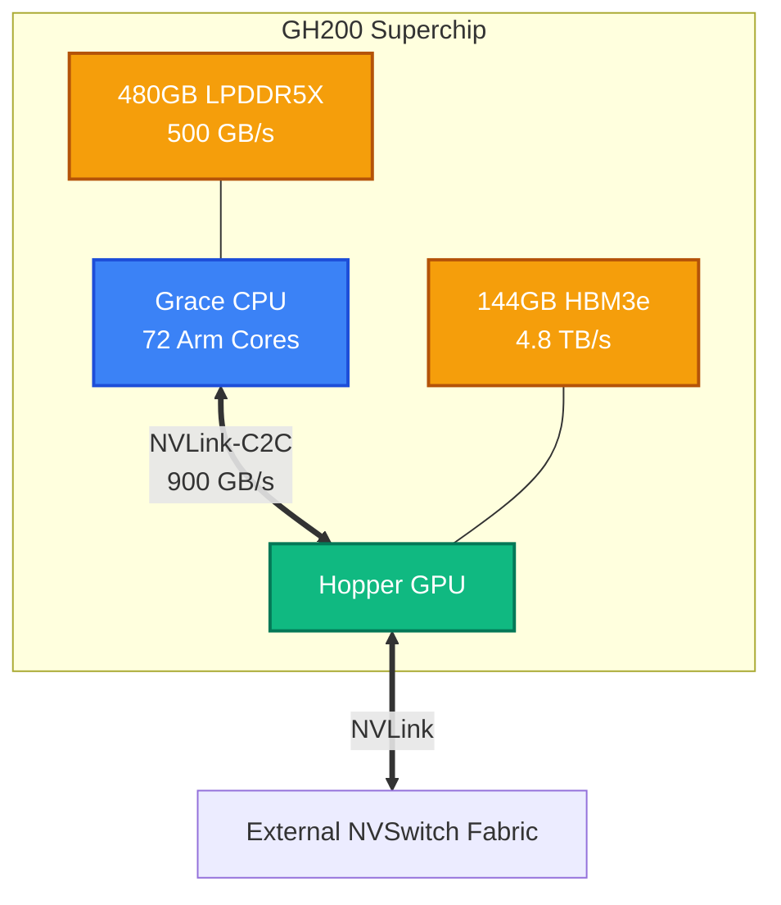

# Grace and Superchips Architecture Masterclass

For decades, the GPU attached to the host CPU via PCIe. PCIe is a general-purpose, ubiquitous I/O bus, but it fundamentally treats the accelerator as a peripheral. The CPU and GPU maintain isolated memory spaces. Any data required by the GPU must be explicitly copied across the PCIe bus—a link that caps at roughly 64 GB/s (Gen5 x16), which is orders of magnitude slower than native GPU High Bandwidth Memory (HBM, 3+ TB/s).

For highly dense workloads, this copy is a negligible rounding error. However, for workloads bound by CPU-GPU data movement—colossal embedding tables, KV-cache offloading, complex graph analytics, or highly iterative data processing pipelines—the PCIe bus becomes the ultimate system bottleneck. 

NVIDIA's architectural response is the **Superchip**: binding a custom CPU and a flagship GPU via a dedicated, coherent interconnect.

## The Grace CPU Architecture

Grace is not simply another x86 alternative; it is a purpose-built, Arm-based data center CPU engineered to resolve data starvation for accelerators.

- **Cores:** 72 ARM Neoverse V2 cores per die.
- **Memory System:** Instead of standard DDR5, Grace utilizes LPDDR5X with ECC. This provides ~500 GB/s of bandwidth per CPU at dramatically lower power consumption than traditional DIMMs.
- **Goal:** Provide massive integer compute and high-bandwidth host memory, while leaving the majority of the node's power budget available for the GPU.

## NVLink-C2C: Breaking the PCIe Barrier

The linchpin of the Superchip architecture is **NVLink-C2C** (Chip-to-Chip).

Rather than routing through PCIe, the Grace CPU and the Hopper (or Blackwell) GPU are physically fused on the same PCB and connected via NVLink-C2C.
- **Bandwidth:** 900 GB/s bidirectional bandwidth between CPU and GPU. This is 7x faster than PCIe Gen5.
- **Coherency:** NVLink-C2C provides hardware cache coherency. The CPU and GPU share a unified, flat memory address space. 

**The Software Impact:**
Developers no longer write explicit `cudaMemcpy` operations. A CUDA kernel running on the H100 can directly dereference a pointer residing in the Grace CPU's LPDDR5X memory. A page fault occurs, and the data is fetched across the 900 GB/s link instantly. This fundamentally alters algorithms for graph neural networks and massive recommendation engines that exceed GPU VRAM.

## The Superchip Topologies

### GH200 (Grace Hopper Superchip)
The GH200 binds one 72-core Grace CPU to one H100 GPU.
- **Memory Pool:** 96GB or 144GB of HBM3/HBM3e (GPU) + 480GB of LPDDR5X (CPU).
- **Scale-Up:** Utilizing the NVLink Switch System, up to 256 GH200 superchips can be linked into a single massively parallel system (the DGX GH200). Every GPU can access the memory of every other GPU *and* every other Grace CPU in the cluster at 900 GB/s.

### GB200 (Grace Blackwell Superchip)
The GB200 alters the ratio, binding **one Grace CPU to two Blackwell GPUs**.
- **Architecture:** Since a single Blackwell GPU is already two compute reticles bound together, a GB200 node effectively houses one Grace CPU interacting with four Blackwell compute dies.
- **Rack Scale:** GB200 systems are inherently designed for rack-scale, liquid-cooled deployments (NVL72), tightly coupling 72 Blackwell GPUs in a single NVLink domain.

## Production Bottlenecks & Troubleshooting

**The "NUMA Nightmare" Resolved:**
In traditional dual-socket x86 PCIe systems (e.g., 2x Intel/AMD CPUs, 8x GPUs), PCIe switches partition the GPUs. If GPU 0 (attached to CPU 0) attempts to access memory on CPU 1, the data must traverse the PCIe bus, cross the QPI/UPI CPU-to-CPU interconnect, and go down the other PCIe bus. This causes severe latency spikes and unpredictable performance drops.
**The Superchip Solution:** The GH200 is inherently a 1:1 design (or 1:2 in GB200). There is no UPI/QPI traversal. Every GPU has a direct, dedicated, 900 GB/s path to its host memory. Complex NUMA tuning and PCIe affinity pinning (`numactl`) are entirely eliminated from operations.

## Senior Interview Scenarios

**Scenario:** A recommendation system team wants to migrate from traditional x86 + H100 PCIe nodes to GH200 Superchips. Their embedding tables are 300GB, which exceeds the H100's HBM capacity. How does the GH200 solve this?

**Expert Answer:**
In the traditional x86 PCIe setup, the 300GB embedding table must reside in host DDR5 memory. Every time the GPU requires embedding lookups, it suffers a severe bottleneck pulling that data over the 64 GB/s PCIe bus, strangling the training step. 
With the GH200, the 300GB table resides in the Grace CPU's LPDDR5X memory. The GPU can perform direct memory access via NVLink-C2C at 900 GB/s. Furthermore, because of hardware cache coherency, the software no longer needs to manage explicit buffering and copying; the GPU kernels directly map the host memory, vastly simplifying the pipeline while providing a 14x bandwidth increase for the memory bottleneck.
