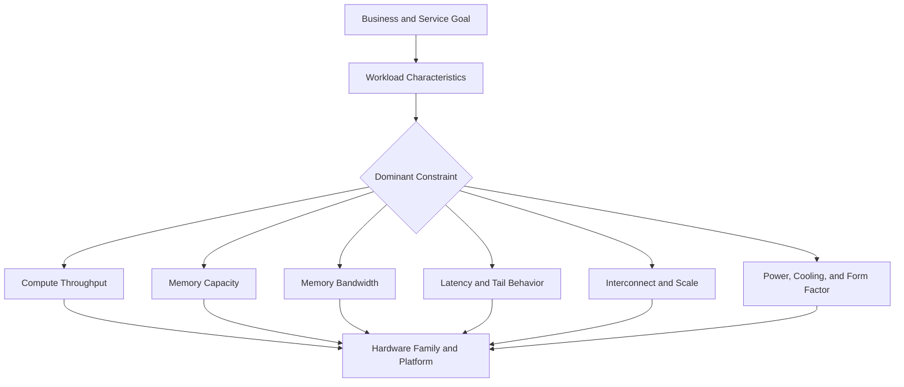

# Why NVIDIA Has Multiple GPU Families

A platform team is asked to buy GPUs for three projects. The first project serves a recommendation model with strict latency targets. The second trains a large language model across many nodes. The third runs visualization and simulation workloads for engineering teams. Procurement asks for one standardized GPU model to simplify purchasing and operations.

Standardization is valuable, but a single accelerator cannot optimize every workload simultaneously. A design that maximizes memory capacity and scale-up bandwidth may consume more power and cost than an edge inference service can justify. A compact PCIe card that performs efficiently for inference may lack the memory, interconnect, or thermal envelope required for large distributed training. The portfolio exists because the constraints are different.

## Learning Objectives

After completing this chapter, you will be able to:

- explain why accelerator families diverge;
- classify workloads before discussing products;
- distinguish compute, memory, interconnect, and deployment constraints;
- identify when standardization helps and when it creates technical debt;
- structure a customer hardware-discovery conversation.

## The First Principle: Hardware Follows Work

The useful question is not, “Which GPU is fastest?” It is, “Which system constraint prevents the workload from meeting its objective?”

**Figure 4.1.1 — Product selection is a constraint-resolution process.** Different dominant constraints naturally produce different accelerator families.

## Why the Portfolio Diverges

### Compute behavior

Scientific workloads may depend on high-precision arithmetic. AI training frequently emphasizes tensor operations at reduced precision. Graphics and visualization require rendering-oriented capabilities. Inference may prioritize predictable latency, energy efficiency, and concurrency rather than maximum aggregate training throughput.

A single die can contain several execution engines, but allocating silicon area always involves trade-offs. More cache, more memory controllers, more specialized matrix units, or more graphics capability all compete for area, power, and design complexity.

### Memory capacity and bandwidth

Model weights, optimizer states, activations, and key-value caches create different memory requirements. A model that does not fit in device memory forces partitioning, offload, quantization, or a different accelerator. Even when a model fits, performance may remain limited by how quickly data can be supplied to execution units.

Memory capacity answers, “Can the workload fit?” Memory bandwidth answers, “Can the workload feed the compute engines quickly enough?” Both questions matter, and they are not interchangeable.

### Scale-up and scale-out communication

A single-GPU workload does not require the same interconnect architecture as an eight-GPU node or a thousand-GPU training cluster. Large synchronized workloads need fast paths for collective communication. The platform may therefore prioritize NVLink, NVSwitch, high-speed network adapters, and topology-aware integration.

### Form factor and facility limits

PCIe cards, integrated modules, workstation products, and data-center systems occupy different power and cooling envelopes. A technically appropriate accelerator is still unusable when the chassis cannot supply power, the rack cannot remove heat, or the data center cannot support the required density.

### Support and lifecycle

Enterprise customers also buy lifecycle properties: validated driver branches, firmware management, security response, vendor support, supply continuity, and platform certification. Consumer, professional visualization, and data-center products may share architectural ancestry while differing significantly in their operational contract.

## A Practical Classification Model

| Workload class | Primary concern | Secondary concerns | Typical architectural emphasis |
|---|---|---|---|
| Real-time inference | Tail latency | Power, concurrency, cost | Efficient compute, adequate memory, compact deployment |
| Batch inference | Throughput per cost | Utilization, scheduling | High concurrency and energy efficiency |
| Fine-tuning | Memory capacity | Interconnect, software support | Training-capable tensor compute and sufficient memory |
| Large-scale training | Aggregate throughput | Scale-up and scale-out bandwidth | HBM, NVLink/NVSwitch, high-speed network fabric |
| HPC simulation | Precision and bandwidth | Communication, CPU balance | Appropriate numeric formats and strong memory subsystem |
| Visualization | Graphics pipeline | Display, media, workstation integration | Rendering and visualization features |

The table is not a product recommendation. It is a discovery tool. Real workloads often combine categories, and the architect must identify which objective has priority.

## When Standardization Helps

Standardization reduces image sprawl, spare-part diversity, qualification effort, scheduler fragmentation, and troubleshooting complexity. A fleet with fewer accelerator types is easier to operate.

However, standardization becomes harmful when the chosen device is materially oversized for common workloads or incapable of supporting critical ones. The correct target is usually **controlled variety**: a small number of validated hardware pools aligned to distinct workload classes.

## Customer Scenario

A bank proposes one high-end training accelerator for every AI workload. The architecture team discovers that most production traffic is moderate-size inference, while a smaller research group performs periodic distributed training.

A more defensible design separates the platform into two pools. The inference pool is optimized for service density, predictable latency, and cost. The training pool is optimized for memory, collective communication, and checkpoint throughput. Standardization is retained inside each pool without forcing incompatible workloads onto one hardware profile.

## Troubleshooting the Wrong Hardware Decision

**Symptoms**

- low utilization despite expensive accelerators;
- models fail to load because memory estimates were incomplete;
- distributed jobs scale poorly;
- rack power or cooling limits delay deployment;
- inference cost remains high even at healthy utilization.

**Diagnosis**

1. Restate the service-level and business objective.
2. Measure model size, precision, batch behavior, and concurrency.
3. Separate compute time from memory, host, storage, and network time.
4. Inspect topology and communication volume.
5. Compare facility assumptions with the proposed system envelope.

**Root cause**

The product was selected before the workload and operational constraints were understood.

**Prevention**

Require a workload-characterization document and a decision matrix before approving a hardware standard.

## Interview Preparation

### Architecture question

Why might the fastest training accelerator be a poor default for enterprise inference?

A strong answer discusses latency objectives, utilization, memory needs, power, cost, form factor, operational standardization, and the difference between peak benchmark throughput and delivered service economics.

### Customer question

A customer asks, “Which NVIDIA GPU should we buy?” How do you respond?

Begin with discovery: workload type, model size, precision, concurrency, latency or throughput target, scale, software stack, facility constraints, budget, lifecycle expectations, and growth. Only then produce a shortlist and explain trade-offs.

## Key Takeaways

- NVIDIA has multiple GPU families because workloads and deployment constraints differ.
- Peak compute alone is not a sufficient selection criterion.
- Memory, interconnect, power, form factor, software support, and lifecycle all influence the decision.
- Standardization should reduce operational complexity without erasing meaningful workload boundaries.
- An architect recommends hardware only after identifying the dominant constraint.

## Cross References

- [Volume 04 Introduction](./index)
- [Volume 02 — GPU Architecture](../volume-02/index)
- [Volume 03 — CUDA Fundamentals](../volume-03/index)
