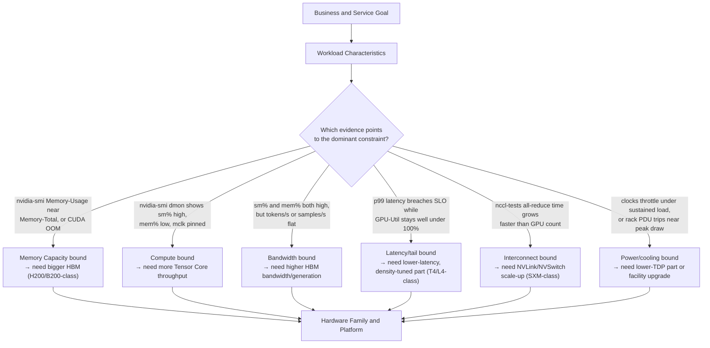

# Why NVIDIA Has Multiple GPU Families

A platform team is asked to buy GPUs for three projects. The first project serves a recommendation model with strict latency targets. The second trains a large language model across many nodes. The third runs visualization and simulation workloads for engineering teams. Procurement asks for one standardized GPU model to simplify purchasing and operations.

Standardization is valuable, but a single accelerator cannot optimize every workload simultaneously. A design that maximizes memory capacity and scale-up bandwidth may consume more power and cost than an edge inference service can justify. A compact PCIe card that performs efficiently for inference may lack the memory, interconnect, or thermal envelope required for large distributed training. The portfolio exists because the constraints are different.

## Learning Objectives

After completing this chapter, you will be able to:

- explain why accelerator families diverge;
- classify workloads before discussing products;
- distinguish compute, memory, interconnect, and deployment constraints;
- identify when standardization helps and when it creates technical debt;
- structure a customer hardware-discovery conversation.

## The First Principle: Hardware Follows Work

The useful question is not, “Which GPU is fastest?” It is, “Which system constraint prevents the workload from meeting its objective?”



**Figure 4.1.1 — Product selection is a constraint-resolution process, proven by evidence, not guessed.** The diamond is the actual triage step an architect performs: each branch names the specific command output or metric that justifies picking that constraint over the others, so the diagram doubles as a fault-isolation checklist, not just a taxonomy of concerns.

**Reading the evidence, concretely — a two-GPU comparison that shows why "dominant constraint" isn't abstract:**

```bash
$ nvidia-smi --query-gpu=name,memory.total,memory.used,utilization.gpu,utilization.memory --format=csv
name, memory.total [MiB], memory.used [MiB], utilization.gpu [%], utilization.memory [%]
NVIDIA T4, 15360 MiB, 14210 MiB, 88 %, 34 %
NVIDIA H100 80GB HBM3, 81920 MiB, 71200 MiB, 91 %, 89 %
```

Both GPUs report similarly high `utilization.gpu` (88% and 91%), so a shallow read says "both are working hard, roughly equally busy." The rows tell a different story once you also read `utilization.memory` (the fraction of time the memory subsystem was busy, a proxy for bandwidth pressure) alongside capacity: the T4 is at 92% of its 15GB HBM capacity with only 34% memory-subsystem activity — it is **capacity-bound**, one more concurrent request away from a CUDA OOM, but not bandwidth-starved. The H100 is at 87% of its 80GB capacity *and* 89% memory utilization — it has room before OOM, but its bottleneck is more likely **bandwidth**, because the memory subsystem is nearly as busy as the compute engines. Two GPUs, two different dominant constraints, same `utilization.gpu` headline number — which is exactly why the decision diamond above asks for more than one metric before naming a constraint.

## Why the Portfolio Diverges

### Compute behavior

Scientific workloads may depend on high-precision arithmetic. AI training frequently emphasizes tensor operations at reduced precision. Graphics and visualization require rendering-oriented capabilities. Inference may prioritize predictable latency, energy efficiency, and concurrency rather than maximum aggregate training throughput.

A single die can contain several execution engines, but allocating silicon area always involves trade-offs. More cache, more memory controllers, more specialized matrix units, or more graphics capability all compete for area, power, and design complexity.

### Memory capacity and bandwidth

Model weights, optimizer states, activations, and key-value caches create different memory requirements. A model that does not fit in device memory forces partitioning, offload, quantization, or a different accelerator. Even when a model fits, performance may remain limited by how quickly data can be supplied to execution units.

Memory capacity answers, “Can the workload fit?” Memory bandwidth answers, “Can the workload feed the compute engines quickly enough?” Both questions matter, and they are not interchangeable.

**A concrete case where both questions get different answers on the same GPU:** a 13B-parameter model at FP16 needs `13,000,000,000 × 2 bytes ≈ 26 GB` for weights alone. On a 24GB card (an L4-class part), that already fails to fit before a single request arrives — a pure capacity failure, and no amount of bandwidth fixes it. On an 80GB H100, the same 26GB of weights fits with room to spare — but at high concurrency, each generated token still requires reading the entire 26GB of weights plus a growing KV cache from HBM, repeatedly. If HBM bandwidth can't keep those reads fed as fast as the SMs consume them, tokens/s drops even though `memory.used` never gets close to `memory.total`. Same 26GB model, two completely different failure modes depending on which axis — capacity or bandwidth — is the actual constraint.

### Scale-up and scale-out communication

A single-GPU workload does not require the same interconnect architecture as an eight-GPU node or a thousand-GPU training cluster. Large synchronized workloads need fast paths for collective communication. The platform may therefore prioritize NVLink, NVSwitch, high-speed network adapters, and topology-aware integration.

### Form factor and facility limits

PCIe cards, integrated modules, workstation products, and data-center systems occupy different power and cooling envelopes. A technically appropriate accelerator is still unusable when the chassis cannot supply power, the rack cannot remove heat, or the data center cannot support the required density.

### Support and lifecycle

Enterprise customers also buy lifecycle properties: validated driver branches, firmware management, security response, vendor support, supply continuity, and platform certification. Consumer, professional visualization, and data-center products may share architectural ancestry while differing significantly in their operational contract.

## A Practical Classification Model

| Workload class | Primary concern | Secondary concerns | Typical architectural emphasis |
|---|---|---|---|
| Real-time inference | Tail latency | Power, concurrency, cost | Efficient compute, adequate memory, compact deployment |
| Batch inference | Throughput per cost | Utilization, scheduling | High concurrency and energy efficiency |
| Fine-tuning | Memory capacity | Interconnect, software support | Training-capable tensor compute and sufficient memory |
| Large-scale training | Aggregate throughput | Scale-up and scale-out bandwidth | HBM, NVLink/NVSwitch, high-speed network fabric |
| HPC simulation | Precision and bandwidth | Communication, CPU balance | Appropriate numeric formats and strong memory subsystem |
| Visualization | Graphics pipeline | Display, media, workstation integration | Rendering and visualization features |

The table is not a product recommendation. It is a discovery tool. Real workloads often combine categories, and the architect must identify which objective has priority.

## When Standardization Helps

Standardization reduces image sprawl, spare-part diversity, qualification effort, scheduler fragmentation, and troubleshooting complexity. A fleet with fewer accelerator types is easier to operate.

However, standardization becomes harmful when the chosen device is materially oversized for common workloads or incapable of supporting critical ones. The correct target is usually **controlled variety**: a small number of validated hardware pools aligned to distinct workload classes.

## Customer Scenario

A bank proposes one high-end training accelerator for every AI workload. The architecture team discovers that most production traffic is moderate-size inference, while a smaller research group performs periodic distributed training.

A more defensible design separates the platform into two pools. The inference pool is optimized for service density, predictable latency, and cost. The training pool is optimized for memory, collective communication, and checkpoint throughput. Standardization is retained inside each pool without forcing incompatible workloads onto one hardware profile.

## Troubleshooting the Wrong Hardware Decision

| Symptom | Evidence to collect | What it usually means |
|---|---|---|
| Low utilization despite expensive accelerators | `nvidia-smi dmon -s pucvmet` sampled over the actual traffic window | Workload doesn't need this device class — see worked check below |
| Models fail to load because memory estimates were incomplete | `nvidia-smi --query-gpu=memory.used,memory.total --format=csv` at peak concurrency, compared to the weights-only estimate | Capacity was sized on weights alone, ignoring KV cache/activations/framework overhead |
| Distributed jobs scale poorly | `nccl-tests` all-reduce bandwidth at 1, 2, 4, 8 nodes | Interconnect (scale-up or scale-out) is the real constraint, not per-GPU compute |
| Rack power or cooling limits delay deployment | Facility PDU headroom vs. `nvidia-smi --query-gpu=power.draw,power.limit` sustained average | Platform's TDP profile was never checked against the destination rack |
| Inference cost remains high even at healthy utilization | Cost-per-request against `requests/GPU-hour`, not raw GPU-hour price | High utilization can still mean poor request density — see below |

**Evidence walkthrough — "low utilization despite expensive accelerators":**

```bash
$ nvidia-smi dmon -s pucvmet -c 5
# gpu   pwr  gtemp  mtemp    sm   mem   enc   dec   jpg   ofa  mclk  pclk
# Idx     W      C      C     %     %     %     %     %     %   MHz   MHz
    0   145     41     38    12     4     0     0     0     0  2619  1410
    0   142     41     38    11     3     0     0     0     0  2619  1410
    0   148     42     39    13     4     0     0     0     0  2619  1410
    0   140     41     38    10     3     0     0     0     0  2619  1410
    0   146     42     39    12     4     0     0     0     0  2619  1410
```

`sm` (SM/compute busy %) sitting at 10-13% on a GPU pulling only 140-148W of its (typical H100) 700W envelope is the signature of a request-starved accelerator, not a slow one — `pclk` (SM clock) is at max (1410MHz), so there is no thermal or power throttling to blame. This is the evidence that should stop a "buy a faster GPU" conversation before it starts: the accelerator is idle waiting for work, and a faster GPU sitting idle 88% of the time is still idle. The next step is upstream — request feed, batching, CPU preprocessing — not a hardware swap.

**Evidence walkthrough — "inference cost remains high even at healthy utilization":**

```bash
$ nvidia-smi dmon -s pucvmet -c 3
    0   620     68     71    97    62     0     0     0     0  1593  1980
    0   615     68     71    96    61     0     0     0     0  1593  1980
    0   618     69     72    98    63     0     0     0     0  1593  1980
```

`sm` at 96-98% looks like the opposite problem — genuinely busy. But if `requests/GPU-hour` computed from the application's own metrics is still low, the GPU is busy doing *inefficient* work: undersized batches, a precision path the framework fell back from (e.g. FP32 instead of the intended FP8/BF16 kernel), or a model that doesn't fit the accelerator's sweet spot. High `sm%` proves the GPU isn't idle; it does not prove the work it's doing is cost-efficient — that requires the application-level throughput metric read alongside it, never `nvidia-smi` alone.

**Root cause:** In both cases, the product was selected before the workload and operational constraints were understood — the accelerator class didn't match either the actual request pattern (case 1) or the actual precision/batching profile (case 2).

**Prevention**

Require a workload-characterization document and a decision matrix before approving a hardware standard.

## Interview Preparation

### Architecture question

Why might the fastest training accelerator be a poor default for enterprise inference?

**Model answer:** "The fastest training accelerator is usually optimized for aggregate throughput across a large, tightly-coupled scale-up domain — think H100/H200-class SXM parts with NVLink and NVSwitch. Inference doesn't need that shape of performance. An inference service usually needs many independent, low-latency replicas, not one very fast shared compute pool. If I put that training-class GPU in an inference role, I'm paying for NVLink bandwidth I'll never use, a power and cooling envelope the rack may not even support at density, and I still have to answer the actual inference question — does the model fit with headroom, and can I hit p99 latency under real concurrency? I'd rather show up with `nvidia-smi dmon` evidence from a pilot — SM utilization, memory utilization, and power draw sampled over real traffic — than argue from the spec sheet. If that data shows the workload is latency- and density-bound rather than compute-bound, a T4- or L4-class part usually wins on cost-per-request even though it loses every peak-FLOPs comparison."

### Customer question

A customer asks, “Which NVIDIA GPU should we buy?” How do you respond?

**Model answer:** "I wouldn't answer that yet — and I'd say so directly. My first questions are about the workload, not the GPU: what are you running — training, fine-tuning, or inference — and what's the model size and precision? What's the latency or throughput target, and which percentile matters? Is this single-node or does it need to scale across nodes? What's your software stack, and what constraints does your data center put on power and cooling? Only once I have real answers to those do I bring back a shortlist, and even then I present it as trade-offs — 'this option wins on memory headroom, this one wins on cost-per-request, this one wins on interconnect for distributed training' — rather than a single recommendation. If I name a GPU model before I've heard the workload, I'm guessing, and a guess dressed up as an architecture recommendation is how customers end up with expensive hardware that doesn't fit their actual problem."

## Key Takeaways

- NVIDIA has multiple GPU families because workloads and deployment constraints differ.
- Peak compute alone is not a sufficient selection criterion.
- Memory, interconnect, power, form factor, software support, and lifecycle all influence the decision.
- Standardization should reduce operational complexity without erasing meaningful workload boundaries.
- An architect recommends hardware only after identifying the dominant constraint.

## Cross References

- [Volume 04 Introduction](./index)
- [Volume 02 — GPU Architecture](../volume-02/index)
- [Volume 03 — CUDA Fundamentals](../volume-03/index)
