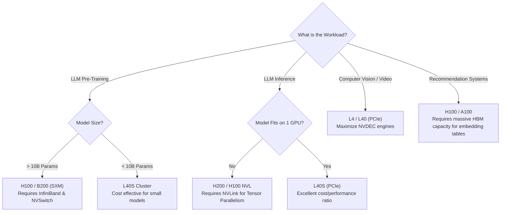

# Chapter 2 — Workload-First GPU Selection

| Chapter metadata | Value |
|---|---|
| Volume | 04 — Accelerator Architecture & Form Factors |
| Difficulty | Advanced |
| Estimated reading time | 35 minutes |
| Primary audience | DevOps, SRE, Platform, Cloud and Infrastructure Engineers |
| Core question | If you have $1 Million to spend, should you buy H100s, L40S's, or L4s? |

## Introduction

"Which GPU should we buy?"

This is the most common question asked of an AI Infrastructure Architect. The answer is always: *"It depends entirely on the workload."*

Purchasing H100s for every AI project is an egregious waste of capital. Different AI workloads stress different parts of the silicon. Some workloads are bounded by Memory Bandwidth (LLM Inference). Some are bounded by VRAM Capacity (Model Fine-Tuning). Some are bounded by raw TFLOPS and Interconnect speed (Large Scale Pre-training). Some are bounded by Video Decoding hardware (Computer Vision).

To build a cost-effective AI Factory, you must profile the workload and purchase the specific silicon designed to destroy that exact bottleneck.

## 1. Workload Profile A: LLM Pre-Training (From Scratch)

Training a 70B+ parameter Large Language Model from scratch is the most brutal workload in computing. It requires pushing petabytes of text through thousands of GPUs continuously for months.

*   **The Bottleneck:** Cross-node synchronization. The model is too big for one GPU. It is split across thousands of GPUs using 3D Parallelism. After every forward/backward pass, the GPUs must share their gradients.
*   **Must-Have Hardware:** 
    *   **NVLink & NVSwitch:** Absolute necessity. You need 8 GPUs in a server acting as one. 
    *   **High-Bandwidth Memory (HBM):** To feed the massive throughput requirement.
    *   **GPUDirect RDMA (InfiniBand/RoCE):** To synchronize across nodes without CPU bottlenecks.
*   **The Hardware Choice:** **H100, H200, B200 (SXM Form Factor).** You cannot compromise here. Using PCIe cards or lacking InfiniBand will cause the training job to take 5 years instead of 3 months.

## 2. Workload Profile B: LLM Inference (Serving)

Serving a trained LLM to users (e.g., ChatGPT) is a completely different physical profile. 

*   **The Bottleneck:** Memory Bandwidth (The Decode Phase). As discussed in Volume 1, generating words requires fetching the entire model weight matrix from memory for *every single token generated*.
*   **Must-Have Hardware:** 
    *   **Extreme Memory Bandwidth:** HBM3 or HBM3e is heavily favored to reduce Time-Per-Output-Token (TPOT).
    *   **Memory Capacity:** You need enough VRAM to hold the model weights *plus* the massive KV Cache for concurrent users. (e.g., An 80GB H100 is great, but a 141GB H200 allows double the concurrent users).
    *   **NVLink (Conditional):** If the model is 70B parameters, it requires ~140GB of RAM (at 16-bit). It will not fit on one 80GB GPU. You *must* use Tensor Parallelism across 2 or 4 GPUs. This requires NVLink. 
*   **The Hardware Choice:** 
    *   For massive models (>70B): **H100, H200 (SXM or NVL)**.
    *   For smaller models (7B to 30B): **L40S (PCIe)**. The L40S uses GDDR6a memory (cheaper than HBM but still fast) and lacks NVLink, but for a model that fits entirely on a single card, it offers massive FP8 compute at a fraction of the H100's price.

## 3. Workload Profile C: Computer Vision & Video Processing

Computer vision tasks (e.g., analyzing security camera feeds, rendering 3D, YOLO object detection) rarely struggle with model size. A vision model might only be 200MB. 

*   **The Bottleneck:** Data ingestion. The GPU cores will sit idle waiting for the CPU to decode the H.264/H.265 video streams into raw pixels.
*   **Must-Have Hardware:**
    *   **NVDEC / NVENC Engines:** Dedicated hardware video decoders and encoders on the GPU die.
    *   **RT Cores (Ray Tracing):** If doing synthetic data generation (Omniverse).
    *   *Note: HBM and NVLink are largely wasted here. The models are small, and they don't communicate with other GPUs.*
*   **The Hardware Choice:** **L4 or L40 (PCIe).** The L4 is a 72-Watt, single-slot powerhouse. It can decode dozens of 1080p video streams simultaneously in hardware, run the AI model over the frames, and encode the output without breaking a sweat, at 1/15th the cost of an H100.

## Architectural Decision Matrix

## Customer Scenario (Senior Level)

**The Situation:**
A Retail company wants to deploy AI across 5,000 retail stores. They want to analyze security camera footage in real-time to detect shoplifting (using a lightweight YOLO model), and run a local small language model (Llama-3-8B) to answer employee inventory questions. They have secured a massive budget and ask you to design the server for the back room of each store. They suggest buying a 2U server with 4x H100 GPUs per store to ensure they are "future-proofed."

**The Senior Architect Response:**
"Deploying 4x H100s in the back room of a retail store is physically impossible and an extreme misallocation of capital. 

First, physical constraints: A server with 4x H100s will draw over 3,000 Watts and generate immense heat. Retail store backrooms lack data-center-grade 240V/30A circuits and direct cooling. The servers would trip the breakers or melt.

Second, workload alignment: The H100's primary advantage is its HBM3 memory bandwidth and NVSwitch interconnect, designed to train 100-Billion parameter models. Your workloads are entirely different. 
1. The 8B LLM requires about 16GB of VRAM and runs entirely on a single card (no NVLink needed). 
2. The security camera analysis is bottlenecked by video decoding (H.264), not Tensor Core math. 

The correct architecture for an Edge deployment is an enterprise server equipped with 2x to 4x **NVIDIA L4 GPUs**. The L4 is a 72-Watt, single-slot PCIe card that requires no external power cables. It possesses advanced NVDEC engines to decode dozens of camera streams simultaneously in hardware, and its Ada Lovelace Tensor Cores can easily serve an 8B LLM at high speed. This solution perfectly matches the thermal, power, and computational profile of the Edge."

## Interview Preparation

**Conceptual:** Why is the L40S an incredible GPU for small LLM Inference, but a terrible GPU for massive LLM Training? *(Hint: It lacks NVLink. Training massive models requires splitting gradients across 8 GPUs simultaneously. The L40S must communicate over the 64GB/s PCIe bus, which bottlenecks collective communications).*

**Architecture:** A client wants to build a recommendation engine that utilizes massive 300GB embedding tables. What hardware feature is their primary bottleneck? *(Hint: VRAM Capacity. They cannot use L4s or L40S's because they lack the memory capacity. They need the H200 (141GB) or massive CPU-to-GPU memory pooling like Grace Hopper).*
