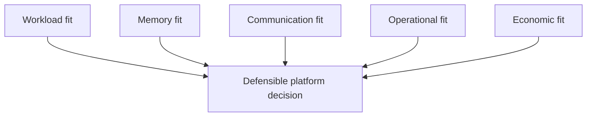
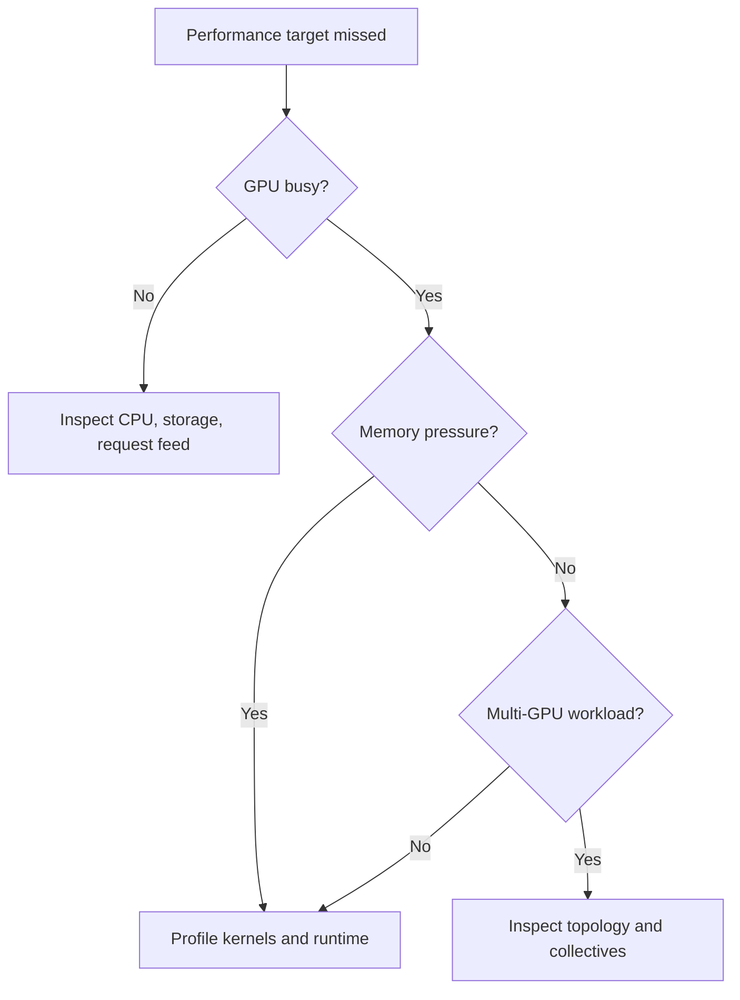

# Workload-First GPU Selection

A customer rarely begins with a complete hardware requirement. They usually begin with a product name.

> “We need H100s.”

That statement sounds specific, but it is not an architecture requirement. It does not reveal whether the customer is training a frontier model, serving a latency-sensitive application, running virtual workstations, processing scientific simulations, or simply following a recommendation copied from another environment.

A defensible GPU design begins by translating the workload into measurable constraints. Product selection comes later.

## Learning objectives

After completing this chapter, you will be able to:

- separate business requirements from assumed hardware choices;
- classify GPU workloads by execution, memory, latency, and deployment behavior;
- identify the hardware characteristics that constrain each workload;
- explain why peak compute alone is an incomplete selection metric;
- reject technically impressive but operationally unsuitable designs;
- present a workload-to-platform recommendation to an enterprise customer.

## The selection problem

GPU selection is a multi-dimensional decision.

**Figure 4.2.1 — Hardware selection is the final stage, not the first.**

Starting with a product name reverses this flow. It encourages the design team to justify a purchase rather than determine whether the purchase is appropriate.

## Step 1: classify the workload

The first useful distinction is not “AI versus non-AI.” It is how the workload consumes compute, memory, communication, and time.

| Workload class | Primary objective | Common pressure points | Typical deployment concern |
|---|---|---|---|
| Model training | Maximize useful work completed over time | Memory capacity, memory bandwidth, collective communication | Multi-GPU and multi-node scaling |
| Real-time inference | Meet latency and availability targets | Model residency, batching delay, token generation rate | Tail latency and replica health |
| Batch inference | Minimize cost per completed item | Throughput, queue depth, utilization | Scheduling and fleet efficiency |
| Fine-tuning | Adapt a model within limited time and budget | Model size, optimizer state, checkpoint I/O | Shared-cluster access |
| Scientific computing | Accelerate numerical kernels | Precision mode, memory movement, interconnect | Application compatibility |
| Visualization | Deliver interactive graphics or remote desktops | Graphics pipeline, framebuffer, encoder support | User density and isolation |
| Edge inference | Operate within power and physical constraints | Efficiency, thermals, model footprint | Remote operations and lifecycle |

A single customer platform may host several of these classes. That does not mean one GPU model is automatically optimal for all of them.

## Step 2: convert the workload into measurable questions

The architect should ask questions that expose the true constraints.

### Model and data questions

- What is the model parameter count?
- Which numerical formats are supported by the application?
- How much memory is required for weights, activations, optimizer state, and runtime caches?
- Does the dataset fit near the compute layer, or will storage become the limiting factor?
- Is the workload sensitive to checkpoint time?

### Service-level questions

- Is the objective throughput, latency, or both?
- Which percentile defines the latency target?
- What happens when demand exceeds capacity?
- Is graceful degradation acceptable?
- How much maintenance downtime is permitted?

### Scaling questions

- Can the workload use multiple GPUs efficiently?
- Is communication mostly within a node or across nodes?
- Does the framework support the intended topology?
- Will future model growth require more memory per accelerator or more accelerators?

### Operational questions

- Is the platform bare metal, virtualized, Kubernetes-based, or appliance-based?
- Which driver and CUDA lifecycle must be supported?
- Is multi-tenancy required?
- What level of vendor support is expected?
- Are power, cooling, rack space, or procurement lead time limiting factors?

These questions turn vague preference into architecture evidence.

## The five selection dimensions

A practical GPU selection framework evaluates five dimensions together.

### 1. Workload fit

The accelerator must support the operations and precision modes the application actually uses. Specialized hardware is valuable only when the software stack can exploit it.

### 2. Memory fit

Memory capacity determines whether the workload can run. Memory bandwidth often determines how quickly it runs. Capacity and bandwidth must be evaluated separately.

A model that barely fits leaves little room for runtime buffers, caches, framework overhead, or growth. Production design should include operational headroom rather than target theoretical minimums.

### 3. Communication fit

A workload that spans accelerators depends on the path between them. The relevant question is not simply how many GPUs exist, but how tensors move among those GPUs.

For distributed workloads, selection expands from a GPU decision into a topology decision involving PCIe, high-speed GPU interconnects, network adapters, switches, and collective-communication behavior.

### 4. Operational fit

The platform must be installable, observable, supportable, and upgradeable by the organization that owns it.

A theoretically faster accelerator may be a poor choice when it introduces unsupported operating systems, incompatible virtualization requirements, difficult cooling constraints, or an upgrade process the operations team cannot sustain.

### 5. Economic fit

Purchase price is only one component of cost.

| Cost category | Examples |
|---|---|
| Acquisition | GPUs, servers, switches, optics, storage |
| Facilities | Rack space, electrical delivery, cooling |
| Software | Enterprise subscriptions, orchestration, observability |
| Operations | Staffing, maintenance, upgrades, incident response |
| Inefficiency | Idle capacity, poor utilization, stranded memory |
| Risk | Delayed deployment, unsupported configurations, rework |

The objective is not the cheapest accelerator. It is the lowest-risk platform that satisfies the workload over its expected lifecycle.

## Why peak performance is insufficient

Peak arithmetic throughput describes a hardware capability under ideal conditions. It does not describe application performance by itself.

A workload may be limited by:

- memory bandwidth;
- memory capacity;
- CPU preprocessing;
- storage throughput;
- network congestion;
- synchronization frequency;
- small batches;
- software compatibility;
- scheduling delay;
- power or thermal limits.

This is why architecture reviews should ask, “What is the expected bottleneck?” before asking, “Which GPU has the largest specification?”

## A customer decision example

A company wants to deploy an internal language-model service. The first proposal requests the most capable training accelerator available. Further discovery reveals:

- the model already exists and will not be trained internally;
- expected demand is moderate but latency-sensitive;
- the service must run in Kubernetes;
- multiple departments will share the platform;
- the data center has limited power headroom;
- the team prioritizes predictable operations over maximum single-node scale.

The workload is an inference platform problem, not a large-scale training problem. The selection criteria should therefore emphasize model residency, latency under concurrency, partitioning or sharing options, power efficiency, software support, and replica operations.

The original product request may still prove appropriate, but now it must win against explicit criteria rather than assumption.

## When not to buy a new GPU

A new accelerator is not always the correct response to poor performance.

Do not begin with hardware replacement when:

- utilization is low because data arrives slowly;
- the model server is misconfigured;
- requests are too small to batch efficiently;
- CPU tokenization is saturated;
- the application cannot use the accelerator’s supported precision modes;
- the workload is blocked on storage or network I/O;
- existing GPUs are fragmented by poor scheduling;
- an upgrade would create unsupported software dependencies.

Benchmark the existing pipeline first. Otherwise, new hardware may preserve the same bottleneck at greater cost.

## Production troubleshooting: wrong hardware, or wrong pipeline?

### Symptoms

- low throughput despite expensive accelerators;
- low power draw during peak demand;
- memory is full while compute utilization remains low;
- adding GPUs does not improve completion time;
- tail latency grows sharply under moderate concurrency.

### Diagnostic path

### Root causes

Common root causes include an undersized memory configuration, a topology mismatch, a host bottleneck, an application that cannot exploit the device, or a service design optimized for throughput when the requirement is latency.

### Resolution

Resolve the measured bottleneck first. Change hardware only when the evidence shows that the existing accelerator or platform cannot satisfy the requirement within acceptable operational and economic limits.

## Customer conversation

A Solutions Architect should avoid answering “Which GPU should we buy?” with a product list.

A stronger response is:

> “Let us first identify the workload, memory footprint, scaling pattern, latency target, deployment model, and facility constraints. Then we can compare platforms against those requirements and validate the shortlist with representative benchmarks.”

That answer changes the engagement from procurement assistance into architecture discovery.

## Interview preparation

### Knowledge questions

1. Why is GPU memory capacity different from GPU memory bandwidth?
2. Why can a higher-throughput accelerator produce worse application economics?
3. What operational factors can invalidate an otherwise suitable GPU choice?

### Architecture questions

1. Design a selection process for a shared training and inference platform.
2. Explain how topology changes the value of adding more accelerators.
3. Compare the decision criteria for batch inference and real-time inference.

### Scenario questions

1. A customer requests premium training GPUs for a small inference service. How do you challenge the assumption?
2. A workload uses only 25 percent GPU utilization. What evidence do you collect before recommending new hardware?
3. A model fits in memory but misses its latency target. What additional dimensions do you investigate?

## Key takeaways

- Begin with workload and business constraints, not product names.
- Capacity, bandwidth, communication, operations, and economics must be evaluated together.
- Peak hardware specifications do not predict end-to-end performance.
- A platform recommendation is credible only when it is tied to measurable requirements.
- Benchmarking validates architecture assumptions; it does not replace architecture discovery.

## Cross references

- [Volume 04 introduction](./index)
- [Chapter 01 — Why NVIDIA Has Multiple GPU Families](./chapter-01-why-nvidia-has-multiple-gpu-families)
- [Lab 01 — Build a GPU Selection Scorecard](./labs/lab-01-build-a-gpu-selection-scorecard)
