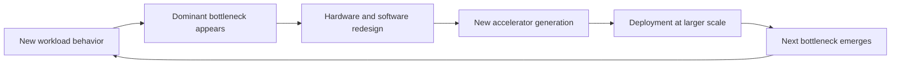
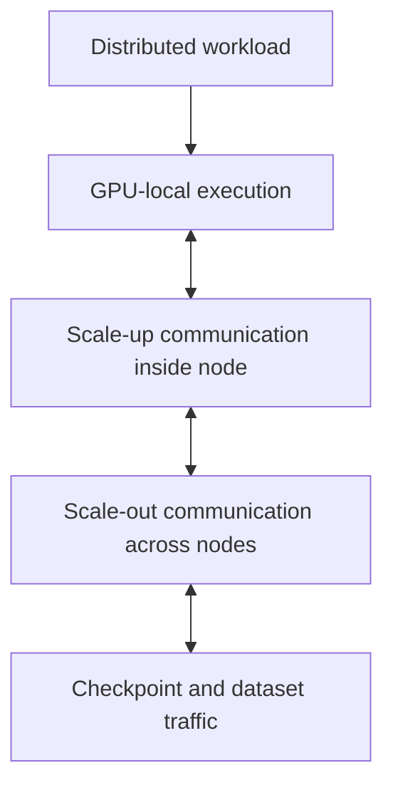
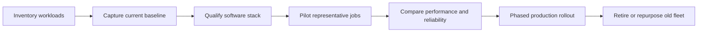

# Accelerator Generations and Design Shifts

A hardware generation should not be evaluated as a list of specifications. It should be evaluated as an engineering response to the bottlenecks that dominated the previous generation.

A platform team that buys only by peak arithmetic throughput often discovers that the real constraint was memory capacity, memory bandwidth, interconnect behavior, power density, software compatibility, or deployment form factor. This chapter builds a durable way to read accelerator generations without turning the discussion into a product catalogue.

| Chapter field | Value |
|---|---|
| Difficulty | Intermediate |
| Estimated reading time | 35–45 minutes |
| Prerequisites | Volume 02 and Chapters 01–02 of this volume |
| Primary outcome | Explain what changed between accelerator generations and why |

## 1. The Production Problem

A customer plans a five-year AI platform investment. The procurement team asks a seemingly simple question:

> Which GPU generation should we standardize on?

The question is incomplete. A generation is not a single answer because the customer may need several outcomes at once:

- large-model training;
- memory-heavy inference;
- cost-sensitive batch inference;
- virtual workstations;
- scientific computing;
- mixed Kubernetes workloads;
- long support life and predictable upgrades.

The correct decision begins by identifying the bottleneck the platform must remove.

## 2. Learning Objectives

After completing this chapter, you will be able to:

- interpret a GPU generation as a set of architectural trade-offs;
- distinguish compute, memory, interconnect, and deployment improvements;
- explain why newer hardware does not automatically improve every workload;
- identify migration risks between generations;
- design a generation-evaluation plan for enterprise customers.

## 3. The Generational Feedback Loop

Accelerator architecture evolves through a repeating cycle.

**Figure 4.3.1 — Accelerator evolution as a feedback loop.** New workloads expose limits, architects redesign the platform, and larger deployments reveal the next constraint.

The most important lesson is that generations evolve as systems. Compute engines, memory technology, interconnects, packaging, power delivery, firmware, and software support all move together.

## 4. Reading a Generation Correctly

A useful evaluation separates six dimensions.

| Dimension | Engineering question |
|---|---|
| Compute capability | Which operations execute faster or more efficiently? |
| Memory capacity | Can the model, activations, cache, or working set fit? |
| Memory bandwidth | Can data reach the execution units fast enough? |
| Scale-up fabric | How efficiently can GPUs inside one system communicate? |
| Scale-out fabric | How efficiently can multiple systems communicate? |
| Platform envelope | What power, cooling, rack, software, and support changes are required? |

A generation may improve all six dimensions, but not equally. Workload value depends on which dimension limits the application.

## 5. Compute Evolution

Early GPU acceleration emphasized highly parallel floating-point work. AI then shifted the center of gravity toward matrix operations, reduced precision, sparsity, transformer execution, and increasingly specialized data paths.

The architectural pattern is consistent:

1. identify a frequently executed operation;
2. implement a more efficient hardware path;
3. expose it through CUDA libraries and frameworks;
4. allow compilers and runtimes to use it automatically where possible.

This is why application performance cannot be predicted from a single core count. The relevant question is whether the workload, framework, precision mode, and software stack can use the generation's specialized execution paths.

:::caution
Peak throughput is a ceiling under specific assumptions. It is not a promise of application performance.
:::

## 6. Memory Evolution

Modern AI models frequently encounter memory constraints before arithmetic constraints. Generation changes therefore need to be examined through both capacity and bandwidth.

### Capacity

Capacity determines what can remain resident on the device:

- model parameters;
- optimizer state;
- activations;
- embeddings;
- inference key-value cache;
- temporary workspaces.

When the working set does not fit, the platform must shard, offload, quantize, recompute, or reduce concurrency. Each option changes latency, throughput, complexity, or model quality.

### Bandwidth

Bandwidth determines how quickly data can feed the execution engines. A GPU with more compute can remain underutilized when kernels repeatedly wait for memory transactions.

The correct comparison therefore asks:

> Does the new generation increase useful compute faster than the workload can supply data?

## 7. Interconnect Evolution

Single-GPU performance is only one part of modern AI infrastructure. Large workloads depend on communication among accelerators.

**Figure 4.3.2 — Communication domains that shape accelerator value.** A faster GPU can expose network or storage bottlenecks if the rest of the platform does not evolve with it.

Generational evaluation must therefore include collective communication, topology, adapter placement, and the relationship between scale-up and scale-out fabrics.

## 8. Packaging and Form-Factor Evolution

NVIDIA accelerators appear in multiple integration styles. The form factor determines far more than physical shape.

| Integration style | Typical architectural emphasis | Operational implication |
|---|---|---|
| PCIe accelerator | Broad server compatibility and flexible expansion | More OEM variation and topology analysis |
| SXM-based platform | Dense scale-up GPU communication | Higher power and cooling requirements |
| Integrated superchip | Tighter CPU-GPU coupling and reduced data movement | New platform and software qualification requirements |
| Rack-scale system | System-level scale-up and coordinated infrastructure | Facility, networking, and lifecycle design become inseparable |

Do not compare form factors as though they were interchangeable boards. Each implies a different server, cooling, networking, serviceability, and support model.

## 9. Why Newer Is Not Always Better

A newer generation may be inappropriate when:

- the application cannot use its optimized precision modes;
- the software stack is not yet qualified;
- the facility cannot support the power or cooling envelope;
- memory capacity, not compute, remains the limiting factor;
- the workload is small and latency is dominated elsewhere;
- existing hardware already meets service-level objectives;
- migration cost exceeds the operational benefit.

A disciplined architecture review compares measurable outcomes, not launch dates.

## 10. Migration Architecture

Moving between generations is a platform migration.

**Figure 4.3.3 — Safe accelerator-generation migration.** Qualification precedes rollout, and rollback remains possible until representative workloads are proven.

### Compatibility domains

A migration plan must verify:

- driver branch;
- CUDA compatibility;
- framework and container support;
- collective communication libraries;
- firmware and Fabric Manager requirements;
- orchestration and telemetry support;
- model precision and compilation behavior;
- cluster scheduler resource definitions.

## 11. Production Troubleshooting

### Symptom

A new accelerator generation delivers much less improvement than expected.

### Diagnosis workflow

1. Compare the same model, dataset, precision, and batch configuration.
2. Check whether the optimized execution path is active.
3. Measure memory throughput and kernel occupancy.
4. Inspect CPU feeding, storage, and network wait time.
5. Compare power and thermal behavior.
6. Confirm framework and library versions are qualified.

### Common root causes

| Root cause | Evidence | Corrective action |
|---|---|---|
| Software fallback | Unsupported operator or precision path | Upgrade or recompile the software stack |
| Input starvation | Low GPU utilization and high CPU wait | Improve preprocessing and data delivery |
| Communication limit | Collective time grows as GPUs are added | Correct topology or fabric design |
| Thermal or power limit | Clocks below expected range | Review cooling, power caps, and rack design |
| Poor benchmark design | Different workload parameters | Rebuild an apples-to-apples baseline |

## 12. Customer Scenario

A financial-services customer operates an older accelerator fleet that still meets overnight training windows but cannot support a new interactive generative-AI service. The architect separates the decision into two tracks.

The existing fleet remains assigned to stable batch workloads. A newer platform is introduced for memory-intensive, latency-sensitive inference and larger training jobs. This avoids a costly universal refresh and aligns each generation with the workload it serves best.

The customer is not buying a generation. The customer is buying a measurable improvement in specific business services.

## 13. Interview Preparation

### Architecture question

**How would you compare two NVIDIA accelerator generations for an enterprise platform?**

A strong answer starts with workload baselines and then evaluates compute paths, memory capacity, memory bandwidth, scale-up communication, scale-out communication, power, cooling, software qualification, reliability, and lifecycle cost.

### Scenario question

**A newer GPU has substantially higher peak throughput but only improves a customer workload by 20 percent. What do you investigate?**

Investigate whether the workload uses the intended precision and optimized kernels, then inspect memory behavior, CPU feeding, network communication, storage, synchronization, and power or thermal limits.

### Customer question

**Why should we replace hardware that still works?**

Do not argue from age. Demonstrate whether the current fleet fails capacity, latency, throughput, efficiency, supportability, or growth requirements. If it still meets those requirements, replacement may not be justified.

## 14. Summary

Accelerator generations are engineering responses to changing bottlenecks. The correct comparison examines compute, memory, interconnect, packaging, software, power, and operational constraints together.

The most important principle is simple:

> A new generation creates value only when its architectural improvements align with the workload's real limiting factor.

## Cross References

- [Chapter 01 — Why NVIDIA Has Multiple GPU Families](./chapter-01-why-nvidia-has-multiple-gpu-families)
- [Chapter 02 — Workload-First GPU Selection](./chapter-02-workload-first-gpu-selection)
- [Volume 02 — GPU Architecture](../volume-02/index)

## Further Reading

- [NVIDIA-Certified Systems documentation](https://docs.nvidia.com/certification-programs/latest/nvidia-certified-systems.html)
- [NVIDIA AI Enterprise infrastructure support matrix](https://docs.nvidia.com/ai-enterprise/support-matrix/latest/index.html)
