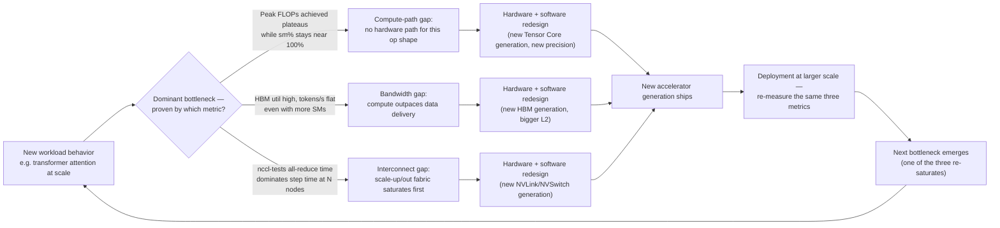
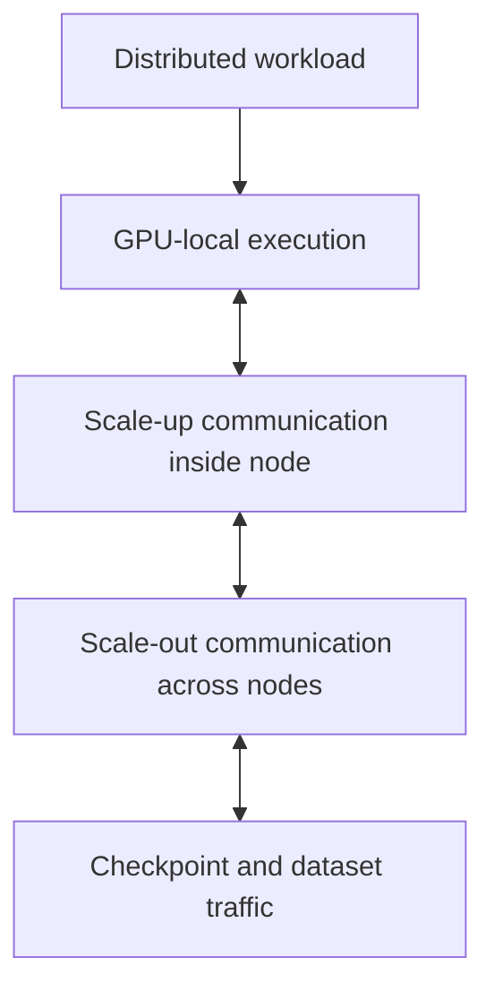
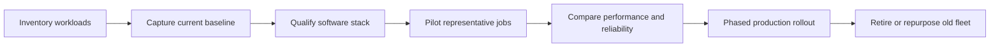

# Accelerator Generations and Design Shifts

A hardware generation should not be evaluated as a list of specifications. It should be evaluated as an engineering response to the bottlenecks that dominated the previous generation.

A platform team that buys only by peak arithmetic throughput often discovers that the real constraint was memory capacity, memory bandwidth, interconnect behavior, power density, software compatibility, or deployment form factor. This chapter builds a durable way to read accelerator generations without turning the discussion into a product catalogue.

| Chapter field | Value |
|---|---|
| Difficulty | Intermediate |
| Estimated reading time | 35–45 minutes |
| Prerequisites | Volume 02 and Chapters 01–02 of this volume |
| Primary outcome | Explain what changed between accelerator generations and why |

## 1. The Production Problem

A customer plans a five-year AI platform investment. The procurement team asks a seemingly simple question:

> Which GPU generation should we standardize on?

The question is incomplete. A generation is not a single answer because the customer may need several outcomes at once:

- large-model training;
- memory-heavy inference;
- cost-sensitive batch inference;
- virtual workstations;
- scientific computing;
- mixed Kubernetes workloads;
- long support life and predictable upgrades.

The correct decision begins by identifying the bottleneck the platform must remove.

## 2. Learning Objectives

After completing this chapter, you will be able to:

- interpret a GPU generation as a set of architectural trade-offs;
- distinguish compute, memory, interconnect, and deployment improvements;
- explain why newer hardware does not automatically improve every workload;
- identify migration risks between generations;
- design a generation-evaluation plan for enterprise customers.

## 3. The Generational Feedback Loop

Accelerator architecture evolves through a repeating cycle.



**Figure 4.3.1 — Accelerator evolution as a feedback loop, with the actual measurement that proves which of the three bottlenecks fired.** This is the mechanism behind "why generations look different" — each generation is a targeted fix for whichever of compute, bandwidth, or interconnect saturated first in the previous one, and the same three metrics (FLOPs achieved, HBM utilization, collective time share) are what an architect measures to find out which fix a *current* workload actually needs, rather than assuming "newer" addresses the right one.

**Concretely, this is measurable — comparing two generations on the same workload shape:**

```bash
$ nvidia-smi --query-gpu=name,memory.total,power.limit,clocks.max.sm --format=csv
name, memory.total [MiB], power.limit [W], clocks.max.sm [MHz]
NVIDIA A100-SXM4-80GB, 81920 MiB, 400.00 W, 1410
NVIDIA H100-SXM5-80GB, 81920 MiB, 700.00 W, 1980
```

Same 80GB capacity on paper — a naive read says "no memory improvement between generations." The number that actually moved is HBM generation and bandwidth (not shown by `memory.total`, which only reports capacity): H100 pairs the same nominal capacity with substantially higher HBM bandwidth and a higher power envelope to sustain higher sustained clocks (`clocks.max.sm` 1980MHz vs. 1410MHz). This is exactly the trap Figure 4.3.1 is warning about — reading one field (`memory.total`) and concluding "no change" when the actual generational improvement is in a different field (bandwidth, sustained clocks) entirely.

The most important lesson is that generations evolve as systems. Compute engines, memory technology, interconnects, packaging, power delivery, firmware, and software support all move together.

## 4. Reading a Generation Correctly

A useful evaluation separates six dimensions.

| Dimension | Engineering question |
|---|---|
| Compute capability | Which operations execute faster or more efficiently? |
| Memory capacity | Can the model, activations, cache, or working set fit? |
| Memory bandwidth | Can data reach the execution units fast enough? |
| Scale-up fabric | How efficiently can GPUs inside one system communicate? |
| Scale-out fabric | How efficiently can multiple systems communicate? |
| Platform envelope | What power, cooling, rack, software, and support changes are required? |

A generation may improve all six dimensions, but not equally. Workload value depends on which dimension limits the application.

## 5. Compute Evolution

Early GPU acceleration emphasized highly parallel floating-point work. AI then shifted the center of gravity toward matrix operations, reduced precision, sparsity, transformer execution, and increasingly specialized data paths.

The architectural pattern is consistent:

1. identify a frequently executed operation;
2. implement a more efficient hardware path;
3. expose it through CUDA libraries and frameworks;
4. allow compilers and runtimes to use it automatically where possible.

This is why application performance cannot be predicted from a single core count. The relevant question is whether the workload, framework, precision mode, and software stack can use the generation's specialized execution paths.

:::caution
Peak throughput is a ceiling under specific assumptions. It is not a promise of application performance.
:::

## 6. Memory Evolution

Modern AI models frequently encounter memory constraints before arithmetic constraints. Generation changes therefore need to be examined through both capacity and bandwidth.

### Capacity

Capacity determines what can remain resident on the device:

- model parameters;
- optimizer state;
- activations;
- embeddings;
- inference key-value cache;
- temporary workspaces.

When the working set does not fit, the platform must shard, offload, quantize, recompute, or reduce concurrency. Each option changes latency, throughput, complexity, or model quality.

### Bandwidth

Bandwidth determines how quickly data can feed the execution engines. A GPU with more compute can remain underutilized when kernels repeatedly wait for memory transactions.

The correct comparison therefore asks:

> Does the new generation increase useful compute faster than the workload can supply data?

## 7. Interconnect Evolution

Single-GPU performance is only one part of modern AI infrastructure. Large workloads depend on communication among accelerators.



**Figure 4.3.2 — Communication domains that shape accelerator value.** A faster GPU can expose network or storage bottlenecks if the rest of the platform does not evolve with it.

Generational evaluation must therefore include collective communication, topology, adapter placement, and the relationship between scale-up and scale-out fabrics.

## 8. Packaging and Form-Factor Evolution

NVIDIA accelerators appear in multiple integration styles. The form factor determines far more than physical shape.

| Integration style | Typical architectural emphasis | Operational implication |
|---|---|---|
| PCIe accelerator | Broad server compatibility and flexible expansion | More OEM variation and topology analysis |
| SXM-based platform | Dense scale-up GPU communication | Higher power and cooling requirements |
| Integrated superchip | Tighter CPU-GPU coupling and reduced data movement | New platform and software qualification requirements |
| Rack-scale system | System-level scale-up and coordinated infrastructure | Facility, networking, and lifecycle design become inseparable |

Do not compare form factors as though they were interchangeable boards. Each implies a different server, cooling, networking, serviceability, and support model.

## 9. Why Newer Is Not Always Better

A newer generation may be inappropriate when:

- the application cannot use its optimized precision modes;
- the software stack is not yet qualified;
- the facility cannot support the power or cooling envelope;
- memory capacity, not compute, remains the limiting factor;
- the workload is small and latency is dominated elsewhere;
- existing hardware already meets service-level objectives;
- migration cost exceeds the operational benefit.

A disciplined architecture review compares measurable outcomes, not launch dates.

## 10. Migration Architecture

Moving between generations is a platform migration.



**Figure 4.3.3 — Safe accelerator-generation migration.** Qualification precedes rollout, and rollback remains possible until representative workloads are proven.

### Compatibility domains

A migration plan must verify:

- driver branch;
- CUDA compatibility;
- framework and container support;
- collective communication libraries;
- firmware and Fabric Manager requirements;
- orchestration and telemetry support;
- model precision and compilation behavior;
- cluster scheduler resource definitions.

## 11. Production Troubleshooting

### Symptom

A new accelerator generation delivers much less improvement than expected.

### Diagnosis workflow

1. Compare the same model, dataset, precision, and batch configuration.
2. Check whether the optimized execution path is active.
3. Measure memory throughput and kernel occupancy.
4. Inspect CPU feeding, storage, and network wait time.
5. Compare power and thermal behavior.
6. Confirm framework and library versions are qualified.

### Common root causes

| Root cause | Evidence | Corrective action |
|---|---|---|
| Software fallback | Unsupported operator or precision path | Upgrade or recompile the software stack |
| Input starvation | Low GPU utilization and high CPU wait | Improve preprocessing and data delivery |
| Communication limit | Collective time grows as GPUs are added | Correct topology or fabric design |
| Thermal or power limit | Clocks below expected range | Review cooling, power caps, and rack design |
| Poor benchmark design | Different workload parameters | Rebuild an apples-to-apples baseline |

**Evidence walkthrough — "software fallback," the most common reason a new generation underperforms its spec sheet:**

```bash
$ nvidia-smi --query-gpu=name,driver_version,compute_cap --format=csv
name, driver_version, compute_cap
NVIDIA H100 80GB HBM3, 550.90.07, 9.0

$ python -c "import torch; print(torch.backends.cuda.matmul.allow_tf32, torch.get_default_dtype())"
True torch.float32
```

Driver and compute capability both report correctly (`9.0` confirms Hopper), so the naive check "is the GPU healthy" passes. The actual fallback shows up one layer up the stack: the model is running its matmuls in `torch.float32` by default rather than the BF16/FP8 path the H100's Tensor Cores are built for. `nvidia-smi` cannot see this — it only reports device health, not which precision kernel a framework chose. This is why the diagnosis workflow above insists on checking "whether the optimized execution path is active" as a separate step from confirming the hardware is present; a perfectly healthy H100 running FP32 matmuls will benchmark closer to a previous generation than to its own spec sheet.

**Evidence walkthrough — "thermal or power limit," confirmed rather than assumed:**

```bash
$ nvidia-smi --query-gpu=power.draw,power.limit,clocks.sm,clocks.max.sm,temperature.gpu --format=csv
power.draw [W], power.limit [W], clocks.sm [MHz], clocks.max.sm [MHz], temperature.gpu [C]
698.20 W, 700.00 W, 1410 MHz, 1980 MHz, 84 C

```

`power.draw` (698W) sitting right at `power.limit` (700W) while `clocks.sm` (1410MHz) is well below `clocks.max.sm` (1980MHz) is direct proof of power throttling — the GPU is capping its own clock to stay under the power cap, not choosing to run slower. `temperature.gpu` at 84C is elevated but the power ceiling is hit first here, which is the common case on data-center GPUs — power caps usually bind before thermal caps do, so checking `power.draw/power.limit` is a better first move than checking temperature alone.

## 12. Customer Scenario

A financial-services customer operates an older accelerator fleet that still meets overnight training windows but cannot support a new interactive generative-AI service. The architect separates the decision into two tracks.

The existing fleet remains assigned to stable batch workloads. A newer platform is introduced for memory-intensive, latency-sensitive inference and larger training jobs. This avoids a costly universal refresh and aligns each generation with the workload it serves best.

The customer is not buying a generation. The customer is buying a measurable improvement in specific business services.

## 13. Interview Preparation

### Architecture question

**How would you compare two NVIDIA accelerator generations for an enterprise platform?**

**Model answer:** "I'd start by establishing a baseline on the current generation with the real workload, not a synthetic benchmark — step time, throughput, GPU utilization, memory use, and communication time share, all captured with `nvidia-smi dmon` and the application's own metrics. Then I'd reproduce that exact workload on the new generation and compare the same numbers side by side, not the spec sheets. Specifically, I want to know: did `memory.total` or bandwidth change in a way this workload can use, is the intended precision path actually active — I've seen H100s benchmark like A100s because a model was silently running FP32 — and does collective time share grow the same way at scale on the new interconnect generation? Only after that comparison do power, cooling, and software qualification enter the conversation, because a generation that wins every performance metric can still be disqualified by a rack that can't power it."

### Scenario question

**A newer GPU has substantially higher peak throughput but only improves a customer workload by 20 percent. What do you investigate?**

**Model answer:** "First, whether the workload is actually using the new generation's optimized path — I'd check the precision the framework selected, because a 20% gain despite a much higher peak-throughput spec is the classic signature of a software fallback: the model runs on the new silicon but not through its new Tensor Core path. If that checks out, I'd move to memory: is HBM bandwidth the actual ceiling now, shown by high memory utilization while SM utilization is also high but throughput is flat? Then CPU feeding and I/O — is the host now the bottleneck because the GPU got faster and the data pipeline didn't? And finally power and thermal — I'd pull `power.draw` against `power.limit` and `clocks.sm` against `clocks.max.sm` to rule out the new part throttling under a rack that wasn't provisioned for its higher TDP. A 20% gain on a generation with a much bigger peak-throughput jump almost always traces back to one of these four, not to the silicon underperforming."

### Customer question

**Why should we replace hardware that still works?**

**Model answer:** "I wouldn't argue from age, and I'd tell the customer that directly — 'it still works' isn't actually the question. The question is whether the current fleet is failing a specific, measurable requirement: capacity, because newer workloads don't fit; latency, because tail behavior is degrading under current load; throughput, because it can't keep pace with demand growth; efficiency, because cost-per-request has drifted up; or supportability, because the vendor lifecycle is ending. If I can show the current fleet is genuinely failing one of those, replacement is justified and I can quantify the business impact. If it's meeting all of them, I'll say so — recommending a refresh the numbers don't support costs me credibility on the next recommendation I do need them to trust."

## 14. Summary

Accelerator generations are engineering responses to changing bottlenecks. The correct comparison examines compute, memory, interconnect, packaging, software, power, and operational constraints together.

The most important principle is simple:

> A new generation creates value only when its architectural improvements align with the workload's real limiting factor.

## Cross References

- [Chapter 01 — Why NVIDIA Has Multiple GPU Families](./chapter-01-why-nvidia-has-multiple-gpu-families)
- [Chapter 02 — Workload-First GPU Selection](./chapter-02-workload-first-gpu-selection)
- [Volume 02 — GPU Architecture](../volume-02/index)

## Further Reading

- [NVIDIA-Certified Systems documentation](https://docs.nvidia.com/certification-programs/latest/nvidia-certified-systems.html)
- [NVIDIA AI Enterprise infrastructure support matrix](https://docs.nvidia.com/ai-enterprise/support-matrix/latest/index.html)
