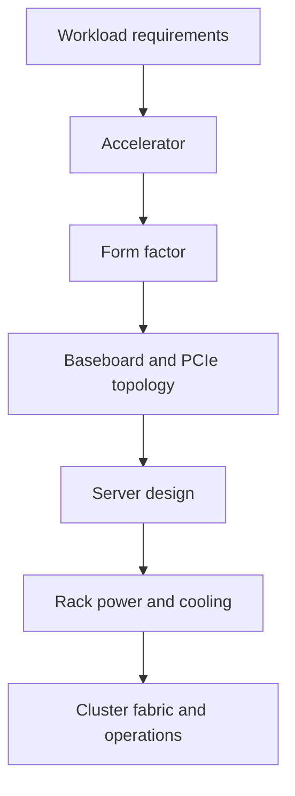
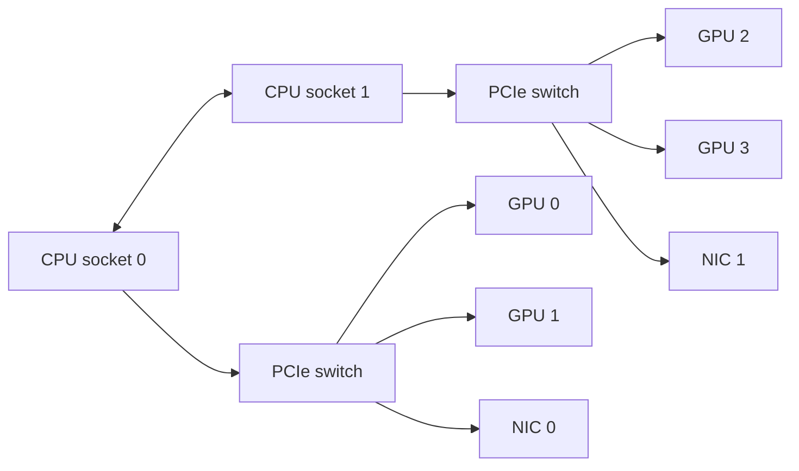
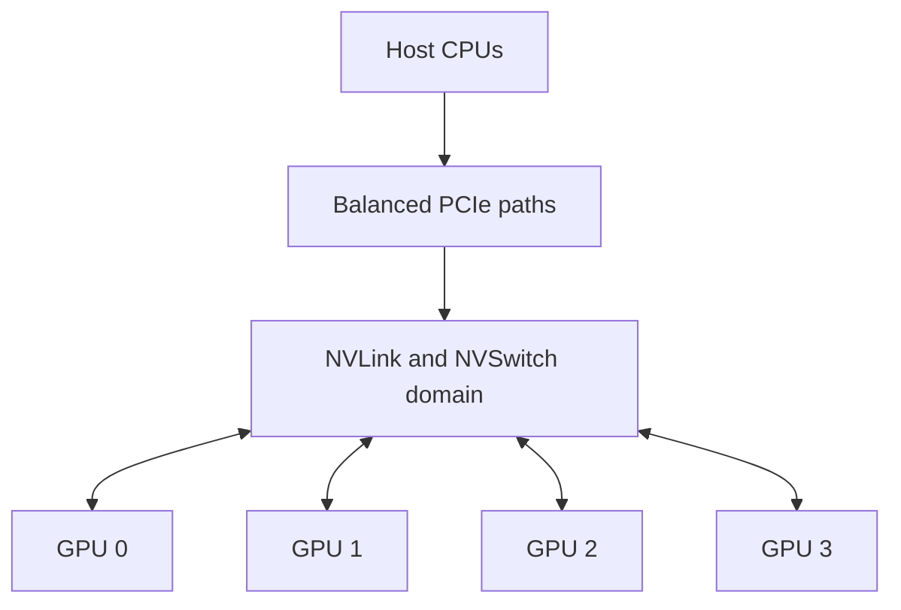
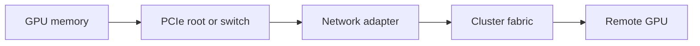

# PCIe, SXM, and Platform Integration

Two GPUs from the same architectural generation can create very different systems. The difference is often not the execution engine itself, but how the accelerator is integrated into the server.

PCIe cards, SXM modules, integrated CPU-GPU platforms, and rack-scale systems represent distinct architectural choices. Each changes data paths, power delivery, thermal design, serviceability, networking, and the operational boundary between the GPU vendor and the system vendor.

| Chapter field | Value |
|---|---|
| Difficulty | Intermediate |
| Estimated reading time | 35–45 minutes |
| Prerequisites | Chapters 01–03 |
| Primary outcome | Select an accelerator integration model based on workload and operational constraints |

## 1. The Production Problem

A customer requests eight high-end GPUs in every node. One vendor proposes PCIe accelerators in a conventional server. Another proposes an SXM-based platform with a high-bandwidth scale-up fabric.

Both proposals contain eight GPUs. They are not equivalent systems.

The design decision affects:

- GPU-to-GPU communication;
- CPU-to-GPU locality;
- adapter placement;
- power density;
- cooling method;
- failure domains;
- firmware ownership;
- field replacement procedures;
- qualification and support.

## 2. Learning Objectives

After completing this chapter, you will be able to:

- explain the architectural difference between PCIe and SXM integration;
- identify how form factor changes topology and data movement;
- evaluate power, cooling, and serviceability implications;
- explain why server qualification matters;
- recommend an integration model without declaring a universal winner.

## 3. The Integration Stack



**Figure 4.4.1 — Accelerator integration stack.** The GPU is one layer in a chain of platform decisions.

A form factor should therefore be treated as an architectural contract, not a mechanical detail.

## 4. PCIe Accelerator Integration

A PCIe accelerator is installed through the server's PCI Express fabric. This model fits a broad ecosystem of enterprise servers and allows flexible combinations of GPU count, CPU platform, network adapters, and storage.

### Strengths

- broad OEM availability;
- flexible server configurations;
- familiar replacement procedures;
- ability to scale from one to several accelerators;
- suitable for workloads that do not require the strongest possible intra-node scale-up fabric.

### Constraints

- GPU-to-GPU traffic may traverse PCIe switches or CPU root complexes;
- peer paths vary by server design;
- NIC and GPU affinity must be inspected carefully;
- chassis airflow and slot spacing can limit density;
- performance consistency depends heavily on OEM topology.



**Figure 4.4.2 — Simplified PCIe accelerator topology.** Performance depends on which devices share switches and CPU roots.

## 5. SXM Platform Integration

SXM-based systems integrate accelerator modules on a specialized baseboard designed for dense GPU communication. The platform commonly combines multiple accelerators with NVLink and NVSwitch to create a stronger scale-up domain.

### Strengths

- high-bandwidth GPU-to-GPU communication;
- predictable multi-GPU topology;
- platform design optimized around dense AI and HPC workloads;
- fewer application-visible penalties when models communicate heavily inside the node.

### Constraints

- higher rack power and cooling density;
- more specialized service procedures;
- less freedom to mix arbitrary server components;
- platform firmware and Fabric Manager compatibility become critical;
- acquisition and support are tied closely to qualified systems.



**Figure 4.4.3 — Simplified SXM scale-up domain.** The baseboard is designed around coordinated multi-GPU communication rather than independent add-in cards.

## 6. PCIe Versus SXM

| Design dimension | PCIe accelerator server | SXM-based platform |
|---|---|---|
| Configuration flexibility | High | More standardized |
| Intra-node GPU fabric | Depends on server and GPU | Designed for dense scale-up |
| Power density | Often lower per node | Often higher per node |
| Cooling complexity | Conventional high-performance server range | Frequently requires stricter airflow or liquid-cooling planning |
| Serviceability | Familiar add-in-card model | Platform-specific procedures |
| Topology variability | High across OEM designs | More predictable within a platform generation |
| Best fit | Flexible inference, visualization, mixed workloads, smaller GPU counts | Communication-heavy training and large multi-GPU inference |

The table is not a winner matrix. It is a constraint matrix.

## 7. CPU and NUMA Placement

The host CPU remains part of the data path. A GPU can be physically attached to one CPU socket while the process feeding it runs on another.

Cross-socket access may introduce:

- additional latency;
- reduced effective host-to-device bandwidth;
- contention on the CPU interconnect;
- inconsistent performance among otherwise identical jobs.

Production scheduling should consider:

- CPU affinity;
- memory allocation locality;
- GPU locality;
- NIC locality;
- storage-controller locality.

A correct GPU count with an incorrect NUMA policy is still an incorrect architecture.

## 8. Network Adapter Placement

Distributed training and inference move data between GPUs in different nodes. The path from GPU to network adapter is therefore a first-class design decision.



**Figure 4.4.4 — Simplified scale-out data path.** Extra PCIe hops or cross-socket paths can reduce effective communication performance.

The architect should verify whether adapters are balanced across CPU sockets and whether each GPU has an efficient path to the intended network interface.

## 9. Power and Cooling

Accelerator selection changes facility design.

### Power planning must include

- steady-state draw;
- transient behavior;
- CPU, memory, NIC, and storage consumption;
- power-supply redundancy mode;
- rack-level distribution limits;
- derating and safety margin.

### Cooling planning must include

- inlet temperature;
- airflow direction;
- rack density;
- containment strategy;
- liquid-cooling dependencies where applicable;
- behavior during degraded cooling.

:::warning
A server that fits physically in a rack may still be impossible to operate safely in that rack.
:::

## 10. Qualification and Support Boundaries

A production platform is supported as a combination of hardware and software.

Qualification should verify:

- server model and firmware bundle;
- GPU firmware;
- BMC version;
- BIOS settings;
- driver branch;
- CUDA and framework support;
- network adapter firmware;
- operating system;
- orchestration stack.

NVIDIA-Certified Systems and vendor qualification matrices help reduce the risk of unsupported combinations, but the customer still needs an internal approved configuration baseline.

## 11. Production Troubleshooting

### Symptom

Two servers with the same GPU model show different distributed-training performance.

### Diagnosis

```bash
nvidia-smi topo -m
lspci -tv
numactl --hardware
```

The commands reveal GPU, NIC, PCIe, and NUMA relationships. Compare the outputs rather than assuming identical topology from the bill of materials.

### Likely causes

| Cause | Evidence | Resolution |
|---|---|---|
| Different PCIe switch layout | Different `nvidia-smi topo -m` paths | Align placement or standardize server design |
| Cross-socket CPU feeding | Process CPU affinity differs from GPU locality | Bind CPU and memory correctly |
| NIC attached to remote root | Network path crosses CPU interconnect | Reassign interfaces or workload placement |
| Firmware drift | Same hardware, different firmware bundle | Return to approved baseline |
| Thermal limitation | Reduced clocks under sustained load | Correct airflow or cooling capacity |

## 12. Customer Scenario

A telecom customer needs two platforms. The first runs many independent inference services with moderate model sizes and strict cost controls. The second trains a large model using all GPUs in a node.

A flexible PCIe platform may be appropriate for the independent services because the workloads communicate little across GPUs. An SXM-based system may be appropriate for the training workload because intra-node collective communication is central to scaling.

The architect uses the workload communication pattern—not brand preference—to separate the designs.

## 13. Interview Preparation

### Architecture question

**Why can two eight-GPU servers behave differently?**

Because GPU count does not describe PCIe roots, switches, NUMA attachment, GPU fabric, NIC affinity, power limits, cooling, firmware, or software configuration.

### Scenario question

**When would you choose PCIe accelerators instead of an SXM platform?**

Choose PCIe when configuration flexibility, lower density, independent workloads, broad OEM options, or cost structure matters more than maximum intra-node GPU communication.

### Troubleshooting question

**What is the first command you use to understand GPU topology?**

`nvidia-smi topo -m` is a useful starting point, followed by PCIe and NUMA inspection. The command is not the conclusion; it is the map used to reason about data paths.

## 14. Summary

PCIe and SXM represent different platform-integration strategies. PCIe emphasizes flexibility. SXM emphasizes a coordinated scale-up domain. Neither is universally correct.

The correct choice aligns workload communication, topology, power, cooling, serviceability, and support requirements.

## Cross References

- [Chapter 02 — Workload-First GPU Selection](./chapter-02-workload-first-gpu-selection)
- [Chapter 03 — Accelerator Generations and Design Shifts](./chapter-03-accelerator-generations-and-design-shifts)
- [Lab 01 — Build a GPU Selection Scorecard](./labs/lab-01-build-a-gpu-selection-scorecard)

## Further Reading

- [NVIDIA-Certified Systems](https://docs.nvidia.com/certification-programs/latest/nvidia-certified-systems.html)
- [NVIDIA HGX Platforms documentation](https://docs.nvidia.com/hgx-platforms/index.html)
