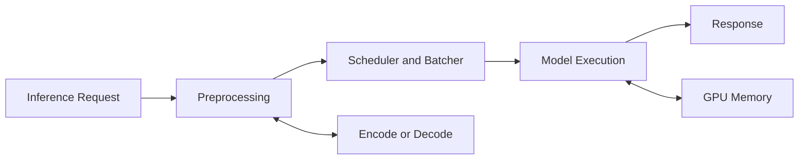
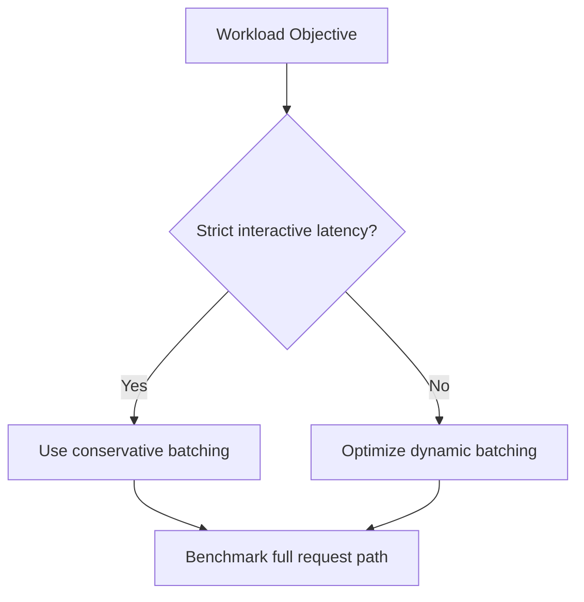

# Inference Accelerators — T4, L4, and L40S

A platform team is asked to replace a fleet of CPU inference servers. The first proposal is to purchase the accelerator with the highest published arithmetic throughput. That answer is attractive because it is simple. It is also incomplete.

Inference performance depends on much more than peak compute. Model size, precision, batching, latency objectives, media processing, host power limits, rack density, software compatibility, and cost per request all influence the correct choice. T4, L4, and L40S occupy different points in this design space.

| Chapter field | Value |
|---|---|
| Difficulty | Intermediate |
| Estimated reading time | 35–45 minutes |
| Prerequisites | Chapters 01–04 |
| Primary outcome | Build an inference accelerator shortlist from workload evidence |

## Learning Objectives

After completing this chapter, you will be able to:

- explain why inference accelerators cannot be compared using one performance number;
- distinguish density-oriented, balanced, and high-capacity inference designs;
- map model, latency, media, and power requirements to accelerator characteristics;
- identify when a training-oriented platform is unnecessary for inference;
- troubleshoot poor inference performance without immediately blaming the GPU.

## The Production Story

A media company operates three services:

1. image classification at high request volume;
2. video transcoding with AI enhancement;
3. an interactive generative AI assistant.

The company asks whether one GPU model should standardize all three services. A single standard simplifies procurement and operations, but each service stresses a different part of the platform. Image classification may benefit from efficient batching and density. Video pipelines depend heavily on encode and decode capabilities. Generative inference may require much more memory and memory bandwidth.

The architecture process must therefore begin with the request path, not the product list.

## Big Picture



**Figure 4.5.1 — Inference is a pipeline.** The accelerator influences model execution, but preprocessing, batching, memory movement, and media stages can determine end-to-end latency.

## Why These Products Exist

Inference often rewards different design priorities than large-scale training.

Training commonly favors high aggregate throughput, large scale-up domains, and fast collective communication. Inference may instead prioritize:

- low power per server;
- many independent model replicas;
- predictable tail latency;
- efficient low-precision execution;
- video encode and decode capacity;
- broad server compatibility;
- cost per successful request.

T4 established a widely deployed low-profile inference pattern. L4 modernized that pattern for newer AI and media workloads. L40S serves workloads that need substantially more memory, compute, and graphics capability while remaining in a PCIe server form factor.

## Architectural Positioning

| Design question | T4 tendency | L4 tendency | L40S tendency |
|---|---|---|---|
| Deployment objective | Cost-sensitive legacy and established inference | Modern density-efficient inference and media | Larger models, heavier inference, graphics, and mixed workloads |
| Server integration | Low-profile, low-power PCIe environments | Low-profile, energy-conscious PCIe environments | Full-size, higher-power PCIe platforms |
| Memory requirement | Smaller model footprints | Moderate model and pipeline footprints | Larger model footprints and richer workloads |
| Media processing | Useful video acceleration | Strong modern media acceleration | High-end media and graphics capability |
| Operational impact | Easy to place in many existing servers | Often suitable for dense inference nodes | Requires more deliberate thermal and power planning |

This table describes architectural tendencies, not universal rules. Exact suitability must be validated against the current product documentation, server qualification, software stack, and benchmark results.

## The Five Questions That Matter

### 1. Does the model fit?

Model weights are only part of memory consumption. Runtime memory also includes activations, framework workspaces, CUDA contexts, KV cache, batching buffers, and fragmentation. A model that barely fits during a synthetic test may fail under production concurrency.

A practical capacity estimate is:

```text
required GPU memory = weights + runtime workspace + request state + safety margin
```

For large language models, request state can grow with sequence length, batch size, and concurrent sessions. The capacity plan must therefore model the operating envelope rather than a single request.

### 2. Is the workload latency-bound or throughput-bound?

A real-time service may optimize p95 or p99 latency. A batch service may optimize completed items per hour. The best batch size for throughput can violate an interactive latency objective.



**Figure 4.5.2 — Batching is a service-level decision.** It should be tuned from latency and throughput objectives, not copied from a benchmark.

### 3. Does media processing dominate?

Video analytics pipelines may spend substantial time decoding, resizing, color converting, encoding, or transferring frames. A GPU with suitable media engines can remove CPU bottlenecks, but only when the application actually uses those engines.

Observe each stage separately. High GPU utilization does not prove the tensor execution path is efficient, and low SM utilization may be healthy when dedicated media engines perform much of the work.

### 4. Can the server power and cool the card?

PCIe compatibility is not merely whether a card fits into a slot. Validate:

- mechanical dimensions;
- slot width and spacing;
- auxiliary power connectors;
- airflow direction and pressure;
- per-slot power delivery;
- host BIOS and firmware support;
- validated GPU count per server;
- NIC and storage lane contention.

A high-capacity accelerator installed in an unsuitable chassis may throttle, reset, or operate below expected performance.

### 5. Does the software stack support the chosen architecture?

Driver, CUDA, framework, inference runtime, container image, and model engine must form a compatible chain. Newer GPUs may require newer software. Older applications may contain architecture-specific binaries or unsupported plugins.

The selection decision must include an upgrade plan, not only a purchase order.

## Production Deployment Patterns

### Pattern A — Dense stateless inference

Many independent replicas serve small or moderate models. The design emphasizes power efficiency, horizontal scaling, autoscaling signals, and rapid replacement of failed instances.

### Pattern B — Video analytics node

The node combines network ingestion, decoding, preprocessing, inference, tracking, and encoding. Capacity planning must include media sessions and network throughput in addition to model execution.

### Pattern C — Generative inference node

The design emphasizes memory capacity, memory bandwidth, KV-cache management, continuous batching, and request admission control. L40S-class deployments may be considered when the model and service envelope exceed density-oriented accelerator capacity but do not require an SXM scale-up platform.

## Observability Model

| Layer | Evidence |
|---|---|
| Service | request rate, p50/p95/p99 latency, errors, queue depth |
| Runtime | batch size, active sequences, cache use, model instance count |
| GPU | SM activity, memory use, memory bandwidth, power, temperature, throttling |
| Media | decoder and encoder utilization, dropped frames |
| Host | CPU saturation, NUMA locality, PCIe health, network and storage throughput |

A useful dashboard aligns all layers on the same timeline. GPU metrics without service metrics cannot explain customer impact.

## Production Troubleshooting

### Problem — Low GPU utilization and high request latency

**Symptoms**

- GPU utilization remains low;
- request queues grow;
- CPU utilization is high;
- batch sizes are smaller than expected.

**Diagnosis**

Inspect preprocessing time, tokenizer saturation, request scheduler behavior, CPU affinity, and host-to-device transfer timing. Confirm that the runtime actually forms batches and that requests are not serialized before reaching the GPU.

**Root cause**

The GPU is starved by the host pipeline.

**Resolution**

Parallelize preprocessing, increase scheduler concurrency, use pinned buffers where appropriate, improve NUMA placement, and tune batching against the latency objective.

**Prevention**

Benchmark the complete service path and alert on queue delay separately from GPU execution time.

### Problem — Throughput collapses under concurrency

**Symptoms**

- single-request tests appear healthy;
- memory use grows sharply with concurrency;
- latency increases nonlinearly;
- the runtime reports allocation failures or cache eviction.

**Root cause**

The concurrency model exceeds the memory envelope, often because request-state growth was omitted from sizing.

**Resolution**

Introduce admission control, reduce maximum sequence length or batch size, partition model replicas, or select an accelerator with a larger validated memory envelope.

## Customer Scenario

A bank wants to deploy document classification, speech transcription, and an internal assistant on one shared GPU pool. The architect should not begin by selecting one card. First classify each service by memory, latency, concurrency, media, and regulatory isolation requirements. A standardized server may still be appropriate, but the evidence may justify separate node pools: density-efficient accelerators for classification and speech, and higher-capacity accelerators for generative inference.

The customer recommendation should include a benchmark plan, software compatibility matrix, failure-domain design, and a method for measuring cost per successful request.

## Interview Preparation

### Architecture question

Why might a lower-power inference accelerator deliver better fleet economics than a faster card?

A strong answer discusses server density, power, cooling, workload fit, utilization, licensing, replica count, and cost per request rather than only purchase price.

### Troubleshooting question

An inference service has 20% GPU utilization and misses latency objectives. What do you inspect first?

Begin with the request timeline: queueing, CPU preprocessing, batching, transfers, GPU execution, and response serialization. Low utilization is a symptom, not a root cause.

### Customer question

When should a customer avoid standardizing all inference workloads on one GPU model?

When workload envelopes differ enough that standardization creates persistent waste, capacity risk, software incompatibility, or unacceptable operational trade-offs.

## Key Takeaways

- Inference accelerator selection begins with the service envelope.
- Model fit includes runtime state and safety margin, not only weights.
- Media engines, host behavior, and batching can matter as much as tensor throughput.
- PCIe form factor does not eliminate power, cooling, topology, and qualification constraints.
- The final decision must be supported by end-to-end benchmarks and operational evidence.

## Cross References

- [Workload-First GPU Selection](./chapter-02-workload-first-gpu-selection)
- [PCIe, SXM, and Platform Integration](./chapter-04-pcie-sxm-and-platform-integration)
- [Training Accelerators](./chapter-06-training-accelerators-v100-to-b200)
- [Lab 02 — Benchmark an Inference Accelerator Shortlist](./labs/lab-02-benchmark-an-inference-accelerator-shortlist)
