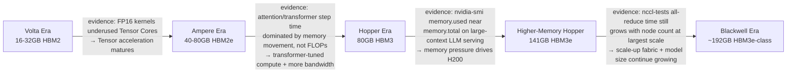
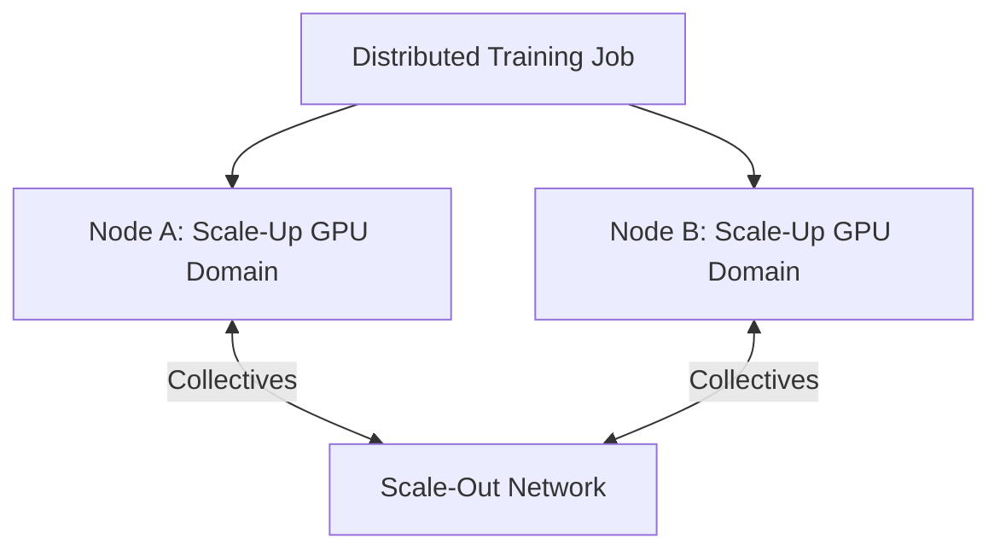

# Training Accelerators — V100, A100, H100, H200, and B200

A research team asks for the newest accelerator because its current training run takes six weeks. The infrastructure team immediately faces a harder question: which part of the training system is responsible for those six weeks?

A newer GPU can provide more compute, memory, bandwidth, and communication capability. It cannot repair an input pipeline that starves the device, a collective pattern that does not scale, or a checkpoint design that stalls every worker. Training hardware must be evaluated as part of a distributed system.

| Chapter field | Value |
|---|---|
| Difficulty | Intermediate |
| Estimated reading time | 40–50 minutes |
| Prerequisites | Chapters 01–05 |
| Primary outcome | Compare training platforms without reducing the decision to peak FLOPS |

## Learning Objectives

After completing this chapter, you will be able to:

- explain the architectural progression from V100 through Blackwell-era platforms;
- distinguish compute, memory, and communication constraints;
- evaluate whether a workload needs a PCIe server, an SXM scale-up system, or a larger cluster;
- identify when additional GPUs will not shorten time to train;
- build a production validation plan for a training platform refresh.

## The Evolutionary Story

Each accelerator generation responded to pressure from larger models, lower-precision arithmetic, larger working sets, and distributed training. The important lesson is not the sequence of product names. It is the sequence of bottlenecks.



**Figure 4.6.1 — Accelerator evolution follows workload bottlenecks, and each arrow names the measurement that justified the next generation's design change.** New generations change multiple dimensions at once — compute engines, precision support, memory systems, interconnect, partitioning, system integration — but the arrow labels above are the specific piece of evidence (a memory ceiling, a step-time profile, a collective-time trend) that an architect would point to when explaining *why* a given generation exists, not just naming it.

**The capacity story behind the H100 → H200 edge, worked out:** a 70B-parameter model at FP16 needs `70,000,000,000 × 2 bytes ≈ 140 GB` for weights. That alone exceeds a single 80GB H100's HBM — it must be sharded across at least 2 GPUs before a single token of KV cache is added. On a single 141GB H200, the same 140GB of weights fits on one GPU with roughly 1GB left for KV cache and activations — not comfortable, but the qualitative difference between "must shard across 2+ GPUs" and "fits on one" is exactly the memory-capacity pressure the arrow label above is pointing at, and it's a difference that shows up directly in `nvidia-smi --query-gpu=memory.used,memory.total` during a sizing pass, before a training run is ever launched.

## Comparing Generations Correctly

| Dimension | Architectural question |
|---|---|
| Precision | Which numerical formats are supported by the model and framework? |
| Memory capacity | Do weights, optimizer state, activations, and communication buffers fit? |
| Memory bandwidth | Is the workload frequently waiting on data movement? |
| Scale-up fabric | How quickly can GPUs inside one system exchange tensors? |
| Scale-out network | How efficiently can nodes participate in collectives? |
| Software maturity | Are framework, compiler, kernel, and container paths validated? |
| Facility impact | Can the data center supply the required power and cooling density? |

Peak arithmetic throughput is useful only after the workload can feed the arithmetic units and the implementation can use the supported precision.

## Memory Is a System Constraint

Training memory commonly includes:

```text
weights
+ gradients
+ optimizer states
+ activations
+ temporary workspaces
+ communication buffers
+ framework overhead
```

The exact total depends on precision, optimizer, checkpointing, sharding strategy, sequence length, batch size, and model architecture. A model that fits for inference may require several times more memory during training.

### Capacity versus bandwidth

Capacity determines whether the working set fits. Bandwidth determines how quickly data can be supplied once it fits. A higher-capacity GPU may remove a sharding boundary or allow a larger local batch. A higher-bandwidth GPU may improve kernels that repeatedly stream tensors from memory. The benchmark must identify which limitation matters.

## Scale-Up and Scale-Out



**Figure 4.6.2 — Distributed training has two communication domains.** Fast communication inside a node does not guarantee efficient communication between nodes.

Scale-up systems reduce communication cost among GPUs connected by a high-bandwidth local fabric. Scale-out networking connects those systems into a cluster. The placement of tensor, pipeline, data, or expert parallel groups should reflect both domains.

## Generation-Level Architectural Interpretation

### V100

V100 established a major training platform generation with Tensor Cores and broad adoption in early large-scale deep learning clusters. It remains important because many enterprises still operate V100-era systems and must decide whether to extend, isolate, or retire them.

### A100

A100 expanded the practical range of training and inference, introduced important partitioning capabilities in supported configurations, and became a common baseline for modern AI infrastructure. Migration from V100 to A100 often changes not only speed but also memory strategy and consolidation options.

### H100

H100 targets transformer-heavy and large-scale workloads with architectural features intended to accelerate modern AI execution. Realized gains depend on framework support, precision choices, optimized kernels, and communication behavior.

### H200

H200 extends the Hopper platform with a larger memory envelope and higher memory-system capability. It is especially relevant when H100-class compute is suitable but memory capacity or bandwidth constrains the workload.

### B200

B200 belongs to the Blackwell generation and is designed for very large AI workloads and newer scale-up system architectures. Its adoption is a platform decision involving power, cooling, interconnect, software readiness, and data-center integration—not merely a card replacement.

:::caution
Exact specifications, supported formats, and platform configurations vary by product variant and release. Architecture decisions must use current NVIDIA and system-vendor documentation rather than copied historical tables.
:::

## When a Newer GPU Does Not Solve the Problem

A hardware refresh may underperform expectations when:

- the data loader cannot sustain device demand;
- CPU preprocessing is serialized;
- small kernels create launch-bound execution;
- the model cannot use the expected precision;
- collective communication dominates step time;
- storage stalls checkpoint or dataset access;
- the job uses an inefficient parallelism strategy;
- thermal or power limits cause throttling.

The correct pre-purchase question is therefore: **what fraction of step time is attributable to compute, memory, communication, input, and storage?**

## Production Validation Method

### 1. Establish the current baseline

Record model version, framework, container, driver, CUDA runtime, dataset, global batch size, precision, parallelism strategy, step time, throughput, GPU utilization, memory use, communication time, power, and failure rate.

### 2. Reproduce the workload

Use a representative model and data path. Synthetic matrix multiplication can validate hardware health but cannot predict application time to train.

### 3. Separate bottleneck classes

Profile compute kernels, memory behavior, host overhead, collectives, and I/O independently.

### 4. Validate scaling efficiency

Calculate how throughput changes from one GPU to one node and from one node to multiple nodes. Poor scaling can erase the advantage of a faster accelerator.

### 5. Test recoverability

Measure checkpoint duration, restart behavior, node-loss handling, and operational procedures. A training platform is not production-ready if every interruption loses hours of work.

## Troubleshooting Scenario

### Problem — New cluster is faster per GPU but slower at full scale

**Symptoms**

- single-GPU benchmarks improve;
- one-node training improves;
- multi-node efficiency drops;
- collective operations consume a larger fraction of step time.

**Diagnosis**

Compare topology, rank placement, NIC affinity, collective algorithm selection, message sizes, and fabric health. Confirm that traffic uses the intended data path and that parallel groups align with the local GPU topology.

**Evidence walkthrough — the numbers that turn "multi-node efficiency drops" from a complaint into a diagnosis:**

```bash
$ nccl-tests/build/all_reduce_perf -b 8M -e 8M -f 2 -g 8
#                                                     out-of-place
#       size    count    type   redop    time   algbw   busbw
        8388608  2097152  float     sum   612.3   13.70   25.68  (1 node, 8 GPUs)
        8388608  2097152  float     sum  2840.1    2.95    5.53  (2 nodes, 16 GPUs)
```

Doubling GPU count from 8 to 16 (adding a second node) should roughly preserve or modestly reduce `busbw` (bus bandwidth, GB/s) for a healthy fabric — instead it drops from 25.68 to 5.53 GB/s, a 4.6x collapse, while `time` (μs per all-reduce) grows 4.6x. This is the direct evidence behind "collective operations consume a larger fraction of step time": the scale-up fabric (NVLink/NVSwitch, evidenced by the healthy 1-node number) is fine, but the scale-out path added by the second node is the new bottleneck — worth confirming next with `nvidia-smi topo -m` and NIC-to-GPU affinity on the second node specifically, since a single misconfigured or wrong-NUMA-attached NIC can produce exactly this signature.

**Root cause**

The cluster was sized for compute but not for the communication pattern.

**Resolution**

Correct placement and affinity, tune the collective stack, redesign parallel groups, validate switch and NIC health, or increase network capability where evidence justifies it.

**Prevention**

Include distributed application benchmarks in acceptance testing. Never approve a training cluster from single-GPU results alone.

## Customer Scenario

A pharmaceutical company operates A100 systems and plans a Hopper or Blackwell refresh. Its models are memory-intensive, checkpoints are large, and jobs run across several nodes. The architect should produce three separate findings:

1. whether the model benefits from new compute and precision features;
2. whether additional memory reduces sharding or recomputation;
3. whether the network and storage layers can preserve the expected gain at cluster scale.

The recommendation may include a phased migration, preserving A100 capacity for compatible workloads while validating newer platforms for the largest jobs.

## Interview Preparation

### Architecture question

How do you decide between buying more current-generation GPUs and fewer next-generation GPUs?

**Model answer:** "I'd want the same baseline-and-reproduce process either way — run the actual training workload, not a synthetic benchmark, and measure step time, memory headroom, and scaling efficiency from 1 GPU to 1 node to multiple nodes. More current-generation GPUs wins when the workload's bottleneck is aggregate throughput and it scales well — I'm just buying more of what already works. Fewer next-generation GPUs wins when the bottleneck is memory capacity or bandwidth per GPU — for example if a model needs sharding today that a larger-HBM part would remove entirely, fewer GPUs with more memory each can mean simpler parallelism and fewer communication hops, which often beats a larger fleet on both cost and reliability. I'd present both options with the same scaling-efficiency numbers side by side rather than defaulting to 'newer is better' — the nccl-tests-style all-reduce bandwidth curve at each node count is usually the deciding evidence."

### Scenario question

A model is out of memory on H100. Is H200 automatically the correct answer?

**Model answer:** "No, and I'd say that directly before recommending anything. First I want to know what's actually consuming the memory — I'd break down weights, optimizer state, activations, and communication buffers separately, because 'out of memory' on H100 is often a sharding, precision, or fragmentation problem, not a genuine capacity ceiling. If the model is running in FP32 when BF16 or FP8 would halve or quarter memory with acceptable accuracy impact, that's a much cheaper fix than new hardware. If checkpointing or activation recomputation can trade compute for memory, that's another lever before a purchase order. H200's larger HBM envelope is the right answer specifically when none of those levers close the gap — for instance a 70B-parameter model at FP16 needs about 140GB for weights alone, which doesn't fit on an 80GB H100 no matter how well-tuned the rest of the pipeline is, and that's the case where H200's ~141GB genuinely removes a sharding boundary rather than just papering over an inefficiency."

### Whiteboard question

Draw the difference between scale-up and scale-out communication and show where tensor parallelism and data parallelism might be placed.

**Model answer:** "I'd draw two boxes — one node with 8 GPUs connected by NVLink/NVSwitch inside the box, that's scale-up, and then a network fabric connecting multiple such boxes together, that's scale-out. Tensor parallelism splits a single layer's math across GPUs and needs very frequent, low-latency communication — so it belongs inside the scale-up box, on the NVLink domain, never crossing the scale-out network if I can help it, because that communication pattern is too chatty for typical node-to-node latency. Data parallelism replicates the whole model and only synchronizes gradients once per step, which is a much less frequent, more bandwidth-tolerant pattern — that's the one I'd place across the scale-out network, between nodes. If I saw tensor-parallel ranks spanning across nodes in a real cluster, that's usually a configuration mistake worth flagging immediately, because it puts the most latency-sensitive communication pattern on the slowest path available."

## Key Takeaways

- Training accelerator generations should be understood as responses to evolving bottlenecks.
- Memory capacity, memory bandwidth, and communication are distinct constraints.
- Distributed efficiency determines whether per-GPU performance becomes useful cluster performance.
- New hardware requires software, facility, and operational readiness.
- Representative end-to-end benchmarks are the basis of a defensible refresh decision.

## Cross References

- [Accelerator Generations and Design Shifts](./chapter-03-accelerator-generations-and-design-shifts)
- [PCIe, SXM, and Platform Integration](./chapter-04-pcie-sxm-and-platform-integration)
- [Inference Accelerators](./chapter-05-inference-accelerators-t4-l4-and-l40s)
- [Lab 02 — Benchmark an Inference Accelerator Shortlist](./labs/lab-02-benchmark-an-inference-accelerator-shortlist)
