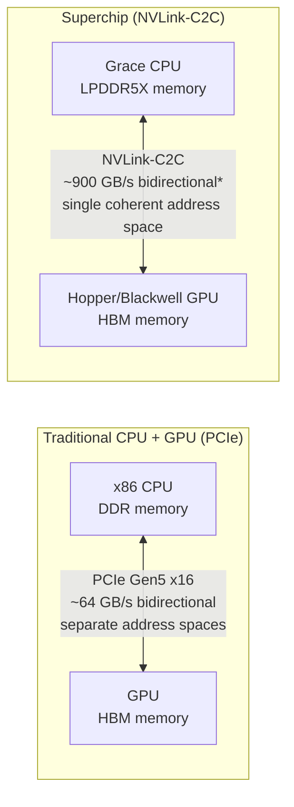
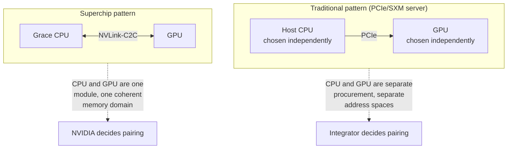

# Grace CPU, GH200, and GB200 Superchips

Every accelerator so far in this volume attaches to a host CPU through PCIe. PCIe is a general-purpose I/O bus, and it treats the GPU as a peripheral: the CPU and GPU keep separate memory spaces, and moving data between them means an explicit copy across a link that tops out far below either device's own memory bandwidth. For most workloads that copy is a rounding error. For workloads that are bound by how much data can move between CPU and GPU memory — very large embedding tables, KV-cache overflow, graph analytics, or data pipelines that repeatedly stage between host and device — that copy is the bottleneck.

Grace is NVIDIA's answer: a custom Arm-based server CPU designed specifically to sit next to a Hopper- or Blackwell-class GPU and share memory with it coherently, at a bandwidth PCIe cannot reach. GH200 and GB200 are the products built around that CPU. This chapter treats Grace as an architectural decision, not a spec sheet — the same discipline this volume has applied to every accelerator generation.

| Chapter field | Value |
|---|---|
| Difficulty | Advanced |
| Estimated reading time | 35–45 minutes |
| Prerequisites | Chapters 01–06 |
| Primary outcome | Explain why NVIDIA built Grace, what NVLink-C2C actually changes, and where GH200/GB200 fit against traditional PCIe and SXM platforms |

## Learning Objectives

After completing this chapter, you will be able to:

- explain why NVIDIA built a custom CPU instead of continuing to pair its GPUs with commodity x86 hosts;
- describe NVLink-C2C and what "coherent memory" means in practice, as distinct from PCIe peer access;
- compare Grace's LPDDR5X memory subsystem against traditional DDR server memory, including the honest trade-offs;
- explain the GH200 and GB200 superchip module architecture and how they differ from a PCIe or SXM server;
- identify which workload patterns actually benefit from Grace's coherent memory model, and which do not;
- place GH200/GB200 correctly against the DGX and HGX platforms covered in Volumes 05 and 06.

## Why Build a Custom CPU At All

NVIDIA does not need a CPU to sell GPUs — the overwhelming majority of H100 and B200 deployments still pair with a standard x86 host, and Volume 06's HGX platform is built entirely around that assumption. Grace exists to solve three specific problems that a commodity x86 host does not solve well:

1. **CPU-to-GPU bandwidth.** A PCIe Gen5 x16 link delivers roughly 64 GB/s bidirectional. Hopper and Blackwell GPUs move data internally, and to each other over NVLink, at multiple terabytes per second. Any workload phase that depends on CPU-GPU transfer inherits the PCIe number, not the GPU number, no matter how fast the GPU itself is.
2. **Unified, coherent addressing.** On a PCIe system, CPU and GPU memory are separate address spaces. Even with Unified Virtual Memory smoothing the programming model, data that crosses the boundary is still physically copied. A coherent link lets the GPU address Grace's memory directly (and vice versa) without an explicit copy, which matters for workloads whose working set is bigger than GPU HBM but does not fit the access pattern of a deliberate, batched offload.
3. **Power efficiency at the rack level.** An Arm CPU built for this specific job — high memory bandwidth per watt, no legacy x86 socket and chipset overhead — costs less of a rack's power and cooling budget than a general-purpose x86 server CPU, which matters enormously once GPU power density is the dominant constraint (a theme this volume returns to in Chapter 09 and that Volume 06 covers in depth for rack-level design).

None of these are workload-agnostic wins. A CPU-bound preprocessing pipeline, a workload with a modest and well-batched host-device transfer pattern, or a shop standardized on x86-only tooling gets little from Grace and pays a real switching cost to adopt it. The rest of this chapter treats Grace as a tool for a specific bottleneck class, not a universal upgrade — the same evaluation discipline Chapter 06 applied to choosing between GPU generations.

## NVLink-C2C: What "Coherent" Actually Means

NVLink-C2C (Chip-to-Chip) is the interconnect that joins Grace to a Hopper or Blackwell GPU inside a superchip module. It is architecturally distinct from the NVLink fabric that connects GPUs to each other (covered in Volume 05's DGX fabric chapters and Volume 06's HGX topology chapters) — same underlying NVLink signaling heritage, different job.

**Figure 4.7.1 — NVLink-C2C replaces a peripheral bus with a coherent memory link.** The PCIe path treats the GPU as an I/O device the CPU talks to. The NVLink-C2C path treats CPU and GPU memory as regions of one coherent space that either processor can address directly.

*The ~900 GB/s bidirectional figure is the number NVIDIA has published for NVLink-C2C in the Grace Hopper generation. Treat it as approximate and verify against current NVIDIA documentation before quoting it in a customer-facing document — interconnect bandwidth figures are revised across product generations, and marketing materials sometimes report unidirectional and bidirectional numbers inconsistently.

Two things change relative to PCIe, and an architect should be able to name both precisely:

- **Bandwidth.** Roughly an order of magnitude more than PCIe Gen5 x16. This matters when the CPU-GPU boundary is crossed repeatedly during the hot path of a workload, not just at job start.
- **Coherence.** Both processors can access both memory pools without a driver-managed copy. This is the more architecturally significant change: it means Grace's memory can function as an extension of the GPU's addressable memory for workloads that are memory-*capacity*-bound rather than memory-*bandwidth*-bound on the GPU side, at a cost that is close to (but not identical to) native HBM latency for the GPU-local case and higher for the cross-chip case.

Coherence is not the same claim as "as fast as HBM." A GPU thread reading data that physically lives in Grace's LPDDR5X over NVLink-C2C is still slower than reading data in local HBM — it is fast enough, and transparent enough, that the workload does not have to be restructured around explicit staging the way a PCIe offload would require.

## LPDDR5X: The Honest Trade-off

Grace uses LPDDR5X — the same memory class used in mobile and laptop silicon, run at server scale with a wide bus — rather than the DDR5 RDIMM/registered-DIMM memory found in x86 servers. This is a deliberate trade-off, not a cost-cutting compromise, and it should be described honestly:

| Dimension | LPDDR5X (Grace) | Server DDR5 (traditional x86 host) |
|---|---|---|
| Bandwidth per CPU | Substantially higher (soldered, wide-bus design) | Lower, but expandable via more DIMM channels |
| Power per bit moved | Lower — a major reason it was chosen for a GPU-attached, power-constrained rack | Higher |
| Capacity expandability | Fixed at manufacture — soldered, not user-upgradable | Expandable by populating more/larger DIMMs |
| ECC / RAS maturity | On-die ECC present, but the decades of enterprise RAS features (chipkill, memory mirroring, hot-swap DIMMs) built around RDIMM/LRDIMM ecosystems are less directly comparable | Mature, extensively field-proven RAS feature set |
| Field replaceability | Not field-replaceable (soldered to the module) | DIMMs are field-replaceable |

The honest summary: LPDDR5X gives Grace the bandwidth and power efficiency it needs to be a credible GPU-memory extension, at the cost of the expandability and some of the mature RAS tooling that enterprise DDR deployments have relied on for years. That is the correct trade to make for a GPU-fabric-attached compute node whose job is to feed an accelerator — it would be a much harder sell as the memory subsystem for a general-purpose database or virtualization host, which is not what Grace is built for.

:::caution
Exact LPDDR5X bandwidth figures, ECC implementation details, and capacity options vary by Grace SKU and generation. Verify current specifications against NVIDIA's published documentation before using them in a sizing or procurement decision.
:::

## The Superchip Pattern

"Superchip" is NVIDIA's term for a single module that integrates one or more Grace CPUs with one or more GPUs, connected by NVLink-C2C, sold and deployed as one unit rather than as separate CPU and GPU parts a system integrator combines.

**Figure 4.7.2 — The superchip pattern moves the CPU-GPU pairing decision from the system integrator to NVIDIA.** This is the same kind of integration trade-off Volume 06 describes between HGX (NVIDIA-defined accelerator complex, OEM-defined everything else) and DGX (NVIDIA-defined complete system) — a superchip is NVIDIA extending its defined boundary one layer further, down into the CPU choice itself.

### GH200 — Grace Hopper Superchip

GH200 pairs one Grace CPU with one Hopper GPU on a single module via NVLink-C2C.

- **Memory configuration (verify current SKU specifics before quoting):** the Hopper side ships with either 96GB or 141GB of HBM3/HBM3e depending on SKU, and the Grace side ships with up to approximately 480GB of LPDDR5X. These are the figures NVIDIA has published across GH200 variants — treat exact numbers as approximate and confirm against the current datasheet for a specific deployment, since NVIDIA has shipped more than one GH200 memory configuration.
- **What the coherent memory model actually buys a workload:** Grace's LPDDR5X becomes memory the GPU can address as an extension of its own space. This is most useful for workloads that are memory-*capacity*-bound rather than compute-bound — large embedding tables in recommendation models, KV-cache that overflows HBM during long-context inference, or graph/vector workloads with a large resident working set. It is not a substitute for HBM bandwidth on compute-bound kernels; a matrix multiply that fits comfortably in HBM gets no benefit from Grace being nearby.
- **Where GH200 fits:** as a single-GPU module, GH200 is not a training-scale-out product on its own. It shows up as a building block in NVIDIA-designed systems (see Volume 05's coverage of how GH200 fits the DGX-class lineup) and in HPC/inference deployments where the CPU-GPU memory relationship, not raw GPU count, is the binding constraint.

### GB200 — Grace Blackwell Superchip

GB200 extends the same pattern to Blackwell: a compute tray pairs 2 Grace CPUs with Blackwell GPUs connected via NVLink-C2C. NVIDIA's published GB200 compute-tray configuration is 2 Grace CPUs and 4 Blackwell GPUs; verify this ratio against current documentation before stating it in a customer-facing setting, since NVIDIA has described GB200 building blocks at more than one level (die, package, tray) and it is easy to conflate "GPUs per package" with "GPUs per compute tray."

GB200's significance is not really the tray-level CPU:GPU ratio — it is what happens when many GB200 trays are connected together at rack scale, which is the subject of the next chapter's counterpart in Volume 06: the GB200 NVL72 rack.

## Placing Grace Against What This Volume Already Covered

| Question | PCIe accelerator (Ch. 04) | SXM accelerator (Ch. 04) | Grace superchip (this chapter) |
|---|---|---|---|
| CPU-GPU link | PCIe, separate address spaces | PCIe, separate address spaces | NVLink-C2C, coherent |
| Who chooses the CPU | System integrator, any compatible x86/Arm host | System integrator | NVIDIA, fixed pairing |
| Best fit | General-purpose, flexible deployment | Multi-GPU scale-up within a chassis | CPU-GPU-memory-bound workloads: large embeddings, KV-cache overflow, HPC working sets |
| Where GPU-GPU communication happens | PCIe or, in multi-GPU SXM systems, NVLink/NVSwitch | NVLink/NVSwitch (Volume 05/06) | NVLink/NVSwitch between the GPUs, NVLink-C2C to each GPU's own Grace CPU — two different links doing two different jobs |

The key thing not to conflate: NVLink-C2C (CPU-to-GPU, inside one superchip module) and NVLink/NVSwitch (GPU-to-GPU, the fabric Volume 05 and Volume 06 cover in depth) are different links solving different problems, even though both carry the NVLink name. A GH200 or GB200 node still needs the GPU-to-GPU fabric to scale beyond the GPUs directly attached to its own Grace CPUs — Grace does not replace that fabric, it adds a second, orthogonal one.

## Interview Preparation

### Architecture question

Why did NVIDIA build its own CPU instead of continuing to sell GPUs that plug into any x86 server?

**Model answer:** "Because for a specific and growing class of workloads, the CPU-GPU link itself had become the bottleneck, and PCIe wasn't going to close that gap fast enough. PCIe Gen5 x16 tops out around 64 GB/s bidirectional; NVLink-C2C is roughly an order of magnitude higher, and — more importantly than the raw number — it's coherent, so the GPU can address Grace's memory directly instead of requiring an explicit staged copy. That matters most for workloads whose working set is bigger than GPU HBM but doesn't fit a deliberate batch-offload pattern — large embedding tables, KV-cache overflow on long-context inference. I'd be careful not to oversell this, though: a workload that's compute-bound and fits comfortably in HBM gets essentially nothing from Grace being nearby, and a shop with existing x86-only tooling pays a real integration cost to adopt it. It's a targeted answer to a specific bottleneck, not a universal replacement for the PCIe-attached x86 host most deployments still use."

### Scenario question

A customer's long-context LLM inference workload is hitting HBM capacity limits on H100 due to KV-cache growth. They ask whether GH200 solves this.

**Model answer:** "It can, but I'd want to confirm it's actually a capacity problem before recommending a platform change — the same discipline I'd apply to an H100-versus-H200 decision. If the KV-cache is genuinely overflowing HBM and the alternative is aggressive cache eviction or a hard context-length cap, GH200's coherent Grace memory gives the GPU a large additional address space — up to roughly 480GB of LPDDR5X, extending well beyond what fits on the Hopper side alone — to spill into without the workload having to be rewritten around explicit host staging. That's the case GH200's memory model was built for. But I'd also check what the access pattern into that overflow region actually looks like: LPDDR5X over NVLink-C2C is fast and coherent, but it is not HBM-speed, so if the workload needs the overflowed KV-cache read at HBM bandwidth rather than accessed occasionally, GH200 won't fully solve it and a straightforward H200 memory upgrade or a sharding change might be the better, simpler answer."

## Key Takeaways

- Grace is a targeted answer to a CPU-GPU bandwidth and coherent-addressing bottleneck, not a general-purpose CPU upgrade.
- NVLink-C2C (~900 GB/s bidirectional, verify against current NVIDIA documentation) is roughly an order of magnitude faster than PCIe Gen5 x16 and, critically, coherent rather than copy-based.
- LPDDR5X trades DIMM expandability and some mature enterprise RAS features for bandwidth and power efficiency — a deliberate, workload-appropriate trade, not a downgrade.
- GH200 pairs one Grace CPU with one Hopper GPU; GB200's published compute-tray configuration pairs 2 Grace CPUs with 4 Blackwell GPUs (verify before quoting).
- NVLink-C2C (CPU-to-GPU) and NVLink/NVSwitch (GPU-to-GPU) are distinct links solving distinct problems inside the same superchip node.
- Coherent memory helps memory-capacity-bound workloads (large embeddings, KV-cache overflow); it does not substitute for HBM bandwidth on compute-bound kernels.

## Cross References

- [Chapter 04 — PCIe, SXM, and Platform Integration](./chapter-04-pcie-sxm-and-platform-integration)
- [Chapter 06 — Training Accelerators — V100, A100, H100, H200, and B200](./chapter-06-training-accelerators-v100-to-b200)
- Volume 05 — how GH200 and GB200 fit the DGX-class system lineup
- Volume 06 — GB200 NVL72 rack-scale NVLink domain architecture
