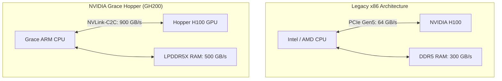

# Chapter 7 — The Grace CPU and Superchips

| Chapter metadata | Value |
|---|---|
| Volume | 04 — Accelerator Architecture & Form Factors |
| Difficulty | Expert |
| Estimated reading time | 35 minutes |
| Primary audience | DevOps, SRE, Platform, Cloud and Infrastructure Engineers |
| Core question | If PCIe is the ultimate bottleneck, what happens if you solder the CPU and the GPU onto the exact same motherboard? |

## Introduction

Throughout Volume 1, 2, and 3, we have constantly fought the same enemy: **The PCIe Bus**. 

When a standard x86 CPU (Intel or AMD) talks to an NVIDIA GPU, it must push data across the PCIe Gen5 bus at ~64 GB/s. We spent chapters learning how to write asynchronous streams, use Pinned Memory, and configure GPUDirect RDMA just to avoid this horrible 64 GB/s bottleneck.

In 2023, NVIDIA decided that optimizing software to avoid the PCIe bus was no longer sufficient. They decided to eliminate the PCIe bus entirely.

To do this, they couldn't just change the GPU. They had to build their own CPU. 
This is the **NVIDIA Grace CPU**, and the resulting architecture is the **Grace Hopper (GH200)** and **Grace Blackwell (GB200) Superchip**.

## 1. The Grace CPU (ARM Architecture)

The Grace CPU is not an x86 processor (like Intel or AMD). It is built on the **ARM** architecture (specifically Neoverse V2). 
*   **Why ARM?** ARM processors are incredibly power-efficient. In a data center constrained by power, every watt spent on the CPU is a watt stolen from the GPU. Grace provides massive multi-core performance (72 to 144 cores) while sipping power.
*   **LPDDR5X Memory:** Instead of using standard DDR5 server RAM, Grace uses LPDDR5X (Low-Power DDR), achieving up to 500 GB/s of memory bandwidth at a fraction of the power cost.

## 2. The Superchip: NVLink-C2C

The magic is not the CPU itself. The magic is how it connects to the GPU.

NVIDIA places the Grace CPU and the Hopper (or Blackwell) GPU onto the exact same physical board (a "Superchip"). 
They wire them together using a proprietary interconnect called **NVLink-C2C (Chip-to-Chip)**. 

### The Bandwidth Revolution
*   Standard PCIe Gen5 bandwidth: **64 GB/s**.
*   NVLink-C2C bandwidth: **900 GB/s**. 

The connection between the CPU and the GPU is suddenly **14 times faster**. 

## 3. Unified Memory: The Death of cudaMemcpy

With a 900 GB/s link, the entire CUDA memory paradigm shifts.

In a standard x86 system, if you use Unified Virtual Memory (UVM), the GPU triggers a Page Fault and waits agonizingly for the data to cross the 64 GB/s PCIe bus.

On a Grace Hopper (GH200) Superchip, the CPU RAM (up to 480 GB of LPDDR5X) and the GPU RAM (96 GB of HBM3) are **coherently linked**. The GPU can read the CPU's memory directly at 900 GB/s. 
*   A data scientist can load a massive 500 GB recommendation embedding table into the CPU's RAM, and the GPU can query it instantly as if it were local VRAM.
*   The dreaded `cudaMemcpy` is effectively obsolete on this architecture. The developer simply allocates memory, and the hardware fetches it at NVLink speeds.

## Architectural Diagram: x86 vs. Superchip

## Customer Scenario (Senior Level)

**The Situation:**
A quantitative hedge fund runs a massive graph-neural-network algorithm. The algorithm relies on an enormous 400 GB dataset that is constantly updated. They currently run it on an 8-GPU x86 server. Because the dataset doesn't fit on a single 80 GB GPU, they split the data. The developers complain that the code is incredibly complex, the PCIe transfers are strangling the performance, and they want to buy a server with 16 GPUs to get more VRAM.

**The Senior Architect Response:**
"Buying a 16-GPU server will not solve your code complexity or your memory transfer bottlenecks. Your workload is suffering from a Host-to-Device boundary issue.

Because your 400 GB dataset cannot fit in HBM, you are constantly page-faulting or copying data across the 64 GB/s PCIe bus. 

We should migrate this specific workload to an **NVIDIA Grace Hopper (GH200) Superchip** cluster. 
With the GH200, the CPU and GPU are linked via a 900 GB/s NVLink-C2C interconnect. We can load your entire 400 GB dataset into the Grace CPU's LPDDR5X memory. Your developers can delete all the complex `cudaMemcpy` and multi-GPU sharding code. The Hopper GPU will simply query the Grace CPU's memory directly over the NVLink-C2C connection, processing the massive graph dataset at speeds 14x faster than your current PCIe bottleneck allows."

## Interview Preparation

**Conceptual:** Why did NVIDIA switch from Intel/AMD x86 CPUs to building their own ARM-based Grace CPUs? *(Hint: To eliminate the PCIe bottleneck by fusing the CPU and GPU together with the 900 GB/s NVLink-C2C interconnect, and to increase power efficiency using ARM).*

**Architecture:** On a Grace Hopper (GH200) system, how does the memory access differ from a standard x86 server? *(Hint: Coherent Unified Memory. The GPU can read the CPU's massive LPDDR5X memory pool directly at 900 GB/s, effectively expanding the GPU's memory capacity for workloads like massive recommendation embedding tables).*
