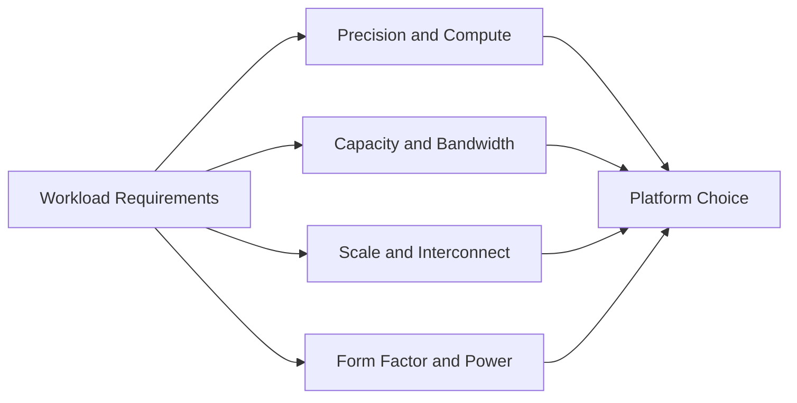

# Volume 04 — NVIDIA Hardware Portfolio

A customer rarely begins with a clean hardware question. They begin with a workload problem: a model does not fit in memory, inference latency misses its target, training takes too long, or a data center cannot support the power and cooling profile of the proposed platform. The architect's job is therefore not to recite GPU model names. It is to translate workload behavior into hardware requirements and then explain the trade-offs.

This volume builds that decision-making skill. It organizes NVIDIA hardware by architectural role, generation, memory system, interconnect, deployment form factor, and workload fit. Individual products are studied as examples of design choices—not as isolated specification sheets.

| Volume field | Value |
|---|---|
| Difficulty | Intermediate |
| Estimated reading time | 12–15 hours |
| Prerequisites | Volumes 01–03 |
| Primary focus | Hardware selection and portfolio reasoning |
| Outcome | Build defensible accelerator recommendations from workload evidence |

## The Portfolio Is a Decision Space

**Figure 4.0.1 — Hardware selection begins with workload constraints.** Product selection is the output of the architecture process, not the first step.

## Planned Chapter Sequence

1. Why NVIDIA Has Multiple GPU Families
2. Reading a GPU Specification as an Architect
3. Data Center GPU Generations: Volta to Blackwell
4. Inference Accelerators: T4, L4, and L40S
5. Training Accelerators: V100, A100, H100, H200, and B200
6. Grace CPU and Grace Hopper Superchip
7. Memory Capacity, Bandwidth, and Precision Trade-offs
8. PCIe Cards, SXM Modules, and Integrated Platforms
9. Power, Cooling, Density, and Data Center Constraints
10. Workload-to-Hardware Decision Framework
11. Customer Design Scenarios
12. Volume 04 Summary

## Labs

- Build a hardware comparison matrix from authoritative data
- Translate workload requirements into an accelerator shortlist
- Model memory capacity and deployment density
- Review a hardware recommendation as a customer architecture board

## Production Perspective

A technically valid recommendation can still fail in production if it ignores rack power, thermal density, network topology, software compatibility, procurement lead time, support boundaries, or operational standardization. Every chapter therefore connects silicon characteristics to the complete system that must host, power, cool, monitor, upgrade, and recover the accelerator.
