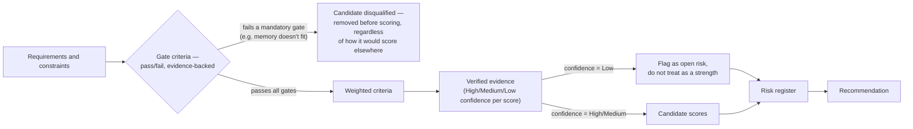

# Build a GPU Selection Scorecard

## Lab metadata

| Field | Value |
|---|---|
| Volume | 04 — NVIDIA Hardware Portfolio |
| Difficulty | Intermediate |
| Estimated time | 60 minutes |
| Lab type | Architecture and evaluation |
| Target platform | Any spreadsheet or Markdown environment |

## Objective

Build a weighted scorecard that compares candidate GPU platforms against measurable workload, operational, and economic requirements.

## Background

Hardware discussions often become product debates because selection criteria remain implicit. This lab makes those criteria visible. The output is not a universal ranking. It is a traceable decision model for one customer workload.

## Learning outcomes

After completing this lab, you will be able to:

- define mandatory and weighted requirements;
- separate accelerator characteristics from system characteristics;
- identify missing evidence;
- compare candidates without declaring a universal winner;
- document assumptions and validation work.

## Architecture



**Why the gate-fail branch matters, with a real number:** if a candidate's usable memory is 24GB (an L4-class part) and the workload statement in Step 1 calls for a model needing 140GB of weights alone (a 70B-parameter model at FP16, per the calculation `70B × 2 bytes ≈ 140GB`), Gate G2 fails outright — no amount of weighted-criteria strength on power efficiency or cost elsewhere rescues that candidate. This is the discipline the diagram is enforcing: gates are checked and can disqualify *before* any weighted scoring happens, not folded into the weighted average where a strong cost score could mathematically outweigh a hard capacity failure.

## Prerequisites

- Completion of Chapter 02.
- Familiarity with basic capacity and performance terminology.
- Three candidate platforms. They may be real systems or anonymized candidates A, B, and C.
- No physical GPU is required.

## Environment

Create a file named `gpu-selection-scorecard.md` or use a spreadsheet with the same fields.

## Components

| Component | Purpose |
|---|---|
| Requirement register | Captures business and technical needs |
| Gate criteria | Eliminates candidates that cannot satisfy mandatory requirements |
| Weighted scorecard | Compares viable candidates |
| Evidence register | Records where each score came from |
| Risk register | Captures uncertainty and operational exposure |
| Validation plan | Defines benchmarks needed before purchase |

## Step 1 — Define the workload

Use this scenario:

> A platform team must host a private language-model service for several business units. The service requires predictable latency, Kubernetes integration, tenant accounting, room for model growth, and operation within a constrained power envelope. Large-scale pretraining is out of scope.

Record:

```md
## Workload statement

- Primary workload:
- Business users:
- Availability target:
- Latency objective:
- Expected concurrency:
- Model memory requirement:
- Growth assumption:
- Deployment model:
- Facility constraint:
```

Do not select hardware yet.

## Step 2 — Create gate criteria

Gate criteria are pass/fail requirements.

```md
| Gate | Requirement | Candidate A | Candidate B | Candidate C |
|---|---|---:|---:|---:|
| G1 | Supported by target software stack |  |  |  |
| G2 | Sufficient usable memory |  |  |  |
| G3 | Fits power and cooling envelope |  |  |  |
| G4 | Available with required support model |  |  |  |
| G5 | Compatible with deployment platform |  |  |  |
```

A candidate that fails a mandatory gate should not be rescued by a high weighted score.

## Step 3 — Define weighted criteria

Assign weights totaling 100.

```md
| Criterion | Weight | Why it matters |
|---|---:|---|
| Model and cache memory headroom | 20 | Supports current model and growth |
| Latency under target concurrency | 20 | Protects service objective |
| Throughput per node | 15 | Determines fleet size |
| Power and cooling fit | 15 | Facility constraint |
| Kubernetes and sharing fit | 10 | Multi-tenant operations |
| Observability and supportability | 10 | Day-2 reliability |
| Acquisition and lifecycle cost | 10 | Economic constraint |
```

Change the weights only when you can explain the customer requirement behind the change.

## Step 4 — Define the scoring scale

Use a consistent scale:

| Score | Meaning |
|---:|---|
| 0 | Unsupported or no evidence |
| 1 | Major gap |
| 2 | Partially satisfies requirement |
| 3 | Satisfies requirement |
| 4 | Exceeds requirement with useful headroom |
| 5 | Strong fit supported by representative evidence |

Do not assign a 5 based only on a vendor specification. A top score requires workload-relevant evidence.

## Step 5 — Record evidence

```md
| Candidate | Criterion | Evidence | Confidence | Validation needed |
|---|---|---|---|---|
| A | Memory headroom | Verified model estimate | Medium | Load full production model |
| A | Latency | No representative test | Low | Concurrency benchmark |
```

Use `High`, `Medium`, or `Low` confidence. Missing evidence is itself an architecture risk.

## Step 6 — Calculate weighted scores

For each criterion:

```text
weighted contribution = score × weight
```

Because all candidates use the same scale and weights, the raw total is sufficient for comparison. Normalize it only when presentation requires a percentage.

**Worked example — the Step 1 language-model workload scored against three real candidates:**

Workload statement from Step 1: private LLM service, 7B-parameter model at FP16 (`7,000,000,000 × 2 bytes ≈ 14 GB` for weights), Kubernetes-deployed, p95 latency target 300ms at 20 concurrent sessions, shared across business units, data center power headroom is tight.

```md
| Criterion (weight) | Candidate A: T4 16GB (score) | Candidate B: L4 24GB (score) | Candidate C: H100 80GB (score) |
|---|---:|---:|---:|
| Memory headroom (20) | 1 — 14GB weights leaves ~2GB for KV cache/20 sessions; measured OOM at 12 concurrent | 3 — 14GB weights + ~8GB headroom comfortably covers KV cache at 20 sessions | 5 — 14GB weights in 80GB leaves enormous headroom, no realistic ceiling here |
| Latency under concurrency (20) | 2 — p95 measured at 480ms at 20 sessions, misses 300ms target | 4 — p95 measured at 240ms at 20 sessions, meets target with margin | 5 — p95 measured at 90ms at 20 sessions, far under target |
| Throughput per node (15) | 2 — low headroom forces small batches | 4 — batches comfortably to the concurrency target | 5 — batches well past the target with room to spare |
| Power/cooling fit (15) | 5 — 70W TDP, no facility risk | 4 — 72W TDP, no facility risk | 1 — 700W TDP; rack power headroom is explicitly tight per the workload statement |
| Kubernetes/sharing fit (10) | 3 — supported, no MIG | 3 — supported, no MIG | 4 — MIG-capable, but overkill for one 7B model |
| Observability/supportability (10) | 3 | 3 | 3 |
| Acquisition/lifecycle cost (10) | 4 — lowest unit cost, but more replicas needed to hit throughput | 4 — balanced | 2 — highest unit cost, most of the capacity goes unused for this model |

| Candidate | Weighted total |
|---|---:|
| A (T4) | 1×20 + 2×20 + 2×15 + 5×15 + 3×10 + 3×10 + 4×10 = 275 |
| B (L4) | 3×20 + 4×20 + 4×15 + 4×15 + 3×10 + 3×10 + 4×10 = 340 |
| C (H100) | 5×20 + 5×20 + 5×15 + 1×15 + 4×10 + 3×10 + 2×10 = 355 |
```

Reading this the way Step 8's verification questions expect: C scores highest on raw total, but its Power/cooling fit score of `1` is exactly the kind of high-impact, unresolved risk the risk register below is built to catch — the workload statement explicitly names tight power headroom as a facility constraint, and an H100-class part at 700W per card directly threatens it regardless of how well it wins on latency and memory. B is the traceable recommendation here: it clears every gate, meets the latency target with margin, and doesn't introduce the facility risk C does. This is also why gates run *before* scoring in the Figure above — if the facility gate (G3) had been written as "confirmed power budget for 700W/card," C would already be disqualified before this table is built, rather than requiring the risk register to catch it after the fact.
```

## Step 7 — Build a risk register

```md
| Risk | Candidate | Probability | Impact | Mitigation |
|---|---|---|---|---|
| Model growth consumes headroom | B | Medium | High | Validate larger model profile |
| Cooling design not approved | C | Medium | High | Facility review before purchase |
| Multi-tenant behavior untested | A | High | Medium | Run sharing and isolation test |
```

A high score does not cancel a high-impact unresolved risk.

## Validation

Your scorecard is valid when:

- weights total 100;
- every score has an evidence entry;
- mandatory gates are evaluated before scoring;
- unknowns are not treated as strengths;
- the recommendation states assumptions;
- a benchmark plan exists for the most important uncertainties.

## Verification

Ask another engineer to review the scorecard without additional explanation. They should be able to answer:

1. What workload is being designed?
2. Why does the leading candidate rank first?
3. Which assumptions could change the result?
4. What must be tested before purchase?

If they cannot answer, the scorecard is not sufficiently traceable.

## Observability

In this architecture lab, observability means decision visibility. Track:

- source and age of evidence;
- owner of each unresolved question;
- benchmark date and configuration;
- changes to weights;
- changes to workload assumptions.

Treat the scorecard as a versioned architecture artifact.

## Performance measurements

Define a minimum benchmark plan:

| Measurement | Test condition | Why it matters |
|---|---|---|
| End-to-end latency | Target concurrency and request shape | Validates service objective |
| Throughput | Sustained production-like load | Estimates fleet capacity |
| Peak memory | Full model and runtime cache | Validates headroom |
| Host utilization | During GPU benchmark | Detects non-GPU bottlenecks |
| Power behavior | Sustained workload | Validates facility assumption |

## Failure injection

Perform two deliberate failures.

### Failure 1 — Change the workload

Add a new requirement: the platform must now support periodic fine-tuning.

Revisit gates, weights, and risk. Observe whether the recommendation changes.

### Failure 2 — Remove trusted evidence

Mark the leading candidate’s latency evidence as invalid because the benchmark used a smaller model.

Reduce confidence and update the validation plan. Do not retain the original score without justification.

## Troubleshooting

### Symptom: every candidate scores almost the same

**Likely cause:** criteria are too generic or the scoring scale is not tied to requirements.

**Resolution:** rewrite criteria around measurable constraints such as model headroom, tail latency, deployment support, and facility limits.

### Symptom: the preferred product wins regardless of weights

**Likely cause:** confirmation bias or unsupported high scores.

**Resolution:** require evidence for every score and ask an independent reviewer to challenge assumptions.

### Symptom: the cheapest candidate always wins

**Likely cause:** acquisition price is being confused with lifecycle cost.

**Resolution:** include operations, facility, utilization, support, and risk costs.

## Cleanup

Archive the completed scorecard in a version-controlled architecture directory. Remove candidate names when the artifact will be used as a reusable training example.

## Summary

You created a workload-first evaluation model that separates mandatory requirements, weighted preferences, evidence, risk, and validation. The result is not a permanent product ranking. It is a defensible decision for a defined workload at a defined point in time.

## Challenge exercises

1. Create a second scorecard for large-scale distributed training.
2. Compare how the weights change for edge inference.
3. Add a sensitivity analysis showing how the winner changes when power or memory weight increases.
4. Convert the scorecard into an architecture decision record.

## Further reading

- [Chapter 02 — Workload-First GPU Selection](../chapter-02-workload-first-gpu-selection)
- [Volume 04 introduction](../index)
