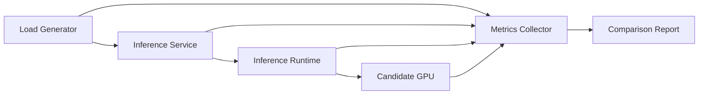

# Lab 02 — Benchmark an Inference Accelerator Shortlist

## Lab Metadata

| Field | Value |
|---|---|
| Volume | 04 |
| Difficulty | Intermediate |
| Estimated time | 90 minutes |
| Target platform | Linux GPU server or cloud GPU instance |
| Lab type | Performance validation |

## 1. Objective

Compare two or more candidate accelerator environments using a controlled inference workload. The goal is not to crown a universal winner. The goal is to produce enough evidence to recommend the most appropriate platform for a defined service envelope.

## 2. Background

Vendor specifications describe device capabilities. They do not predict the behavior of your model, runtime, request distribution, host, and service-level objective. A production benchmark must therefore control variables, capture the full request path, and report both performance and operational cost.

## 3. Learning Outcomes

After completing this lab, you will be able to:

- define a repeatable inference benchmark;
- collect latency, throughput, memory, power, and host metrics;
- distinguish warm-up behavior from steady state;
- test concurrency and batching without hiding tail latency;
- write an evidence-based accelerator recommendation.

## 4. Architecture



## 5. Prerequisites

- a Linux host with an NVIDIA GPU;
- a working NVIDIA driver and container runtime;
- Docker or another supported container engine;
- `nvidia-smi`;
- a chosen inference server or model runtime;
- a model and synthetic or approved test dataset;
- permission to collect power and performance metrics.

Record the exact driver, CUDA, runtime, container, model, and host configuration. Do not compare runs with undocumented software differences.

## 6. Environment

Create a run manifest:

```yaml
candidate: gpu-a
host_cpu: replace-me
host_memory_gb: 0
gpu_model: replace-me
driver_version: replace-me
container_image: replace-me
model: replace-me
precision: replace-me
max_batch_size: 0
concurrency: 0
input_shape: replace-me
```

Store one manifest beside every result set.

## 7. Components

| Component | Purpose |
|---|---|
| Load generator | Produces repeatable requests and records latency |
| Inference runtime | Loads, schedules, batches, and executes the model |
| GPU telemetry | Captures utilization, memory, power, temperature, and clocks |
| Host telemetry | Detects CPU, NUMA, network, and storage bottlenecks |
| Report | Connects measurements to the customer requirement |

## 8. Deployment Steps

### Step 1 — Verify the GPU environment

**Purpose:** Confirm that the device and driver are healthy before benchmarking.

```bash
nvidia-smi
nvidia-smi topo -m
```

**Expected output:** The GPU is visible, no critical health error is reported, and the topology matches the intended server design.

### Step 2 — Capture a static baseline

```bash
nvidia-smi --query-gpu=name,driver_version,memory.total,power.limit,temperature.gpu --format=csv
lscpu
free -h
```

Save the output with the run manifest.

### Step 3 — Start telemetry

```bash
nvidia-smi dmon -s pucvmet -d 1 -o DT > gpu-dmon.log &
D_MON_PID=$!
```

The selected fields capture power, utilization, clocks, memory, PCIe, errors, and temperature where supported.

### Step 4 — Warm the service

Send enough requests to load model engines, populate caches, and stabilize clocks. Do not include warm-up requests in steady-state results.

### Step 5 — Run the benchmark matrix

Test at least:

| Test | Batch policy | Concurrency | Duration |
|---|---:|---:|---:|
| Interactive baseline | 1 | 1 | 5 min |
| Moderate load | runtime default | 4 | 10 min |
| Throughput load | tuned | 16 or validated limit | 10 min |
| Saturation search | tuned | incremental | until SLO violation |

For every run, capture request count, error count, throughput, p50, p95, p99, GPU memory, average power, peak temperature, and CPU utilization.

### Step 6 — Stop telemetry

```bash
kill "$D_MON_PID"
wait "$D_MON_PID" 2>/dev/null || true
```

## 9. Validation

A valid run must satisfy all of the following:

- no unplanned model or container change;
- no critical GPU or driver error;
- warm-up excluded from results;
- enough requests to make percentile latency meaningful;
- identical input distribution across candidates;
- no hidden CPU, network, or storage saturation unless that is part of the system under test.

## 10. Verification

Compare candidates using a service-level table:

| Candidate | Throughput | p95 latency | p99 latency | Peak memory | Avg. power | Errors |
|---|---:|---:|---:|---:|---:|---:|
| GPU A | | | | | | |
| GPU B | | | | | | |

Add cost and density only after the technical run is valid.

## 11. Observability

Correlate request latency with:

- queue depth;
- runtime batch size;
- GPU utilization;
- memory use;
- power and clocks;
- CPU saturation;
- encode/decode activity for media workloads;
- PCIe traffic where observable.

## 12. Performance Measurements

Calculate:

```text
cost per one million successful requests
requests per watt
requests per GPU
requests per server
maximum concurrency within the latency SLO
```

Do not compare cost per GPU alone. A higher-cost device may reduce server count, while a cheaper device may provide better fleet density for smaller models.

## 13. Failure Injection

Create one controlled failure:

- reduce the runtime batch limit;
- constrain CPU cores;
- increase sequence length;
- lower the service concurrency limit;
- introduce an intentionally oversized request.

Observe how the failure appears in service and GPU telemetry.

## 14. Troubleshooting

### Symptom — Candidate B appears slower despite stronger specifications

Check software versions, precision, engine compilation, clocks, power limit, thermal behavior, host bottlenecks, and whether the workload uses features available on the candidate architecture.

### Symptom — Results vary widely between runs

Check warm-up, competing workloads, autoscaling, CPU frequency policy, data caching, request distribution, and run duration.

## 15. Cleanup

```bash
pkill -f 'nvidia-smi dmon' || true
```

Stop the inference service, remove temporary containers, and archive manifests, logs, and reports.

## 16. Summary

You created a benchmark that evaluates an accelerator as part of an inference service rather than as an isolated device. The result should explain which candidate meets the defined service envelope and why.

## 17. Challenge Exercises

- Add a media-processing workload and collect encoder/decoder telemetry.
- Compare static batching with dynamic batching.
- Add a memory-heavy generative workload.
- Model node-level capacity and rack power for each candidate.

## 18. Further Reading

- [Inference Accelerators](../chapter-05-inference-accelerators-t4-l4-and-l40s)
- [Training Accelerators](../chapter-06-training-accelerators-v100-to-b200)
- Current NVIDIA data-center GPU and inference-runtime documentation
