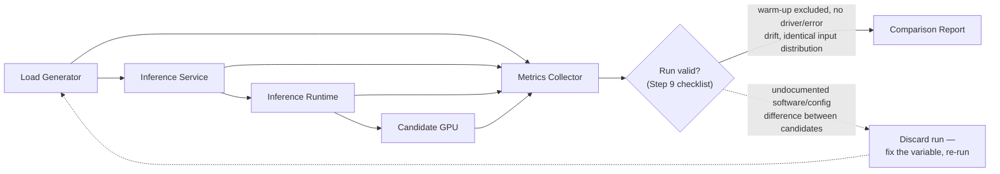

# Lab 02 — Benchmark an Inference Accelerator Shortlist

## Lab Metadata

| Field | Value |
|---|---|
| Volume | 04 |
| Difficulty | Intermediate |
| Estimated time | 90 minutes |
| Target platform | Linux GPU server or cloud GPU instance |
| Lab type | Performance validation |

## 1. Objective

Compare two or more candidate accelerator environments using a controlled inference workload. The goal is not to crown a universal winner. The goal is to produce enough evidence to recommend the most appropriate platform for a defined service envelope.

## 2. Background

Vendor specifications describe device capabilities. They do not predict the behavior of your model, runtime, request distribution, host, and service-level objective. A production benchmark must therefore control variables, capture the full request path, and report both performance and operational cost.

## 3. Learning Outcomes

After completing this lab, you will be able to:

- define a repeatable inference benchmark;
- collect latency, throughput, memory, power, and host metrics;
- distinguish warm-up behavior from steady state;
- test concurrency and batching without hiding tail latency;
- write an evidence-based accelerator recommendation.

## 4. Architecture



The `Valid?` gate and its discard loop-back are the point of the whole exercise: a comparison report built from a run that skipped Step 9's validation (different driver versions, warm-up requests counted in steady state, mismatched input distributions) produces numbers that look precise and are not comparable — the loop-back forces a re-run with the variable controlled, rather than letting an invalid run reach the report.

## 5. Prerequisites

- a Linux host with an NVIDIA GPU;
- a working NVIDIA driver and container runtime;
- Docker or another supported container engine;
- `nvidia-smi`;
- a chosen inference server or model runtime;
- a model and synthetic or approved test dataset;
- permission to collect power and performance metrics.

Record the exact driver, CUDA, runtime, container, model, and host configuration. Do not compare runs with undocumented software differences.

## 6. Environment

Create a run manifest:

```yaml
candidate: gpu-a
host_cpu: replace-me
host_memory_gb: 0
gpu_model: replace-me
driver_version: replace-me
container_image: replace-me
model: replace-me
precision: replace-me
max_batch_size: 0
concurrency: 0
input_shape: replace-me
```

Store one manifest beside every result set.

## 7. Components

| Component | Purpose |
|---|---|
| Load generator | Produces repeatable requests and records latency |
| Inference runtime | Loads, schedules, batches, and executes the model |
| GPU telemetry | Captures utilization, memory, power, temperature, and clocks |
| Host telemetry | Detects CPU, NUMA, network, and storage bottlenecks |
| Report | Connects measurements to the customer requirement |

## 8. Deployment Steps

### Step 1 — Verify the GPU environment

**Purpose:** Confirm that the device and driver are healthy before benchmarking.

```bash
nvidia-smi
nvidia-smi topo -m
```

**Expected output:**

```
$ nvidia-smi
+-----------------------------------------------------------------------------------------+
| NVIDIA-SMI 550.90.07              Driver Version: 550.90.07      CUDA Version: 12.4      |
|-----------------------------------------+------------------------+----------------------+
| GPU  Name                 Persistence-M | Bus-Id          Disp.A | Volatile Uncorr. ECC |
| Fan  Temp   Perf          Pwr:Usage/Cap |           Memory-Usage | GPU-Util  Compute M. |
|===========================================+========================+======================|
|   0  NVIDIA L4                      On  | 00000000:31:00.0 Off  |                    0 |
| N/A   34C    P8              9W /  72W |      4MiB / 24576MiB |      0%      Default |
+-----------------------------------------------------------------------------------------+

$ nvidia-smi topo -m
        GPU0    NIC0    CPU Affinity
GPU0     X      PHB     0-15
NIC0    PHB      X      0-15

Legend:
  X   = self
  PHB = connection traversing a single PCIe host bridge
```

Reading this before running a single benchmark request: `Pwr:Usage/Cap` at `9W / 72W` and `GPU-Util 0%` confirm the card is idle and not already loaded by a stray process — a nonzero `Memory-Usage` here would mean a previous run didn't clean up. `Driver Version 550.90.07` / `CUDA Version 12.4` is the pairing to record in the run manifest verbatim; benchmarking two candidates on different driver versions invalidates the comparison before the first request is sent. `topo -m` showing `PHB` between the GPU and NIC means both share a single PCIe host bridge — the same NUMA node, no cross-socket penalty — which is worth confirming before blaming the accelerator for latency that's actually a host-placement problem. A **critical health error** would show up as `ERR!` in place of a temperature/power reading, or ECC error counts in `nvidia-smi -q` (not shown in the summary view); either should stop the benchmark before it starts.

### Step 2 — Capture a static baseline

```bash
nvidia-smi --query-gpu=name,driver_version,memory.total,power.limit,temperature.gpu --format=csv
lscpu
free -h
```

Save the output with the run manifest.

```
$ nvidia-smi --query-gpu=name,driver_version,memory.total,power.limit,temperature.gpu --format=csv
name, driver_version, memory.total [MiB], power.limit [W], temperature.gpu
NVIDIA L4, 550.90.07, 24564 MiB, 72.00 W, 33

$ lscpu | grep -E 'Model name|Socket|Core|Thread'
Model name:            AMD EPYC 7513 32-Core Processor
Socket(s):              2
Core(s) per socket:     32
Thread(s) per core:     2

$ free -h
              total    used    free    shared  buff/cache   available
Mem:           503Gi    12Gi   478Gi     0.1Gi        13Gi        488Gi
Swap:            0B      0B      0B
```

This baseline is what every later step gets compared against. `power.limit 72.00 W` confirms which SKU is actually installed — an L4 caps at 72W, so if this instead read `300.00 W` mid-run, the candidate identity itself would be in question, not just its performance. `2 socket / 32 core-per-socket` from `lscpu` matters for Step 9's host-saturation check: pin the load generator and inference service to cores on the GPU's own NUMA node, not split across sockets, or a host bottleneck will masquerade as a GPU limitation later. `free -h` showing `Swap: 0B` total confirms swap is disabled — relevant because a host that swaps under memory pressure introduces exactly the kind of run-to-run noise this lab's Troubleshooting section (Step 14) warns about.

### Step 3 — Start telemetry

```bash
nvidia-smi dmon -s pucvmet -d 1 -o DT > gpu-dmon.log &
D_MON_PID=$!
```

The selected fields capture power, utilization, clocks, memory, PCIe, errors, and temperature where supported.

```
$ tail -5 gpu-dmon.log
# Date       Time        gpu   pwr  gtemp  mtemp    sm   mem   enc   dec   jpg   ofa  mclk  pclk
2026/08/07   14:41:02      0    58     51     47    62    38     0     0     0     0  6251  1650
2026/08/07   14:41:03      0    61     52     48    64    39     0     0     0     0  6251  1650
2026/08/07   14:41:04      0    57     51     47    61    37     0     0     0     0  6251  1650
```

Even at steady request load, `pwr` (58-61W of the L4's 72W cap) and `sm` (61-64%) both sitting comfortably under their ceilings with `pclk` pinned at its boost clock (1650MHz, no throttling) is what a healthy, non-saturated candidate looks like during the "Moderate load" test in Step 5's matrix — worth capturing now so the later "Saturation search" run has a clean baseline to contrast against when `pwr` and `sm` climb toward their limits.

### Step 4 — Warm the service

Send enough requests to load model engines, populate caches, and stabilize clocks. Do not include warm-up requests in steady-state results.

### Step 5 — Run the benchmark matrix

Test at least:

| Test | Batch policy | Concurrency | Duration |
|---|---:|---:|---:|
| Interactive baseline | 1 | 1 | 5 min |
| Moderate load | runtime default | 4 | 10 min |
| Throughput load | tuned | 16 or validated limit | 10 min |
| Saturation search | tuned | incremental | until SLO violation |

For every run, capture request count, error count, throughput, p50, p95, p99, GPU memory, average power, peak temperature, and CPU utilization.

### Step 6 — Stop telemetry

```bash
kill "$D_MON_PID"
wait "$D_MON_PID" 2>/dev/null || true
```

## 9. Validation

A valid run must satisfy all of the following:

- no unplanned model or container change;
- no critical GPU or driver error;
- warm-up excluded from results;
- enough requests to make percentile latency meaningful;
- identical input distribution across candidates;
- no hidden CPU, network, or storage saturation unless that is part of the system under test.

## 10. Verification

Compare candidates using a service-level table. Illustrative results from a "Moderate load" run (batch policy: runtime default, concurrency 4) comparing an L4 and a T4 on the same 7B-parameter INT8 model:

| Candidate | Throughput | p95 latency | p99 latency | Peak memory | Avg. power | Errors |
|---|---:|---:|---:|---:|---:|---:|
| GPU A (L4) | 142 req/s | 118 ms | 165 ms | 19.2 GiB / 24.6 GiB | 59 W / 72 W | 0 |
| GPU B (T4) | 61 req/s | 240 ms | 340 ms | 13.8 GiB / 15.4 GiB | 66 W / 70 W | 3 (admission-control rejects at saturation) |

Reading this the way Step 12's economics calculation depends on: raw throughput alone (142 vs. 61 req/s) already favors GPU A by more than 2x, but the number that actually decides fleet sizing is **requests per watt** — GPU A delivers roughly `142/59 ≈ 2.4 req/s per watt` against GPU B's `61/66 ≈ 0.9 req/s per watt`, a gap far larger than the raw throughput difference alone suggests, because GPU B is also running closer to its power ceiling while delivering less. GPU B's 3 errors at this concurrency (T4 is at 90% of its 15.4GiB capacity — `13.8/15.4`) is the "Peak memory" column explaining the "Errors" column directly: this candidate is close enough to its memory ceiling that admission control is already rejecting requests at only moderate load, which is exactly the failure mode Step 13's failure-injection exercise is designed to surface deliberately rather than discover in production.

Add cost and density only after the technical run is valid.

## 11. Observability

Correlate request latency with:

- queue depth;
- runtime batch size;
- GPU utilization;
- memory use;
- power and clocks;
- CPU saturation;
- encode/decode activity for media workloads;
- PCIe traffic where observable.

## 12. Performance Measurements

Calculate:

```text
cost per one million successful requests
requests per watt
requests per GPU
requests per server
maximum concurrency within the latency SLO
```

Do not compare cost per GPU alone. A higher-cost device may reduce server count, while a cheaper device may provide better fleet density for smaller models.

## 13. Failure Injection

Create one controlled failure:

- reduce the runtime batch limit;
- constrain CPU cores;
- increase sequence length;
- lower the service concurrency limit;
- introduce an intentionally oversized request.

Observe how the failure appears in service and GPU telemetry.

## 14. Troubleshooting

### Symptom — Candidate B appears slower despite stronger specifications

Check software versions, precision, engine compilation, clocks, power limit, thermal behavior, host bottlenecks, and whether the workload uses features available on the candidate architecture.

### Symptom — Results vary widely between runs

Check warm-up, competing workloads, autoscaling, CPU frequency policy, data caching, request distribution, and run duration.

## 15. Cleanup

```bash
pkill -f 'nvidia-smi dmon' || true
```

Stop the inference service, remove temporary containers, and archive manifests, logs, and reports.

## 16. Summary

You created a benchmark that evaluates an accelerator as part of an inference service rather than as an isolated device. The result should explain which candidate meets the defined service envelope and why.

## 17. Challenge Exercises

- Add a media-processing workload and collect encoder/decoder telemetry.
- Compare static batching with dynamic batching.
- Add a memory-heavy generative workload.
- Model node-level capacity and rack power for each candidate.

## 18. Further Reading

- [Inference Accelerators](../chapter-05-inference-accelerators-t4-l4-and-l40s)
- [Training Accelerators](../chapter-06-training-accelerators-v100-to-b200)
- Current NVIDIA data-center GPU and inference-runtime documentation
